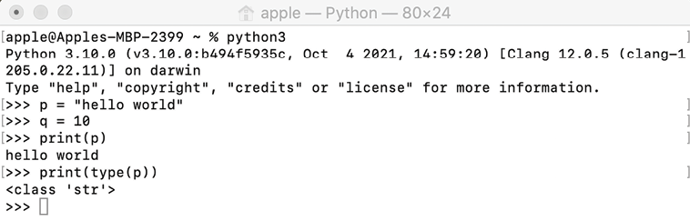
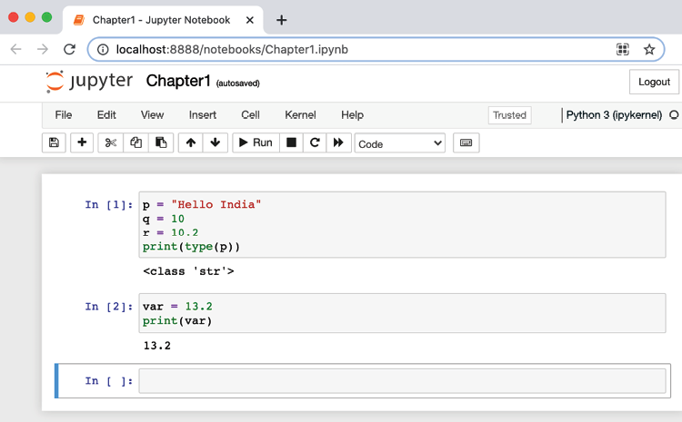
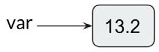
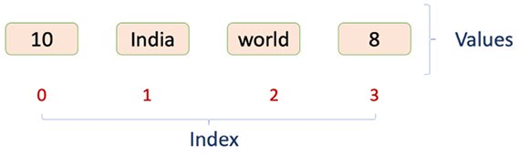
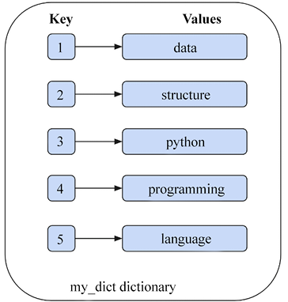
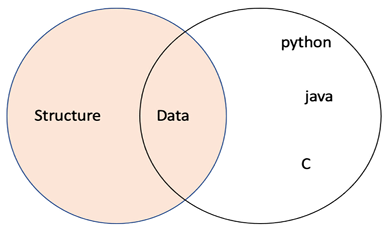

# ```Python``` 数据类型和结构

数据结构和算法是任何软件系统开发中的重要组成部分。 算法可以定义为解决任何给定问题的一组分步说明； 算法处理数据并根据特定问题产生输出结果。 算法用于解决问题的数据必须在计算机内存中有效地存储和组织，以便软件的有效实施。 系统的性能取决于对数据的有效访问和检索，而这取决于在系统中存储和组织数据的数据结构的选择程度。

数据结构处理数据在计算机内存中的存储和组织方式，这些数据将在程序中使用。 计算机科学家应该了解算法的效率以及在其实现中应使用哪种数据结构。 ```Python``` 编程语言是一种健壮、强大且广泛使用的语言，用于开发基于软件的系统。 ```Python``` 是一种高级的、解释型的、面向对象的语言，非常便于学习和理解数据结构和算法的概念。

在本章中，我们简要回顾了将用于实现本书讨论的各种数据结构的 ```Python``` 编程语言组件。 要从更广泛的角度更详细地讨论 ```Python``` 语言，请查看 ```Python``` 文档：

- https://docs.python.org/3/reference/index.html
- https://docs.python.org/3/tutorial/index.html

在本章中，我们将研究以下主题：

- 介绍 ```Python 3.10```
- 安装 ```Python```
- 搭建 ```Python``` 开发环境
- 数据类型和对象概述
- 基本数据类型
- 复杂数据类型
- ```Python``` 的集合模块

## 介绍 ```Python 3.10```

```Python``` 是一种解释型语言：语句逐行执行。 它遵循面向对象编程的概念。 ```Python``` 是动态类型的，这使得它成为许多平台上脚本和快节奏开发语言的理想候选者。 它的源代码是开源的，有一个非常大的社区正在以非常快的速度持续使用和开发它。 ```Python``` 代码可以在任何文本编辑器中编写，并以 ```.py``` 文件扩展名保存。 ```Python``` 因其紧凑和优雅的语法而易于使用和学习。

由于将使用 ```Python``` 语言编写算法，因此提供了如何设置运行示例的环境的说明。

## 安装 ```Python```

```Python``` 预装在基于 ```Linux``` 和 ```Mac``` 的操作系统上。 但是，你需要安装最新版本的 ```Python```，这可以按照以下说明在不同的操作系统上完成。

### Windows操作系统
对于 ```Windows```，可以通过可执行 ```.exe``` 文件安装 ```Python```。

1. 转到 https://www.python.org/downloads/。
2. 根据你的架构选择最新版本的 ```Python```——目前是 ```3.10.0```。 如果你有 ```32``` 位版本的 ```Windows```，请选择 ```32``` 位安装程序； 否则，请选择 ```64``` 位安装程序。
3. 下载 ```.exe``` 文件。
4. 打开 ```python-3.10.0.exe``` 文件。
5. 确保选中将 ```Python 3.10.0``` 添加到 ```PATH```。
6. 点击立即安装，然后等待安装完成； 你现在可以使用 ```Python``` 了。
7. 要验证 ```Python``` 是否已正确安装，请打开命令提示符并键入 ```python --version``` 命令。 它应该输出 ```Python 3.10.0```。

### 基于 ```Linux``` 的操作系统

要在 ```Linux``` 机器上安装 ```Python```，请执行以下步骤：

1. 通过在终端中输入 ```python --version``` 命令检查你是否预装了 ```Python```。

2. 如果你没有 ```Python``` 版本，请通过以下命令安装它：

   ```sh
   sudo apt-get install python3.10
   ```

3. 现在，通过在终端中键入 ```python3.10 --version``` 命令来验证你是否已正确安装 ```Python```。 它应该输出 ```Python 3.10.0```。

### 苹果操作系统

要在 ```Mac``` 上安装 ```Python```，请执行以下步骤：

1. 转到 https://www.python.org/downloads/。
2. 下载并打开 ```Python 3.10.0``` 的安装程序文件。
3. 单击立即安装。
4. 要验证 ```Python``` 是否已正确安装，请打开终端并键入 ```python --version```。 它应该输出 ```Python 3.10.0```。

## 搭建 ```Python``` 开发环境

为各自的操作系统成功安装 ```Python``` 后，你就可以开始使用数据结构和算法进行这种动手实践了。 有两种流行的方法来设置开发环境。

### 通过命令行设置

设置 ```Python``` 执行环境的第一种方法是通过命令行，在你各自的操作系统上安装 ```Python``` 包之后。 可以使用以下步骤进行设置。

1. 在 ```Mac/Linux``` 操作系统上打开终端或在 ```Windows``` 上打开命令提示符。
2. 执行 ```Python 3``` 命令启动 ```Python```，或者直接在 ```Windows``` 命令提示符中键入 ```py``` 启动 ```Python```。
3. 命令可以在终端上执行。



图 1.1：```Python``` 命令行界面的屏幕截图

命令行执行环境的用户界面如图 1.1 所示。

### 通过 ```Jupyter``` 笔记本设置

运行 ```Python``` 程序的第二种方法是通过 ```Jupyter Notebook```，这是一个基于浏览器的界面，我们可以在其中编写代码。 ```Jupyter Notebook``` 的用户界面如图 1.2 所示。 我们可以编写代码的地方称为"单元格"。



图 1.2：```Jupyter Notebook``` 界面截图

安装 ```Python``` 后，在 ```Windows``` 上，可以通过以下步骤使用名为 ```Anaconda``` 的科学 ```Python``` 发行版轻松安装和设置 ```Jupyter Notebook```。

1. 从 https://www.anaconda.com/products/individual 下载 ```Anaconda``` 发行版。

2. 按照安装说明进行安装。

3. 安装后，在 ```Windows``` 上，我们可以通过在命令提示符下执行 ```jupyter notebook``` 命令来运行笔记本。 或者，在安装后，可以从任务栏搜索并运行 ```Jupyter Notebook``` 应用程序。

4. 在 ```Linux/Mac``` 操作系统上，可以通过在终端中运行以下代码使用 ```pip3``` 安装 ```Jupyter Notebook```：

   ```sh
   pip3 install notebook
   ```
   
5. ```Jupyter Notebook``` 安装完成后，我们可以在终端执行以下命令来运行它：
   
      ```sh
      jupyter notebook
      ```
      
      > 在某些系统上，此命令不起作用，具体取决于操作系统或系统配置。 在这种情况下，Jupyter Notebook 应该通过在终端上执行以下命令来启动。
      ```sh
      python3 -m notebook
      ```

值得注意的是，我们将使用 ```Jupyter Notebook``` 来执行本书中的所有命令和程序，但如果你愿意使用命令行，代码也可以在命令行中运行。

## 数据类型和对象概述
给定一个问题，我们可以计划通过编写计算机程序或软件来解决它。 第一步是开发一种算法，本质上是计算机系统要遵循的一组逐步指令，以解决问题。 可以使用任何编程语言将算法转换为计算机软件。 人们总是希望计算机软件或程序尽可能高效和快速； 计算机程序的性能或效率在很大程度上也取决于数据在计算机内存中的存储方式，这些数据随后将用于算法。

算法中使用的数据必须存储在变量中，变量的不同取决于要存储在这些变量中的值的类型。 这些称为数据类型：整型变量只能存储整数，而浮点型变量可以存储实数、字符等。 变量是可以存储值的容器，值是不同数据类型的内容。

在大多数编程语言中，首先必须声明变量及其数据类型，然后只有该类型的数据才能静态存储在这些变量中。 然而，在 ```Python``` 中，情况并非如此。 ```Python``` 是一种动态类型的语言； 不需要显式定义变量的数据类型。 ```Python``` 解释器在运行时将变量的值与其类型隐式绑定。 在 ```Python``` 中，可以使用函数 ```type()``` 检查变量类型的数据类型，该函数返回传递的变量类型。 例如，如果我们输入以下代码：

```python
p = "Hello India"
q = 10
r = 10.2
print(type(p))
print(type(q))
print(type(r))
print(type(12+31j))
```

我们将得到如下输出：

```python
<class 'str'>
<class 'int'>
<class 'float'>
<class 'complex'>
```

以下示例演示了一个具有 var float 值的变量，该值被替换为字符串值：

```python
var = 13.2
print(var)
 
print(type (var))
 
var = "Now the type is string"
print(type(var))
```

代码的输出是：

```python
13.2
<class 'float'> 
<class 'str'>
```

在 ```Python``` 中，每一项数据都是一个特定类型的对象。 考虑前面的例子； 这里，当变量 ```var``` 被赋值 ```13.2``` 时，解释器最初创建一个值为 ```13.2``` 的 ```float``` 对象； 然后变量 ```var``` 指向该对象，如图 1.3 所示：



图 1.3：变量赋值

```Python``` 是一种易于学习的面向对象语言，具有一组丰富的内置数据类型。 主要的内置类型如下，将在以下各节中更详细地讨论：

- 数值类型：整数 (```int```), ```float```, ```complex```
- 布尔类型：```bool```
- 序列类型：String (```str```), ```range```, ```list```, ```tuple```
- 映射类型：字典(```dict```)
- 集合类型：```set```, ```frozenset```

我们将把它们分为基本(数字、布尔和序列)和复杂(映射和集合)数据类型。 在后续章节中，我们将一一详细讨论。

## 基本数据类型
最基本的数据类型是数字和布尔类型。 我们将首先介绍这些，然后是序列数据类型。

### 数字

数值数据类型变量存储数值。 整数、浮点数和复数值属于这种数据类型。 ```Python``` 支持三种数值类型：

- 整数(```int```)：在 ```Python``` 中，解释器将十进制数字序列作为十进制值，例如整数 ```45```、```1000``` 或 ```-25```。
- ```float```: ```Python``` 将具有浮点值的值视为 ```float``` 类型； 它用小数点指定。 它用于存储浮点数，例如 ```2.5``` 和 ```100.98```。 它精确到小数点后 ```15``` 位。
- 复数：复数使用两个浮点值表示。 它包含一个有序对，例如 ```a + ib```。 这里，```a``` 和 ```b``` 表示实数，```i``` 表示虚部。 复数采用 ```3.0 + 1.3i```, ```4.0i``` 等形式。

### 布尔值
这提供了一个 ```True``` 或 ```False``` 值，检查任何语句是真还是假。 ```True``` 可以用任何非零值表示，而 ```False``` 可以用 ```0``` 表示。例如：

```python
print(type(bool(22)))
print(type(True))
print(type(False))
```

输出如下：

```python
<class 'bool'>
<class 'bool'>
<class 'bool'>
```

在 ```Python``` 中，可以使用内置的 ```bool()``` 函数将数值用作 ```bool``` 值。 任何值为零的数字(整数、浮点数、复数)都被视为假，非零值被视为真。 例如：

```python
bool(False)
print(bool(False))
va1 = 0
print(bool(va1))
va2 = 11
print(bool(va2))
va3 = -2.3
print(bool(va3))
```

上述代码的输出如下。

```python
False
False
True
True
```

序列数据类型也是一种非常基础和常见的数据类型，我们接下来会介绍。

### 序列
序列数据类型用于以有组织且高效的方式将多个值存储在单个变量中。 有四种基本的序列类型：字符串、范围、列表和元组。

#### 字符串

字符串是用单引号、双引号或三引号表示的不可变字符序列。

> 不可变意味着一旦为数据类型分配了某个值，就不能更改。

```Python``` 中的字符串类型称为 ```str```。 三重引号字符串可以跨越多行，包括字符串中的所有空格。 例如：

```python
str1 = 'Hello how are you'
str2 = "Hello how are you"
str3 = """multiline String"""
print(str1)
print(str2)
print(str3)
```

输出将如下所示：

```python
Hello how are you
Hello how are you
multiline String
```

运算符 ```+``` 连接字符串，在连接操作数后返回一个字符串，将它们连接在一起。 例如：

```python
f = 'data' 
s = 'structure'
print(f + s)
print('Data ' + 'structure')
```

输出将如下所示：

```python
datastructure
Data structure
```

运算符 ```*``` 可用于创建字符串的多个副本。 当它与一个整数(比方说 ```n```)和一个字符串一起应用时，```*``` 运算符返回一个由 ```n``` 个串联的字符串副本组成的字符串。 例如：

```python
st = 'data.'
print(st * 3)
print(3 * st)
```

输出将如下所示。

```python
data.data.data.
data.data.data.
```

#### ```Range```

```Range```数据类型表示不可变的数字序列。 它主要用于 ```for``` 和 ```while``` 循环。 它返回从给定数字开始到函数参数指定的数字的数字序列。 它在以下命令中使用：

```python
range(start, stop, step)
```

这里，```start``` 参数指定序列的开始，```stop``` 参数指定序列的结束限制，```step``` 参数指定序列应该如何增加或减少。 此示例 ```Python``` 代码演示了 ```range``` 函数的工作原理：

```python
print(list(range(10)))
print(range(10))
print(list(range(10)))
print(range(1,10,2))
print(list(range(1,10,2)))
print(list(range(20,10,-2)))
```

输出将如下所示。

```python
[0, 1, 2, 3, 4, 5, 6, 7, 8, 9]
range(0, 10)
[0, 1, 2, 3, 4, 5, 6, 7, 8, 9]
range(1, 10, 2)
[1, 3, 5, 7, 9]
[20, 18, 16, 14, 12]
```

#### 列表
```Python``` 列表用于将多个项目存储在单个变量中。 列表中允许重复值，元素可以是不同类型：例如，你可以在 ```Python``` 列表中同时包含数字和字符串数据。

列表中存储的项目用方括号 ```[]``` 括起来，用逗号隔开，如下图：

```python
a = ['food', 'bus', 'apple', 'queen']
print(a)
mylist  = [10, "India", "world", 8] 
# accessing elements in list.
print(mylist[1])
```

上述代码的输出如下。

```python
['food', 'bus', 'apple', 'queen']
India
```

列表的数据元素如图1.4所示，显示了每个列表项的索引值：



图 1.4：示例列表的数据元素

```Python``` 中列表的特点如下。 首先，列表元素可以通过其索引访问，如图 1.4 所示。 列表元素是有序的和动态的。 它可以包含任何所需的任意对象。 此外，列表数据结构是可变的，而其他大多数数据类型，如整数和浮点数，都是不可变的。

> 列表是一种可变数据类型，一旦创建，列表元素就可以在列表中添加、删除、移动和替换。

为了更加清晰，列表的所有属性在下表 1.1 中进行了解释：

|            属性            |                             描述                             | 例子                                                         |
| :------------------------: | :----------------------------------------------------------: | :----------------------------------------------------------- |
|          Ordered           | 列表元素按照定义它们时在列表中指定的顺序排列。 此顺序无需更改，并在其整个生命周期内保持固有状态。 | ```[10, 12, 31, 14] == [14, 10, 31, 12]```<br/>```False```   |
|            动态            | 该列表是动态的。 它可以根据需要通过添加或删除列表项来扩大或缩小。 | ```b = ['data', 'and', 'book', 'structure', 'hello', 'st']```<br/>```b += [32]```<br/>```print(b)```<br/>```b[2:3] = []```<br/>```print(b)```<br/>```del b[0]```<br/>```print(b)```<br/>```['data', 'and', 'book', 'structure', 'hello', 'st', 32]```<br/>```['data', 'and', 'structure', 'hello', 'st', 32]```<br/>```['and', 'structure', 'hello', 'st', 32]``` |
| 列表元素可以是任意一组对象 |            列表元素可以是相同类型或不同数据类型。            | ```a = [2.2, 'python', 31, 14, 'data', False, 33.59]<br/>print(a)```<br/>```[2.2, 'python', 31, 14, 'data', False, 33.59]``` |
|  可以通过索引访问列表元素  | 可以使用方括号中从零开始的索引来访问元素，类似于字符串。 访问列表中的元素类似于字符串； 否定列表索引也适用于列表。 否定列表索引从列表末尾开始计数。<br/>列表也支持切片。 如果 abc 是一个列表，表达式 abc[x:y] 将返回从索引 x 到索引 y 的元素部分(不包括索引 y) | ```a = ['data', 'structures', 'using', 'python', 'happy', 'learning']```<br/>```print(a[0])```<br/>```print(a[2])```<br/>```print(a[-1])```<br/>```print(a[-5])```<br/>```print(a[1:5])```<br/>```print(a[-3:-1])```<br/>```data```<br/>```using```<br/>```learning```<br/>```structures```<br/>```['structures', 'using', 'python', 'happy']```<br/>```['python', 'happy']``` |
|           可变的           | 单个列表值：列表中的元素可以通过索引和简单赋值来更新。<br/>也可以通过切片修改多个列表值。 | ```a = ['data', 'and', 'book', 'structure', 'hello', 'st']```<br/>```print(a)```<br/>```a[1] = 1```<br/>```a[-1] = 120```<br/>```print(a)```<br/>```a = ['data', 'and', 'book', 'structure', 'hello', 'st']```<br/>```print(a[2:5])```<br/>```a[2:5] = [1, 2, 3, 4, 5]```<br/>```print(a)``` |
|                            |                                                              | ```['data', 'and', 'book', 'structure', 'hello', 'st']```<br/>```['data', 1, 'book', 'structure', 'hello', 120]```<br/>```['book', 'structure', 'hello']```<br/>```['data', 'and', 1, 2, 3, 4, 5, 'st']``` |
|          其他操作          | 多个运算符和内置函数也可以应用于列表，例如 ```in```、```not in```、串联 (```+```) 和复制 (```*```) 运算符。 此外，还提供其他内置函数，例如 ```len()```、```min()``` 和 ```max()```。 | ```a = ['data', 'structures', 'using', 'python', 'happy', 'learning']```<br/>```print('data' in a)```<br/>```print(a)```<br/>```print(a + ['New', 'elements'])```<br/>```print(a)```<br/>```print(a *2)```<br/>```print(len(a))```<br/>```print(min(a))```<br/>```['data', 'structures', 'using', 'python', 'happy', 'learning']```<br/>```['data', 'structures', 'using', 'python', 'happy', 'learning', 'New', 'elements']```<br/>```['data', 'structures', 'using', 'python', 'happy', 'learning']```<br/>```['data', 'structures', 'using', 'python', 'happy', 'learning', 'data', 'structures', 'using', 'python', 'happy', 'learning']```<br/>```6```<br/>```data``` |

现在，在讨论列表数据类型时，我们应该首先了解不同的运算符，例如成员资格、身份和逻辑运算符，然后再讨论它们以及如何在列表数据类型或任何其他数据类型中使用它们。 在下一节中，我们将讨论这些运算符如何工作以及如何用于各种数据类型。

### 成员资格、身份和逻辑操作

```Python``` 支持成员资格、身份和逻辑运算符。 ```Python``` 中的几种数据类型支持它们。 为了理解这些运算符是如何工作的，我们将在本节中逐一讨论这些运算符。

#### 成员操作

这些运算符用于验证项目的成员资格。 成员资格意味着我们希望测试给定值是否存储在序列变量中，例如字符串、列表或元组。 成员资格运算符将测试序列中的成员资格； 即字符串、列表或元组。 ```Python``` 中使用的两个常见成员运算符是 ```in``` 和 ```not in```。

```in``` 运算符用于检查序列中是否存在值。 如果在指定序列中找到给定变量，则返回 ```True```，否则返回 ```False```：

```python
# Python program to check if an item (say second 
# item in the below example) of a list is present 
# in another list (or not) using 'in' operator
mylist1 = [100,20,30,40]
mylist2 = [10,50,60,90]
if mylist1[1] in mylist2:
    print("elements are overlapping") 
else:
    print("elements are not overlapping")
```

输出将如下所示：

```python
elements are not overlapping
```

如果```not in```运算符在指定序列中未找到变量，则返回 ```True```，如果找到，则返回 ```False```：

```python
val = 104
mylist = [100, 210, 430, 840, 108]
if val not in mylist:
    print("Value is NOT present in mylist")
else:
    print("Value is  present in mylist")
```

输出将如下所示。

```python
Value is NOT present in mylist
```

#### 身份操作

身份运算符用于比较对象。 不同类型的身份运算符是和不是，定义如下。

```is``` 运算符用于检查两个变量是否引用同一个对象。 这与相等 (```==```) 运算符不同。 在相等运算符中，我们检查两个变量是否相等。 如果两侧变量都指向同一个对象，则返回 ```True```； 如果不是，则返回 ```False```：

```python
Firstlist = []
Secondlist = []
if Firstlist == Secondlist:
    print("Both are equal")
else:
    print("Both are not equal")
if Firstlist is Secondlist:
    print("Both variables are pointing to the same object")
else:
    print("Both variables are not pointing to the same object")
thirdList = Firstlist
if thirdList is Secondlist:
    print("Both are pointing to the same object")
else:
    print("Both are not pointing to the same object")
```

输出将如下所示：

```python
Both are equal
Both variables are not pointing to the same object
Both are not pointing to the same object
```

```is not``` 运算符用于检查两个变量是否指向同一个对象。 如果两侧变量指向不同的对象，则返回 ```True```，否则返回 ```False```：

```python
Firstlist = []
Secondlist = []
if Firstlist is not Secondlist:
    print("Both Firstlist and Secondlist variables are the same object")
else:
    print("Both Firstlist and Secondlist variables are not the same object")
```

输出将如下所示：

```python
Both Firstlist and Secondlist variables are not the same object
```

本节是关于身份运算符的。 接下来，让我们讨论逻辑运算符。

#### 逻辑运算符

这些运算符用于组合条件语句(真或假)。 逻辑运算符分为三种类型：```AND```、```OR``` 和 ```NOT```。

如果两个语句都为真，则逻辑 ```AND``` 运算符返回 ```True```，否则返回 ```False```。 它使用以下语法：```A and B```：

```python
a = 32
b = 132
if a > 0 and b > 0:
    print("Both a and b are greater than zero")
else:
    print("At least one variable is less than 0")
```

输出将如下所示。

```python
Both a and b are greater than zero
```

如果任何语句为真，则逻辑 ```OR``` 运算符返回 ```True```，否则返回 ```False```。 它使用以下语法：```A or B```：

```python
a = 32
b = -32
if a > 0 or b > 0:
    print("At least one variable is greater than zero")
else:
    print("Both variables are less than 0")
```

输出将如下所示。

```python
At least one variable is greater than zero
```

逻辑 ```NOT``` 运算符是一个布尔运算符，可以应用于任何对象。 如果对象/操作数为假，则返回 ```True```，否则返回 ```False```。 此处，操作数是应用运算符的一元表达式```/```语句。 它使用以下语法：```not A```：

```python
a = 32
if not a:
    print("Boolean value of a is False")
else:
    print("Boolean value of a is True")
```

输出将如下所示。

```python
Boolean value of a is True
```

在本节中，我们了解了 Python 中可用的不同运算符，还了解了如何将成员资格运算符和恒等运算符应用于列表数据类型。 在下一节中，我们将继续讨论最终的序列数据类型：元组。

### 元组

元组用于将多个项目存储在单个变量中。 它是一个只读集合，其中数据是有序的(从零开始的索引)并且不可更改/不可变(无法添加、修改、删除项目)。 元组中允许重复值，元素可以是不同类型，类似于列表。 当我们希望存储不应在程序中更改的数据时，使用元组而不是列表。

元组用圆括号书写，项目用逗号分隔：

```python
tuple_name = ("entry1", "entry2", "entry3")
```

例如：

```python
my_tuple = ("Shyam", 23, True, "male")
```

元组支持 ```+```(连接)和 ```*```(重复)操作，类似于 ```Python``` 中的字符串。 此外，元组中还提供成员资格运算符和迭代运算。 表 1.2 列出了元组支持的不同操作：

| 表达式                            | 结果                | 描述          |
| :-------------------------------- | :------------------ | :------------ |
| ```print(len((4,5, "hello")))```  | 3                   | Length        |
| ```print((4,5)+(10,20))```        | (4,5,10,20)         | Concatenation |
| ```print((2,1)*3)```              | ```(2,1,2,1,2,1)``` | Repetition    |
| ```print(3 in ('hi', 'xyz',3))``` | ```True```          | Membership    |
| ```for p in (6,7,8):  print(p)``` | ```6,7,8```         | Iteration     |

```Python``` 中的元组支持从零开始的索引、负索引和切片。 为了理解它，让我们来看一个示例元组，如下所示：

```python
x = ( "hello", "world", " india")
```

我们可以在表 1.3 中看到基于零的索引、负索引和切片操作的示例：

|       表达式       |           结果           |                             描述                             |
| :----------------: | :----------------------: | :----------------------------------------------------------: |
| ```print(x[1])```  |      ```"world"```       | 从零开始的索引意味着索引从 0 而不是 1 开始，因此在这个例子中，第一个索引指的是元组的第二个成员。 |
| ```print(x[-2])``` |      ```"world"```       |                     负数：从右手边数起。                     |
| ```print(x[1:])``` | ```("world", "india")``` |                      切片获取一个部分。                      |

### 复杂数据类型
我们已经讨论了基本数据类型。 接下来，我们讨论复杂数据类型，即映射数据类型，即字典，以及集合数据类型，即```set``` 和 ```frozenset```。 我们将在本节中详细讨论这些数据类型。

#### ```dict```

在 ```Python``` 中，字典是另一种重要的数据类型，类似于列表，从某种意义上说，它也是对象的集合。 它将数据存储在无序的 ```{key-value}``` 对中； 键必须是可哈希且不可变的数据类型，值可以是任意的 ```Python``` 对象。 在这种情况下，如果一个对象的哈希值在其程序生命周期内不会改变，则该对象是可哈希的。

字典中的项目用花括号 ```{}``` 括起来，用逗号分隔，可以使用 ```{key:value}``` 语法创建，如下所示：

```python
dict = {
    <key>: <value>,
    <key>: <value>,
      .
      .
      .
    <key>: <value>
}
```

字典中的```ey```是区分大小写的，它们应该是唯一的，不能重复； 但是，字典中的值可以重复。 例如，以下代码可用于创建字典：

```python
my_dict = {
    '1': 'data',
    '2': 'structure',
    '3': 'python',
    '4': 'programming',
    '5': 'language'
}
```

图 1.5 显示了由前面的代码创建的 ```{key-value}``` 对：



图 1.5：示例字典数据结构

可以根据键获取字典中的值。 例如：```my_dict['1']``` 给出数据作为输出。

字典数据类型是可变的和动态的。 它与列表的不同之处在于字典元素可以使用键访问，而列表元素通过索引访问。 表 1.4 通过示例显示了字典数据结构的不同特征：

|             Item             | 例子                                                         |
| :--------------------------: | :----------------------------------------------------------- |
| 创建字典，并从字典中访问元素 | ```person = {}```<br/>```print(type(person))```<br/>```person['name'] = 'ABC'```<br/>```person['lastname'] = 'XYZ'```<br/>```person['age'] = 31```<br/>```person['address'] = ['Jaipur']```<br/>```print(person)```<br/>```print(person['name'])```<br/>```<class 'dict'>{'name': 'ABC', 'lastname': 'XYZ', 'age': 31, 'address': ['Jaipur']}ABC``` |
|   in and not in operators    | ```print('name' in person)```<br/>```print('fname' not in person)```<br/>```True```<br/>```True``` |
|   Length of the dictionary   | ```print(len(person))```<br/>```4```                         |

```Python``` 还包括字典方法，如表 1.5 所示：

|          Function          |                             描述                             | 案例                                                         |
| :------------------------: | :----------------------------------------------------------: | :----------------------------------------------------------- |
|    ```mydict.clear()```    |                     从字典中删除所有元素                     | ```mydict = {'a': 1, 'b': 2, 'c': 3}```<br/>```print(mydict)```<br/>```mydict.clear()```<br/>```print(mydict)```<br/>```{'a': 1, 'b': 2, 'c': 3}```<br/>```{}``` |
|  ```mydict.get(<key>)```   | 在字典中搜索一个键，如果找到则返回对应的值； 否则，它返回 ```None```。 | ```mydict = {'a': 1, 'b': 2, 'c': 3}```<br/>```print(mydict.get('b'))```<br/>```print(mydict)```<br/>```print(mydict.get('z'))```<br/>```2```<br/>```{'a': 1, 'b': 2, 'c': 3}```<br/>```None``` |
|    ```mydict.items()```    |                返回(键，值)对中的字典项列表。                | ```print(list(mydict.items()))```<br/>```[('a', 1), ('b', 2), ('c', 3)]``` |
|    ```mydict.keys()```     |                       返回字典键列表。                       | ```print(list(mydict.keys()))```<br/>```['a', 'b', 'c']```   |
|   ```mydict.values()```    |                       返回字典值列表。                       | ```print(list(mydict.values()))```<br/>```[1, 2, 3]```       |
|     ```mydict.pop()```     |    如果字典中存在给定键，则此函数将删除该键并返回关联值。    | ```print(mydict.pop('b'))```<br/>```print(mydict)```<br/>```{'a': 1, 'c': 3}``` |
|   ```mydict.popitem()```   |  此方法删除字典中添加的最后一个键值对，并将其作为元组返回。  | ```mydict = {'a': 1,'b': 2,'c': 3}```<br/>```print(mydict.popitem())```<br/>```print(mydict)```<br/>```{'a': 1, 'b': 2}``` |
| ```mydict.update(<obj>)``` | 将一本字典与另一本字典合并。 首先，它检查第二个字典的关键字是否存在于第一个字典中； 然后更新相应的值。 如果键不存在于第一个字典中，则添加键值对。 | ```d1 = {'a': 10, 'b': 20, 'c': 30}```<br/>```d2 = {'b': 200, 'd': 400}```<br/>```print(d1.update(d2))```<br/>```print(d1)```<br/>```{'a': 10, 'b': 200, 'c': 30, 'd': 400}``` |

### ```Sets```
集合是可哈希对象的无序集合。 它是可迭代的、可变的，并且具有独特的元素。 元素的顺序也没有定义。 虽然允许添加和删除项目，但集合中的项目本身必须是不可变的和可散列的。 集合支持成员测试运算符(```in```、```not in```)，以及交、并、差、对称差等运算。 集合不能包含重复项。 它们是使用内置的 ```set()``` 函数或花括号 ```{}``` 创建的。 ```set()``` 从可迭代对象返回一个集合对象。 例如：

```python
x1 = set(['and', 'python', 'data', 'structure'])
print(x1)
print(type(x1))
x2 = {'and', 'python', 'data', 'structure'}
print(x2)
```

输出将如下所示：

```python
{'python', 'structure', 'data', 'and'}
<class 'set'>
{'python', 'structure', 'data', 'and'}
```

> 重要的是要注意集合是无序的数据结构，集合中项目的顺序不会被保留。 因此，你在本节中的输出可能与此处显示的略有不同。 但是，这并不影响我们将在本节中演示的操作的功能。

集合通常用于执行数学运算，例如交集、并集、差集和补集。 ```len()``` 方法给出集合中的项数，并且可以在集合中使用 ```in``` 和 ```not in``` 运算符来测试成员资格：

```python
x = {'data', 'structure', 'and', 'python'}
print(len(x))
print('structure' in x)
```

输出将如下所示：

```python
4
True
```

可应用于集合数据结构的最常用的方法和操作如下。 两个集合的并集，比如 ```x1``` 和 ```x2```，是一个由任一集合中的所有元素组成的集合：

```python
x1 = {'data', 'structure'}
x2 = {'python', 'java', 'c', 'data'}
```

图 1.6 显示了一个维恩图，展示了两个集合之间的关系：



表 1.6 中显示了可应用于集合类型变量的各种操作的描述以及示例：

|                             描述                             | 示例代码                                                     |
| :----------------------------------------------------------: | ------------------------------------------------------------ |
| 两个集合 ```x1``` 和 ```x2``` 的并集。 可以使用两种方法来完成，(1) 使用运算符， (2) 使用联合方法。 | ```x1 = {'data', 'structure'}```<br/>```x2 = {'python', 'java', 'c', 'data'}```<br/>```x3 = x1 |x2```<br/>```print(x3)```<br/>```print(x1.union(x2))```<br/>```{'structure', 'data', 'java', 'c', 'python'}```<br/>```{'structure', 'data', 'java', 'c', 'python'}``` |
| 集合的交集：要计算两个集合的交集，可以使用 ```&``` 运算符和 ```intersection()``` 方法，它返回两个集合 ```x1``` 和 ```x2``` 共有的一组项目。 | ```print(x1.intersection(x2))```<br/>```print(x1 & x2)```<br/>```{'data'}```<br/>```{'data'}``` |
| 可以使用 ```.difference()``` 和减法运算符 - 获得集合之间的差异，它返回 ```x1``` 中但不在 ```x2``` 中的所有元素的集合。 | ```print(x1.difference(x2))```<br/>```print(x1 - x2)```<br/>```{'structure'}```<br/>```{'structure'}``` |
| 可以使用 ```.symmetric_difference()``` 获得对称差异，而 ```^``` 返回一组存在于 ```x1``` 或 ```x2``` 中的所有数据项，但不能同时存在于两者中。 | ```print(x1.symmetric_difference(x2))```<br/>```print(x1 ^ x2)```<br/>```{'structure', 'python', 'c', 'java'}```<br/>```{'structure', 'python', 'c', 'java'}``` |
| 要测试一个集合是否是另一个集合的子集，请使用 ```.issubset()``` 和运算符 ```<=``` | ```print(x1.issubset(x2))```<br/>```print(x1 <= x2)```<br/>```False```<br/>```False``` |

#### 不可变集

在 ```Python``` 中，```frozenset``` 是另一种内置类型数据结构，它在所有方面都与集合完全一样，只是它是不可变的，因此在创建后不能更改。 元素的顺序也是未定义的。 使用内置函数 ```frozenset()``` 创建 ```frozenset```：

```python
x = frozenset(['data', 'structure', 'and', 'python'])
print(x)
```

输出是：

```python
frozenset({'python', 'structure', 'data', 'and'})
```

当我们想要使用集合但需要使用不可变对象时，```frozenset```很有用。 此外，不可能在集合中使用集合元素，因为它们也必须是不可变的。 考虑一个例子：

```python
a11 = set(['data'])
a21 = set(['structure'])
a31 = set(['python'])
x1 = {a11, a21, a31}
```

输出将是：

```python
TypeError: unhashable type: 'set'
```

现在有了 ```frozenset```：

```python
a1 = frozenset(['data'])
a2 = frozenset(['structure'])
a3 = frozenset(['python'])
x = {a1, a2, a3}
print(x)
```

输出是：

```python
{frozenset({'structure'}), frozenset({'python'}), frozenset({'data'})}
```

在上面的示例中，我们创建了一组 ```frozensets(a1、a2 和 a3)```的集合 ```x```，这是可能的，因为 ```frozensets``` 是不可变的。

我们已经讨论了 ```Python``` 中可用的最重要和最流行的数据类型。 ```Python``` 还提供了其他重要方法和模块的集合，我们将在下一节中讨论。

## ```Python``` 的 ```collections``` 模块
```collections``` 模块提供了不同类型的容器，这些容器是用于存储不同对象并提供访问它们的方法的对象。 在访问这些之前，让我们简要地考虑一下模块、包和脚本之间的作用和关系。

模块是具有 ```.py``` 扩展名的 ```Python``` 脚本，其中包含函数、类和变量的集合。 包是包含模块集合的目录； 它有一个 ```__init__.py``` 文件，让解释器知道它是一个包。 可以将模块调用到 ```Python``` 脚本中，而 ```Python``` 脚本又可以在其代码中使用模块的函数和变量。 在 ```Python``` 中，我们可以使用 ```import``` 语句将它们导入脚本。 每当解释器遇到 ```import``` 语句时，它都会导入指定模块的代码。

表 1.7 提供了 ```collections``` 模块的数据类型和操作及其说明：

| ```Container``` 数据类型           | 描述                                                         |
| ---------------------------------- | ------------------------------------------------------------ |
| ```namedtuple```                   | 创建一个具有与常规元组类似的命名字段的元组                   |
| ```deque```                        | 双向链表，可以有效地从列表的两端添加和删除项目               |
| ```defaultdict```                  | 返回缺失键的默认值的字典子类                                 |
| ```ChainMap```                     | 合并多个```dict```的```dict```                               |
| ```Counter```                      | 返回与其对象/键对应的计数的字典                              |
| ```UserDict UserList UserString``` | 这些数据类型用于向其基本数据结构添加更多功能，例如字典、列表和字符串。 我们可以为自定义字典/列表/字符串创建子类 |

让我们更详细地考虑这些类型。

### ```Named tuples```

```collections``` 的```namedtuple```提供了内置元组数据类型的扩展。 ```namedtuple``` 对象是不可变的，类似于标准元组。 因此，我们无法在创建 ```namedtuple``` 实例后添加新字段或修改现有字段。 它们包含映射到特定值的键，我们可以通过索引或键遍历命名元组。 ```namedtuple``` 函数主要在应用程序中使用多个元组时有用，并且根据它们表示的内容跟踪每个元组很重要。

在这种情况下，```namedtuple``` 提供了一种更具可读性和自我记录的方法。 语法如下：

```python
nt = namedtuple(typename , field_names)
```

这是一个例子：

```python
from collections import namedtuple
Book = namedtuple ('Book', ['name', 'ISBN', 'quantity'])
Book1 = Book('Hands on Data Structures', '9781788995573', '50')
#Accessing data items
print('Using index ISBN:' + Book1[1])
print('Using key ISBN:' + Book1.ISBN)
```

输出将如下所示。

```python
Using index ISBN:9781788995573
Using key ISBN:9781788995573
```

在这里，在上面的代码中，我们首先从 ```collections``` 模块中导入了 ```namedtuple```。 ```Book``` 是一个命名的元组，```class```，然后创建 ```Book1```，它是 ```Book``` 的一个实例。 我们还看到可以使用索引和键方法访问数据元素。

### 双端队列

```deque``` 是一个双端队列(```deque```)，它支持从列表的两侧追加和弹出元素。 双端队列实现为双链表，在 $O(1)$ 时间复杂度内插入和删除元素非常高效。

考虑一个例子：

```python
from collections import deque
s = deque()   # Creates an empty deque
print(s)
my_queue = deque([1, 2, 'Name'])
print(my_queue)
```

输出将如下所示。

```python
deque([])
deque([1, 2, 'Name'])
```

你还可以使用以下一些预定义函数：

| Function                         | 描述                     |
| -------------------------------- | ------------------------ |
| ```my_queue.append('age')```     | 在列表的右端插入"年龄"。 |
| ```my_queue.appendleft('age')``` | 在列表的左端插入"年龄"。 |
| ```my_queue.pop()```             | 删除最右边的值。         |
| ```my_queue.popleft()```         | 删除最左边的值。         |

在本节中，我们展示了 ```collections``` 模块的 ```deque``` 方法的使用，以及如何从队列中添加和删除元素。

### ```OrderedDict```

有序字典是保留插入键顺序的字典。 如果键顺序对任何应用程序都很重要，则可以使用 ```OrderedDict```：

```python
od = OrderedDict([items])
```

示例如下所示：

```python
from collections import OrderedDict
od = OrderedDict({'my': 2, 'name ': 4, 'is': 2, 'Mohan' :5})
od['hello'] = 4
print(od)
```

输出将如下所示。

```python
OrderedDict([('my', 2), ('name ', 4), ('is', 2), ('Mohan', 5), ('hello', 4)])
```

在上面的代码中，我们使用 ```OrderedDict``` 模块创建了一个字典 ```od```。 我们可以观察到键的顺序与我们创建键时的顺序相同。

### ```defaultdict```

默认字典 (```defaultdict```) 是内置字典类 (```dict```) 的子类，它具有与字典类相同的方法和操作，唯一的区别是它从不引发 ```KeyError```，就像普通字典一样 . ```defaultdict``` 是初始化字典的便捷方式：

```python
d = defaultdict(def_value)
```

示例如下所示：

```python
from collections import defaultdict
dd = defaultdict(int)
words = str.split('data python data data structure data python')
for word in words:
    dd[word] += 1
print(dd)
```

输出将如下所示。

```python
defaultdict(<class 'int'>, {'data': 4, 'python': 2, 'structure': 1})
```

在上面的示例中，如果使用普通字典，那么在添加第一个键时 ```Python``` 会显示 ```KeyError```。 我们作为参数提供给 ```defaultdict``` 的 ```int``` 实际上是 ```int()``` 函数，它只返回一个零。

### ```ChainMap``` 对象

```ChainMap``` 用于创建字典列表。 ```collections.ChainMap``` 数据结构将多个字典组合成一个映射。 每当在 ```chainmap``` 中搜索一个键时，它都会逐一查找所有字典，直到找不到该键为止：

```python
class collections.ChainMap(dict1, dict2)
```

示例如下所示：

```python
from collections import ChainMap
dict1 = {"data": 1, "structure": 2}
dict2 = {"python": 3, "language": 4}
chain = ChainMap(dict1, dict2)
print(chain)
print(list(chain.keys()))
print(list(chain.values()))
print(chain["data"])
print(chain["language"])
```

输出将是：

```python
ChainMap({'data': 1, 'structure': 2}, {'python': 3, 'language': 4})
['python', 'language', 'data', 'structure']
[3, 4, 1, 2]
1
4
```

在上面的代码中，我们创建了两个字典，即 ```dict1```和 ```dict2```，然后我们可以使用 ```ChainMap``` 方法将这两个字典组合起来。

### ```Counter``` 对象

正如我们之前讨论的，可散列对象是其散列值在其程序生命周期内保持不变的对象。 计数器用于计算可哈希对象的数量。 在这里，字典键是一个可哈希对象，而对应的值是该对象的计数。 换句话说，计数器对象创建一个哈希表，其中元素及其计数存储为字典键和值对。

字典和计数器对象在数据存储在 ```{key, value}``` 对中的意义上是相似的，但在计数器对象中，值是键的计数，而在字典的情况下它可以是任何值。 因此，当我们只想查看每个唯一单词在字符串中出现的次数时，我们使用计数器对象。

示例如下所示：

```python
from collections import Counter
inventory = Counter('hello')
print(inventory)
print(inventory['l'])
print(inventory['e'])
print(inventory['o'])
```

输出将是：

```python
Counter({'l': 2, 'h': 1, 'e': 1, 'o': 1})
2
1
1
```

在上面的代码中，创建了 ```inventory``` 变量，它使用计数器模块保存所有字符的计数。 这些字符的计数值可以使用类似字典的键访问(```[key]```)来访问。

### ```UserDict```

```Python``` 支持容器 ```UserDict```，存在于 ```collections``` 模块中，用于包装字典对象。 我们可以在字典中添加自定义函数。 这对于我们想要添加/更新/修改字典功能的应用程序非常有用。 考虑下面的示例代码，其中不允许在字典中推送/添加新数据元素：

```python
# we can not push to this user dictionary
from collections import UserDict


class MyDict(UserDict):
    def push(self, key, value):
        raise RuntimeError("Cannot insert")


d = MyDict({"ab": 1, "bc": 2, "cd": 3})
d.push("b", 2)
```

输出如下：

```python
RuntimeError: Cannot insert
```

在上面的代码中，在 ```MyDict``` 类中创建了一个自定义的推送函数来添加自定义功能，它不允许你将元素插入到字典中。

### ```UserList```

```UserList``` 是包装列表对象的容器。 它可用于扩展列表数据结构的功能。 考虑下面的示例代码，其中不允许在列表数据结构中推送/添加新数据元素：

```python
# we can not push to this user list
from collections import UserList


class MyList(UserList):
    def push(self, key):
        raise RuntimeError("Cannot insert in the list")


d = MyList([11, 12, 13])
d.push(2)
```

输出如下：

```python
RuntimeError: Cannot insert in the list
```

在上面的代码中，在 ```MyList``` 类中创建了一个自定义的推送函数，以添加不允许你将元素插入列表变量的功能。

### ```UserString```

字符串可以被认为是一个字符数组。 在 ```Python``` 中，一个字符是一个长度为一个的字符串，它充当一个包装字符串对象的容器。 它可用于创建具有自定义功能的字符串。 示例如下所示：

```python
# Create a custom append function for string
from collections import UserString


class MyString(UserString):
    def append(self, value):
        self.data += value


s1 = MyString("data")
print("Original:", s1)
s1.append("h")
print("After append: ", s1)
```

输出是：

```python
Original: data
After append:  datah
```

在上面的示例代码中，创建了 ```MyString``` 类中的自定义追加函数，以添加追加字符串的功能。

## 概括
在本章中，我们讨论了 ```Python``` 支持的不同内置数据类型。 我们还了解了一些基本的 ```Python``` 函数、库和模块，例如集合模块。 本章的主要目的是概述 ```Python``` 并使用户熟悉该语言，以便轻松实现数据结构的高级算法。

总的来说，本章概述了 ```Python``` 中可用的几种数据结构，这些数据结构对于理解数据结构的内部结构至关重要。 在下一章中，我们将介绍算法设计和分析的基本概念。
