# 搜索

所有数据结构的一个重要操作是从数据集合中搜索数据。 有多种方法可以在数据结构中搜索数据； 在本章中，我们将探讨可用于在数据项集合中查找数据的不同策略。

数据项可以存储在任何类型的数据结构中，例如数组、链表、树或图； 搜索操作对于许多应用程序非常重要，主要是当我们想知道特定数据数据是否存在于现有数据项列表中时。 为了有效地检索信息，我们需要一种有效的搜索算法。

在本章中，我们将了解以下内容：

- 各种搜索算法
- 线性搜索算法
- 跳转搜索算法
- 二分搜索算法
- 插值搜索算法
- 指数搜索算法

让我们从搜索的介绍和定义开始，然后看看线性搜索算法。

## 搜索简介

执行搜索操作以从数据项集合中找到所需数据的位置。 搜索算法返回搜索值在数据项列表中的位置，如果数据项不存在，则返回 ```None```。

有效的搜索对于从存储的数据项列表中有效地检索所需数据的位置很重要。 例如，我们有一个很长的数据值列表，例如 ```{1, 45, 65, 23, 65, 75, 23}```，我们想看看列表中是否存在 ```75```。 当数据项列表变大时，拥有高效的搜索算法就变得很重要。

有两种不同的数据组织方式，它们会影响搜索算法的工作方式：

1. 首先，将搜索算法应用于已排序的数据项列表； 也就是说，它应用于一组有序的数据项。 例如，```[1、3、5、7、9、11、13、15、17]```。
2. 搜索算法应用于未排序的无序数据项集。 例如，```[11、3、45、76、99、11、13、35、37]```。

我们将首先看一下线性搜索。

## 线性搜索

搜索操作用于找出给定数据在数据项列表中的索引位置。 如果搜索到的项在给定的数据项列表中存在，则搜索算法返回它所在的索引位置； 否则，它返回找不到该数据。 这里，索引位置是给定列表中所需数据的位置。

在列表中搜索数据项的最简单方法是线性搜索，我们在整个列表中逐一查找数据项。 我们以六个列表项 ```{60, 1, 88, 10, 11, 100}``` 为例来理解线性搜索算法，如图10.1所示：

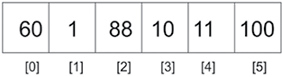

图 10.1：线性搜索示例

前面的列表包含可以通过索引访问的数据。 要在列表中找到一个数据，我们可以一个一个地线性搜索给定的数据。 该技术通过使用索引从列表的开头移动到结尾来遍历数据列表。 检查每个数据，如果它与搜索数据不匹配，则检查下一个数据。 通过从一个数据跳到下一个数据，列表被顺序遍历。 我们在本章中使用具有整数值的列表项来帮助您理解这个概念，因为整数可以很容易地进行比较； 但是，列表项也可以包含任何其他数据类型。

线性搜索方法取决于列表项在内存中的存储方式——它们是否已按顺序排序或未排序。 让我们首先看看如果给定的数据项列表未排序，线性搜索算法是如何工作的。

### 无序线性搜索

无序线性搜索是一种线性搜索算法，其中给定的日期项列表未排序。 我们将所需的数据项与列表的数据项逐一线性匹配，直到列表的末尾或找到所需的数据项。 考虑一个包含数据 ```60```、```1```、```88```、```10``` 和 ```100``` 的示例列表——一个无序列表。 要在这样的列表上执行搜索操作，需要从第一项开始并将其与搜索数据进行比较。 如果搜索数据不匹配，则检查列表中的下一个数据。 这一直持续到我们到达列表中的最后一个数据或直到找到匹配项。

在数据的无序列表中，搜索数据 ```10``` 从第一个数据开始，然后移动到列表中的下一个数据。 因此，首先将 ```60``` 与 ```10``` 进行比较，由于不相等，我们将 ```66``` 与下一个数据 ```1``` 进行比较，然后是 ```88```，依此类推，直到我们在列表中找到搜索数据。 找到数据后，我们返回找到所需数据的索引位置。 这个过程如图 10.2 所示：

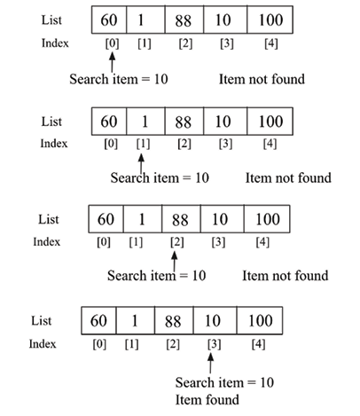

图 10.2：无序线性搜索

下面是在 ```Python``` 中对数据的无序列表进行线性搜索的实现：

```python
def search(unordered_list, term):
    return next(
        (
            i
            for i, item in enumerate(unordered_list)
            if term == unordered_list[i]
        ),
        None,
    )
```

搜索函数有两个参数； 第一个是保存数据的列表，第二个参数是我们要查找的数据，称为搜索数据。 在 ```for``` 循环的每次传递中，我们检查搜索数据是否等于索引项。 如果这是真的，那么就有一个匹配，并且没有必要继续进行搜索。 我们返回在列表中找到搜索数据的索引位置。 如果循环运行到列表末尾仍未找到匹配项，则返回 ```None``` 以表示列表中没有这样的数据。

我们可以使用以下代码片段来检查给定的数据项列表中是否存在所需的数据数据：

```python
list1 = [60, 1, 88, 10, 11, 600]

search_term = 10
index_position = search(list1, search_term)
print(index_position)
list2 = ["packt", "publish", "data"]
search_term2 = "data"
Index_position2 = search(list2, search_term2)
print(Index_position2)
```

上述代码的输出如下：

```python
3
2
```

在上面代码的输出中，首先我们在 ```list1``` 中查找数据数据 ```10``` 时返回索引位置 ```3```。 其次，在 ```list2``` 中查找数据项 ```data``` 时返回索引位置 ```2```。 我们可以使用相同的算法从 ```Python``` 中的非数字数据项列表中搜索非数字数据，因为字符串数据也可以类似于 ```Python``` 中的数字数据进行比较。

当从数据的无序列表中搜索任何数据时，在最坏的情况下，所需的数据可能位于最后一个位置，或者可能不存在于列表中。 在这种情况下，我们将不得不将搜索数据与列表的所有数据进行比较，即如果列表中的数据项总数为 ```n```，则进行 ```n``` 次比较。 因此，无序线性搜索的最坏情况运行时间为 $O(n)$。 在找到搜索数据之前，可能需要访问所有数据。 最坏的情况是搜索数据位于列表的最后位置。

接下来，我们讨论如果给定的数据项列表已经排序，线性搜索算法如何工作。

### 有序线性搜索

如果数据数据已经按排序顺序排列，则可以改进线性搜索算法。 数据排序列表中的线性搜索算法具有以下步骤：

1. 按顺序移动列表
2. 如果搜索数据的值大于循环中当前正在检查的对象或数据，则退出并返回 ```None```

在遍历列表的过程中，如果搜索数据的值小于列表中的当前项，则不需要继续搜索。 让我们考虑一个例子，看看它是如何工作的。 假设我们有一个数据列表 ```{2, 3, 4, 6, 7}``` 如图 10.3 所示，我们想要搜索数据 ```5```：

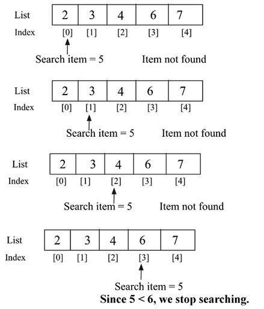

图 10.3：有序线性搜索示例

我们通过将所需的搜索数据 ```5``` 与第一个数据进行比较来开始搜索操作； 未找到匹配项。 我们继续将搜索数据与列表中的下一个数据（即 ```3```）进行比较。 由于它也不匹配，我们继续检查下一个数据，即 ```4```，由于它也不匹配，我们继续在列表中搜索，并将搜索数据与第四个数据，即 ```6``` 进行比较。这也与搜索数据不匹配。 由于给定的列表已经按升序排序并且搜索数据的值小于第四个数据，因此无法在列表中的任何后面位置找到搜索数据。 换句话说，如果列表中的当前项大于搜索数据，则意味着不需要进一步搜索列表，我们将停止搜索列表中的数据。

这是列表已经排序时线性搜索的实现：

```python
def search_ordered(ordered_list, term):
    ordered_list_size = len(ordered_list)
    for i in range(ordered_list_size):
        if term == ordered_list[i]:
            return i
        elif ordered_list[i] > term:
            return None
    return None
```

在前面的代码中，```if``` 语句现在用于检查是否在列表中找到搜索数据。 然后，```elif``` 检查 ```ordered_list[i] > term``` 的条件。 如果比较结果为 ```True```，我们将停止搜索，这意味着列表中的当前项大于搜索数据。 该方法的最后一行返回 ```None```，因为循环可能会遍历整个列表，但搜索数据仍未在列表中匹配。

我们使用以下代码片段来使用搜索算法：

```python
list1 = [2, 3, 4, 6, 7]

search_term = 5
index_position1 = search_ordered(list1, search_term)

if index_position1 is None:
    print(f"{search_term} not found")
else:
    print(f"{search_term} found at position {index_position1}")


list2 = ["book", "data", "packt", "structure"]

search_term2 = "structure"
index_position2 = search_ordered(list2, search_term2)
if index_position2 is None:
    print(f"{search_term2} not found")
else:
    print(f"{search_term2} found at position {index_position2}")
```

上述代码的输出如下：

```python
5 not found
structure found at position 3
```

在上述代码的输出中，首先，搜索数据 ```5``` 在给定列表中不匹配。 而对于第二个非数字数据数据列表，字符串结构在索引位置 ```3``` 处匹配。因此，我们可以使用相同的线性搜索算法从数据项的有序列表中搜索非数字数据项，因此给定的数据项列表应该类似于电话上的联系人列表进行排序。

在最坏的情况下，所需的搜索数据将出现在列表的最后位置或根本不出现。 在这种情况下，我们将不得不追踪完整的列表（比如 ```n``` 个数据）。 因此，有序线性搜索的最坏情况时间复杂度为 $O(n)$。

接下来，我们将讨论跳跃搜索算法。

## 跳跃搜索

跳跃搜索算法是对线性搜索的改进，用于从有序（或排序）的数据列表中搜索给定数据。 这使用分而治之的策略来搜索所需的数据。 在线性搜索中，我们将搜索值与列表的每个数据进行比较，而在跳跃搜索中，我们将搜索值在列表中的不同间隔进行比较，从而减少了比较次数。

在该算法中，首先，我们将排序后的数据列表划分为称为块的数据子集。 在每个块中，最大值将位于最后一个数据内，因为数组已排序。 接下来，在该算法中，我们开始将搜索值与每个块的最后一个数据进行比较。 可以有以下三种情况：

1. 如果搜索值小于块的最后一个数据，我们将其与下一个块进行比较。
2. 如果搜索值大于块的最后一个数据，则意味着所需的搜索值必须存在于当前块中。 因此，我们在此块中应用线性搜索并返回索引位置。
3. 如果搜索值与块的比较数据相同，则返回数据的索引位置并返回当前值。

通常，块的大小取为 $\sqrt{n} $，因为它为给定的长度为 ```n``` 的数组提供最佳性能。

在最坏的情况下，如果最后一个块的最后一个数据大于要查询的数据，我们将不得不进行 ```n/m``` 次跳跃（这里，```n``` 是数据总数，```m``` 是块大小） 搜索，我们将需要 ```m - 1``` 比较以在最后一个块中进行线性搜索。 因此，比较的总数将为 ```((n/m) + m - 1)```，这将在 $m = \sqrt{n}$ 时最小化。 因此，块的大小取为$\sqrt{n}$，因为它提供了最佳性能。

让我们以列表 ```{1, 2, 3, 4, 5, 6, 7, 8, 9, 10, 11}``` 为例来搜索给定数据（比如 ```10```）：

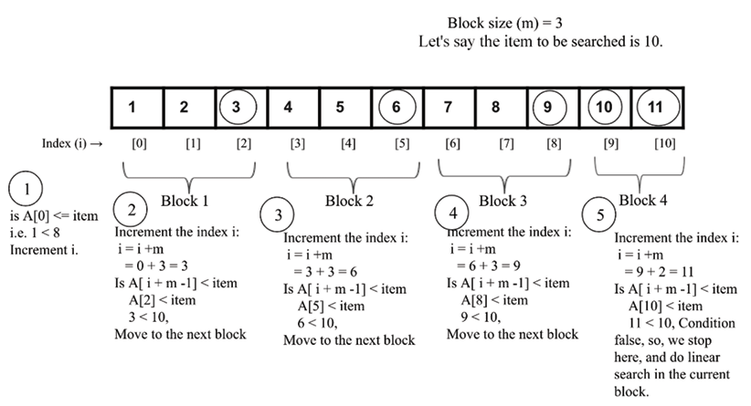

图 10.4：跳跃搜索算法的图示

在上面的例子中，我们通过 ```5``` 次比较找到了想要的数据 ```10```。 首先，我们将数组的第一个值与所需的项进行比较 ```A[0] <= item```; 如果为 ```True```，则我们将索引增加块大小（如图 10.4 中的步骤 ```1``` 所示）。 接下来，我们将所需的数据与每个块的最后一个数据进行比较。 如果它更大，那么我们移动到下一个块，例如从块 ```1``` 到块 ```3```（如图 10.4 中的步骤 ```2```、```3``` 和 ```4``` 所示）。

此外，当所需的搜索数据变得小于块的最后一个数据时，我们停止递增索引位置，然后我们在当前块中进行线性搜索。 现在，让我们讨论跳跃搜索算法的实现。 首先，我们实现线性搜索算法，这与我们在上一节中讨论的类似。

为了完整起见，这里再次给出代码如下：

```python
def search_ordered(ordered_list, term):
    print("Entering Linear Search")
    ordered_list_size = len(ordered_list)
    for i in range(ordered_list_size):
        if term == ordered_list[i]:
            return i
        elif ordered_list[i] > term:
            return -1
    return -1
```

在上面的代码中，给定一个有序的数据列表，它返回在列表中找到给定数据数据的位置的索引。 如果在列表中找不到所需的数据，则返回 ```-1```。 接下来，我们实现 ```jump_search()``` 方法如下：

```python
def jump_search(ordered_list, item):
    import math

    print("Entering Jump Search")
    list_size = len(ordered_list)
    block_size = int(math.sqrt(list_size))
    i = 0
    while i != len(ordered_list) - 1 and ordered_list[i] <= item:
        print(f"Block under consideration - {ordered_list[i:i + block_size]}")
        if i + block_size > len(ordered_list):
            block_size = len(ordered_list) - i
            block_list = ordered_list[i : i + block_size]
            j = search_ordered(block_list, item)
            if j == -1:
                print("Element not found")
                return
            return i + j
        if ordered_list[i + block_size - 1] == item:
            return i + block_size - 1
        elif ordered_list[i + block_size - 1] > item:
            block_array = ordered_list[i : i + block_size - 1]
            j = search_ordered(block_array, item)
            if j == -1:
                print("Element not found")
                return
            return i + j
        i += block_size
```

在上面的代码中，首先我们将列表的长度分配给变量 ```n```，然后我们计算块大小为 。 接下来，我们从索引 ```0``` 的第一个数据开始，然后继续搜索，直到到达列表的末尾。

我们从起始索引 ```i = 0``` 开始，块大小为 ```m```，然后继续递增，直到窗口到达列表的末尾。 我们比较是否 ```ordered_list [I + block_size -1] == item```。 如果它们匹配，则返回索引位置 ```(i+ block_size - 1)```。 代码片段如下：

```python
        if ordered_list[i + block_size - 1] == item:
            return i + block_size - 1
```

如果 ```ordered_list [i + block_size - 1] > item```，则继续在当前块内进行线性搜索算法 ```block_array = ordered_list [i : i+ block_size-1]```，如下：

```python
        elif ordered_list[i + block_size - 1] > item:
            block_array = ordered_list[i : i + block_size - 1]
            j = search_ordered(block_array, item)
            if j == -1:
                print("Element not found")
                return
            return i + j
```

在上面的代码中，我们在子数组中使用了线性搜索算法。 如果在列表中找不到所需的数据，则返回 ```-1```； 否则，返回 ```(i + j)``` 的索引位置。 这里，```i``` 是索引位置，直到我们可以找到所需数据的前一个块，```j``` 是数据数据在块中匹配所需数据的位置。 图 10.5 也描述了这个过程。

在这个图中，我们可以看到 ```i``` 在索引位置 ```5```，然后 ```j``` 是我们找到所需数据的最终块中的数据数，即 ```2```，因此最终返回的索引将是 ```5 + 2 = 7```：

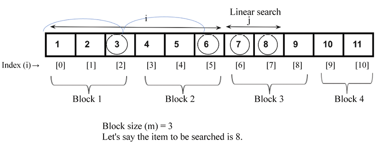

图 10.5：搜索值 ```8``` 的索引位置 ```i``` 和 ```j``` 的演示

此外，我们需要检查最后一个块的长度，因为它可能包含许多小于块大小的数据。 例如，如果数据总数为 ```11```，那么在最后一个块中我们将有 ```2``` 个数据。 因此，我们检查所需的搜索数据是否存在于最后一个块中，如果存在，我们应该更新开始和结束索引，如下所示：

```python
        if i + block_size > len(ordered_list):
            block_size = len(ordered_list) - i
            block_list = ordered_list[i : i + block_size]
            j = search_ordered(block_list, item)
            if j == -1:
                print("Element not found")
                return
            return i + j
```

在上面的代码中，我们使用线性搜索算法搜索所需的数据。

最后，如果 ```ordered_list[i+m-1] < item```，那么我们进入下一次迭代，并通过将块大小添加到索引来更新索引，因为 ```i += block_size```。

```python
print(jump_search([1, 2, 3, 4, 5, 6, 7, 8, 9, 10, 11], 8))
```

上述代码片段的输出是：

```python
Entering Jump Search
Block under consideration - [1, 2, 3]
Block under consideration - [4, 5, 6]
Block under consideration - [7, 8, 9]
Entering Linear Search
7
```

在上面的输出中，我们可以看到我们如何在给定的数据列表中搜索数据 ```10``` 的步骤。

因此，跳转搜索对块执行线性搜索，因此首先找到数据所在的块，然后在该块内应用线性搜索。 块的大小取决于数组的大小。 如果数组的大小为 ```n```，则块大小可能为 . 如果在那个块中没有找到数据，它就会移动到下一个块。 跳转搜索首先找出所需数据可能存在于哪个块中。 对于 ```n``` 个数据的列表和 ```m``` 的块大小，可能的跳转总数将是 ```n/m``` 跳转。 假设块的大小是； 因此，最坏情况下的时间复杂度将是 。

接下来，我们将讨论二分搜索算法。

## 二分搜索

二分搜索算法从给定的排序数据列表中找到给定的数据。 搜索数据是一种快速高效的算法； 然而，该算法的一个缺点是我们需要一个排序列表。 二分搜索算法的最坏情况运行时间复杂度是 $O(logn)$，而对于线性搜索，它是 $O(n)$。

二分搜索算法的工作原理如下: 它通过将给定列表分成两半来开始搜索数据。 如果搜索数据小于中间值，那么它只会在列表的前半部分寻找搜索数据，如果搜索数据大于中间值，它只会在列表的后半部分寻找。 我们每次都重复相同的过程，直到找到搜索数据，或者检查了整个列表。 对于非数字数据项列表，例如，如果我们有字符串数据项，那么我们应该按字母顺序对数据项进行排序（类似于联系人列表在手机上的存储方式）。

让我们通过一个例子来理解二分搜索算法。 假设我们有一本书有 ```1,000``` 页，我们想要达到页码 ```250```。我们知道每本书的页码都是从 ```1``` 向上顺序编号的。 因此，根据二分搜索的类比，我们首先检查搜索数据 ```250```，它小于中点值，即 ```500```。因此，我们只在书的前半部分搜索所需的页面。

我们再次找到本书前半部分的中点，使用第 ```500``` 页作为参考，我们找到中点 ```250```。这使我们更接近找到第 ```250``` 页。 然后我们在书中找到需要的页面。

让我们再举一个例子来理解二分搜索的工作原理。 我们要从 ```12``` 项的列表中搜索第 ```43``` 项，如图 10.6 所示：

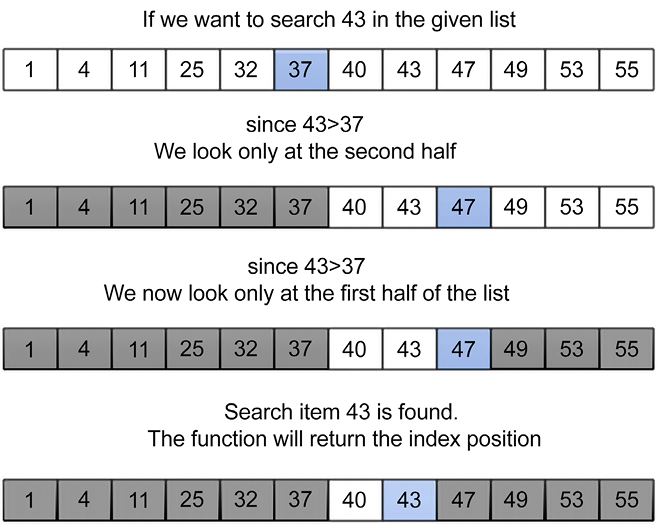

图 10.6：二分搜索的工作原理

我们通过将它与列表的中间项（在示例中为 ```37```）进行比较来开始搜索该数据。 如果搜索数据的值小于中间值，我们只看列表的前半部分； 否则，我们将看看另一半。 所以，我们只需要搜索下半部分的数据。 我们遵循相同的过程，直到在列表中找到搜索数据 ```43```。 这个过程如图 10.6 所示。

以下是对有序数据列表的二分搜索算法的实现：

```python
def binary_search_iterative(ordered_list, term):
    size_of_list = len(ordered_list) - 1
    index_of_first_element = 0
    index_of_last_element = size_of_list
    while index_of_first_element <= index_of_last_element:
        mid_point = (index_of_first_element + index_of_last_element) / 2
        if ordered_list[mid_point] == term:
            return mid_point
        if term > ordered_list[mid_point]:
            index_of_first_element = mid_point + 1
        else:
            index_of_last_element = mid_point - 1
    if index_of_first_element > index_of_last_element:
        return None
```

我们将使用已排序数据列表 ```{10, 30, 100, 120, 500}``` 来解释上述代码。 现在假设我们必须找到第 ```10``` 项在图 10.7 所示列表中的位置：

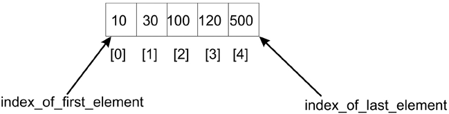

图 10.7：五个数据的示例列表

首先，我们声明两个变量，即 ```index_of_first_element``` 和 ```index_of_last_element```，它们表示给定列表中的开始和结束索引位置。 接下来，该算法使用 ```while``` 循环迭代地调整我们必须在其中找到搜索数据的列表中的限制。 停止 ```while``` 循环的终止条件是起始索引 ```index_of_first_element``` 和 ```index_of_last_element``` 索引之间的差值应该为正。

该算法首先通过将第一个数据的索引（在本例中为 ```0```）与最后一个数据的索引（在本例中为 ```4```）相加并将其除以 ```2``` 来找到列表的中点。我们得到中间索引: 中点:

```python
        mid_point = (index_of_first_element + index_of_last_element) / 2
```

在本例中，中点的索引为 ```2```，该位置存储的数据项为 ```100```。我们将中点数据与搜索数据 ```10``` 进行比较。

由于这些不匹配，并且搜索数据 ```10``` 小于中点，因此需要的搜索数据应该位于列表的前半部分，因此我们将 ```index_of_first_element``` 的索引范围调整为 ```mid_point - 1```，即新的搜索 范围变为 ```0``` 到 ```1```，如图10.8所示：

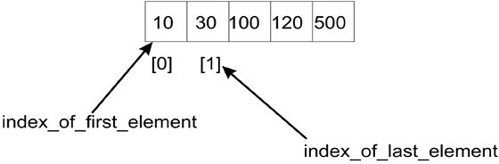

图 10.8：列表前半部分第一个和最后一个数据的索引

但是，如果我们一直在搜索 ```120```，因为 ```120``` 会大于中间值 (```100```)，我们会在列表的后半部分搜索该数据，因此，我们需要更改 列表索引范围为 ```mid_point + 1``` 到 ```index_of_last_element```。 在这种情况下，新范围将是 ```(3, 4)```。

因此，使用第一个和最后一个数据的新索引，即 ```index_of_first_element``` 和 ```index_of_last_element```，现在分别为 ```0``` 和 ```1```，我们计算中点 ```(0 + 1)/2```，它等于 ```0```。新的中点为 ```0```，所以我们找到 中间项并将其与搜索数据进行比较，结果为 ```10```。现在，我们的搜索数据已找到，并返回索引位置。

最后，我们检查 ```index_of_first_element``` 是否小于 ```index_of_last_element```。 如果此条件失败，则意味着搜索数据不在列表中。

我们可以使用下面的代码片段来搜索给定列表中的数据：

```python
list1 = [10, 30, 100, 120, 500]

search_term = 10
index_position1 = binary_search_iterative(list1, search_term)
if index_position1 is None:
    print(f"The data item {search_term} is not found")
else:
    print(f"The data item {search_term} is found at position {index_position1}")

list2 = ["book", "data", "packt", "structure"]

search_term2 = "structure"
index_position2 = binary_search_iterative(list2, search_term2)
if index_position2 is None:
    print(f"The data item {search_term2} is not found")
else:
    print(f"The data item {search_term2} is found at position {index_position2}")
```

上述代码的输出如下：

```python
The data item 10 is found at position 0
The data item structure is found at position 3
```

在上面的代码中，首先我们检查列表中的搜索数据 ```10```，我们得到正确的位置，即索引位置 ```0```。进一步，我们检查字符串结构在给定的数据项排序列表中的索引位置，并且我们 获取索引位置 ```3```.

我们讨论的实现基于迭代过程。 但是，我们也可以使用递归方法来实现它，在这种方法中，我们递归地移动指向搜索列表开头（或开始）和结尾的指针。 有关二分搜索算法的递归实现示例，请参见以下代码：

```python
def binary_search_recursive(ordered_list, first_element_index, last_element_index, term):
    if (last_element_index < first_element_index):
        return None
    mid_point = first_element_index + ((last_element_index - first_element_index) // 2)
    if ordered_list[mid_point] > term:
        return binary_search_recursive (ordered_list, first_element_index, mid_point-1, term)
    elif ordered_list[mid_point] < term:
        return binary_search_recursive (ordered_list, mid_point+1, last_element_index, term)
    else:
        return mid_point
```

对二分搜索算法的递归实现及其输出的调用如下：

```python
list1 = [10, 30, 100, 120, 500]

search_term = 10
index_position1 = binary_search_recursive(list1, 0, len(list1) - 1, search_term)
if index_position1 is None:
    print(f"The data item {search_term} is not found")
else:
    print(f"The data item {search_term} is found at position {index_position1}")


list2 = ["book", "data", "packt", "structure"]

search_term2 = "data"
index_position2 = binary_search_recursive(list2, 0, len(list1) - 1, search_term2)
if index_position2 is None:
    print(f"The data item {search_term2} is not found")
else:
    print(f"The data item {search_term2} is found at position {index_position2}")
```

上述代码的输出如下：

```python
The data item 10 is found at position 0
The data item data is found at position 1
```

这里，递归二分搜索和迭代二分搜索之间的唯一区别是函数定义以及计算 ```mid_point``` 的方式。 ```((last_element_index - first_element_index)//2)``` 操作后的 ```mid_point``` 的计算必须将其结果添加到 ```first_element_index```。 这样，我们定义了列表的一部分来尝试搜索。

在二分搜索中，我们反复将搜索空间（即所需数据所在的列表）分成两半。 我们从完整列表开始，在每次迭代中，我们计算中间点； 我们只考虑列表的一半来搜索数据，列表的另一半被忽略。 我们反复检查，直到找到值，或者区间为空。 因此，在每次迭代中，数组的大小都会减少一半； 例如，在第 ```1``` 次迭代中，列表的大小为 ```n```，在第 ```2``` 次迭代中，列表的大小变为 ```n/2```，在第 ```3``` 次迭代中，列表的大小变为 $n/2^2$，在 ```k``` 次迭代后，列表的大小变为 列表变为 $n/2^k$。 那时列表的大小将等于 ```1```。这意味着：

$$
=>  n/2^k = 1
$$

在两侧应用日志功能：
$$
=> log_2(n) = log_2(2k) \\
=> log_2(n) = k*log_2(2) \\
=> k = log_2(n)
$$
因此，二分搜索算法的最坏情况时间复杂度为 $O(log n)$。

接下来，我们将讨论插值搜索算法。

## 插值搜索

二分搜索算法是一种高效的查找算法。 它总是根据搜索数据的值丢弃一半的搜索空间，从而将搜索空间减少一半。 如果搜索数据小于列表中间的值，则从搜索空间中丢弃列表的后半部分。 在二分搜索的情况下，我们总是将搜索空间减少一半的固定值，而插值搜索算法是二分搜索算法的改进版本，其中我们使用更有效的方法将搜索空间减少超过每次迭代后减半。

当排序列表中存在均匀分布的数据时，插值搜索算法可以有效地工作。 在二分搜索中，我们总是从列表的中间开始搜索，而在插值搜索中，我们根据要搜索的数据计算起始搜索位置。 在插值搜索算法中，起始搜索位置最有可能靠近列表的开头或结尾； 如果搜索数据靠近列表中的第一个数据，则起始搜索位置可能靠近列表的开头，如果搜索数据靠近列表末尾，则起始搜索位置可能是 接近列表的末尾。

这与人类对任何数据列表进行搜索的方式非常相似。 它基于尝试很好地猜测可能在排序的数据列表中找到搜索数据的索引位置。

它的工作方式与二分查找算法类似，只是为了减少比较次数而确定分割标准的方法来划分数据。 在二分搜索的情况下，我们将数据分成相等的两半，在插值搜索的情况下，我们使用以下公式划分数据：

$$
mid = low\_index + \frac{(upper\_index - low\_index)}{(list[upper\_index] - list[low\_index])} * (search\_term - list[low\_index]) 
$$
上式中，```low_index``` 为列表的下界索引，即最小值的索引，```upper_index``` 表示最大值在列表中的索引位置。 ```list[low_index]``` 和 ```list[upper_index]``` 分别是列表中的最低值和最高值。 ```search_value``` 变量包含要搜索的数据的值。

让我们考虑一个例子来理解插值搜索算法是如何工作的，使用以下七个数据的列表：

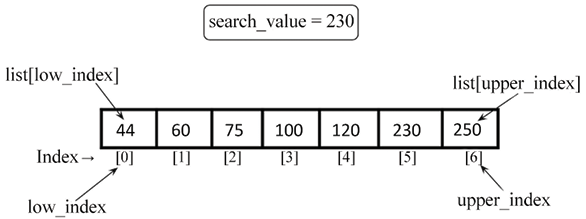

图 10.9：插值搜索示例

给定七个数据的列表，```44```、```60```、```75```、```100```、```120```、```230``` 和 ```250```，可以使用上述公式计算中点，其值如下：

```python
list1 = [4, 60, 75, 100, 120, 230, 250]
low_index = 0
upper_index = 6
list1[upper_index] = 250
list1[low_index] = 44
search_value = 230
```

将所有变量的值代入公式，我们得到：

```python
mid = low_index +  ((upper_index - low_index)/ (list1[upper_index] - list1[low_index])) * (search_value - list1[low_index])
=> 0 + [(6-0)/(250-44)] * (230-44)
=> 5.41
=> 5
```

在插值搜索的情况下，中间索引为 ```5```，因此算法从索引位置 ```5``` 开始搜索。因此，这就是我们计算开始搜索给定数据的中点的方式。

插值搜索算法的工作原理如下：

1. 我们从中点开始搜索给定的搜索值（我们刚刚看到了如何计算它）。
2. 如果搜索值与存储在中点索引处的值匹配，我们将返回该索引位置。
3. 如果搜索值与存储在中点的值不匹配，我们将列表分为两个子列表，即更高的子列表和更低的子列表。 较高子列表包含索引值高于中点的所有数据，较低子表包含索引值较低的所有数据。
4. 如果搜索值大于中点的值，我们在较高的子列表中搜索给定的搜索值并忽略较低的子列表。
5. 如果搜索值低于中点值，我们在较低的子列表中搜索给定的搜索值并忽略较高的子列表。
6. 我们重复这个过程，直到子列表的大小减少到零。

让我们了解插值搜索算法的实现。 首先，我们定义了 ```nearest_mid()``` 方法，它计算中点如下：

```python
def nearest_mid(input_list, low_index, upper_index, search_value):
    mid = low_index + (
        (upper_index - low_index) / (input_list[upper_index] - input_list[low_index])
    ) * (search_value - input_list[low_index])
    return int(mid)
```

```nearest_mid``` 函数将执行搜索的列表作为参数。 ```low_index``` 和 ```upper_index``` 参数表示我们希望在列表中找到搜索词的范围。 此外，```search_value``` 表示正在搜索的值。

在插值搜索中，中点通常更偏向左侧或右侧。 这是由除法获得中点时使用的乘数的影响造成的。 除了我们计算中点的方式外，插值算法的实现与二分查找相同。

在下面的代码中，我们提供了插值搜索算法的实现：

```python
def interpolation_search(ordered_list, search_value):
    low_index = 0
    upper_index = len(ordered_list) - 1
    while low_index <= upper_index:
        mid_point = nearest_mid(ordered_list, low_index, upper_index, search_value)
        if mid_point > upper_index or mid_point < low_index:
            return None
        if ordered_list[mid_point] == search_value:
            return mid_point
        if search_value > ordered_list[mid_point]:
            low_index = mid_point + 1
        else:
            upper_index = mid_point - 1
    if low_index > upper_index:
        return None
```

在上面的代码中，我们为给定的排序列表初始化了 ```low_index``` 和 ```upper_index``` 变量。 我们首先使用 ```nearest_mid()``` 方法计算中点。

使用 ```nearest_mid``` 函数计算的中点可能会产生大于 ```upper_bound_index``` 或小于 ```lower_bound_index``` 的值。 发生这种情况时，表示搜索词项不在列表中。 因此，没有返回来表示这一点。

接下来，我们将搜索值与存储在中点的值进行匹配，即 ```ordered_list[mid_point]```。 如果匹配，则返回中点的索引； 如果不匹配，那么我们将列表分为更高和更低的子列表，并重新调整 ```low_index``` 和 ```upper_index``` 以便算法将关注可能包含搜索词的子列表，类似于我们在二分搜索中所做的：

```python
        if search_value > ordered_list[mid_point]:
            low_index = mid_point + 1
        else:
            upper_index = mid_point - 1
```

在上面的代码中，我们检查搜索值是否大于存储在 ```ordered_list[mid_point]``` 的值，然后我们只调整 ```low_index``` 变量指向 ```mid_point + 1``` 索引。

让我们看看这种调整是如何发生的。 假设我们要在图 10.10 中的给定列表中搜索 ```190```，那么按照上面的公式，中点将为 ```4```。 然后我们将搜索值（即 ```190```）与存储在中点的值（即 ```120```）进行比较。 由于搜索值较大，我们在较高的子列表中搜索数据，并重新调整 ```low_index``` 值。 如图 10.10 所示：

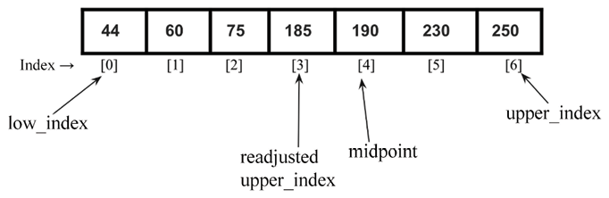

图 10.10：当搜索数据的值大于中点值时重新调整 ```low_index```

另一方面，如果搜索数据的值小于存储在 ```ordered_list[mid_point]``` 的值，那么我们只调整 ```upper_index``` 变量指向索引 ```mid_point - 1```。例如，如果我们有如下所示的列表 图 10.11，我们要搜索 ```185```，那么根据公式，中点将为 ```4```。

接下来，我们将搜索值（即 ```185```）与存储在中点的值（即 ```190```）进行比较。 由于搜索值比 ```ordered_list[mid_point]``` 小，我们在 ```lower``` 子列表中搜索数据，并重新调整 ```upper_index``` 值。 如图 10.11 所示：

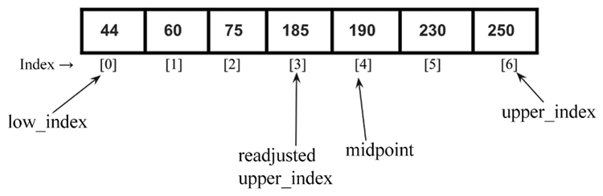

图 10.11：当搜索数据小于中点值时重新调整 ```upper_index```

以下代码片段可用于创建数据列表 ```{44, 60, 75, 100, 120, 230, 250}```，我们要使用插值搜索算法在其中搜索 ```120```。

```python
list1 = [44, 60, 75, 100, 120, 230, 250]
a = interpolation_search(list1, 120)
print("Index position of value 2 is ", a)
```

上述代码的输出如下：

```python
Index position of value 2 is  4
```

让我们用一个更实际的例子来理解二分搜索和插值算法的内部工作原理。

例如考虑以下数据列表：

```python
[2, 4, 5, 12, 43, 54, 60, 77]
```

在索引 ```0``` 处，存储值 ```2```，在索引 ```7``` 处，存储值 ```77```。 现在，假设我们要在列表中找到数据 ```2```。 这两种不同的算法将如何处理呢？

如果我们将这个列表传递给插值搜索函数，那么 ```nearest_mid``` 函数将使用 ```mid_point``` 计算公式返回一个等于 ```0``` 的值，如下所示：

```python
mid_point = 0 + [(7 - 0) / (77 - 2)] * (2 - 2) = 0
```

当我们得到 ```mid_point``` 值 ```0``` 时，我们开始使用索引 ```0``` 处的值进行插值搜索。仅通过一次比较，我们就找到了搜索词。

另一方面，二分搜索算法需要进行三次比较才能得出搜索数据，如图 10.12 所示：

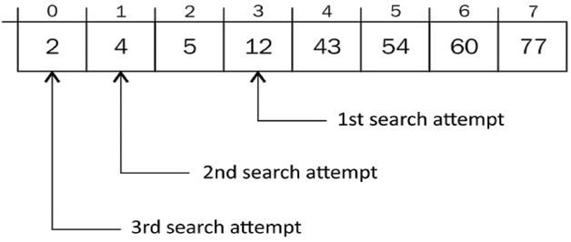

图 10.12：使用二分搜索算法搜索数据目需要进行三次比较

计算出的第一个 ```mid_point``` 值为 ```3```，第二个 ```mid_point``` 值为 ```1```，最后一个找到搜索词的 ```mid_point``` 值为 ```0```。所以，我们通过三次比较找到了想要的搜索数据，而在插值搜索中，我们找到了想要的项 第一次尝试。

当数据集已排序且均匀分布时，插值搜索算法效果很好。 在这种情况下，平均时间复杂度为 $O(log(log n))$，其中 ```n``` 是数组的长度。 此外，如果数据集是随机的，在这种情况下，插值搜索算法的最坏情况时间复杂度将为 $O(n)$。 因此，如果给定数据均匀分布，插值搜索可能比二分搜索效果更好。

## 指数搜索
指数搜索是另一种搜索算法，当我们在列表中有大量元素时，它最常使用。 指数搜索也称为奔跑搜索和加倍搜索。 指数搜索算法的工作分为以下两个步骤：

1. 给定一个包含 ```n``` 个数据元素的排序数组，我们首先确定原始列表中可能存在所需搜索项的子范围
2. 接下来，我们使用二分搜索算法在步骤 1 中识别的数据元素的子范围内找出搜索值

首先，为了找出数据元素的子范围，我们开始在给定的排序数组中通过每次迭代跳转 $2^i$ 个元素来搜索所需的项目。 这里，```i``` 是数组索引的值。 每次跳转后，我们检查搜索项是否存在于上一次跳转和当前跳转之间。 如果搜索项存在，那么我们在这个子数组中使用二分搜索算法，如果不存在，我们将索引移动到下一个位置。 因此，我们首先找到指数 ```i``` 的第一次出现，使得索引 $2^i$ 处的值大于搜索值。 然后，$2^i$ 成为下限，$2^i-1$ 成为该数据元素范围的上限，搜索值将出现在该范围内。 指数搜索算法定义如下：

1. 首先，我们用搜索元素检查第一个元素 ```A[0]```。
2. 初始化索引位置 ```i=1```。
3. 我们检查两个条件：(1) 它是否是数组的末尾（即 $2^i$ < ```len(A)```），以及 (2) 如果 ```A[i] <= search_value```）。 在第一种情况下，我们检查是否搜索了完整列表，如果到达列表末尾则停止。 在第二种情况下，当我们到达一个值大于搜索值的元素时，我们停止搜索，因为这意味着所需的元素将出现在该索引位置之前（因为列表已排序）。
4. 如果上述两个条件中的任何一个为真，我们通过以 ```2``` 的幂递增 ```i``` 来移动到下一个索引位置。
5. 当满足步骤 ```3``` 的两个条件中的任何一个时，我们停止。
6. 我们在范围 $2^i$//2 到 ```min (2 ** i, len(A))``` 上应用二分搜索算法。

让我们举一个元素排序数组 ```A = {3, 5, 8, 10, 15, 26, 35, 45, 56, 80, 120, 125, 138}``` 的例子，我们要在其中搜索元素 ```125```。

我们首先比较索引 ```i = 0``` 处的第一个元素，即 ```A[0]``` 与搜索元素。 由于 ```A[0] < search_value```，我们跳转到 ```i = 0``` 的下一个位置 $2^i$，因为 ```A[20] < search_value```，条件为 ```True```，因此我们跳转到 ```i = 1``` 的下一个位置，即 ```A[221] < search_value```。 我们再次跳转到 ```i = 2``` 的下一个位置 $2^i$，因为 ```A[22] < search_value```，条件为 ```True```。 我们迭代地跳到下一个位置，直到我们完成搜索列表或搜索值大于该位置的值，即 ```A[2 ** i] < len(A)``` 或 ```A[2 ** i] <= search_value```。 然后我们在子数组的范围上应用二分搜索算法。 使用指数搜索算法在排序数组中搜索给定元素的完整过程如图 10.13 所示：

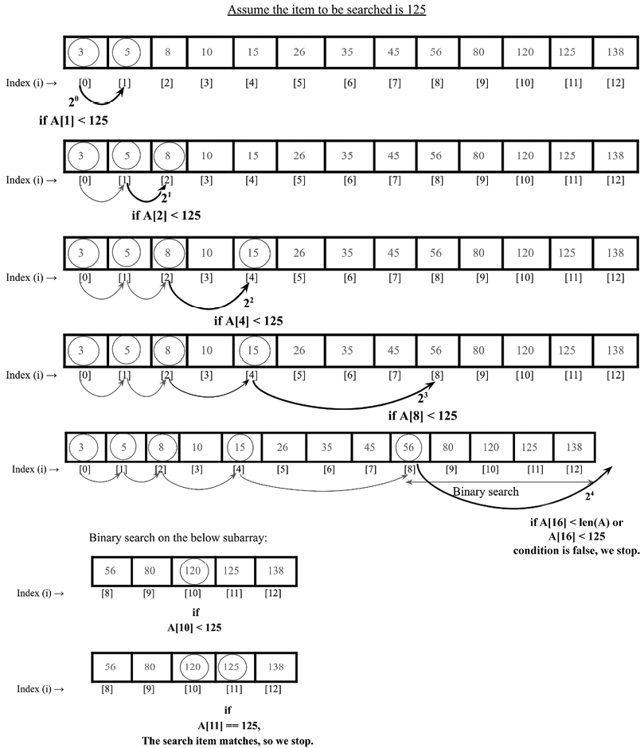

图 10.13：指数搜索算法的图示

现在，让我们讨论指数搜索算法的实现。 首先，我们实现二分查找算法，我们在上一节中已经讨论过了，但是为了该算法的完整性，再次给出如下：

```python
def binary_search_recursive(
    ordered_list, first_element_index, last_element_index, term
):
    if last_element_index < first_element_index:
        return None
    mid_point = first_element_index + (
        (last_element_index - first_element_index) // 2
    )
    if ordered_list[mid_point] > term:
        return binary_search_recursive(
            ordered_list, first_element_index, mid_point - 1, term
        )
    elif ordered_list[mid_point] < term:
        return binary_search_recursive(
            ordered_list, mid_point + 1, last_element_index, term
        )
    else:
        return mid_point
```

在上面的代码中，给定有序的元素列表，它返回在列表中找到给定数据元素的位置的索引。 如果在列表中找不到所需的元素，则返回 ```None```。 接下来，我们按如下方式实现 ```exponential_search()``` 方法：

```python
def exponential_search(A, search_value):
    if A[0] == search_value:
        return 0
    index = 1
    while index < len(A) and A[index] < search_value:
        index *= 2
    return binary_search_recursive(A, index // 2, min(index, len(A) - 1), search_value)
```

在上面的代码中，首先，我们将第一个元素 ```A[0]``` 与 ```search_value``` 进行比较。 如果匹配则返回索引位置 ```0```。 如果不匹配，我们将索引位置增加到 ```20```，即 ```1```。我们检查 ```A[1] < search_value```。 由于条件为真，我们跳转到下一个位置 ```21```，即我们比较 ```A[2] < search_value```。 由于条件为真，我们移动到下一个位置。

我们以 ```2``` 的幂迭代地增加索引位置，直到满足停止条件：

```python
    while index < len(A) and A[index] < search_value:
        index *= 2
```

最后，当满足停止条件时，我们使用二分搜索算法在子范围内搜索所需的搜索值，如下所示：

```python
    return binary_search_recursive(A, index // 2, min(index, len(A) - 1), search_value)
```

最后，如果在给定数组中找到搜索值，则 ```exponential_search()``` 方法返回索引位置； 否则，返回 ```None```。

```python
print(exponential_search([1, 2, 3, 4, 5, 6, 7, 8, 9, 10, 11, 12, 34, 40], 34))
```

上述代码片段的输出是：

```python
12
```

在上面的输出中，我们得到了给定数组中搜索项 ```34``` 的索引位置 ```12```。

指数搜索对于非常大的数组很有用。 这比二分查找更好，因为我们不是在整个数组上执行二分查找，而是找到一个可能存在该元素的子数组然后应用二分查找，因此它减少了比较次数。

指数搜索的最坏情况时间复杂度是 $O(log2^i)$，其中 ```i``` 是要搜索的元素所在的索引。 当所需的搜索元素出现在数组的开头时，指数搜索算法可以胜过二进制搜索。

我们还可以使用指数搜索来搜索有界数组。 当目标靠近数组的开头时，它甚至可以胜过二进制搜索，因为指数搜索需要 $O(log(i))$ 时间，而二进制搜索需要 $O(logn)$ 时间，其中 ```n``` 是元素的总数 . 当元素出现在数组的第一个位置时，指数搜索的最佳情况复杂度为 $O(1)$。

接下来，让我们讨论如何决定在给定情况下应该选择哪种搜索算法。

## 选择搜索算法

现在我们已经介绍了不同类型的搜索算法，我们可以研究哪些算法在什么情况下效果更好。 与有序和无序线性搜索函数相比，二进制搜索和插值搜索算法在性能上更好。 线性搜索算法较慢，因为顺序查询列表中的元素以找到搜索项。

线性搜索的时间复杂度为 $O(n)$。 当给定的数据元素列表很大时，线性搜索算法表现不佳。

另一方面，二进制搜索操作在尝试搜索时将列表一分为二。 在每次迭代中，我们比线性策略更快地接近搜索词。 时间复杂度为 $O(logn)$。 二分搜索算法性能良好，但它的缺点是它需要一个排序的元素列表。 因此，如果给定的数据元素很短且未排序，那么最好使用线性搜索算法。

插值搜索从搜索空间中丢弃超过一半的项目列表，这使它能够更有效地到达包含搜索词的列表部分。 在插值搜索算法中，中点的计算方式使得更快获得搜索项的概率更高。 插值搜索的平均时间复杂度为$O(log(logn))$，而插值搜索算法的最坏情况时间复杂度为 $O(n)$。 这表明插值搜索比二进制搜索更好，并且在大多数情况下提供更快的搜索。

因此，如果列表很短且未排序，则适合使用线性搜索算法，如果列表已排序且不是很大，则可以使用二分查找算法。 此外，如果列表中的数据元素均匀分布，则可以使用插值搜索算法。 如果列表很大，那么可以使用指数搜索算法和跳跃搜索算法。

## 概括

在本章中，我们讨论了从数据元素列表中搜索给定元素的概念。 我们讨论了几种重要的搜索算法，如线性搜索、二分搜索、跳跃搜索、插值搜索和指数搜索。 使用 ```Python``` 详细讨论了这些算法的实现。 我们将在下一章讨论排序算法。

## 练习

1. n 个元素的线性搜索平均需要多少次比较？
2. 假设排序数组中有八个元素。 如果所有搜索都成功并且使用二分搜索算法，平均需要进行多少次比较？
3. 二分查找算法最坏情况下的时间复杂度是多少？
4. 什么时候插值搜索算法应该比二分搜索算法表现更好？