# 排序

排序意味着以升序或降序的方式重新组织数据。 排序是计算机科学中最重要的算法之一，广泛应用于数据库相关算法中。 对于多个应用程序，如果数据已排序，则可以高效地检索它，例如，如果它是姓名、电话号码或简单待办事项列表中的数据的集合。

在本章中，我们将学习一些最重要和流行的排序技术，包括：

- 冒泡排序
- 插入排序
- 选择排序
- 快速排序
- ```Timsort```

##技术要求


GitHub 存储库中提供了用于解释本章概念的所有源代码，链接如下：

https://github.com/PacktPublishing/Hands-On-Data-Structures-and-Algorithms-with-Python-Third-Edition/tree/main/Chapter11

## 排序算法

排序是指按升序或降序排列列表中的所有数据。 我们可以通过运行它们需要多少时间和内存空间来比较不同的排序算法。

算法花费的时间根据输入大小而变化。 此外，一些算法实现起来相对容易，但在时间和空间复杂度方面可能表现不佳，而另一些算法实现起来稍微复杂一些，但在对较长的数据列表进行排序时表现良好。 其中一种排序算法，合并排序，我们已经在[第 3 章](./3.md)"算法设计技术和策略"中讨论过。 我们将一一详细讨论几种排序算法及其实现细节，从冒泡排序算法开始。

## 冒泡排序算法

冒泡排序算法背后的思想非常简单。 给定一个无序列表，我们比较列表中的相邻数据，并且在每次比较之后，我们根据它们的值将它们按正确的顺序排列。 因此，如果相邻数据的顺序不正确，我们将交换它们。 对于包含 ```n``` 个数据的列表，此过程重复 ```n-1``` 次。

在每次迭代中，列表中最大的数据被移动到列表的末尾。 第二次迭代后，第二大数据将被放置在列表中的倒数第二个位置。 重复相同的过程，直到列表被排序。

我们以一个只有 ```{5, 2}``` 两个数据的列表来理解冒泡排序的概念，如图 11.1 所示：

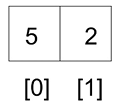

图 11.1：冒泡排序的例子

要对这个包含两个数据的列表进行排序，首先，我们比较 ```5``` 和 ```2```； 因为 ```5``` 大于 ```2```，这意味着它们的顺序不正确，所以我们交换这些值以将它们放在正确的顺序中。 为了交换这两个数字，首先，我们将存储在索引 ```0``` 的数据移动到一个临时变量中（图 11.2 的步骤 ```1```），然后将存储在索引 ```1``` 的数据复制到索引 ```0```（图 11.2 的步骤 ```2```），最后 存储在临时变量中的第一个数据存储回索引 ```1```（图 11.2 的步骤 3）。 因此，首先，数据 ```5``` 被复制到临时变量 ```temp```。 然后，数据 ```2``` 移动到索引 ```0```。最后，```5``` 从 ```temp``` 移动到索引 ```1```。列表现在将包含数据 ```[2, 5]```：

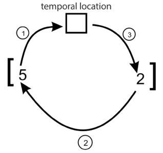

图 11.2：冒泡排序中两个数据的交换

如果 ```unordered_list[0]``` 的数据顺序不正确，以下代码会将它们交换为 ```unordered_list[1]``` ：

```python
unordered_list = [5, 2]
temp = unordered_list[0]
unordered_list[0] = unordered_list[1]
unordered_list[1] = temp
print(unordered_list)
```

上述代码的输出是：

```python
[2, 5]
```

现在我们已经能够交换一个双数据数组，使用相同的想法使用冒泡排序对整个列表进行排序应该很简单。

让我们考虑另一个例子来理解冒泡排序算法的工作原理，并对包含六个数据的无序列表进行排序，例如 ```{45, 23, 87, 12, 32, 4}```。 在第一次迭代中，我们开始比较前两个数据 ```45``` 和 ```23```，然后交换它们，因为 ```45``` 应该放在 ```23``` 之后。然后，我们比较下一个相邻值 ```45``` 和 ```87```，看它们是否在 正确的顺序。 由于 ```87``` 的值高于 ```45```，因此我们不需要交换它们。 如果两个数据的顺序不正确，我们就交换它们。

我们可以看到，在图 11.3 中，在冒泡排序的第一次迭代之后，最大的数据 ```87``` 被放置在列表的最后一个位置：

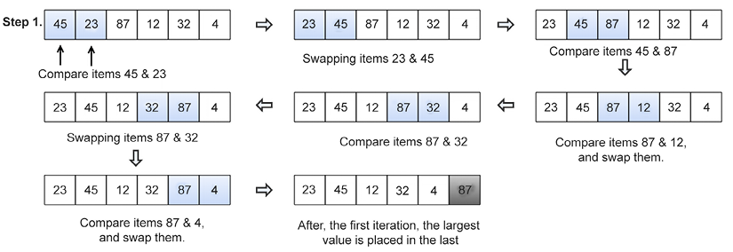

图 11.3：使用冒泡排序对示例数组进行排序的第一次迭代的步骤

第一次迭代后，我们只需要排列剩余的```(n-1)``` 个数据即可； 我们通过比较剩余 ```5``` 个数据的相邻数据来重复相同的过程。 第二次迭代后，第二大数据 ```45``` 被放置在列表中的倒数第二个位置，如图 11.4 所示：

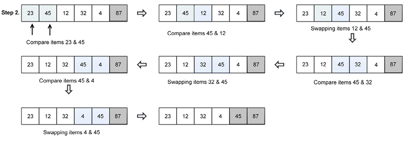

图 11.4：使用冒泡排序对示例数组进行排序的第二次迭代的步骤

接下来，我们要比较剩余的 ```(n-2)``` 个数据，将它们排列成如图 11.5 所示：

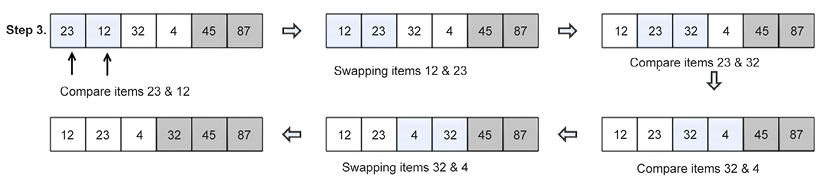

图 11.5：使用冒泡排序对示例数组进行排序的第三次迭代的步骤

同样，我们比较剩余的数据，对它们进行排序，也如图11.6所示：

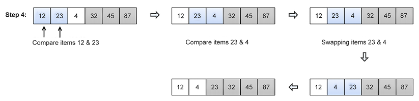

图 11.6：使用冒泡排序对示例数组进行排序的第四次迭代的步骤

最后，对于剩下的最后两个数据，我们将它们按正确的顺序排列，得到最终的排序列表，如图11.7所示：

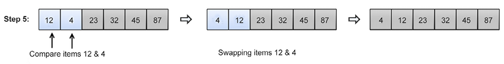

图 11.7：使用冒泡排序对示例数组进行排序的第五次迭代的步骤

冒泡排序算法的完整 ```Python``` 代码如下所示，之后对每一步进行了详细的解释：

```python
def bubble_sort(unordered_list):
    iteration_number = len(unordered_list) - 1
    for i in range(iteration_number, 0, -1):
        for j in range(i):
            if unordered_list[j] > unordered_list[j + 1]:
                temp = unordered_list[j]
                unordered_list[j] = unordered_list[j + 1]
                unordered_list[j + 1] = temp
```

冒泡排序是使用双嵌套循环实现的，其中一个循环在另一个循环内。 在冒泡排序中，内循环在每次迭代中反复比较和交换给定列表的相邻数据，外循环跟踪内循环应该重复多少次。

首先，在上面的代码中，我们计算循环应该运行多少次才能完成所有交换； 这等于列表的长度减去 ```1```，可以写成 ```iteration_number = len(unordered_list) - 1```。 在这里，```len``` 函数将给出列表的长度。 我们减去 ```1```，因为它恰好为我们提供了要运行的最大迭代次数。 外层循环确保这一点并执行一个减去列表的大小。

此外，在上面的代码中，对于每次迭代，在内部循环中，我们使用 if 语句比较相邻数据，并检查相邻数据的顺序是否正确。 对于第一次迭代，内部循环应运行 ```n``` 次，对于第二次迭代，内部循环应运行 ```n-1``` 次，依此类推。 例如，要对包含三个数字的列表 ```[3, 2, 1]``` 进行排序，内部循环运行两次，我们最多需要交换数据两次，如图 11.8 所示：

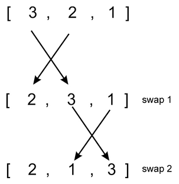

图 11.8：示例列表 ```[3, 2, 1]``` 的迭代 ```1``` 中的交换次数

更进一步，在第一次迭代之后，在第二次迭代中，我们执行一次内循环，如图11.9所示：

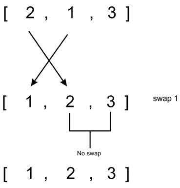

图 11.9：示例列表 ```[3, 2, 1]``` 的迭代 ```2``` 中的交换次数

以下代码片段可用于部署冒泡排序算法：

```python
my_list = [4, 3, 2, 1]
bubble_sort(my_list)
print(my_list)

my_list = [1, 12, 3, 4]
bubble_sort(my_list)
print(my_list)
```

输出如下：

```python
[1, 2, 3, 4]
[1, 3, 4, 12]
```

在最坏的情况下，第一次迭代所需的比较次数为 ```(n-1)```，第二次需要的比较次数为 ```(n-2)```，第三次迭代为 ```(n-3)``` ）， 等等。 因此，冒泡排序所需的总比较次数为：
$$
(n-1) + (n-2) + (n-3) +.....+ 1 = \frac {n(n-1)}{2}
$$

$$
\frac {n(n-1)}{2}
$$

$$
O(n^2)
$$

冒泡排序算法不是一种高效的排序算法，因为它提供了 $O(n^2)$ 的最坏情况运行时复杂度和 $O(n)$ 的最佳情况复杂度。 最坏的情况发生在我们想对给定的列表进行升序排序而给定的列表是降序的时候，最好的情况发生在给定的列表已经排序的时候； 在这种情况下，将不需要交换。

通常，不应该使用冒泡排序算法对大型列表进行排序。 冒泡排序算法适用于对性能要求不高或给定列表长度较短的应用，而且更喜欢短小精悍的代码。 冒泡排序算法在相对较小的列表上表现良好。

现在我们将研究插入排序算法。

## 插入排序算法
插入排序的思想是我们维护两个子列表（子列表是原来更大列表的一部分），一个已排序，一个未排序，其中数据从未排序的子列表中一个一个添加到已排序的子列表中 子列表。 因此，我们从未排序的子列表中取出数据并将它们插入到已排序的子列表中的正确位置，这样子列表就会保持排序。

在插入排序算法中，我们总是从一个数据开始，取它进行排序，然后从未排序的子列表中一个一个地取出数据，并将它们放在已排序的子列表中的正确位置（相对于第一个数据）。 因此，在从未排序的子列表中取出一个数据并将其添加到已排序的子列表后，现在我们在已排序的子列表中有两个数据。 然后，我们再次从未排序的子列表中取出另一个数据，并将其放置在已排序子列表中的正确位置（相对于两个已经排序的数据）。 我们反复按照这个过程将未排序的子列表中的所有数据一个一个地插入到已排序的子列表中。 阴影数据表示图 11.10 中的有序子列表，在每次迭代中，无序子列表中的一个数据被插入到已排序子列表中的正确位置。

让我们考虑一个例子来理解插入排序算法的工作原理。 比方说； 我们必须对包含六个数据的列表进行排序：```{45, 23, 87, 12, 32, 4}```。 首先，我们从一个数据开始，假设它已排序，然后从未排序的子列表中取出下一个数据 23，并将其插入已排序的子列表中的正确位置。 在下一次迭代中，我们从未排序的子列表中取出第三个数据 ```87```，并将其再次插入到已排序子列表的正确位置。 我们遵循相同的过程，直到所有数据都在已排序的子列表中。 这整个过程如图 11.10 所示：

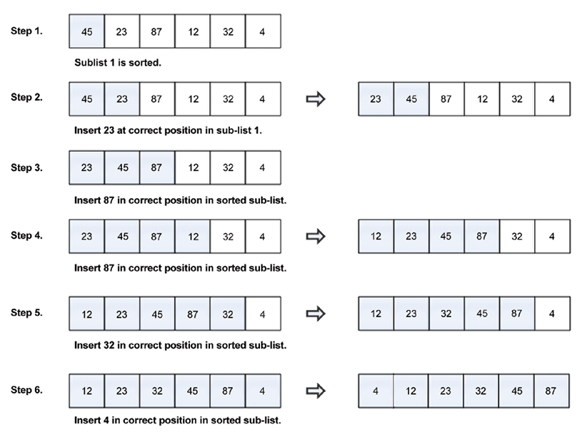

图 11.10：使用插入排序算法对示例数组数据进行排序的步骤

下面给出了插入排序的完整 ```Python``` 代码； 算法的每个语句都通过示例进一步详细解释：

```python
def insertion_sort(unsorted_list):
    for index in range(1, len(unsorted_list)):
        search_index = index
        insert_value = unsorted_list[index]
        while search_index > 0 and unsorted_list[search_index - 1] > insert_value:
            unsorted_list[search_index] = unsorted_list[search_index - 1]
            search_index -= 1
        unsorted_list[search_index] = insert_value
```

为了理解插入排序算法的实现，让我们再举五个数据 ```{5, 1, 100, 2, 10}``` 的例子，并详细解释一下这个过程。 让我们考虑下面的数组，如图 11.11 所示：

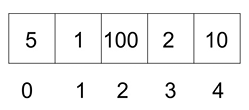

图 11.11：具有索引位置的示例数组

该算法首先使用 ```for``` 循环在 ```1``` 和 ```4``` 索引之间运行。 我们从索引 ```1``` 开始，因为我们将存储在索引 ```0``` 的数据放在已排序的子数组中，而索引 ```1``` 到 ```4``` 之间的数据属于未排序的子列表，如图 11.12 所示：

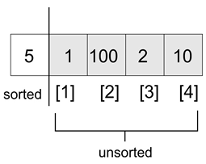

图 11.12：插入排序中已排序和未排序子列表的演示

在循环执行开始时，我们有以下代码片段：

```python
    for index in range(1, len(unsorted_list)):
        search_index = index
        insert_value = unsorted_list[index]
```

在 ```for``` 循环的每次运行开始时，```unsorted_list[index]``` 处的数据存储在 ```insert_value``` 变量中。 稍后，当我们在子列表的已排序部分中找到合适的位置时，```insert_value``` 将存储在已排序子列表中的该索引处。 下一个代码片段如下所示：

```python
        while search_index > 0 and unsorted_list[search_index - 1] > insert_value:
            unsorted_list[search_index] = unsorted_list[search_index - 1]
            search_index -= 1
        unsorted_list[search_index] = insert_value
```

```search_index``` 用于为 ```while``` 循环提供信息，即准确找到下一个需要插入已排序子列表的数据的位置。

```while``` 循环在两个条件的指导下向后遍历列表。 首先，如果 ```search_index > 0```，则意味着列表的已排序部分中有更多数据； 其次，要运行 ```while``` 循环，```unsorted_list[search_index - 1]``` 必须大于 ```insert_value``` 变量。 ```unsorted_list[search_index - 1]``` 数组将执行以下任一操作：

- 指向数据，就在 ```unsorted_list[search_index]``` 之前，第一次执行 ```while``` 循环之前
- 指向 ```unsorted_list[search_index - 1]``` 之前的一个数据，在 ```while``` 循环第一次运行之后

在示例列表中，将执行 ```while``` 循环，因为 ```5 > 1```。在 ```while``` 循环体中，```unsorted_list[search_index - 1]``` 处的数据存储在 ```unsorted_list[search_index]``` 中。 并且，```search_index -= 1``` 向后移动列表遍历，直到它的值为 ```0```。

在 ```while``` 循环退出后，```search_index``` 的最后已知位置（在本例中为 ```0```）现在帮助我们知道在哪里插入 ```insert_value```。 图 11.13 显示了第一次迭代后数据的位置：

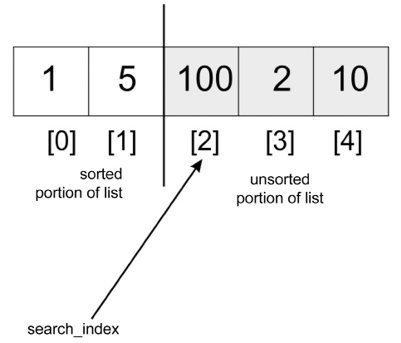

图 11.13：第一次迭代后的示例列表位置

在 ```for``` 循环的第二次迭代中，```search_index``` 的值为 ```2```，这是数组中第三个数据的索引。 此时，我们开始在向左方向（朝向索引 ```0```）进行比较。 ```100``` 会和 ```5``` 比较，但是因为 ```100``` 大于 ```5```，所以不会执行 ```while``` 循环。 ```100``` 将被自身替换，因为 ```search_index``` 变量从未减少。 因此，```unsorted_list[search_index] = insert_value``` 将无效。

当 ```search_index``` 指向索引 ```3``` 时，我们将 ```2``` 与 ```100``` 进行比较，并将 ```100``` 移动到存储 ```2``` 的位置。 然后我们将 ```2``` 与 ```5``` 进行比较，并将 ```5``` 移动到最初存储 ```100``` 的位置。 此时，```while``` 循环将中断，```2``` 将存储在索引 ```1``` 中。数组将根据值 ```[1, 2, 5, 100, 10]``` 进行部分排序。 前面的步骤将最后一次发生，以便对列表进行排序。

以下代码可用于创建数据列表，我们可以使用定义的 ```insertion_sort()``` 方法对其进行排序：

```python
my_list = [5, 1, 100, 2, 10]
print("Original list", my_list)
insertion_sort(my_list)
print("Sorted list", my_list)
```

插入排序的最坏情况时间复杂度是当给定的数据列表以相反的顺序排序时。 在这种情况下，每个数据都必须与其他每个数据进行比较。 因此，我们将需要在第一次迭代中进行一次比较，在第二次迭代中进行两次比较，在第三次迭代中进行三次比较，在第 $(n-1)$ 次迭代中进行 $(n-1)^{th}$ 次比较。 因此，比较的总数是：

```python
1 + 2 + 3 ... + (n - 1) 
n(n - 1) / 2
```

因此，插入排序算法给出了 $O(n^2)$ 的最坏情况运行时复杂度。 此外，在给定输入列表已经排序的情况下，插入排序算法的最佳情况复杂度为 $O(n)$，其中未排序子列表中的每个数据仅与已排序子列表的最右边数据进行比较 在每次迭代中。 插入排序算法适用于给定列表的数据数量较少的情况，最适合输入数据一个接一个到达，需要保持列表有序的情况。 现在我们来看看选择排序算法。

## 选择排序算法

另一种流行的排序算法是选择排序。 选择排序算法首先找到列表中的最小数据，然后将其与存储在列表第一个位置的数据进行交换。 因此，它对排序到第一个数据的子列表进行排序。 此过程重复 ```(n-1)``` 次以对 ```n``` 个数据进行排序。

接下来，第二个最小的数据，即剩余列表中的最小数据，被识别并与列表中的第二个位置互换。 这使得最初的两个数据排序。 重复该过程，并将列表中剩余的最小数据与列表中第三个索引中的数据交换。 这意味着前三个数据现在已排序。

让我们看一个例子来理解算法是如何工作的。 我们将使用选择排序算法对以下四个数据列表 ```{15, 12, 65, 10, 7}``` 及其索引位置进行排序，如图 11.14 所示：


图 11.14：选择排序第一次迭代的演示

在选择排序的第一次迭代中，我们从索引 ```0``` 开始，搜索列表中的最小项，当找到最小数据时，将其与索引 ```0``` 处的列表的第一个数据数据交换。我们简单地 重复这个过程，直到列表完全排序。 第一次迭代后，最小的数据将被放置在列表的第一个位置。

接下来，我们从索引位置为 ```1``` 的列表的第二个数据开始，搜索数据列表中从索引位置 ```1``` 到列表长度的最小数据。 一旦我们从这个剩余的数据列表中找到最小的数据，我们就将这个数据与列表的第二个数据交换。 选择排序第二次迭代的分步过程如图11.15所示：

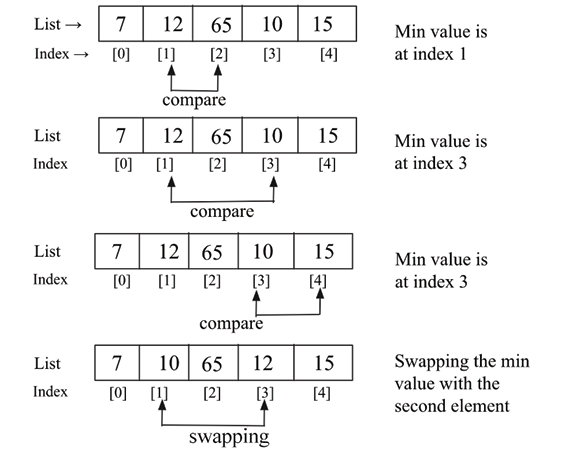

图 11.15：选择排序第二次迭代的演示

在下一次迭代中，我们在索引位置 ```2``` 到 ```4``` 中找出剩余列表中的最小数据，并在第二次迭代中将最小数据数据与索引 ```2``` 处的数据数据交换。 我们遵循相同的过程，直到我们对完整列表进行排序。

下面是选择排序算法的实现。 该函数的参数是未排序的数据列表，我们希望按其值的升序排列：

```python
def selection_sort(unsorted_list):
    size_of_list = len(unsorted_list)
    for i in range(size_of_list):
        small = i
        for j in range(i + 1, size_of_list):
            if unsorted_list[j] < unsorted_list[small]:
                small = j
        temp = unsorted_list[i]
        unsorted_list[i] = unsorted_list[small]
        unsorted_list[small] = temp
```

在上面选择排序的代码中，算法从外层的 ```for``` 循环开始遍历列表，从索引 ```0``` 开始到 ```size_of_list```。 因为我们将 ```size_of_list``` 传递给 ```range``` 方法，它会生成一个从 ```0``` 到 ```size_of_list - 1``` 的序列。

接下来，我们声明一个变量 ```small```，它存储最小数据的索引。 此外，内部循环负责遍历列表，我们跟踪列表中最小值的索引。 一旦找到最小数据的索引，我们就将这个数据与列表中的正确位置交换。

以下代码可用于创建数据列表，我们使用选择排序算法对列表进行排序：

```python
a_list = [3, 2, 35, 4, 32, 94, 5, 7]
print("List before sorting", a_list)
selection_sort(a_list)
print("List after sorting", a_list)
```

上述代码的输出如下：

```python
List before sorting [3, 2, 35, 4, 32, 94, 5, 7]
List after sorting [2, 3, 4, 5, 7, 32, 35, 94]
```

在选择排序中，第一次迭代需要 ```(n-1)``` 次比较，第二次迭代需要 ```(n-2)``` 次比较，第三次迭代需要 ```(n-3)``` 次比较，以此类推。 因此，所需的总比较次数为： ```(n-1) + (n-2) + (n-3) + ..... + 1 = n(n-1) / 2```，几乎等于 $n^2$ . 因此，选择排序的最坏情况时间复杂度为 $O(n^2)$。 最坏的情况是给定的数据列表是反向排序的。 选择排序算法给出了 $O(n^2)$ 的最佳情况运行时复杂度。 当我们有一个小的数据列表时，可以使用选择排序算法。

接下来，我们将讨论快速排序算法。

## 快速排序算法
快速排序算法是一种高效的排序算法。 快速排序算法基于分而治之的算法类，类似于合并排序算法，我们将问题分解（划分）为更容易解决的更小的块，进一步，最终结果通过以下方式获得 结合较小问题的输出（征服）。

快速排序背后的概念是对给定的列表或数组进行分区。 为了对列表进行分区，我们首先从给定列表中选择一个数据数据，称为枢轴数据。

我们可以选择列表中的任何数据作为枢轴数据。 但是，为了简单起见，我们将数组中的第一个数据作为基准数据。 接下来，将列表中的所有数据与该枢轴数据进行比较。 在第一次迭代结束时，列表中的所有数据的排列方式是，小于主元的数据排列在主元的左侧，大于主元的数据排列在主元的左侧 在枢轴的右侧。

现在，让我们通过一个例子来理解快速排序算法的工作原理。

在该算法中，首先我们将给定的未排序数据数据列表划分为两个子列表，使得该划分点（也称为枢轴）左侧的所有数据都应小于枢轴，并且所有数据 在枢轴的右侧应该更大。 这意味着左侧子列表和右侧子列表的数据将未排序，但枢轴数据将位于完整列表中的正确位置。 如图 11.16 所示。

因此，在快速排序算法的第一次迭代之后，选择的枢轴点被放置在列表中的正确位置，并且在第一次迭代之后，我们得到两个无序子列表，并在这两个子列表上再次执行相同的过程。 因此，快速排序算法将列表分为两部分，并递归地将快速排序算法应用于这两个子列表以对整个列表进行排序：

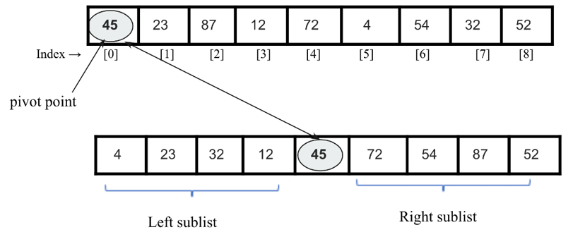

图 11.16：快速排序中子列表的图示

快速排序算法的工作原理如下：

我们首先选择一个要与所有数据数据进行比较的主元数据，在第一次迭代结束时，这个主元数据将被放置在列表中的正确位置。 为了将枢轴数据放在正确的位置，我们使用了两个指针，一个左指针和一个右指针。 这个过程如下：

1. 左指针最初指向索引 ```1``` 处的值，右指针指向最后一个索引处的值。 这里的主要思想是移动位于枢轴数据错误一侧的数据项。 因此，我们从左指针开始，沿从左到右的方向移动，直到我们到达列表中数据项的值大于枢轴数据的位置。
2. 同样，我们将右指针向左移动，直到找到小于枢轴数据的数据项。
   接下来，我们交换左右指针指示的这两个值。
3. 我们重复相同的过程，直到两个指针相互交叉，换句话说，直到右指针索引指示的值小于左指针索引的值。
4. 在步骤 ```1``` 中描述的每次迭代之后，枢轴数据将被放置在列表中的正确位置，并且原始列表将被分成两个无序的子列表，左和右。 我们对这些左子列表和右子列表都遵循相同的过程（如步骤 ```1``` 中所述），直到每个子列表都包含一个数据。
5. 最后，所有数据将被放置在它们正确的位置，这将给出排序列表作为输出。

让我们以数字列表 ```{45, 23, 87, 12, 72, 4, 54, 32, 52}``` 为例来了解快速排序算法的工作原理。 假设列表中的枢轴数据（也称为枢轴点）是第一个数据 ```45```。我们将左指针从索引 ```1``` 向右移动，并在到达值 ```87``` 时停止，因为 (```87 > 45``` ). 接下来，我们将右指针向左移动并在找到值 ```32``` 时停止，因为 (```32 < 45```)。 现在，我们交换这两个值。 这个过程如图11.17所示：

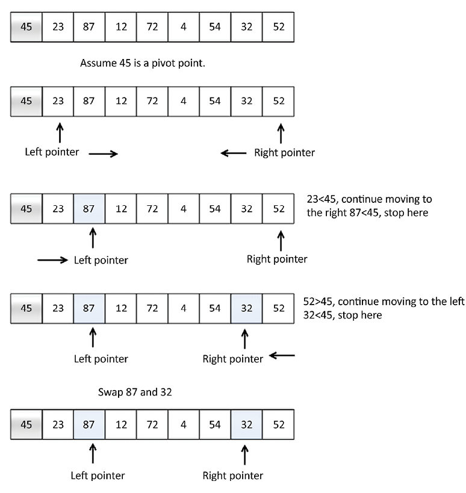

图 11.17：快速排序算法的示例

之后，我们重复相同的过程，将左指针向右移动，当找到值 ```72``` 时停止，因为 (```72 > 45```)。 接下来，我们将右指针向左移动并在到达值 ```4``` 时停止，因为 (```4 < 45```)。 现在，我们交换这两个值，因为它们位于基准值的错误两侧。 我们重复相同的过程并在右指针索引值小于左指针索引值时停止。 在这里，我们找到 ```4``` 作为分裂点，并将其与枢轴值交换。 如图 11.18 所示：

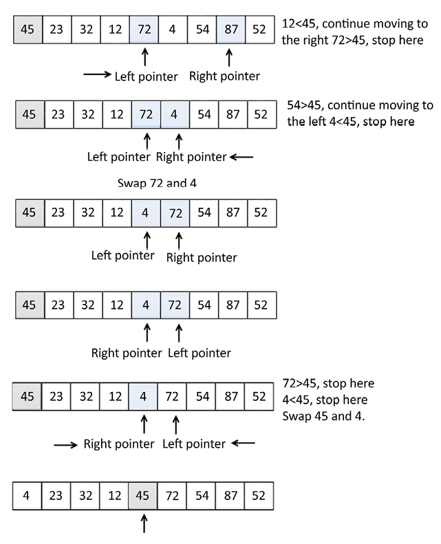

图 11.18：快速排序算法的示例（续）

可以观察到，在快速排序算法的第一次迭代之后，枢轴值 45 被放置在列表中的正确位置。

现在我们有两个子列表：

1. 枢轴值 ```45``` 左侧的子列表的值小于 ```45```。
2. 枢轴值右侧的另一个子列表包含大于 ```45``` 的值。我们将对这两个子列表递归地应用快速排序算法，并重复它直到整个列表被排序，如图 11.19 所示：

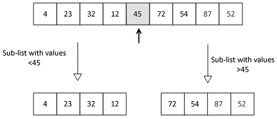

图 11.19：在数据列表示例上快速排序算法的第一次迭代之后

我们将在下一节中了解快速排序算法的实现。

## 快速排序算法的实现

快速排序算法的主要任务是首先将基准数据放在正确的位置，以便我们将给定的未排序列表划分为两个子列表（左子列表和右子列表）； 这个过程称为分区步骤。 分区步骤对于理解快速排序算法的实现非常重要，因此我们将首先通过一个例子来理解分区步骤的实现。 在此，给定一个数据列表，所有数据将以这样的方式排列：小于枢轴数据的数据将在其左侧，大于枢轴的数据将排列在枢轴右侧 数据。

让我们看一个例子来理解实现。 考虑以下整数列表。 ```[43、3、20、89、4、77]```。 我们将使用分区函数对这个列表进行分区：

```
[43, 3, 20, 89, 4, 77]
```

考虑下面的分区函数的代码； 我们将详细讨论每一行：

```python
def partition(unsorted_array, first_index, last_index):
    pivot = unsorted_array[first_index]
    pivot_index = first_index
    index_of_last_element = last_index
    less_than_pivot_index = index_of_last_element
    greater_than_pivot_index = first_index + 1
    while True:
        while (
            unsorted_array[greater_than_pivot_index] < pivot
            and greater_than_pivot_index < last_index
        ):
            greater_than_pivot_index += 1
        while (
            unsorted_array[less_than_pivot_index] > pivot
            and less_than_pivot_index >= first_index
        ):
            less_than_pivot_index -= 1
        if greater_than_pivot_index >= less_than_pivot_index:
            break
        temp = unsorted_array[greater_than_pivot_index]
        unsorted_array[greater_than_pivot_index] = unsorted_array[
            less_than_pivot_index
        ]
        unsorted_array[less_than_pivot_index] = temp
    unsorted_array[pivot_index] = unsorted_array[less_than_pivot_index]
    unsorted_array[less_than_pivot_index] = pivot
    return less_than_pivot_index
```

分区函数接收我们需要分区的数组的第一个和最后一个数据的索引作为其参数。

枢轴的值存储在枢轴变量中，而其索引存储在 ```pivot_index``` 中。 我们没有使用 ```unsorted_array[0]```，因为当使用数组的一段调用未排序的数组参数时，索引 ```0``` 不一定指向该数组中的第一个数据。 枢轴旁边的数据的索引，即左指针，```first_index + 1```，标志着我们开始在数组中寻找数据的位置。 正如 ```greater_than_pivot_index = first_index + 1``` 所暗示的那样，这个数组大于主元。 右指针 ```less_than_pivot_index``` 变量指向 ```less_than_pivot_index = index_of_last_element``` 列表中最后一个数据的位置，我们从这里开始搜索小于主元的数据。

此外，在主 ```while``` 循环开始执行时，数组看起来如图 11.20 所示：

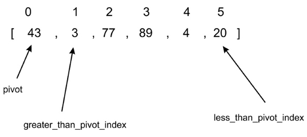

图 11.20：快速排序算法示例数组的插图 ```1```

第一个内部 ```while``` 循环将一个索引向右移动，直到它落在索引 ```2``` 上，因为该索引处的值大于 ```43```。此时，第一个 ```while``` 循环中断并且不再继续。 在第一个 ```while``` 循环中的每个条件测试中，仅当 ```while``` 循环的测试条件评估为 ```True``` 时，才会评估 ```greater_than_pivot_index += 1```。 这使得搜索大于主元的数据前进到右边的下一个数据。

第二个内部 ```while``` 循环每次向左移动一个索引，直到到达索引 ```5```，其值 ```20``` 小于 ```43```，如图 11.21 所示：

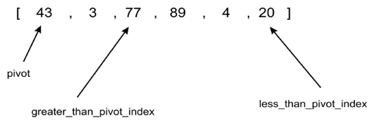

图 11.21 快速排序算法示例数组图 ```2```

接下来，此时，内部的 ```while``` 循环都不能再执行了，接下来的代码片段如下所示：

```python
        if greater_than_pivot_index >= less_than_pivot_index:
            break
        temp = unsorted_array[greater_than_pivot_index]
        unsorted_array[greater_than_pivot_index] = unsorted_array[
            less_than_pivot_index
        ]
        unsorted_array[less_than_pivot_index] = temp
```

这里，由于 ```greater_than_pivot_index < less_than_pivot_index```，```if``` 语句的主体交换这些索引处的数据。 只要 ```greater_than_pivot_index``` 变得大于 ```less_than_pivot_index```，```else``` 条件就会打破无限循环。 在这种情况下，这意味着 ```greater_than_pivot_index``` 和 ```less_than_pivot_index``` 已经相互交叉。

该数组现在如图 11.22 所示：

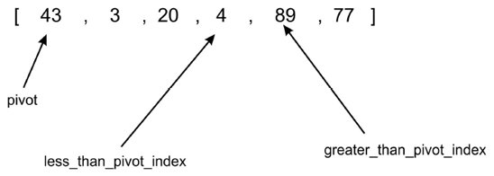

图 11.22：快速排序算法示例数组的插图 ```3```

```break``` 语句在 ```less_than_pivot_index``` 等于 ```3```，```greater_than_pivot_index``` 等于 ```4``` 时执行。

一旦我们退出 ```while``` 循环，我们就将 ```unsorted_array[less_than_pivot_index]``` 中的数据与 ```less_than_pivot_index``` 中的数据交换，后者作为枢轴的索引返回：

```python
    unsorted_array[pivot_index] = unsorted_array[less_than_pivot_index]
    unsorted_array[less_than_pivot_index] = pivot
    return less_than_pivot_index
```

图 11.23 显示了代码如何将 ```4``` 与 ```43``` 互换作为分区过程的最后一步：

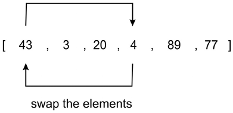

图 11.23：快速排序算法示例数组的插图 ```4```

回顾一下，第一次调用 ```quick_sort``` 函数时，它是在索引为 ```0``` 的数据处进行分区的。分区函数返回后，我们得到数组顺序为 ```[4, 3, 20, 43, 89, 77]```.

可以看到，数据 ```43``` 右边的所有数据都大于 ```43```，而左边的数据都小于 ```43```。 这样，分区就完成了。

使用索引为 ```3``` 的分割点 ```43```，我们将使用我们刚刚经历的相同过程递归地对两个子数组 ```[4, 30, 20]``` 和 ```[89, 77]``` 进行排序。

主要的 ```quick_sort``` 函数体如下：

```python
def quick_sort(unsorted_array, first, last):
    if last - first <= 0:
        return
    partition_point = partition(unsorted_array, first, last)
    quick_sort(unsorted_array, first, partition_point - 1)
    quick_sort(unsorted_array, partition_point + 1, last)
```

```quick_sort``` 函数非常简单； 最初，调用分区方法，返回分区点。 此分区点位于 ```unsorted_array``` 数组中，其中左侧的所有数据都小于枢轴值，而右侧的所有数据都大于枢轴值。 我们在分区进度后立即打印 ```unsorted_array``` 的状态，以查看每次调用后数组的状态。

第一次分区后，第一个子数组```[4, 3, 20]``` 将完成； 当 ```greater_than_pivot_index``` 位于索引 ```2``` 且 ```less_than_pivot_index``` 位于索引 ```1``` 时，此子数组的分区将停止。此时，两个标记被称为交叉。 因为 ```greater_than_pivot_index``` 大于 ```less_than_pivot_index```，```while``` 循环的进一步执行将停止。 枢轴 ```4``` 将与 ```3``` 交换，而索引 ```1``` 作为分区点返回。

我们可以使用下面的代码片段创建一个数据列表，并使用快速排序算法对其进行排序：

```python
my_array = [43, 3, 77, 89, 4, 20]
print(my_array)
quick_sort(my_array, 0, 5)
print(my_array)
```

上述代码的输出如下：

```python
[43, 3, 77, 89, 4, 20]
[3, 4, 20, 43, 77, 89]
```

在快排算法中，分区算法需要$O(n)$的时间。 由于快速排序算法遵循分而治之的范式，它需要 $O(logn)$ 时间； 因此，快速排序算法的整体平均情况运行时间复杂度为 $O(n) * O(logn) = O(nlogn)$。 快速排序算法给出了 $O(n^2)$ 的最坏情况运行时复杂度。 快速排序算法的最坏情况复杂性是每次都选择最差的枢轴点，并且其中一个分区始终只有一个数据。 例如，如果列表已经排序，那么如果分区选择最小的数据作为轴心点，则会出现最坏情况的复杂性。 当确实出现最坏情况的复杂性时，可以使用随机化快速排序来改进快速排序算法。 当给定的数据列表很长时，快速排序算法是有效的； 在这种情况下，与上述其他排序算法相比，它的效果更好。

## ```Timsort``` 算法
```Timsort``` 在所有 ```Python``` 版本 ```>=2.3``` 中被用作默认的标准排序算法。 ```Timsort``` 算法是基于归并排序和插入排序算法的组合的针对现实世界长列表的最优算法。 ```Timsort``` 算法利用了两种算法中最好的； 插入排序在数组部分排序且其大小较小时效果最好，而合并排序算法的合并方法在我们必须组合小的排序列表时效果很快。

```Timsort``` 算法的主要概念是它使用插入排序算法对数据数据的小块（也称为块）进行排序，然后使用归并排序算法合并所有已排序的块。 ```Timsort``` 算法的主要特征是它利用了被称为"自然运行"的已经排序的数据数据，这种数据在现实世界的数据中经常出现。

```Timsort``` 算法的工作原理如下：

1. 首先，我们将给定的数据数据数组分成许多块，这些块也称为运行。
2. 我们通常使用 ```32``` 或 ```64``` 作为运行的大小，因为它适合 ```Timsort```； 但是，我们可以使用可以从给定数组的长度（比如 ```N```）计算得出的任何其他大小。 ```minrun``` 是每次运行的最小长度。 可以按照给定的原则计算最小运行的大小：
   1. ```minrun``` 大小不应该太长，因为我们使用插入排序算法对这些小块进行排序，这对于短数据列表表现良好。
   2. 跑步的长度不应该很短； 在这种情况下，它将导致更多的运行次数，这将使合并算法变慢。
   3. 由于合并排序在运行次数为 ```2``` 的幂时效果最佳，因此如果以 ```N / minrun``` 计算的运行次数为 ```2``` 的幂，那就更好了。
3. 例如，如果我们采用 ```32``` 的运行大小，则运行次数将为 (```size_of_array / 32```)； 如果这是 ```2``` 的幂，那么合并过程将非常高效。
4. 使用插入排序算法对每个运行进行排序。
5. 使用合并排序算法的 ```merge``` 方法将所有排序的运行一一合并。
6. 每次迭代后，我们将合并子数组的大小加倍。

让我们举个例子来理解 ```Timsort``` 算法的工作原理。 假设我们有数组 ```[4, 6, 3, 9, 2, 8, 7, 5]```。 我们使用 ```Timsort``` 算法对其进行排序； 在这里，为简单起见，我们将运行的大小设为 ```4```。因此，我们将给定数组分为两个运行，运行 ```1``` 和运行 ```2```。接下来，我们使用插入排序算法对运行 ```1``` 进行排序，然后对运行 ```2``` 进行排序 使用插入排序算法。 一旦我们对所有运行进行排序，我们使用合并排序算法的合并方法来获得最终的完整排序列表。 完整流程如图11.24所示：


图 11.24：```Timsort``` 算法的示例数组图示

下面我们来讨论一下 ```Timsort``` 算法的实现。 首先，我们实现了插入排序算法和归并排序算法的归并方法。 前面几节已经详细讨论了插入排序算法。 为了完整起见，下面再次给出：

```python
def Insertion_Sort(unsorted_list):
    for index in range(1, len(unsorted_list)):
        search_index = index
        insert_value = unsorted_list[index]
        while search_index > 0 and unsorted_list[search_index - 1] > insert_value:
            unsorted_list[search_index] = unsorted_list[search_index - 1]
            search_index -= 1
        unsorted_list[search_index] = insert_value
    return unsorted_list
```

在上面，插入排序方法负责对运行进行排序。 接下来介绍归并排序算法的归并方法； 这已在[第 3 章](./3.md)"算法设计技术和策略"中详细讨论。 此 ```Merge()``` 函数用于合并已排序的运行，其定义如下：

```python
def Merge(first_sublist, second_sublist):
    i = j = 0
    merged_list = []
    while i < len(first_sublist) and j < len(second_sublist):
        if first_sublist[i] < second_sublist[j]:
            merged_list.append(first_sublist[i])
            i += 1
        else:
            merged_list.append(second_sublist[j])
            j += 1
    while i < len(first_sublist):
        merged_list.append(first_sublist[i])
        i += 1
    while j < len(second_sublist):
        merged_list.append(second_sublist[j])
        j += 1
    return merged_list
```

接下来，让我们讨论一下 ```Timsort``` 算法。 下面给出了它的实现。 让我们一点一点地理解它：

```python
def Tim_Sort(arr, run):
    for x in range(0, len(arr), run):
        arr[x : x + run] = Insertion_Sort(arr[x : x + run])
    runSize = run
    while runSize < len(arr):
        for x in range(0, len(arr), 2 * runSize):
            arr[x : x + 2 * runSize] = Merge(
                arr[x : x + runSize], arr[x + runSize : x + 2 * runSize]
            )

        runSize = runSize * 2
```

在上面的实现中，我们首先传递了两个参数，即要排序的数组和运行的大小。 接下来，我们使用插入排序在下面的代码片段中按运行大小对各个子数组进行排序：

```python
    for x in range(0, len(arr), run):
        arr[x : x + run] = Insertion_Sort(arr[x : x + run])
```

在示例列表 ```[4, 6, 3, 9, 2, 8, 7, 5]``` 的上述代码中，假设运行大小为 ```2```，因此我们将总共有四个块/块/运行，并且在退出之后这个循环，数组将是这样的：```[4, 6, 3, 9, 2, 8, 5, 7]```，表示大小为 ```2``` 的所有游程都已排序。 之后我们初始化 ```runSize``` 并迭代直到 ```runSize``` 等于数组长度。 因此，我们使用 ```Merge``` 方法合并排序后的小列表：

```python
    runSize = run
    while runSize < len(arr):
        for x in range(0, len(arr), 2 * runSize):
            arr[x : x + 2 * runSize] = Merge(
                arr[x : x + runSize], arr[x + runSize : x + 2 * runSize]
            )

        runSize = runSize * 2
```

在上面的代码中，```for``` 循环使用 ```Merge``` 函数合并大小为 ```runSize``` 的运行。 对于上面的示例，```runSize``` 为 ```2```。在第一次迭代中，它将合并从索引（```0``` 到 ```1```）的左运行和从索引（```2``` 到 ```3```）的右运行以形成从索引（```0``` 到 ```3```）的排序数组 , 数组将变为 ```[3, 4, 6, 9, 2, 8, 5, 7]```。

此外，在第二次迭代中，它将合并索引（```4``` 到 ```5```）的左侧运行和索引（```6``` 到 ```7```）的右侧运行，以形成索引（```4``` 到 ```7```）的排序运行。 第二次迭代后 ```for``` 循环将终止，数组将变为 ```[3, 4, 6, 9, 2, 5, 7, 8]```，这表明数组已从索引 (```0``` 到 ```3```) 和 (```4``` 到 ```7```).

现在我们将运行的大小更新为 ```2 * runSize```，并对更新后的 ```runSize``` 重复相同的过程。 所以现在，```runSize``` 是 ```4```。现在，在第一次迭代中，它将合并左运行（索引 ```0``` 到 ```3```）和右运行（索引 ```4``` 到 ```7```）以形成从索引（```0``` 到 ```7```）排序的数组，之后 ```for``` 循环将终止，数组将变为 ```[2, 3, 4, 5, 6, 7, 8, 9]```，这表明数组已排序。

现在，```runSize``` 将等于数组长度，因此 ```while``` 循环将终止，最后，我们将得到排序后的数组。

我们可以使用下面的代码片段创建一个列表，然后使用 ```Timsort``` 算法对列表进行排序：

```python
arr = [4, 6, 3, 9, 2, 8, 7, 5]
run = 2
Tim_Sort(arr, run) 
print(arr)
```

上述代码的输出如下：

```python
[2,3,4,5,6,7,8,9]
```

```Timsort``` 对于实际应用程序非常有效，因为它的最坏情况复杂度为 $O(n logn)$。 ```Timsort``` 是排序的最佳选择，即使给定列表的长度很短。 在那种情况下，它使用插入排序算法，它对于较小的列表非常快，而 ```Timsort``` 算法由于合并方法而对于长列表工作得很快； 因此，```Timsort``` 算法是一个很好的排序选择，因为它适用于在实际使用中对任何长度的数组进行排序。

下表给出了不同排序算法的复杂度对比：

|   算法   |  最坏情况  |  平均情况  |  最好情况  |
| :------: | :--------: | :--------: | :--------: |
| 冒泡排序 |  $O(n^2)$  |  $O(n^2)$  |   $O(n)$   |
| 插入排序 |  $O(n^2)$  |  $O(n^2)$  |   $O(n)$   |
| 选择排序 |  $O(n^2)$  |  $O(n^2)$  |  $O(n^2)$  |
| 快速排序 |  $O(n^2)$  | $O(nlogn)$ | $O(nlogn)$ |
| Timsort  | $O(nlogn)$ | $O(nlogn)$ |   $O(n)$   |


## 概括

在本章中，我们探索了重要且流行的排序算法，这些算法对许多实际应用非常有用。 我们讨论了冒泡排序、插入排序、选择排序、快速排序和 ```Timsort``` 算法，并解释了它们在 ```Python``` 中的实现。 总的来说，快速排序算法的性能优于其他排序算法，而 ```Timsort``` 算法是在实际应用中使用的最佳选择。

在下一章中，我们将讨论选择算法。

## 练习
1. 如果给定一个数组 ```arr = {55, 42, 4, 31}``` 并使用冒泡排序对数组数据进行排序，那么需要迭代多少次才能对数组进行排序？
   1. ```3```
   2. ```2```
   3. ```1```
   4. ```0```
2. 冒泡排序的最坏情况复杂度是多少？
   1. $O(nlogn)$
   2. $O(logn)$
   3. $O(n)$
   4. $O(n^2)$
3. 对序列 ```(56, 89, 23, 99, 45, 12, 66, 78, 34)``` 应用快速排序。 第一阶段之后的顺序是什么，第一个数据是什么枢轴？
   1. ```45, 23, 12, 34, 56, 99, 66, 78, 89```
   2. ```34, 12, 23, 45, 56, 99, 66, 78, 89```
   3. ```12, 45, 23, 34, 56, 89, 78, 66, 99```
   4. ```34, 12, 23, 45, 99, 66, 89, 78, 56```
4. 快速排序是一个 ______
   1. 贪心算法
   2. 分而治之算法
   3. 动态规划算法
   4. 回溯算法
5. 考虑交换操作成本非常高的情况。 应使用以下哪种排序算法以使交换操作的数量最少？
   1. 堆排序
   2. 选择排序
   3. 插入排序
   4. 合并排序
6. 如果给定输入数组 ```A = {15, 9, 33, 35, 100, 95, 13, 11, 2, 13}```，使用选择排序，第五次交换后数组的顺序是什么？ （注意：不管他们是交换位置还是保持原位，都算在内。）
   1. ```2, 9, 11, 13, 13, 95, 35, 33, 15, 100```
   2. ```2, 9, 11, 13, 13, 15, 35, 33, 95, 100```
   3. ```35, 100, 95, 2, 9, 11, 13, 33, 15, 13```
   4. ```11, 13, 9, 2, 100, 95, 35, 33, 13, 13```
7. 使用插入排序对数据 ```{44, 21, 61, 6, 13, 1}``` 进行排序的迭代次数是多少？
   1. ```6```
   2. ```5```
   3. ```7```
   4. ```1```
8. 如果使用插入排序对数据进行排序，则数组数据 ```A = [35, 7, 64, 52, 32, 22]``` 在第二次迭代后会如何显示？
   1. ```7, 22, 32, 35, 52, 64```
   2. ```7, 32, 35, 52, 64, 22```
   3. ```7, 35, 52, 64, 32, 22```
   4. ```7, 35, 64, 52, 32, 22```