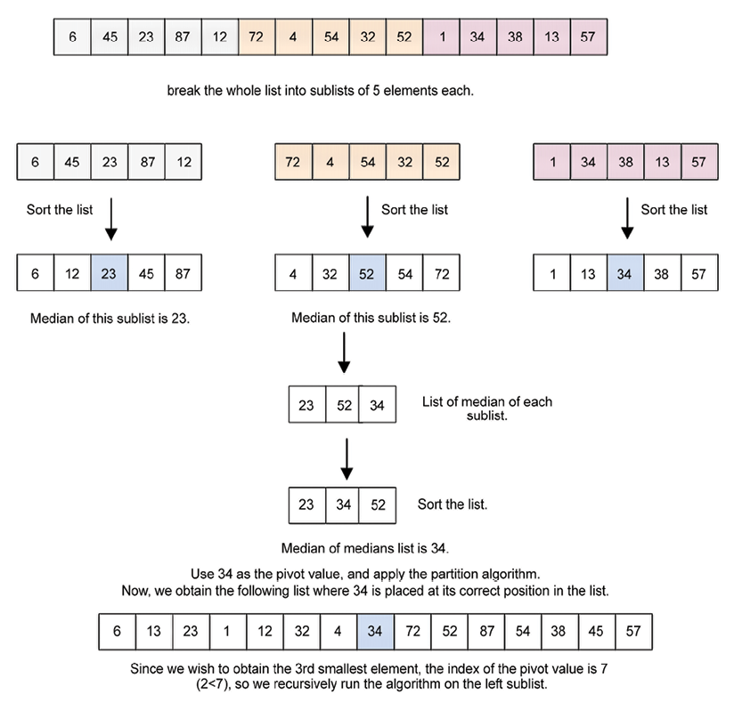

# 选择算法

与在无序列表中查找元素相关的一组有趣的算法是选择算法。 给定一个元素列表，选择算法用于从列表中找到第 k 个最小或最大的元素。 因此，给定一个数据元素列表和一个数字 (k)，目标是找到第 k 个最小或最大的元素。 选择算法最简单的情况是从列表中找到最小或最大数据元素。 然而，有时，我们可能需要找到列表中第 k 个最小或最大的元素。 最简单的方法是先使用任何排序算法对列表进行排序，然后我们就可以轻松获得第 k 个最小（或最大）的元素。 但是，当列表非常大时，对列表进行排序以获得第 k 个最小或最大元素的效率不高。 在那种情况下，我们可以使用不同的选择算法来有效地产生第 k 个最小或最大的元素。

在本章中，我们将讨论以下主题：

- 选择排序算法
- 随机选择
- 确定性选择

我们将从技术要求开始，然后我们将讨论选择排序算法。

## 技术要求

本章中使用的所有源代码都在给定的 ```GitHub``` 链接中提供：https://github.com/PacktPublishing/Hands-On-Data-Structures-and-Algorithms-with-Python-Third-Edition/tree/main/Chapter12 .

## 选择排序算法

列表中的数据可能会进行统计查询，例如查找平均值、中值和模式值。 查找均值和众数不需要对列表进行排序。 但是，要在数字列表中找到中位数，必须首先对列表进行排序。 寻找中位数要求你找到位于有序列表中间位置的元素。 此外，当我们想在列表中找到第 k 个最小的数据时，可以使用它。 要在无序列表中找到第 ```k``` 个最小的数，一个明显的方法是先对列表进行排序，排序后，你可以放心，索引 ```0``` 处的元素将包含列表中的最小元素。 同样，列表中的最后一个元素将包含列表中最大的元素。

有关如何对列表中的数据项进行排序的更多信息，请参阅[第 11 章](./11.md)"排序"。 然而，为了从列表中获得第 ```k``` 个最小的元素，将排序算法应用于一长串元素以获得列表中的最小值或最大值或第 ```k``` 个最小值或最大值并不是一个好的解决方案，因为排序相当于一项昂贵的手术。 因此，如果我们需要从给定列表中找出第 ```k``` 个最小或最大的元素，则无需对整个列表进行排序，因为我们有其他方法可用于此目的。 让我们讨论更好的技术来找到第 ```k``` 个最小的元素，而不必首先对列表进行排序，从随机选择开始。

## 随机选择
在快速排序算法的基础上，采用随机选择算法获取第 ```k``` 小数； 随机选择算法也称为快速选择。 在[第 11 章](./11.md)"排序"中，我们讨论了快速排序算法。 快速排序算法是一种对无序列表进行排序的高效算法。 总结一下，快速排序算法的工作原理如下：

1. 它选择一个枢轴。
2. 它围绕枢轴对未排序的列表进行分区。
3. 它使用步骤 ```1``` 和 ```2``` 递归地对分区列表的两半进行排序。

关于快速排序的一个重要事实是，在每个分区步骤之后，主元的索引不会改变，即使在列表排序之后也是如此。 这意味着在每次迭代之后，选定的主元值将被放置在列表中的正确位置。 快速排序的这个特性使我们能够在不对完整列表进行排序的情况下获得第 ```k``` 个最小的数字。 让我们讨论随机选择方法，也称为快速选择算法，从 ```n``` 个数据项的列表中获取第 ```k``` 个最小元素。

### 快速选择

```quickselect``` 算法用于获取无序列表中的第 ```k``` 个最小元素。 它基于快速排序算法，其中我们从轴心点递归地对两个子列表的元素进行排序。 在每次迭代中，枢轴值到达列表中的正确位置，将列表分为两个无序子列表（左子列表和右子列表），其中左子列表与枢轴值相比具有较小的值，而右子列表具有更大的值 值与枢轴值的比较。 现在，在 ```quickselect``` 算法的情况下，我们只为具有第 ```k``` 个最小元素的子列表递归调用该函数。

在 ```quickselect``` 算法中，我们将枢轴点的索引与 ```k``` 值进行比较，以从给定的无序列表中获得第 ```k``` 个最小的元素。 ```quickselect``` 算法中会出现三种情况，如下：

1. 如果枢轴点的索引小于 ```k```，那么我们确定第 ```k``` 个最小值将出现在枢轴点的右侧子列表中。 所以我们只递归调用右子列表的 ```quickselect``` 函数。
2. 如果枢轴点的索引大于 ```k```，那么很明显第 ```k``` 个最小的元素将出现在枢轴点的左侧。 所以我们只递归地寻找左边子列表中的第i个元素。
3. 如果枢轴点的索引等于 ```k```，那么就意味着我们已经找到了第 ```k``` 小的值，我们将它返回。

让我们通过一个例子来理解快速选择算法的工作原理。 考虑一个元素列表，```{45, 23, 87, 12, 72, 4, 54, 32, 52}```。 我们可以使用 ```quickselect``` 算法找到这个列表中第三小的元素。

我们通过选择一个枢轴值开始算法，即 ```45```。为简单起见，这里我们选择第一个元素作为枢轴元素； 但是，可以选择任何其他元素作为枢轴元素。 在算法的第一次迭代之后，主元值移动到其在列表中的正确位置，在本例中为索引 ```4```（索引从 ```0``` 开始）。 接下来，我们检查条件 ```k < pivot```（即 ```2 < 4```）。 ```Case-2``` 适用，所以我们只考虑左边的子列表，递归调用函数。 在这里，我们将枢轴值的索引（即 ```4```）与 ```k``` 的值（即第 ```3``` 个位置或索引 ```2``` 处）进行比较。

接下来，我们获取左侧子列表并选择枢轴点（即 ```4```）。 运行后，```4``` 被放置在正确的位置（即第 ```0``` 个索引）。 由于主元的索引小于 ```k``` 的值，我们考虑右子列表。

同样，我们以 ```23``` 为轴心点，它也被放置在正确的位置。 现在，当我们比较枢轴点的索引和 ```k``` 的值时，它们是相等的，这意味着我们找到了第三小的元素，它将被返回。 查找第 ```3``` 个最小元素的完整分步过程如图 12.1 所示：


图 12.1：快速选择算法的逐步演示

让我们讨论一下 ```quick_select``` 方法的实现。 它的定义如下：

```python
def quick_select(array_list, start, end, k):
    split = partition(array_list, start, end)
    if split == k:
        return array_list[split]
    elif split < k:
        return quick_select(array_list, split + 1, end, k)
    else:
        return quick_select(array_list, start, split - 1, k)
```

在上面的代码中，```quick_select``` 函数以完整数组、列表第一个元素的索引、最后一个元素的索引以及值k指定的第 ```k``` 个元素为参数。 ```k``` 的值映射到用户正在搜索的索引，即列表中第 ```k``` 个最小的数字。

最初，我们使用 ```partition()``` 方法（在[第 11 章](./11.md)"排序"中详细定义和讨论）以这样一种方式放置选定的枢轴点，即它将给定的元素列表分为左子列表和右子列表， 其中左子列表有小于枢轴值的数据元素，右子树有大于枢轴值的数据元素。 ```partition()``` 方法称为 ```split = partition(array_list, start, end)``` 并返回拆分索引。 这里，```split index``` 是主元在数组中的位置，```(start, end)``` 是列表的起始和结束索引。 一旦我们得到分裂点，我们将分裂索引与所需的 ```k``` 值进行比较，以确定我们是否到达了第 ```k``` 个最小数据项的位置，或者所需的第 ```k``` 个最小元素是否在左子列表或右子列表中 . 这三个条件如下：

1. 如果 ```split``` 等于 ```k``` 的值，那么就意味着我们已经到达了列表中第 ```k``` 个最小的数据项。
2. 如果 ```split``` 小于 ```k```，则意味着第 ```k``` 个最小的数据应该存在或在 ```split + 1``` 和 ```right``` 之间找到。
3. 如果 ```split``` 大于 ```k```，则意味着第 ```k``` 个最小的数据应该存在于 ```left``` 和 ```split - 1``` 之间。

在前面的示例中，分割点出现在索引 ```4```（索引从 ```0``` 开始）。 如果我们正在搜索第三小的数字，那么由于 ```4 < 2``` 会产生错误，因此使用 ```quick_select(array_list, left, split - 1, k)``` 对右子列表进行递归调用。

这里，为了本算法的完整性，给出 ```partition()``` 方法如下：

```python
def partition(unsorted_array, first_index, last_index):
    pivot = unsorted_array[first_index]
    pivot_index = first_index
    index_of_last_element = last_index
    less_than_pivot_index = index_of_last_element
    greater_than_pivot_index = first_index + 1
    while True:
        while (
            unsorted_array[greater_than_pivot_index] < pivot
            and greater_than_pivot_index < last_index
        ):
            greater_than_pivot_index += 1
        while (
            unsorted_array[less_than_pivot_index] > pivot
            and less_than_pivot_index >= first_index
        ):
            less_than_pivot_index -= 1
        if greater_than_pivot_index >= less_than_pivot_index:
            break
        temp = unsorted_array[greater_than_pivot_index]
        unsorted_array[greater_than_pivot_index] = unsorted_array[less_than_pivot_index]
        unsorted_array[less_than_pivot_index] = temp
    unsorted_array[pivot_index] = unsorted_array[less_than_pivot_index]
    unsorted_array[less_than_pivot_index] = pivot
    return less_than_pivot_index
```

我们可以使用下面的代码片段，使用给定数组的快速选择算法找出第 ```k``` 个最小的元素。

```python
list1 = [3, 1, 10, 4, 6, 5]
print("The 2nd smallest element is", quick_select(list1, 0, 5, 1))
print("The 3rd smallest element is", quick_select(list1, 0, 5, 2))
```

上述代码的输出如下：

```python
The 2nd smallest element is 3
The 3rd smallest element is 4
```

在上面的代码中，我们从给定的元素列表中获取第二和第三小的元素。 基于随机选择的快速选择算法的最坏情况性能是 $O(n^2)$。

在上面的 ```partition()``` 方法的实现中，为简单起见，我们使用列表的第一个元素作为枢轴元素，但是可以从列表中选择任何元素作为枢轴元素。 一个好的枢轴元素是将列表分成几乎相等的两半的元素。 因此，可以通过在最坏情况复杂度为 $O(n)$ 的线性时间内更有效地选择分割点来提高 ```quickselect``` 算法的性能。 我们将在下一节讨论如何使用确定性选择来做到这一点。

## 确定性选择

确定性选择是一种在无序列表中找出第 ```k``` 项的算法。 正如我们在快速选择算法中看到的那样，我们选择一个随机的"枢轴"元素，该元素将列表划分为两个子列表，并为两个子列表之一递归调用自身。 在确定性选择算法中，我们更有效地选择一个枢轴元素，而不是采用任何随机枢轴元素。

确定性算法的主要概念是选择一个能够很好地拆分列表的枢轴元素，而好的拆分就是将列表分成两半。 例如，选择主元元素的一个好方法是选择所有值的中位数。 但是我们需要对元素进行排序以找出中间元素，这效率不高，因此我们尝试找到一种方法来选择一个将列表大致划分在中间的枢轴元素。

中位数的中值是一种为我们提供近似中值的方法，即对于给定的未排序元素列表，接近实际中值的值。 它以这样的方式划分给定的元素列表，即在最坏的情况下，列表的 ```10``` 个中至少有 ```3``` 个（```3/10```）将在主元元素下方，并且 ```10``` 个元素中至少有 ```3``` 个元素将是 列表上方。

让我们举个例子来理解这一点。 假设我们有一个包含 ```15``` 个元素的列表：```{11, 13, 12, 111, 110, 15, 14, 16, 113, 112, 19, 18, 17, 114, 115}```。

接下来，我们将其分成 ```5``` 个元素的组，并将它们排序如下：```{{11, 12, 13, 110, 111}, {14, 15, 16, 112, 113}, {17, 18, 19, 114, 115}}```。

接下来，我们计算每组的中位数，它们分别为 ```13```、```16``` 和 ```19```。 此外，这些中值 ```{13, 16, 19}``` 的中值是 ```16```。这是给定列表的中值的中值。 在这里，我们可以看到 ```5``` 个元素比主元小，```9``` 个元素比主元大。 当我们选择这个中位数的中位数作为枢轴元素时，```n``` 个元素的列表被划分为至少有 ```3n/10``` 个元素小于枢轴元素。

选择第 ```k``` 个最小元素的确定性算法的工作原理如下：

1. 将未排序的数据列表拆分为每组五个元素（数字 ```5``` 不是必需的；它可以更改为任何其他数字，例如 ```8```）
2. 对这些组进行排序（通常，我们为此使用插入排序）并找到所有这些组的中位数
3. 递归地找到从这些组中获得的中位数的中位数； 假设是 ```p``` 点
4. 以这个点 ```p``` 为 ```pivot``` 元素，递归调用类似于 ```quickselect``` 的划分算法，找出第 ```k``` 小的元素

让我们考虑一个包含 ```15``` 个元素的示例列表，以了解确定性算法的工作原理，以从列表中找出第 ```3``` 个最小的元素，如图 12.2 所示。 首先，我们将列表分成每组 ```5``` 个元素，然后对这些组/子列表进行排序。 一旦我们对列表进行排序，我们就会找出子列表的中位数。 对于此示例，数据 ```23```、```52``` 和 ```34``` 是这三个子列表的中值，如图 12.2 所示。

接下来，我们对所有子列表的中位数列表进行排序。 进一步，我们找出这个列表的中位数，也就是中位数的中位数，就是 ```34```。这个中位数的中位数，是用来为整个列表选择分区/轴心点的。 此外，我们使用此枢轴元素将给定列表划分为 ```2``` 个子列表，将给定枢轴元素放置在列表中的正确位置。 对于这个例子，枢轴元素的索引是 ```7```（索引从 ```0``` 开始；如图 12.2 所示）。



图 12.2：确定性选择算法的分步过程

枢轴元素的索引大于第k个值，因此，我们递归调用左子列表的算法以获得所需的第k小元素。

接下来，我们将讨论确定性选择算法的实现。

### 确定性选择算法的实现

为了实现从列表中确定第 k 个最小值的确定性算法，我们开始实现更新的 ```partition()``` 方法，该方法使用中位数方法在我们选择枢轴元素的位置划分列表。 现在让我们了解分区函数的代码：

```python
def partition(unsorted_array, first_index, last_index):
    if first_index == last_index:
        return first_index
    else:
        nearest_median = median_of_medians(unsorted_array[first_index:last_index])
    index_of_nearest_median = get_index_of_nearest_median(
        unsorted_array, first_index, last_index, nearest_median
    )
    swap(unsorted_array, first_index, index_of_nearest_median)

    pivot = unsorted_array[first_index]
    pivot_index = first_index
    index_of_last_element = last_index
    less_than_pivot_index = index_of_last_element
    greater_than_pivot_index = first_index + 1

    ## This while loop is used to correctly place pivot element at its correct position
    while 1:
        while (
            unsorted_array[greater_than_pivot_index] < pivot
            and greater_than_pivot_index < last_index
        ):
            greater_than_pivot_index += 1
        while (
            unsorted_array[less_than_pivot_index] > pivot
            and less_than_pivot_index >= first_index
        ):
            less_than_pivot_index -= 1

        if greater_than_pivot_index >= less_than_pivot_index:
            break

        temp = unsorted_array[greater_than_pivot_index]
        unsorted_array[greater_than_pivot_index] = unsorted_array[
            less_than_pivot_index
        ]
        unsorted_array[less_than_pivot_index] = temp
    unsorted_array[pivot_index] = unsorted_array[less_than_pivot_index]
    unsorted_array[less_than_pivot_index] = pivot
    return less_than_pivot_index
```

在上面的代码中，我们实现了分区的方法，这和我们在 ```quickselect``` 算法中所做的非常相似。 在快速选择算法中，我们使用了一个随机的枢轴元素（为简单起见，列表的第一个元素），但在确定性选择算法中，我们使用中位数的中位数来选择枢轴元素。 分区方法将列表分为两个子列表——左子列表和右子列表，其中左子列表有小于枢轴元素的元素，右子列表有大于枢轴元素的元素。 使用具有中位数中位数的枢轴元素的主要好处是，它通常将列表分成几乎两半。

在代码的开头，首先，在 ```if-else``` 条件下，我们检查给定元素列表的长度。 如果列表的长度为 ```1```，则我们返回该元素的索引，因此如果 ```unsorted_array``` 只有一个元素，则 ```first_index``` 和 ```last_index``` 将相等。 因此，返回 ```first_index```。 并且，如果长度大于 ```1```，则我们调用 ```median_of_medians()``` 方法来计算传递给此方法的列表中位数的中位数，起始索引和结束索引分别为 ```first_index``` 和 ```last_index```。 中位数值的返回中位数存储在 ```nearest_median``` 变量中。

现在，让我们了解 ```median_of_medians()``` 方法的代码。 给出如下：

```python
def median_of_medians(elems):
    sublists = [elems[j : j + 5] for j in range(0, len(elems), 5)]
    medians = [sorted(sublist)[len(sublist) // 2] for sublist in sublists]
    if len(medians) <= 5:
        return sorted(medians)[len(medians) // 2]
    else:
        return median_of_medians(medians)
```

在 ```median_of_medians``` 函数的上述代码中，递归用于计算给定列表的中位数的中位数。 该函数首先将给定的列表 ```elems``` 分成一组，每组五个元素。 正如前面在确定性算法中所讨论的，我们将给定的列表分成 ```5``` 个元素的组。 在这里，我们选择 ```5``` 个元素，因为它大多表现良好。 但是，我们也可以使用任何其他数字。 这意味着如果 ```elems``` 包含 ```100``` 个数据，将有 ```20``` 个组由 ```sublists = [elems[j:j+5] for j in range(0, len(elems), 5)]``` 语句创建，每个组包含 最多五个元素。

在创建了每个包含五个元素的子列表之后，我们创建了一个空数组 ```medians```，它存储每个五元素数组（即子列表）的中位数。 此外，```for``` 循环遍历子列表中的列表列表。 对每个子列表进行排序，找到中位数，并将其存储在中位数列表中。 ```medians.append(sorted(sublist)[len(sublist)//2])``` 语句将对列表进行排序并获取存储在其中间索引中的元素。 ```medians``` 变量成为所有子列表的中值列表，每个子列表中有五个元素。 在这个实现中，我们使用了 ```Python``` 现有的排序功能； 由于列表很小，它不会影响算法的性能。

此后，下一步是递归计算中位数的中位数，我们将其用作枢轴元素。 这里需要注意的是，中位数数组的长度本身可以是一个大数组，因为如果数组原来的长度是```n```，那么中位数数组的长度就是 ```n / 5```，排序这个可能是```time-consuming```。 因此，我们检查中位数数组的长度，如果它小于 ```5```，我们对中位数列表进行排序并返回位于其中间索引的元素。 另一方面，如果列表的大小大于 ```5```，我们再次递归调用 ```median_of_medians``` 函数，为它提供存储在 ```medians``` 中的中位数列表。 最后，该函数返回给定元素列表的中位数。

让我们再举一个例子，用下面的数字列表来更好地理解中位数的概念：

```python
[2, 3, 5, 4, 1, 12, 11, 13, 16, 7, 8, 6, 10, 9, 17, 15, 19, 20, 18, 23, 21, 22, 25, 24, 14]
```

我们可以将这个列表分成五个元素组，每个元素都有 ```sublists = [elems[j:j+5] for j in range(0, len(elems), 5)]``` 代码语句，以获得以下内容 列表：

```python
[[2, 3, 5, 4, 1], [12, 11, 13, 16, 7], [8, 6, 10, 9, 17], [15, 19, 20, 18, 23], [21, 22, 25, 24, 14]]
```

每个五元素列表将按如下方式排序：

```python
[[1, 2, 3, 5, 5], [7, 11, 12, 13, 16], [6, 8, 9, 10, 17], [15, 18, 19, 20, 23], [14, 21, 22, 24, 25]]
```

接下来，我们获取它们的中位数以生成以下列表：

```python
[3, 12, 9, 19, 22]
```

我们对上面的列表进行排序：

```python
[3, 9, 12, 19, 22]
```

由于列表的大小为五个元素，我们只返回排序列表的中位数，在本例中为 ```12```。 否则，如果这个数组的长度大于 ```5```，我们就会再次调用 ```median_of_median``` 函数。

一旦我们有了中值的中位数，我们就需要在给定的列表中找出它的索引。 我们为此编写了 ```get_index_of_nearest_median``` 函数。 此函数采用第一个和最后一个参数指示的列表的起始和结束索引：

```python
def get_index_of_nearest_median(array_list, first, last, median):
    return first if first == last else array_list.index(median)
```

接下来在分区方法中，我们将 ```medians``` 值的中位数与列表的第一个元素交换，也就是说，我们使用 ```swap``` 函数将 ```index_of_nearest_median``` 与 ```unsorted_array``` 的 ```first_index``` 交换：

```python
swap(unsorted_array, first_index, index_of_nearest_median)
```

交换两个数组元素的实用函数如下所示：

```python
def swap(array_list, first, index_of_nearest_median):
    temp = array_list[first]
    array_list[first] = array_list[index_of_nearest_median]
    array_list[index_of_nearest_median] = temp
```

我们交换这两个元素。 其余实现与我们在 ```quick_select``` 算法中讨论的非常相似。 现在，我们有了给定列表的中位数的中位数，它存储在未排序列表的 ```first_index``` 中。

现在，其余的实现类似于 ```quick_select``` 算法和快速排序算法的分区方法，这将在[第 11 章](./11.md)排序中详细讨论。 这里为了算法的完整性，我们再讨论一下。

我们将第一个元素视为枢轴元素，我们取两个指针，即左指针和右指针。 左指针在列表中从左向右移动，以将小于枢轴元素的元素保留在枢轴元素的左侧。 初始化为链表的第二个元素，即 ```first_index + 1```，而右指针从右向左移动，以大于 ```pivot``` 元素的元素在右边的方式维护链表- 列表中枢轴元素的手边。 它用列表的最后一个元素初始化。 所以我们有两个变量 ```less_than_pivot_index```（右指针）和 ```greater_than_pivot_index```（左指针），其中 ```less_than_pivot_index``` 是用 ```index_of_last_element``` 初始化的，```greater_than_pivot_index``` 是用 ```first_index + 1``` 初始化的：

```python
    less_than_pivot_index = index_of_last_element
    greater_than_pivot_index = first_index + 1
```

接下来，我们移动左指针和右指针，使得在一次迭代后，枢轴元素被放置在列表中的正确位置。 这意味着它将列表分成两个子列表，使得左子列表具有小于主元元素的所有元素，而右子列表具有大于主元素的元素。 我们通过下面给出的这三个步骤来做到这一点：

```python
    ## This while loop is used to correctly place pivot element at its correct position
    while 1:
        while (
            unsorted_array[greater_than_pivot_index] < pivot
            and greater_than_pivot_index < last_index
        ):
            greater_than_pivot_index += 1
        while (
            unsorted_array[less_than_pivot_index] > pivot
            and less_than_pivot_index >= first_index
        ):
            less_than_pivot_index -= 1

        if greater_than_pivot_index >= less_than_pivot_index:
            break

        temp = unsorted_array[greater_than_pivot_index]
        unsorted_array[greater_than_pivot_index] = unsorted_array[less_than_pivot_index]
        unsorted_array[less_than_pivot_index] = temp
```

1. 第一个 ```while``` 循环会将 ```greater_than_pivot_index``` 移动到数组的右侧，直到 ```greater_than_pivot_index``` 指向的元素小于 ```pivot``` 元素且 ```greater_than_pivot_index``` 小于 ```last_index```：
    ```python
        while (
            unsorted_array[greater_than_pivot_index] < pivot
            and greater_than_pivot_index < last_index
        ):
            greater_than_pivot_index += 1
    ```

2. 在第二个 ```while``` 循环中，我们将做同样的事情，但数组中的 ```less_than_pivot_index``` 除外。 我们将 ```less_than_pivot_index``` 向左移动，直到 ```less_than_pivot_index``` 指向的元素大于 ```pivot``` 元素并且 ```less_than_pivot_index``` 大于或等于 ```first_index```：
    ```python
            while (
                unsorted_array[less_than_pivot_index] > pivot
                and less_than_pivot_index >= first_index
            ):
                less_than_pivot_index -= 1
    ```

3. 现在，我们检查 ```greater_than_pivot_index``` 和 ```less_than_pivot_index``` 是否相互交叉。 如果 ```greater_than_pivot_index``` 仍然小于```less_than_pivot_index```（即我们还没有找到正确的 ```pivot``` 元素的位置），我们交换 ```greater_than_pivot_index``` 和 ```less_than_pivot_index``` 指示的元素，然后我们再次重复同样的三个步骤。 如果它们相互交叉，那就意味着我们已经找到了枢轴元素的正确位置，我们将从循环中跳出：
    ```python
    if greater_than_pivot_index >= less_than_pivot_index:
                break
    
            temp = unsorted_array[greater_than_pivot_index]
            unsorted_array[greater_than_pivot_index] = unsorted_array[less_than_pivot_index]
            unsorted_array[less_than_pivot_index] = temp
    ```

退出循环后，变量 ```less_than_pivot_index``` 将指向枢轴的正确索引，因此我们只需交换 ```less_than_pivot_index``` 和 ```pivot_index``` 中存在的值：

```python
    unsorted_array[pivot_index] = unsorted_array[less_than_pivot_index]
    unsorted_array[less_than_pivot_index] = pivot
```

最后，我们将简单地返回存储在变量 ```less_than_pivot_index``` 中的枢轴索引。

在分区方法之后，枢轴元素到达其在列表中的正确位置。 然后，我们根据所需的k值和枢轴元素位置递归调用子列表之一（左子列表或右子列表）的分区方法，以找出第 ```k``` 小的元素。 这个过程和 ```quickselect``` 算法是一样的。

确定性选择算法的实现如下：

```python
def deterministic_select(array_list, start, end, k):
    split = partition(array_list, start, end)
    if split == k:
        return array_list[split]
    elif split < k:
        return deterministic_select(array_list, split + 1, end, k)
    else:
        return deterministic_select(array_list, start, split - 1, k)
```

你可能已经观察到，确定性选择算法的实现看起来与快速选择算法完全相同。 两者之间的唯一区别是我们如何选择枢轴元素； 除此之外，一切都一样。

在初始 ```array_list``` 被选定的枢轴元素（即列表中位数的中位数）划分后，与第 ```k``` 个元素进行比较：

1. 如果分裂点的索引，也就是 ```split```，等于要求的 ```k``` 值，就说明我们找到了要求的第 ```k``` 小的元素。
2. 如果分割点的索引 ```split``` 小于所需的 ```k``` 值，则对右子列表进行递归调用，如 ```deterministic_select(array_list, split + 1, right, k)```。 这将查找数组右侧的第 ```k``` 个元素。
3. 否则，如果拆分索引大于 ```k``` 的值，则对左子列表的函数调用为 ```deterministic_select(array_list, left, split-1, k)```。

下面的代码片段可用于创建一个列表，并进一步使用确定性算法从列表中找出第 ```k``` 个最小的元素：

```python
list1 = [
    2,
    3,
    5,
    4,
    1,
    12,
    11,
    13,
    16,
    7,
    8,
    6,
    10,
    9,
    17,
    15,
    19,
    20,
    18,
    23,
    21,
    22,
    25,
    24,
    14,
]
print("The 6th smallest element is", deterministic_select(list1, 0, len(list1) - 1, 5))
```

上述代码的输出如下。

```python
The 6th smallest element is 6
```

在上面代码的输出中，我们从给定的 ```25``` 个元素列表中得到第 ```6``` 个最小的元素。 确定性选择算法通过使用中位数元素的中位数作为从列表中选择第 ```k``` 个最小元素的枢轴点来改进快速选择算法。 它提高了性能，因为中位数方法在线性时间内找出估计的中位数，并且当这个估计的中位数被用作快速选择算法中的枢轴点时，最坏情况运行时间的复杂度从 $O(n^2)$ 提高到线性复杂度$O(n)$。

中位数算法也可用于在快速排序算法中选择一个枢轴点来对元素列表进行排序。 这将快速排序算法的最坏情况性能从 $O(n^2)$ 显着提高到 $O(nlogn)$ 的复杂度。

## 概括

在本章中，我们讨论了在列表中找到第 ```k``` 个最小元素的两种重要方法，即随机选择和确定性选择算法。 仅对列表进行排序以执行查找第 ```k``` 个最小元素的操作的简单解决方案并不是最优的，因为我们可以使用更好的方法来确定第 ```k``` 个最小元素。 ```quickselect``` 算法，也就是随机选择算法，将列表分成两个子列表。 与所选数据透视元素相比，一个列表具有较小的值，而另一个列表具有较大的值。 我们隐蔽地使用其中一个子列表来找到第 ```k``` 个最小元素的位置，这可以通过在确定性选择算法中使用中位数方法的中位数方法选择枢轴点来进一步改进。

在下一章中，我们将讨论几种重要的字符串匹配算法。

## 练习

1. 如果将快速选择算法应用于给定数组，输出将是什么
   ```arr = [3, 1, 10, 4, 6, 5]``` 其中 ```k``` 为 ```2```？
2. ```quickselect``` 能否找到具有重复值的数组中的最小元素？
3. ```quicksort``` 算法和 ```quickselect``` 算法有什么区别？
4. 确定性选择算法和快速选择算法的主要区别是什么？
5. 是什么触发了选择算法的最坏情况行为？