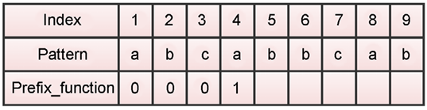

# 字符串匹配算法

有许多流行的字符串匹配算法。 字符串匹配算法具有非常重要的应用，例如在文本文档中搜索数据、抄袭检测、文本编辑程序等。 在本章中，我们将研究在任何给定文本中查找给定模式或子字符串位置的模式匹配算法。 我们将讨论蛮力算法，以及 Rabin-Karp、Knuth-Morris-Pratt (KMP) 和 Boyer-Moore 模式匹配算法。 本章旨在讨论与字符串相关的算法。 本章将涵盖以下主题：

- 学习模式匹配算法及其实现
- 理解和实现 ```Rabin-Karp``` 模式匹配算法
- 了解和实施 ```Knuth-Morris-Pratt``` (```KMP```) 算法
- 理解和实现 ```Boyer-Moore``` 模式匹配算法

## 技术要求

基于本章讨论的概念和算法的所有程序都在本书以及 ```GitHub``` 存储库中提供，链接如下：https://github.com/PacktPublishing/Hands-On-Data-Structures-and-Algorithms-with-Python-Third-Edition/tree/main/Chapter13.。

## 字符串符号和概念

字符串是字符序列。 ```Python``` 提供了一组丰富的可应用于字符串数据类型的操作和函数。 字符串是文本数据，在 ```Python``` 中处理起来非常高效。 下面是一个字符串的例子——```packt publishing```。

子字符串是给定字符串的一部分的字符序列，即字符串中连续顺序的指定索引。 例如，```packt``` 是字符串 ```packt publishing``` 的子串。 另一方面，子序列也是一个字符序列，通过保持字符出现的顺序从字符串中删除一些字符，可以从给定的字符串中获得这些字符。 例如，```pct pblishing``` 是字符串 ```packt publishing``` 的有效子序列，它是通过删除字符 ```a```、```k``` 和 ```u``` 获得的。 但是，这不是子字符串，因为 ```pct pblishing``` 不是连续的字符序列。因此，子序列不同于子字符串，它可以被认为是子字符串的概括。

前缀 (```p```) 是字符串 (```s```) 的子字符串，因为它出现在字符串的开头。 在前缀之后的字符串 (```s```) 中还存在另一个字符串 (```u```)。 例如，子字符串 ```pack``` 是字符串 ```(s) = "packt publishing"``` 的前缀，因为它是起始子字符串，后面还有另一个子字符串 ```u = "publishing"```。因此，前缀加上字符串 ```(u)``` 制作 ```packt publishing```，这是整个字符串。

后缀 (```d```) 是出现在字符串 (```s```) 末尾的子字符串。 例如，子字符串 ```shing``` 是字符串 ```packt publishing``` 的许多可能后缀之一。 ```Python``` 有内置函数来检查字符串是否以特定字符串开头或结尾，如以下代码片段所示：

```python
string = "this is data structures book by packt publisher"
suffix = "publisher"
prefix = "this"
print(string.endswith(suffix))  # Check if string contains given suffix.
print(string.startswith(prefix))  # Check if string starts with given prefix.
```

上述代码的输出如下：

```python
True
True
```

在上面给定字符串的示例中，我们可以看到给定的文本字符串以另一个子字符串 ```publisher``` 结尾，这是一个有效的后缀，并且还有另一个子字符串 ```this```，它是字符串 ```start``` 和 也是一个有效的前缀。

请注意，不要将此处讨论的模式匹配算法与 ```Python 3.10``` 的匹配语句相混淆。

模式匹配算法是最重要的字符串处理算法，我们将在后续部分从模式匹配算法开始讨论它们。

## 模式匹配算法

模式匹配算法用于确定给定模式字符串 (```P```) 在文本字符串 (```T```) 中匹配的索引位置。 因此，模式匹配算法找到并返回给定字符串模式在文本字符串中出现的索引。 如果模式在文本字符串中没有匹配项，它会返回"未找到模式"。

例如，对于给定的文本字符串 ```(s) = "packt publisher"``` 和模式字符串 ```(p) = "publisher"```，模式匹配算法返回模式字符串在文本字符串中匹配的索引位置。 一个字符串匹配问题的例子如图 13.1 所示：


图 13.1：字符串匹配问题的示例

我们将讨论四种模式匹配算法，即蛮力法、Rabin-Karp 算法以及 Knuth-Morris-Pratt (KMP) 和 Boyer-Moore 模式匹配算法。 我们从强力模式匹配算法开始。

## 蛮力算法

蛮力算法也称为模式匹配算法的朴素方法。 朴素的方法意味着它是一种非常基本和简单的算法。 在这种方法中，我们匹配给定文本字符串中输入模式的所有可能组合，以找到模式出现的位置。 该算法非常幼稚，不适合文本很长的情况。

在这个算法中，我们首先将模式字符串的字符与文本字符串的字符一个一个地进行比较，如果模式的所有字符都与文本匹配，则返回文本的索引位置，该索引位置是第一个字符所在的位置。 图案位于。 如果模式的任何字符与文本字符串不匹配，我们将模式移动一个位置以检查模式是否出现在下一个索引位置。 我们通过将模式移动一个索引位置来继续比较模式和文本字符串。

为了更好地理解蛮力算法的工作原理，让我们看一个例子。 假设我们有一个文本字符串```(T) = "acbcabccababcaacbcac"```，模式字符串（```P```）是```acbcac```。 现在，模式匹配算法的目标是确定模式字符串在给定文本 ```T``` 中的索引位置，如图 13.2 所示：


图 13.2：字符串匹配的暴力算法示例

我们首先比较文本的第一个字符，即 ```a``` 和模式的第一个字符。 这里，模式的前五个字符匹配，然后模式的最后一个字符不匹配。 这是不匹配，因此我们将模式移动一个位置。 我们再次开始逐个比较模式的第一个字符和文本字符串的第二个字符。 此处，文本字符串的字符 ```c``` 与模式的字符 ```a``` 不匹配。 所以，这也是一个不匹配，我们将模式移动一个空格，如图 13.2 所示。 我们继续比较模式的字符和文本字符串，直到我们遍历整个文本字符串。 在这个例子中，我们在索引位置 ```14``` 找到一个匹配项，如图 13.2 所示。

让我们考虑一下用于模式匹配的强力算法的 ```Python``` 实现：

```python
def brute_force(text, pattern):
    l1 = len(text)  # The length of the text string
    l2 = len(pattern)  # The length of the pattern
    j = 0  # looping variables are set to 0
    flag = False  # If the pattern doesn't appear at all, then set this to false and execute the last if statement
    for i in range(l1):  # iterating from the 0th index of text
        j = 0
        count = 0
        # Count stores the length upto which the pattern and the text have matched
        while j < l2:
            if i + j < l1 and text[i + j] == pattern[j]:
                # statement to check if a match has occurred or not
                count += 1  # Count is incremented if a character is matched
            j += 1
        if count == l2:  # it shows a matching of pattern in the text
            print("\nPattern occurs at index", i)
            # print the starting index of the successful match
            flag = True
            # flag is True as we wish to continue looking for more matching of pattern in the text.
    if not flag:
        # If the pattern doesn't occur at all, means no match of pattern in the text string
        print("\nPattern is not at all present in the array")
```

以下代码片段可用于调用函数以在给定字符串中搜索模式 "acbcac"：

```python
brute_force('acbcabccababcaacbcac','acbcac')         # function call
```

上述函数调用的输出如下：

```python
Pattern occurs at index 14
```

在前面的暴力方法代码中，我们首先计算给定文本字符串和模式的长度。 我们还用 ```0``` 初始化循环变量并将标志设置为 ```False```。

此变量用于继续搜索字符串中模式的匹配项。 如果在文本字符串末尾标志变量为 ```False```，则表示文本字符串中根本没有模式匹配项。

接下来，我们开始从第 ```0``` 个索引到文本字符串末尾的搜索循环。 在这个循环中，我们有一个计数变量，用于跟踪模式和文本匹配的长度。 接下来，我们有另一个嵌套循环，从第 ```0``` 个索引运行到模式的长度。 这里，变量 ```i``` 跟踪文本字符串中的索引位置，变量 ```j``` 跟踪模式中的字符。 接下来，我们使用以下代码片段比较模式的字符和文本字符串：

```python
            if i + j < l1 and text[i + j] == pattern[j]:
```

此外，我们在每次匹配文本字符串中的模式字符后增加计数变量。 然后，我们继续匹配模式和文本字符串的字符。 如果模式的长度等于计数变量，则表示匹配。

如果文本字符串中存在模式字符串的匹配项，我们将打印文本字符串的索引位置，并将标志变量保持为 True，因为我们希望继续在文本字符串中搜索模式的更多匹配项。 最后，如果变量 ```flag``` 的值为 ```False```，则意味着文本字符串中的模式根本不匹配。

朴素字符串匹配算法的最佳情况和最坏情况时间复杂度分别为 $O(n)$ 和 $O(m*(n-m+1))$。 最好的情况是在文本中找不到模式并且模式的第一个字符根本不存在于文本中，例如，如果文本字符串是 ```ABAACEBCCDAAEE```，而模式是 ```FAA```。 在这里，由于模式的第一个字符在文本中的任何地方都找不到匹配项，因此它将进行等于文本长度 (```n```) 的比较。

最坏的情况发生在文本字符串和模式的所有字符都相同时，我们想要找出给定模式字符串在文本字符串中的所有出现，例如，如果文本字符串是 ```AAAAAAAAAAAAAAAA```，并且 模式字符串是 ```AAAA```。 另一种最坏的情况是只有最后一个字符不同，例如，如果文本字符串是 ```AAAAAAAAAAAAAAAF``` 而模式是 ```AAAAF```。 因此，比较的总数将为 ```m*(n-m+1)```，最坏情况下的时间复杂度将为 $O(m*(n-m+1))$。

接下来，我们讨论 ```Rabin-Karp``` 模式匹配算法。

## ```Rabin-Karp``` 算法

```Rabin-Karp``` 模式匹配算法是暴力法的改进版本，用于查找给定模式在文本字符串中的位置。 ```Rabin-Karp``` 算法的性能是通过在散列的帮助下减少比较次数来提高的。 我们在[第 8 章](./8.md)哈希表中讨论了哈希的概念。 散列函数返回给定字符串的唯一数值。

该算法比蛮力方法更快，因为它避免了不必要的比较。 在这个算法中，我们将模式的哈希值与文本字符串的子字符串的哈希值进行比较。 如果散列值不匹配，则模式向前移动一位。 与蛮力算法相比，这是一种更好的算法，因为不需要一个一个地比较模式的所有字符。

该算法基于这样的概念：如果两个字符串的散列值相等，则假定这两个字符串也相等。 但是，也可能存在哈希值相等的两个不同字符串。 在那种情况下，该算法将不起作用； 这种情况被称为虚假命中，是由于散列中的冲突而发生的。 为了用 Rabin-Karp 算法避免这种情况，在匹配模式和子字符串的哈希值之后，我们通过逐个字符地比较模式和子字符串来确保模式在字符串中实际匹配。

```Rabin-Karp``` 模式匹配算法的工作原理如下：

1. 首先，我们在开始搜索之前对模式进行预处理，即计算长度为 ```m``` 的模式的哈希值和长度为 ```m``` 的文本的所有可能子串的哈希值。 可能的子串总数为 ```(n-m+1)```。 这里，```n``` 是文本的长度。
2. 我们将模式的哈希值与文本子串的哈希值一一比较。
3. 如果哈希值不匹配，那么我们将模式移动一个位置。
4. 如果模式的散列值和文本子串的散列值匹配，那么我们逐个字符比较模式和子串，以确保模式在文本中确实匹配。
5. 我们继续步骤 ```2``` - ```5``` 的步骤，直到到达给定文本字符串的末尾。

在此算法中，我们使用 ```Horner``` 规则（也可以使用任何其他哈希函数）计算数字哈希值，该规则返回给定字符串的唯一值。 我们还使用字符串中所有字符的序数值之和来计算哈希值。

让我们考虑一个例子来理解 ```Rabin-Karp``` 算法。 假设我们有一个文本字符串 ```(T) = "publisher paakt packt"```，以及模式 ```(P) = "packt"```。 首先，我们计算模式（长度为 ```m```）和文本字符串的所有子字符串（长度为 ```m```）的哈希值。 ```Rabin-Karp``` 算法的功能如图 13.3 所示：


图 13.3：用于字符串匹配的 ```Rabin-Karp``` 算法示例

我们开始将模式 ```packt``` 的哈希值与第一个子字符串 ```publi``` 进行比较。 由于哈希值不匹配，我们将模式移动一个位置，然后将模式的哈希值与文本的下一个子字符串的哈希值进行比较，即 ```ublis```。 由于这些哈希值也不匹配，我们再次将模式移动一个位置。 如果散列值不匹配，我们一次将模式移动一个位置。 并且，如果模式的哈希值和子字符串的哈希值匹配，我们逐个字符地比较模式和子字符串，如果它们匹配，我们返回文本字符串的位置。

在图 13.3 所示的示例中，模式的哈希值和文本的子字符串在位置 ```17``` 处匹配。

重要的是要注意，可能有一个不同的字符串，其哈希值可以与模式的哈希匹配，即虚假命中。

接下来，让我们讨论 ```Rabin-Karp ```模式匹配算法的实现。

### 实施 ```Rabin-Karp``` 算法

```Rabin-Karp``` 算法的实现分两步完成：

1. 我们实现了 ```generate_hash()``` 方法，该方法用于计算模式的哈希值以及长度等于模式长度的子串的所有可能组合。
2. 我们实现了 ```Rabin-Karp``` 算法，该算法使用 ```generate_hash()``` 方法来识别哈希值与模式的哈希值匹配的子字符串。 最后，我们逐个字符地匹配它们以确保我们正确地找到了模式。

让我们首先讨论为文本的模式和子字符串生成哈希值的实现。 为此，我们需要首先确定哈希函数。 在这里，我们使用字符串所有字符的所有序数值的和作为哈希函数。

下面给出了计算哈希值的完整 ```Python``` 实现：

```python
def generate_hash(text, pattern):
    ord_text = [ord(i) for i in text]  # stores unicode value of each character in text
    ord_pattern = [
        ord(j) for j in pattern
    ]  # stores unicode value of each character in pattern
    len_text = len(text)  # stores length of the text
    len_pattern = len(pattern)  # stores length of the pattern
    len_hash_array = (
        len_text - len_pattern + 1
    )  # stores the length of new array that will contain the hash values of text
    hash_text = [0] * (len_hash_array)  # Initialize all the values in the array to 0.
    hash_pattern = sum(ord_pattern)
    for i in range(
        len_hash_array
    ):  # step size of the loop will be the size of the pattern
        if i == 0:  # Base condition
            hash_text[i] = sum(ord_text[:len_pattern])  # initial value of hash function
        else:
            hash_text[i] = (hash_text[i - 1] - ord_text[i - 1]) + ord[
                i + len_pattern - 1
            ]  # calculating next hash value using previous value
    return [hash_text, hash_pattern]  # return the hash values
```

在上面的代码中，我们首先将文本和模式的所有字符的序号值存储在 ```ord_text``` 和 ```ord_pattern``` 变量中。 接下来，我们将文本的长度和模式存储在 ```len_text``` 和 ```len_pattern``` 变量中。

接下来，我们创建一个名为 ```len_hash_array``` 的变量，它使用 ```len_text - len_pattern + 1``` 存储长度（等于模式的长度）的所有可能子串的数量，我们创建一个名为 ```hash_text``` 的数组，用于存储所有可能的哈希值 可能的子串。 这显示在以下代码片段中：

```python
    len_hash_array = (
        len_text - len_pattern + 1
    )  # stores the length of new array that will contain the hash values of text
    hash_text = [0] * (len_hash_array)  # Initialize all the values in the array to 0.
```

接下来，我们通过使用以下代码片段对模式中所有字符的序数值求和来计算模式的哈希值：

```python
    hash_pattern = sum(ord_pattern)
```

接下来，我们开始一个循环，对文本的所有可能子字符串执行。 为此，最初，我们通过使用 ```sum(ord_text[:len_pattern])``` 对所有字符的序数值求和来计算第一个子字符串的哈希值。 此外，所有子字符串的哈希值都是使用先前子字符串的哈希值计算的，如以下代码片段所示：

```python
            hash_text[i] = (hash_text[i - 1] - ord_text[i - 1]) + ord[
                i + len_pattern - 1
            ]  # calculating next hash value using previous value
```

因此，我们已经预先计算了模式的哈希值和我们将在 ```Rabin-Karp``` 算法的实现中用于比较模式和文本的文本的所有子字符串。 ```Rabin-Karp``` 算法的工作原理如下。 首先，我们比较文本的模式和子字符串的哈希值。 接下来，我们将哈希值与模式的哈希值匹配的子字符串逐个字符地进行比较。

```Rabin-Karp``` 算法完整的 ```Python``` 实现如下：

```python
def Rabin_Karp_Matcher(text, pattern):
    text = str(text)  # convert text into string format
    pattern = str(pattern)  # convert pattern into string format
    hash_text, hash_pattern = generate_hash(
        text, pattern
    )  # generate hash values using generate_hash function
    len_text = len(text)  # length of text
    len_pattern = len(pattern)  # length of pattern
    flag = False  # checks if pattern is present atleast once or not at all
    for i in range(len(hash_text)):
        if hash_text[i] == hash_pattern:  # if the hash value matches
            count = 0  # count the total characters upto which both are similar
            for j in range(len_pattern):
                if pattern[j] == text[i + j]:  # checking equality for each character
                    count += 1  # if value is equal, then update the count value
                else:
                    break
            if (
                count == len_pattern
            ):  # if count is equal to length of pattern, it means there is a match
                flag = True  # update flag accordingly
                print("Pattern occurs at index", i)
    if (
        not flag
    ):  # if pattern doesn't match even once, then this if statement is executed
        print("Pattern is not at all present in the text")
```

在上面的代码中，首先，我们将给定的文本和模式转换为字符串格式，因为只能为字符串计算序数值。 接下来，我们使用 ```generate_hash``` 函数来计算模式和文本的哈希值。 我们将文本和模式的长度存储在 ```len_text``` 和 ```len_pattern``` 变量中。 我们还将 ```flag``` 变量初始化为 ```False```，以便它跟踪该模式是否至少出现在文本中一次。

接下来，我们开始一个循环来实现算法的主要概念。 这个循环执行 ```hash_text``` 的长度，它是可能的子字符串的总数。 最初，我们使用 ```if hash_text[i] == hash_pattern``` 将第一个子字符串的哈希值与模式的哈希值进行比较。 如果它们不匹配； 我们移动一个索引位置并寻找另一个子字符串。 我们迭代地进一步移动，直到我们得到匹配。

如果找到匹配项，我们将使用 ```if pattern[j] == text[i + j]``` 通过循环逐个字符地比较子字符串和模式。

然后我们创建一个计数变量来跟踪有多少字符在模式和子字符串中匹配。 如果计数的长度和模式的长度相等，这意味着所有字符都匹配，并且返回找到模式的索引位置。 最后，如果标志变量保持为 ```False```，这意味着模式与文本完全不匹配。 以下代码片段可用于执行 ```Rabin-Karp``` 匹配算法：

```python
Rabin_Karp_Matcher("101110000011010010101101","1011")
Rabin_Karp_Matcher("ABBACCADABBACCEDF","ACCE")
```

上述代码的输出如下：

```python
Pattern occurs at index 0
Pattern occurs at index 18
Pattern occurs at index 11
```

在上面的代码中，我们首先检查模式 ```1011``` 是否出现在给定的文本字符串 ```101110000011010010101101``` 中。 输出显示给定模式出现在索引位置 ```0``` 和 ```18``` 处。接下来，模式 ```ACCE``` 出现在文本字符串 ```ABBACCADABBACCEDF``` 中的索引位置 ```11``` 处。

```Rabin-Karp``` 模式匹配算法在搜索前对模式进行预处理； 也就是说，它计算复杂度为 ```O(m)``` 的模式的散列值。 此外，```Rabin-Karp``` 算法最坏情况下的运行时间复杂度为 $O(m *(n-m+1))$。 最坏的情况是模式根本没有出现在文本中。 平均情况是模式至少出现一次。

接下来，我们将讨论 ```KMP``` 字符串匹配算法。

## ```Knuth-Morris-Pratt``` 算法
```KMP``` 算法是一种模式匹配算法，基于模式中的重叠文本本身可用于在任何不匹配时立即知道模式应移动多少以跳过不必要的比较。 在此算法中，我们将预先计算前缀函数，该函数指示每当出现不匹配时所需的模式移位次数。 ```KMP``` 算法对模式进行预处理，以避免使用前缀函数进行不必要的比较。 因此，该算法利用前缀函数来估计当我们遇到不匹配时应该将模式移动多少以在文本字符串中搜索模式。 ```KMP``` 算法是高效的，因为它最大限度地减少了给定模式与文本字符串的比较次数。

```KMP``` 算法背后的动机可以在图 13.4 中观察到。 在此示例中，可以看出在匹配前 ```5``` 个字符后，第 ```6``` 个位置与最后一个字符 ```d``` 不匹配。 从前缀函数中还可以知道字符 ```d``` 之前没有出现在模式中，利用这个信息，模式可以移动六个位置：


图 13.4：```KMP``` 算法示例

因此，在这个例子中，模式已经移动了六个位置而不是一个。 让我们讨论另一个例子来理解 ```KMP``` 算法的概念，如图 13.5 所示：


图 13.5：```KMP``` 算法的第二个例子
在上面的示例中，不匹配发生在模式的最后一个字符处。 由于不匹配位置的模式与前缀 ```bc``` 有部分匹配，因此此信息由前缀函数给出。 在这里，可以移动模式以与模式中匹配的前缀 ```bc``` 的其他匹配项对齐。

接下来我们将研究前缀函数，以便更好地理解我们如何使用它来了解我们应该将模式移动多少。

### 前缀函数

前缀函数（也称为失败函数）在模式中查找模式。 当存在不匹配时，它会发现由于模式本身的重复，之前的比较可以重复使用多少。 ```prefix``` 函数在我们遇到不匹配时为每个位置返回一个值，它告诉我们模式应该移动多少。

让我们通过以下示例了解我们如何使用前缀函数来查找所需的移位量。 考虑第一个例子：如果我们有一个模式的前缀函数，其中所有字符都不同，那么前缀函数的值为 ```0```。这意味着如果我们发现任何不匹配，模式将移动 字符与模式中的那个位置进行比较。

考虑一个包含所有不同字符的模式 ```abcde``` 的示例。 我们开始比较模式的第一个字符和文本字符串的第一个字符，如图 13.6 所示。 如图所示，不匹配出现在模式中的第 ```4``` 个字符处。 由于前缀函数的值为 ```0```，这意味着模式中没有重叠，之前的比较不会被重用，因此模式将移动到该点之前比较的字符数：


图 13.6：```KMP``` 算法中的前缀函数

让我们考虑另一个示例，以更好地理解前缀函数如何为模式 (```P```) ```abcabbcab``` 工作，如图 13.7 所示：


图 13.7：```KMP``` 算法中的前缀函数示例

在图 13.7 中，我们从索引 ```1``` 开始计算前缀函数的值。如果模式中没有重复字符，我们将值赋值为 ```0```。 因此，在此示例中，我们将 ```0``` 分配给索引位置 ```1``` 到 ```3``` 的前缀函数。接下来，在索引位置 ```4``` 处，我们可以看到有一个字符 ```a```，它是模式本身第一个字符的重复 ，所以我们这里赋值为 ```1```，如图13.8所示：



图 13.8：```KMP``` 算法中索引 ```4``` 处前缀函数的值

接下来，我们查看位置 ```5``` 的下一个字符。它具有最长的后缀模式 ```ab```，因此它的值为 ```2```，如图 13.9 所示：


图 13.9：```KMP``` 算法中索引 ```5``` 处前缀函数的值

同样，我们看下一个索引位置 ```6```。这里，字符是 ```b```。 这个字符在模式中没有最长的后缀，所以它的值为 ```0```。接下来，我们在索引位置 ```7``` 处分配值 ```0```。然后，我们查看索引位置 ```8```，并分配值 ```1```，因为它具有 长度为 ```1``` 的最长后缀。

最后，在索引位置 ```9``` 处，我们有最长的后缀 ```2```。如图 13.10 所示：


图 13.10：```KMP``` 算法中索引 ```6``` 到 ```9``` 处前缀函数的值

前缀函数的值显示了如果不匹配，可以重用字符串开头的多少。 例如，如果在索引位置5比较失败，则前缀函数值为 ```2```，这意味着两个起始字符不需要比较，可以相应地移动模式。

接下来，我们讨论 ```KMP``` 算法的细节。

图 13.10：KMP 算法中索引 6 到 9 处前缀函数的值

前缀函数的值显示了如果不匹配，可以重用字符串开头的多少。 例如，如果在索引位置5比较失败，则前缀函数值为2，这意味着两个起始字符不需要比较，可以相应地移动模式。

接下来，我们讨论 KMP 算法的细节。

### 理解 ```KMP``` 算法

```KMP``` 模式匹配算法检测模式本身的重叠，从而避免不必要的比较。 ```KMP``` 算法背后的主要思想是根据模式中的重叠来检测模式应该移动多少。 该算法的工作原理如下：

首先，我们预先计算给定模式的前缀函数，并初始化一个表示匹配字符数的计数器 ```q```。
我们首先将模式的第一个字符与文本字符串的第一个字符进行比较，如果匹配，则增加模式的计数器 ```q``` 和文本字符串的计数器，然后比较下一个字符。
如果不匹配，那么我们将 ```q``` 的预先计算的前缀函数的值分配给 ```q``` 的索引值。
我们继续在文本字符串中搜索模式，直到到达文本末尾，也就是说，如果我们没有找到任何匹配项。 如果模式中的所有字符在文本字符串中都匹配，我们返回模式在文本中匹配的位置并继续搜索另一个匹配项。
让我们考虑以下示例以了解 ```KMP``` 算法的工作原理。 我们有一个模式 ```acacac``` 以及从 ```1``` 到 ```6``` 的索引位置（为了简单起见，我们的索引位置从 ```1``` 而不是 ```0``` 开始），如图 13.11 所示。 给定模式的前缀函数的构造如图 13.11 所示：


图 13.11：模式 ```acacac``` 的前缀函数

让我们举个例子来理解我们如何使用前缀函数根据 ```KMP``` 算法对图 13.12 中给出的文本字符串和模式进行模式移位。 我们开始逐个字符地比较模式和文本。 当我们在索引位置 ```6``` 不匹配时，我们看到这个位置的前缀值为 ```2```。然后我们根据前缀函数的返回值移动模式。 接下来，我们从模式（字符 ```c```）上的索引位置 ```2``` 开始比较模式和文本字符串，以及文本字符串的字符 ```b```。 由于这是不匹配，因此模式将根据此位置的前缀函数的值进行移动。 此描述如图 13.12 所示：


图 13.12：模式根据前缀函数的返回值移动

现在让我们来看图 13.13 中显示的另一个示例，其中显示了图案在文本上的位置。 当我们开始比较字符 ```b``` 和 ```a``` 时，它们不匹配，我们看到索引位置 ```1``` 的前缀函数显示值为 ```0```，这意味着模式中没有发生文本重叠。 因此，我们将模式移动 ```1``` 个位置，如图 13.12 所示。 接下来，我们逐个字符地比较模式和文本字符串，我们发现字符 ```b``` 和 ```c``` 之间的文本中索引位置 ```10``` 不匹配。

在这里，我们使用预先计算的前缀函数来移动模式——因为 ```prefix_function(4)``` 为 ```2```，我们移动模式以对齐模式索引位置 ```2``` 处的文本。 之后，我们比较索引位置 ```10``` 处的字符 ```b``` 和 ```c```，由于它们不匹配，我们将模式移动一位。 这个过程如图13.13所示：


图 13.13：根据前缀函数的返回值移动模式

让我们从索引位置 ```11``` 继续搜索，如图 13.14 所示。 接下来，我们比较文本中索引为 ```11``` 的字符并继续，直到发现不匹配为止。 我们在索引位置 ```12``` 处发现字符 ```b``` 和 ```c``` 不匹配，如图 13.14 所示。 由于 ```prefix_function(2)``` 为 ```0```，我们移动模式并将其移动到不匹配的字符旁边。我们重复相同的过程，直到到达字符串的末尾。 我们在文本字符串中的索引位置 ```13``` 处找到文本字符串中模式的匹配项，如图 13.14 所示：


图 13.14：索引位置 ```11``` 到 ```18``` 的模式转换

```KMP``` 算法有两个阶段：首先，预处理阶段，这是我们计算前缀函数的阶段，其空间和时间复杂度为 $O(m)$。 此外，第二阶段涉及搜索，```KMP``` 算法的时间复杂度为 $O(n)$。 因此，```KMP``` 算法的最坏情况时间复杂度为 $O(m +n)$。

现在，我们将讨论使用 ```Python``` 实现 ```KMP``` 算法。

### 实现 ```KMP``` 算法

这里解释了 ```KMP``` 算法的 ```Python``` 实现。 我们首先为给定的模式实现前缀函数。 前缀函数的代码如下：

```python
def pfun(pattern):  # function to generate prefix function for the given pattern,
    n = len(pattern)  # length of the pattern
    prefix_fun = [0] * (n)  # initialize all elements of the list to 0
    k = 0
    for q in range(2, n):
        while k > 0 and pattern[k + 1] != pattern[q]:
            k = prefix_fun[k]
        if (
            pattern[k + 1] == pattern[q]
        ):  # If the kth element of the pattern is equal to the qth element
            k += 1  # update k accordingly
        prefix_fun[q] = k
    return prefix_fun  # return the prefix function
```

在上面的代码中，我们首先使用 ```len()``` 函数计算模式的长度，然后我们初始化一个列表来存储前缀函数计算的值。

接下来，我们开始执行从 ```2``` 到模式长度的循环。 然后，我们执行一个嵌套循环，直到我们处理完整个模式。 变量 ```k``` 被初始化为 ```0```，这是模式第一个数据的前缀函数。 如果模式的第 ```k``` 个数据等于第 ```q``` 个数据，那么我们将 ```k``` 的值增加 ```1```。```k``` 的值是前缀函数计算的值，所以我们将它赋值在 ```q``` 的索引位置图案。 最后，我们返回前缀函数的列表，该列表具有模式中每个字符的计算值。

一旦我们创建了前缀函数，我们就可以实现主要的 ```KMP``` 匹配算法。 以下代码详细说明了这一点：

```python
def KMP_Matcher(text, pattern):  # KMP matcher function
    m = len(text)
    n = len(pattern)
    flag = False
    text = f"-{text}"  # append dummy character to make it 1-based indexing
    pattern = f"-{pattern}"  # append dummy character to the pattern also
    prefix_fun = pfun(pattern)  # generate prefix function for the pattern
    q = 0
    for i in range(1, m + 1):
        while (
            q > 0 and pattern[q + 1] != text[i]
        ):  # while pattern and text are not equal, decrement the value of q if it is > 0
            q = prefix_fun[q]
        if (
            pattern[q + 1] == text[i]
        ):  # if pattern and text are equal, update value of q
            q += 1
        if (
            q == n
        ):  # if q is equal to the length of the pattern, it means that the pattern has been found.
            print(
                "Pattern occurs at positions ", i - n
            )  # print the index, where first match occurs.
            flag = True
            q = prefix_fun[q]
    if not flag:
        print("No match found")
```

在上面的代码中，我们首先计算文本字符串和模式的长度，它们分别存储在变量 ```m``` 和 ```n``` 中。 接下来，我们定义一个变量标志来指示模式是否找到匹配项。 此外，我们在文本和模式中添加一个虚拟字符 ```-``` 以使索引从索引 ```1``` 而不是索引 ```0``` 开始。接下来，我们调用 ```pfun()``` 方法来构造包含模式所有位置的前缀值的数组 使用 ```prefix_fun = pfun(pattern)```。 接下来，我们执行从 ```1``` 到 ```m + 1``` 的循环，其中 ```m``` 是模式的长度。 此外，对于 ```for``` 循环的每次迭代，我们都会在 while 循环中比较模式和文本，直到完成对模式的搜索。

如果我们得到不匹配，我们使用索引 ```q``` 处的前缀函数的值（这里，```q``` 是发生不匹配的索引）来找出我们必须将模式移动多少。 如果模式和文本相等，则 ```1``` 和 ```n``` 的值将相等，我们可以返回模式在文本中匹配的索引。 此外，当在文本中找到模式时，我们将标志变量更新为 ```True```。 如果我们完成了对整个文本字符串的搜索，但变量 ```flag``` 仍然为 ```False```，则意味着该模式不存在于给定的文本中。

以下代码片段可用于执行字符串匹配的 ```KMP``` 算法：

```python
KMP_Matcher(
    "aabaacaadaabaaba", "aabaa"
)  # function call, with two parameters, text and pattern
```

上述代码的输出如下：

```python
Pattern occurs at positions 0
Pattern occurs at positions 9
```

在上面的输出中，我们看到模式出现在给定文本字符串的索引位置 ```0``` 和 ```9``` 处。

接下来，我们将讨论另一种模式匹配算法，```Boyer-Moore``` 算法。

## ```Boyer-Moore``` 算法
正如我们已经讨论过的，字符串模式匹配算法的主要目标是通过避免不必要的比较来找到尽可能多地跳过比较的方法。

```Boyer-Moore``` 模式匹配算法是另一种此类算法（与 ```KMP``` 算法一起），它通过使用不同方法跳过比较来进一步提高模式匹配的性能。 为了理解 ```Boyer-Moore``` 算法，我们必须了解以下概念：

在这个算法中，我们将模式从左到右的方向移动，类似于 ```KMP``` 算法。
我们从右到左比较模式的字符和文本字符串，这与我们在 ```KMP``` 算法的情况下所做的相反。
该算法通过使用好后缀和不良字符移位试探法跳过不必要的比较。 这些启发式方法本身会找到可以跳过的可能比较次数。 我们将模式滑动到给定文本上，并使用这两种启发式建议的最大偏移量。
让我们了解所有这些启发式方法以及 ```Boyer-Moore``` 模式匹配算法如何工作的细节。

### 理解 ```Boyer-Moore``` 算法

```Boyer-Moore``` 算法从右到左比较模式与文本，这意味着在该算法中，如果模式的结尾与文本不匹配，则可以移动模式而不是检查文本的每个字符。 关键思想是模式与文本对齐，模式的最后一个字符与文本进行比较，如果不匹配，则不需要继续比较每个字符，我们可以移动模式。

在这里，我们将模式移动多少取决于不匹配的字符。 如果文本的不匹配字符没有出现在模式中，则意味着我们可以将模式移动整个模式长度，而如果不匹配字符出现在模式中的某处，则我们以这种方式部分移动模式 不匹配的字符与模式中该字符的其他出现对齐。

此外，在该算法中，我们还可以看到模式的哪一部分匹配（具有匹配的后缀），因此我们利用此信息并通过跳过任何不必要的比较来对齐文本和模式。 使模式沿文本跳跃以减少比较次数而不是检查模式的每个字符与文本是高效字符串匹配算法的主要思想。

```Boyer-Moore``` 算法背后的概念如图 13.15 所示：


图 13.15：演示 ```Boyer-Moore``` 算法概念的示例

在图 13.15 所示的示例中，模式的字符 ```b``` 与文本的字符 ```d``` 不匹配，我们可以移动整个模式，因为不匹配的字符 ```d``` 不存在于模式中的任何地方。 在第二个不匹配中，我们可以看到文本中不匹配的字符 ```a``` 出现在模式中，因此我们移动模式以与该字符对齐。 这个例子展示了我们如何可以跳过不必要的比较。 接下来，我们将进一步讨论算法的细节。

当我们发现不匹配时，```Boyer-Moore``` 算法有两种启发式方法来确定模式可能的最大偏移量：

- 不良字符启发式
- 好的后缀启发式

在不匹配时，这些试探法中的每一个都建议可能的偏移，并且考虑到不良字符和好后缀试探法给出的最大偏移，```Boyer-Moore``` 算法将文本字符串上的模式偏移更长的距离。 不良字符和良好后缀试探法的详细信息将在以下小节中通过示例进行详细说明。

#### 不良字符启发式
```Boyer-Moore``` 算法按从右到左的方向比较模式和文本字符串。 它使用不良字符试探法来转换模式，我们从模式的末尾开始逐个字符地进行比较，如果它们匹配，则比较倒数第二个字符，如果也匹配，则重复该过程 直到整个模式匹配或者我们得到不匹配。

文本的不匹配字符也称为不良字符。 如果我们在此过程中遇到任何不匹配，我们将根据以下条件之一改变模式：

1. 如果文本的不匹配字符没有出现在模式中，那么我们将模式移动到不匹配字符的旁边。
2. 如果不匹配的字符在模式中出现一次，那么我们将以与不匹配的字符对齐的方式移动模式。
3. 如果不匹配的字符在模式中出现不止一次，那么我们将尽可能少地移动以将模式与该字符对齐。

让我们通过示例来了解这三种情况。 考虑一个文本字符串 (```T```) 和 ```pattern = {acacac}```。 我们首先从右到左比较字符，即模式的字符 ```c``` 和文本字符串的字符 ```b```。 由于它们不匹配，我们在模式中查找文本字符串的不匹配字符（即 ```b```）。 由于错误字符 ```b``` 没有出现在模式中，我们将模式移动到不匹配字符旁边，如图 13.16 所示：


图 13.16：```Boyer-Moore``` 算法中的错误字符启发式示例

让我们再举一个例子，给定的文本字符串和 ```pattern = {acacac}``` 如图 13.17 所示。 对于给定的示例，我们从右到左比较文本字符串的字符和模式，我们得到文本字符 ```d``` 的不匹配。 这里匹配到后缀 ```ac```，但是字符 ```d``` 和 ```c``` 不匹配，模式中没有出现不匹配的字符 ```d```。 因此，我们将模式移动到不匹配的字符旁边，如图 13.17 所示：


图 13.17：```Boyer-Moore``` 算法中不良字符启发式的第二个例子

让我们考虑一个例子来理解给定文本字符串和模式的错误字符启发式的第二种和第三种情况，如图 13.18 所示。 在这里，后缀 ```ac``` 被匹配，但下一个字符 ```a``` 和 ```c``` 不匹配，因此我们在模式中搜索不匹配字符 ```a``` 的出现。 由于它在模式中出现了两次，我们有两种选择来移动模式以将其与不匹配的字符对齐。 图 13.18 显示了这两个选项：

在我们有多个选项来转换模式的情况下，我们应用尽可能少的转换次数以防止丢失任何可能的匹配项。 另一方面，如果我们在模式中只出现一次不匹配的字符，我们可以很容易地移动模式，使不匹配的字符对齐。 因此，在这个例子中，我们更喜欢选项 1 来改变模式，如图 13.18 所示：


图 13.18：```Boyer-Moore``` 算法中不良字符启发式的第三个例子

到目前为止，我们已经讨论了不良字符启发式，我们将在下一节中考虑良好后缀启发式。

#### 好的后缀启发式
坏字符启发法并不总能为转换模式提供好的建议。 ```Boyer-Moore``` 算法还使用良好的后缀试探法在基于匹配后缀的文本字符串上移动模式。 在这种方法中，我们将模式向右移动，使模式的匹配后缀与模式中同一后缀的另一个出现对齐。

它是这样工作的：我们首先从右到左比较模式和文本字符串，如果我们发现任何不匹配，那么我们检查到目前为止已经匹配的模式中后缀的出现，这被称为 好后缀。

在这种情况下，我们以这样一种方式移动模式，即我们将另一个出现的好后缀与文本对齐。 好的后缀启发式有两种主要情况：

1. 匹配后缀在模式中出现一次或多次
2. 匹配后缀的某些部分出现在模式的开头（这意味着匹配后缀的后缀作为模式的前缀存在）

让我们通过以下示例来了解这些情况。 假设我们有一个给定的文本字符串和模式 ```acabac```，如图 13.19 所示。 我们开始从右到左比较字符，发现文本字符串的字符 ```a``` 和模式的字符 ```b``` 不匹配。 到这个不匹配点，我们已经匹配了后缀 ```ac```，这被称为“好后缀”。 现在，我们在模式中搜索另一个出现的好后缀 ```ac```（在本例中它出现在模式的起始位置），我们移动模式以使其与该后缀对齐，如图 13.19 所示：


图 13.19：```Boyer-Moore``` 算法中的良好后缀启发式示例

让我们举另一个例子来理解好的后缀启发式。 考虑图 13.18 中给出的文本字符串和模式。 在这里，我们得到了字符 ```a``` 和 ```c``` 之间的不匹配，我们得到了一个好的后缀 ```ac```。 在这里，我们有两个选项来移动模式以将其与好的后缀字符串对齐。

在我们有多个选项来转换模式的情况下，我们会选择转换次数较少的选项。 为此，我们在本例中采用选项 ```1```，如图 13.20 所示：


图 13.20：```Boyer-Moore``` 算法中良好后缀启发式的第二个示例

让我们看一下图 13.19 中显示的文本字符串和模式的另一个示例。 在这个例子中，我们得到了一个好的后缀字符串 ```aac```，我们得到了文本字符串的字符 ```b``` 和模式的字符 ```a``` 的不匹配。 现在，我们在模式中搜索好后缀 ```aac```，但没有找到它的另一个出现。 发生这种情况时，我们检查模式的前缀是否与好后缀的后缀匹配，如果是，我们移动模式以与其对齐。

对于此示例，我们发现模式开头的前缀 ```ac``` 与完整的好后缀不匹配，但与好后缀 ```aac``` 的后缀 ```ac``` 匹配。 在这种情况下，我们通过与 ```aac``` 的后缀对齐来移动模式，它也是模式的前缀，如图 13.21 所示：


图 13.21：```Boyer-Moore``` 算法中良好后缀启发式的第三个示例

图 13.22 显示了给定文本字符串和模式的良好后缀启发式的另一种情况。 在这个例子中，我们比较文本和模式并找到好的后缀 ```aac```，我们得到与文本字符 ```b``` 和模式字符 ```a``` 的不匹配。

接下来，我们在模式中搜索匹配的好后缀，但是模式中没有出现后缀，模式的任何前缀也没有匹配好后缀的后缀。 因此，在这种情况下，我们在匹配的良好后缀之后移动模式，如图 13.22 所示：


图 13.22：```Boyer-Moore``` 算法中良好后缀启发式的第四个示例

在 ```Boyer-Moore``` 算法中，我们计算坏字符和好后缀试探法给出的偏移。 此外，我们通过坏字符和好后缀试探法给出的较长距离来移动模式。

```Boyer-Moore``` 算法对模式的预处理时间复杂度为 $O(m)$，搜索时间复杂度为$O(mn)$，其中 ```m``` 为模式长度，```n``` 为文本长度 .

接下来，让我们讨论一下 ```Boyer-Moore``` 算法的实现。

#### 实现 ```Boyer-Moore``` 算法

让我们了解一下 ```Boyer-Moore``` 算法的实现。 ```Boyer-Moore``` 算法的完整实现如下：

```python
text = "acbaacacababacacac"
pattern = "acacac"


matched_indexes = []

i = 0
flag = True
while i <= len(text) - len(pattern):
    for j in range(len(pattern) - 1, -1, -1):  # reverse searching
        if pattern[j] != text[i + j]:
            flag = False  # indicates there is a mismatch
            if (
                j == len(pattern) - 1
            ):  # if good-suffix is not present, we test bad character
                if text[i + j] in pattern[0:j]:
                    i = i + j - pattern[0:j].rfind(text[i + j])
                    # i+j is index of bad character, this line is used for jumping pattern to match bad character of text with same character in pattern
                else:
                    i = (
                        i + j + 1
                    )  # if bad character is not present, jump pattern next to it
            else:
                k = 1
                while (
                    text[i + j + k : i + len(pattern)]
                    not in pattern[0 : len(pattern) - 1]
                ):
                    # used for finding sub part of a good-suffix
                    k = k + 1
                if (
                    len(text[i + j + k : i + len(pattern)]) != 1
                ):  # good-suffix should not be of one character
                    gsshift = (
                        i
                        + j
                        + k
                        - pattern[0 : len(pattern) - 1].rfind(
                            text[i + j + k : i + len(pattern)]
                        )
                    )
                    # jumps pattern to a position where good-suffix of pattern matches with good-suffix of text
                else:
                    # gsshift=i+len(pattern)
                    gsshift = 0  # when good-suffix heuristic is not applicable,
                    # we prefer bad character heuristic
                if text[i + j] in pattern[0:j]:
                    bcshift = i + j - pattern[0:j].rfind(text[i + j])
                    # i+j is index of bad character, this line is used for jumping pattern to match bad character of text with same character in pattern
                else:
                    bcshift = i + j + 1
                i = max((bcshift, gsshift))
            break
    if flag:  # if pattern is found then normal iteration
        matched_indexes.append(i)
        i = i + 1

```

此处提供了对前面代码中每个语句的解释。 最初，我们有文本字符串和模式。 初始化变量后，我们从一个 ```while``` 循环开始，该循环首先将模式的最后一个字符与文本的相应字符进行比较。

然后，通过使用从模式的最后一个索引到模式的第一个字符的嵌套循环，从右到左比较字符。 这使用```range(len(pattern)-1, -1, -1)```。

外部 ```while``` 循环跟踪文本字符串中的索引，而内部 ```for``` 循环跟踪模式中的索引位置。

接下来，我们开始使用 ```pattern[j] != text[i + j]``` 来比较字符。 如果它们不匹配，我们将标志变量设置为 ```False```，表示存在不匹配。

现在，我们使用条件 ```j == len(pattern) - 1``` 检查是否存在良好的后缀。 如果此条件为```True```，则意味着没有可能的好后缀，因此我们检查坏字符试探法，即使用条件 ```text[i + j] in pattern[0]``` 来检查模式中是否存在不匹配的字符 :j]```，如果条件为```True```，则意味着模式中存在坏字符。 在这种情况下，我们通过使用 ```i=i+j-pattern[0:j].rfind(text[i+j])``` 移动模式，将这个坏字符与模式中该字符的另一个出现对齐。 这里，```(i+j)``` 是坏字符的索引。

如果坏字符不存在于模式中（它不在它的 ```else``` 部分），我们使用索引 ```i=i + j + 1``` 将整个模式移动到不匹配字符的旁边。

接下来，我们进入条件的 ```else``` 部分来检查好后缀。 当我们发现不匹配时，我们进一步测试以查看模式前缀中是否存在良好后缀的任何子部分。 我们使用以下条件执行此操作：

```python
text[i + j + k: i + len(pattern)] not in pattern[0: len(pattern) - 1]
```

此外，我们检查好后缀的长度是否为 ```1```。 如果 ```good suffix``` 的长度为 ```1```，我们不考虑这种移位。 如果良好后缀大于 ```1```，我们将使用良好后缀试探法找出移位次数并将其存储在 ```gsshift``` 变量中。 这是模式，使用指令 ```gsshift = i + j + k - pattern[0: len(pattern) - 1].rfind(text[i + j + k: i + len(pattern)])```。 此外，我们计算了由于坏字符试探法而可能发生的移位次数，并将其存储在 ```bcshift``` 变量中。 当模式中存在坏字符时，可能的移位次数为 ```i + j - pattern[0: j].rfind(text[i + j])```，并且可能的移位次数为 ```i + j + 1``` 模式中不存在坏字符的情况。

接下来，我们使用指令 ```i = max((bcshift, gsshift))``` 将文本字符串上的模式移动到坏字符和好后缀试探法给出的最大移动次数。 最后，我们检查标志变量是否为真。 如果为 ```True```，则表示已找到模式并且匹配的索引已存储在 ```matched_indexes``` 变量中。

我们已经讨论了 ```Boyer-Moore``` 模式匹配算法的概念，这是一种使用坏字符和好后缀试探法跳过不必要比较的高效算法。

## 概括

在本章中，我们讨论了在实时场景中具有广泛应用的最流行和最重要的字符串匹配算法。 我们讨论了蛮力、```Rabin-Karp```、```KMP``` 和 ```Boyer-Moore``` 模式匹配算法。 在字符串匹配算法中，我们试图发现跳过不必要的比较并尽快将模式移动到文本上的方法。 ```KMP``` 算法通过查看模式本身中的重叠子串来检测不必要的比较，以避免冗余比较。 此外，我们还讨论了 ```Boyer-Moore``` 算法，该算法在文本和模式较长时非常有效。 它是实践中用于字符串匹配的最流行的算法。

## 练习
1. 显示模式```aabaabcab``` 的 ```KMP``` 前缀函数。
2. 如果预期的有效移位数较小，模数大于模式长度，那么 ```Rabin-Karp``` 算法的匹配时间是多少？
   1. $\Theta (m)$
   2. $O (n+m)$
   3. $\Theta (n-m)$
   4. $O(n)$
3. ```Rabin-Karp``` 字符串匹配算法在查找所有出现的模式 ```P = "26"```、工作模 ```q = 11``` 和字母集 ```Σ = {0 , 1, 2,..., 9}``` ?
4. 在 ```Rabin-Karp``` 算法中应用什么基本公式来获得 ```Theta (m)``` 的计算时间？
   1. 减半规则
   2. 霍纳规则
   3. 求和引理
   4. 抵消引理
5. ```Rabin-Karp``` 算法可用于发现文本文档中的抄袭。
   1. ```True```
   2. ```False```