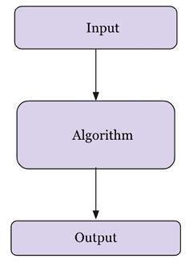
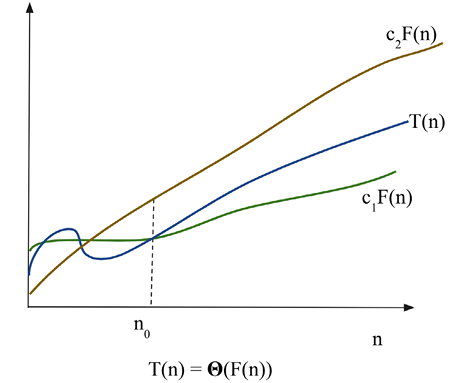
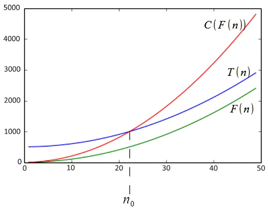
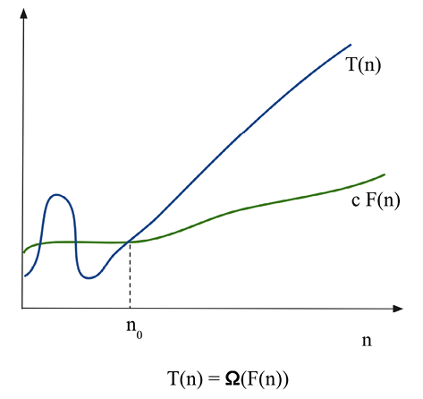

# 算法设计导论

本章的目标是理解设计算法的原则，以及分析算法在解决实际问题中的重要性。 给定输入数据，算法是应按顺序执行以解决给定问题的一组逐步指令。

在本章中，我们还将学习如何比较不同的算法并确定给定用例的最佳算法。 对于一个给定的问题，可能有多种可能的正确解法，例如，对于 n 个数值的排序问题，我们可以有多种算法。 因此，没有一种算法可以解决任何现实世界的问题。

在本章中，我们将研究以下主题：

- 算法介绍
- 算法的性能分析
- 渐近符号
- 摊销分析
- 选择复杂度等级
- 计算算法的运行时间复杂度

## 算法介绍

算法是为完成给定任务/问题而应遵循的一系列步骤。

它是一个定义明确的过程，可以获取输入数据、对其进行处理并生成所需的输出。 图 2.1 显示了这种情况。



图 2.1：算法简介

下面总结了一些研究算法的重要原因：

- 计算机科学与工程必备
- 在许多其他领域(如计算生物学、经济学、生态学、通信、生态学、物理学等)中很重要
- 他们在技术创新中发挥作用
- 他们提高解决问题和分析思维的能力

在解决给定问题时，有两个方面是最重要的。 首先，我们需要一种有效的机制来存储、管理和检索数据，这是解决问题所必需的(属于数据结构)； 其次，我们需要一种有效的算法，它是解决该问题的有限指令集。 因此，数据结构和算法的研究是使用计算机程序解决任何问题的关键。 一个高效的算法应该具备以下特点：

- 它应该尽可能具体
- 它应该正确定义每条指令
- 不应有任何含糊不清的指示
- 算法的所有指令都应该在有限的时间内和有限的步骤中执行
- 它应该有明确的输入和输出来解决问题
- 算法的每条指令在解决给定问题时都应该是不可或缺的

考虑一个算法(类比)的例子来完成我们日常生活中的任务； 让我们以准备一杯茶为例。 准备一杯茶的算法可以包括以下步骤：

1. 将水倒入锅中
2. 将平底锅放在炉子上并点燃炉子
3. 在温水中加入碎姜
4. 将茶叶加入锅中
5. 加牛奶
6. 当它开始沸腾时，加入糖
7. 2-3分钟后，即可上茶

上述程序是泡茶的可能方法之一。 同样，现实世界问题的解决方案可以转化为算法，可以使用编程语言将其开发为计算机软件。 由于对于给定的问题可能有多种解决方案，因此在使用软件实现时应该尽可能高效。 给定一个问题，可能有不止一种正确的算法，定义为能够为所有有效输入值准确产生所需输出的算法。 执行不同算法的成本可能不同； 它可以根据在计算机系统上运行算法所需的时间及其所需的内存空间来衡量。

在设计高效算法时，主要应牢记两点：

1. 该算法应该是正确的，并且应该为所有有效输入值产生预期的结果
2. 该算法应该是最佳的，因为它应该在所需的时间限制内在计算机上执行，符合最佳的内存空间要求

算法的性能分析对于确定给定问题的最佳解决方案非常重要。 如果一个算法的性能在期望的时间和空间要求之内，那么它就是最优的。 评估算法性能的最流行和最常见的方法之一是通过分析其复杂性。 对算法的分析有助于我们确定哪一种算法在消耗的时间和空间方面最有效。

## 算法的性能分析
算法的性能通常由其输入数据的大小 n 以及算法使用的时间和内存空间来衡量。 所需时间由算法要执行的关键操作(例如比较操作)来衡量，其中关键操作是在执行过程中花费大量时间的指令。 而算法的空间需求是通过在程序执行期间存储变量、常量和指令所需的内存来衡量的。

### 时间复杂度

算法的时间复杂度是算法在计算机系统上执行以产生输出所花费的时间。 分析算法的时间复杂度的目的是，对于给定的问题和多个算法，确定哪一种算法在执行所需时间方面最有效。 算法所需的运行时间取决于输入大小； 随着输入大小 n 的增加，运行时间也会增加。 输入大小以输入中的数据项数来衡量，例如，排序算法的输入大小将是输入中的数据项数。 因此，与输入大小为 50 的列表相比，排序算法对输入大小为 5,000 的列表进行排序的运行时间会增加。

算法针对特定输入的运行时间取决于算法中要执行的关键操作。 例如，排序算法的关键操作是比较操作，与赋值或任何其他操作相比，它将占用大部分运行时间。 理想情况下，这些关键操作不应依赖于硬件、操作系统或用于实现算法的编程语言。

执行每一行代码需要一定的时间； 但是，每一行可能需要不同的时间来执行。 为了理解算法所需的运行时间，以下面的代码为例：

```python
if n==0 || n == 3             # constant time       c1
  print("data")				  # c2
else:						  # c3
  for i in range(             # loop run for n times  c4
     print("structure")       # c5
```

这里，在上面示例的语句 1 中，如果条件为真，则打印```data```，如果条件不为真，则 ```for``` 循环将执行 ```n``` 次。 算法所需要的时间取决于每条语句所需要的时间，以及一条语句执行了多少次。 算法的运行时间是所有语句所需时间的总和。 对于上面的代码，假设语句 ```1``` 花费了 ```c1``` 时间，语句 ```2``` 花费了 ```c2``` 时间，依此类推。 所以，如果第 ```i``` 条语句花费的时间为常数 ```ci```，如果第 ```i``` 条语句执行 ```n``` 次，那么它将花费 $c_in$ 时间。 对于给定的 ```n``` 值(假设 ```n``` 的值不为零或三)，算法的总运行时间 $T(n)$ 如下所示。

$$
T(n) = c_1 + c_3 + c_4 x n + c_5 x n
$$
如果 ```n``` 的值等于 ```0``` 或 ```3```，则算法所需的时间如下。

$$
T(n) = c_1 + c_2
$$
因此，算法所需的运行时间除了取决于给定输入的大小之外，还取决于给定的输入是什么。 对于给定的示例，最好的情况是输入为零或三时，在这种情况下，算法的运行时间将是恒定的。 在最坏的情况下，```n``` 的值不等于 ```0``` 或 ```3```，则算法的运行时间可以表示为 $a * n + b$。 这里，```a``` 和 ```b``` 的值是取决于语句成本的常量，并且在最终时间复杂度中不考虑常量时间。 在最坏的情况下，算法所需的运行时间是 ```n``` 的线性函数。

让我们考虑另一个例子，线性搜索：

```python
def linear_search(input_list, element):
    for index, value in enumerate(input_list):
        if value == element:
            return index
        
    return -1
input_list = [3, 4, 1, 6, 14]  
element = 4
print("Index position for the element x is:", linear_search(input_list,element))
```

此实例中的输出将如下所示：

```python
Index position for the element x is: 1
```

算法的最坏情况运行时间是上限复杂度； 它是算法针对任何给定输入执行所需的最大运行时间。 最坏情况时间复杂度非常有用，因为它保证对于任何输入数据，与最坏情况运行时间相比，所需的运行时间不会花费更多时间。 例如，在线性搜索问题中，最坏情况发生在要搜索的元素在上次比较中找到或者在列表中没有找到。 在这种情况下，所需的运行时间将线性取决于列表的长度，而在最好的情况下，将在第一次比较中找到搜索元素。

平均情况运行时间是算法执行所需的平均运行时间。 在此分析中，我们计算所有可能输入值在运行时间内的平均值。 通常，概率分析用于分析算法的平均情况运行时间，它是通过对所有可能输入的分布的成本求平均来计算的。 例如，在线性搜索中，如果在第 ```0``` 个索引处找到要搜索的元素，则所有位置的比较次数都为```1```； 类似地，对于在 ```1、2、3、... (n-1)``` 个索引位置找到的元素，比较的次数分别为 ```2```、```3``` 次，直到 ```n```。 因此，平均情况下的运行时间如下。

$$
T(n) = \frac{1+2+3+\cdots +n}{n} = \frac{n(n+1)}{2n}  
$$
对于平均情况，所需的运行时间也与 ```n``` 的值线性相关。 然而，在大多数实际应用中，大多使用最坏情况分析，因为它保证运行时间不会比任何输入值的算法的最坏情况运行时间更长。

最佳情况运行时间是算法运行所需的最短时间； 它是算法所需运行时间的下限； 在上面的示例中，输入数据的组织方式使得执行给定算法所需的运行时间最少。

### 空间复杂度

该算法的空间复杂度估计了在计算机上执行它以产生作为输入数据函数的输出的内存需求。 算法的内存空间要求是用于决定其效率的标准之一。 在计算机系统上执行算法时，需要存储输入以及数据结构中的中间和临时数据，这些数据存储在计算机的内存中。 为了编写针对任何问题的编程解决方案，需要一些内存来存储变量、程序指令和在计算机上执行程序。 算法的空间复杂度是执行和产生结果所需的内存量。

要计算空间复杂度，请考虑以下示例，其中，给定整数值列表，函数返回相应整数的平方值。

```python
def squares(n):
    square_numbers = []
    for number in n:
        square_numbers.append(number * number)
    return square_numbers
 
nums = [2, 3, 5, 8 ]
print(squares(nums))
```

代码的输出是：

```python
[4, 9, 25, 64]
```

在上面的代码中，算法将需要为输入列表中的数据项数分配内存。 假设输入中的元素个数为n，那么空间需求随着输入大小的增加而增加，因此，算法的空间复杂度变为$O(n)$。

给定两种算法来解决给定问题，在所有其他要求相同的情况下，可以认为需要较少内存的算法更有效。 例如，假设有两种搜索算法，一种具有 $O(n)$，另一种算法具有 $O(nlogn)$ 空间复杂度。 就空间要求而言，与第二种算法相比，第一种算法是更好的算法。 空间复杂度分析对于了解算法的效率很重要，特别是对于内存空间要求高的应用程序。

当输入大小足够大时，增长顺序也变得很重要。 在这种情况下，我们研究算法的渐近效率。 通常，渐近有效的算法被认为是适用于大尺寸输入的更好算法。 在下一节中，我们将研究渐近符号。

## 渐近符号
要分析算法的时间复杂度，当输入规模很大时，增长率(增长阶数)非常重要。 当输入规模变大时，我们只考虑高阶项而忽略无关紧要的项。 在渐近分析中，我们分析了考虑高阶增长并忽略乘法常数和低阶项的大输入规模算法的效率。

我们根据输入大小而不是实际运行时间来比较两种算法，并测量所花费的时间如何随着输入大小的增加而增加。 与其他算法相比，渐近效率更高的算法通常被认为是更好的算法。 以下渐近符号通常用于计算算法的运行时间复杂度：

- ```θ``` 表示法：它表示具有严格界限的最坏情况下的运行时间复杂度。
- ```O``` 符号：它表示具有上限的最坏情况运行时间复杂度，这确保函数的增长速度永远不会超过上限。
- ```Ω``` 符号：它表示算法运行时间的下限。 它测量执行算法的最佳时间。

### Theta 表示法

以下函数描述了时间复杂度部分中讨论的第一个示例的最坏情况下的运行时间：
$$
T(n) = c_1 + c_3 * n + c_5 * n
$$
这里，对于较大的输入大小，最坏情况下的运行时间将为 $ϴ(n)$(发音为 ```n``` 的 ```theta```)。 我们通常认为一种算法比另一种算法更有效，前提是其最坏情况运行时间的增长阶数较低。 由于常数因子和低阶项，运行时间具有较高阶增长的算法可能比运行时间具有较低阶增长的算法花费更少的时间来处理小输入。 例如，一旦输入大小 ```n``` 变得足够大，与插入排序相比，归并排序算法的性能更好，最坏情况下的运行时间分别为 $\Theta (logn)$ 和 $\Theta (n^2)$。

```Theta``` 符号 ($\Theta $) 表示具有紧界的算法的最坏情况运行时间。 对于给定的函数 ```F(n)```，渐近最坏情况运行时间复杂度可以定义如下。
$$
T(n) = \Theta (F(n)) 
$$
当且仅当存在常量 $n_0$、$c_1$ 和 $c_2$ 使得：

$$
0 \le c_1(F(n)) \le T(n) \le c_2(F(n))\ for\ all\ n \ge n_0
$$
如果存在正常数 $c_1$ 和 $c_2$ 使得 $T(n)$ 的值始终位于 $c_1F(n)$ 和 $c_2F(n)$ 之间，则函数 $T(n)$ 属于一组函数 $\Theta(F(n))n$ 的所有大值。 如果这个条件为真，那么我们说 $F(n)$ 是 $T(n)$ 的渐近紧界。

图 2.2 显示了 ```theta``` 符号 ($\Theta$) 的图形示例。 从图中可以看出，当 $n$ 大于 $n_0$ 时，$T(n)$ 的值总是介于 $c_1F(n)$ 和 $c_2F(n)$ 之间。



图 2.2：```theta``` 符号 ($\Theta$) 的图形示例

让我们考虑一个例子，以了解给定函数的 ```theta``` 符号的正式定义在最坏情况下的运行时间复杂度应该是多少：

$$
f(n) = n^2+n\ is\ \theta \ n_2
$$
为了用 $\Theta$ 符号定义确定时间复杂度，我们必须首先确定常数 $c_1$、$c_2$、$n_0$，以便

$$
0 \le c_1 * n^2 \le n^2+n\le c_2 * n^2\ for\ all\ n\ge n_0
$$
除以 $n_2$ 将产生：

$$
0 \le c_1 \le 1 + \frac{1}{n} \le c_2\ for\ all\ n\ge n_0  
$$
通过选择 $c_1 = 1$、$c_2 = 2$ 和 $n_0 = 1$，以下条件可以满足 ```theta``` 符号的定义。

$$
0 \le n^2 \le n^2 + n \le 2n^2\ for\ all\ n\ge 1  
$$
这给出了：

$$
f(n) = \theta (g(n)),\ means\ f(n) = \theta (n^2)
$$
考虑另一个例子来找出另一个函数的渐近紧界 ($\Theta$)：

$$
f(n) = \frac{n^2}{2} + \frac{n}{2} 
$$
为了确定常数 $c_1$、$c_2$ 和 $n_0$，使它们满足条件：

$$
0 \le c_1 * n^2 \le \frac{n^2}{2}\le c_2 * n^2,\ for\ all\ n \ge n_0
$$
通过选择 $c_1 = 1/5$，$c_2 =1$，$n_0 = 1$，以下条件可以满足 ```theta``` 符号的定义：

$$
0 \le \frac{n^2}{5} \le \frac{n^2}{2} + \frac{n}{2} \le n^2,\ for\ all\ the\ values\ of\ n \ge 1 \\\Longrightarrow \frac{n^2}{2} + \frac{n}{2} = \theta (n^2)\ with\ c_1= \frac{1}{5}\ and\ c_2 = 1\ and\ n_0=1
$$
所以，以下是正确的：

$$
f(n) = \frac{n^2}{2} + \frac{n}{2} = \theta (n^2)  
$$
它表明，根据 ```theta``` 符号的定义，给定函数具有 $\Theta(n^2)$ 的复杂性。

因此，```theta``` 表示法为算法的时间复杂度提供了严格的限制。 在下一节中，我们将讨论大 O 表示法。

### 大 O 表示法
我们已经看到，```theta``` 表示法是从函数的上界和下界渐近界定的，而 大 ```O``` 表示法表征了最坏情况下的运行时间复杂度，它只是函数的渐近上界。 大 ```O``` 符号定义如下。 给定函数 ```F(n)```，```T(n)``` 是函数 ```F(n)``` 的大 ```O```，我们定义如下：

$$
T(n) = O(F(n))
$$
当且仅当存在常量 $n_0$ 和 $c$ 使得：

$$
T(n) \le c(F(n))\ for\ all\ n\ge n_0
$$
在大 ```O``` 表示法中，```F(n)``` 的常数倍数是 ```T(n)``` 上的渐近上界，并且正常数 $n_0$ 和 $c$ 应该以这样的方式存在，即所有大于 $n_0$ 的 $n$ 值总是落在或低于 函数 $c*F(n)$。

此外，我们只关心在 $n$ 值较高时会发生什么。 变量 $n_0$ 代表阈值，低于该阈值的增长率并不重要。 图 2.3 中的绘图显示了具有不同 ```n``` 值的函数 $T(n)$ 的图形表示。 我们可以看到 $T(n) = n^2 + 500 = O(n^2)$，其中 $c = 2$，$n_0$ 约为 $23$。



图 2.3：大 ```O``` 表示法的图形示例

在大 ```O``` 表示法中，$O(F(n))$ 实际上是一组函数，包括所有具有与 $F(n)$ 相同或更小增长率的函数。 例如，$O(n^2)$ 还包括 $O(n)$、$O(log n)$ 等。 然而，大 $O$ 符号应该尽可能接近地表征函数，例如，函数 $F(n) = 2n^3+2n^2+5$ 确实是 $O(n^4)$，但是更准确的是 $F(n)$ 是 $O(n^3)$。

在下表中，我们按从低到高的顺序列出了最常见的增长率。

| 时间复杂度 |   Name   |
| :--------: | :------: |
|   $O(1)$   |   常数   |
| $O(logn)$  |   对数   |
|   $O(n)$   |  线性的  |
| $O(nlogn)$ | 线性对数 |
|  $O(n^2)$  |  二次方  |
|  $O(n^3)$  |  三次方  |
|  $O(2^n)$  |  指数型  |

使用大 $O$ 表示法，可以通过分析算法的结构来计算算法的运行时间。 例如，算法中的双嵌套循环将有一个 $O(n^2)$ 的最坏情况运行时间的上限，因为 ```i``` 和 ```j``` 的值最多为 ```n```，并且两个循环都将运行 $n^2$ 次 如下例代码所示：

```python
for i in range(n): 
    for j in range(n): 
        print("data")
```

让我们考虑几个示例，以便使用大 $O$ 表示法计算函数的上界：

1. 找到函数的上限：
   $$T(n) = 2n + 7$$
    解决方案：使用大 ```O``` 表示法，上界的条件是：
   $$T(n) <= c * F(n)$$
    此条件适用于 $n > 7$ 和 $c=3$ 的所有值。
    $2n + 7 <= 3n$ 这适用于所有 $n$ 值，其中 $c=3$，$n_0=7$
   $$T(n) = 2n+7 = O(n)$$
2. 求函数 $T(n) =2n+5$ 的 $F(n)$，使得 $T(n) = O(F(n))$。
   解决方案：使用大 ```O``` 表示法，上界的条件是 $T(n) <=c * F(n)$。
   因为，对于所有 $n ≥ 5$，$2n+5 ≤ 3n$。
   对于 $c=3$，$n_0=5$，条件为真。
   $2n + 5 ≤ O(n)$
   $F(n) = n$

3. 求函数 $T(n) = n^2 +n$ 的 $F(n)$，使得 $T(n) = O(F(n))$。
   解决方案：使用大 ```O``` 表示法，因为 $n^2+ n ≤ 2n^2$，对于所有 $n ≥ 1(c = 2，n_0=2)$
   $n^2+ n≤O(n^2)$
   $F(n) = n^2$

4. 证明 $f(n) =2n^3 - 6n ≠ O(n^2)$。
   解：很明显，$2n^3-6n ≥ n^2$，因为 $n ≥ 2$。所以 $2n^3 - 6n ≠ O(n^2)$ 不可能成立。

5. 证明：$20n^2+2n+5 = O(n^2)$。
解决方案：很明显：
$20n^2 + 2n + 5 <= 21n^2$ 对于所有 $n > 4$(让 $c = 21$ 和 $n_0 = 4$)
$n^2 > 2n + 5$ 对于所有 $n > 4$
因此，复杂度为 $O(n^2)$。

因此，大 ```O``` 表示法为函数提供了上限，这确保函数的增长速度永远不会超过上限函数。 在下一节中，我们将讨论 ```Omega``` 表示法。

### Ω符号
```Omega``` 符号 ($Ω$) 描述算法的渐近下界，类似于大 ```O``` 符号描述上限的方式。 ```Omega``` 表示法计算算法的最佳运行时复杂度。 $Ω$ 符号$(Ω(F(n))$ 发音为 ```omega of F of n```)，是一组函数，其中存在正常数 $n_0$ 和 $c$，使得对于大于 $n_0$ 的所有 $n$ 值，$T (n)$ 总是位于或高于 $c*F(n)$ 的函数。
$$
T(n) = Ω (F(n))
$$
如果常数 $n_0$ 和 $c$ 存在，则：

$$
0 \le c(F(n)) \le T(n),\ for\ all\ n\ge n_0
$$
图 2.4 显示了欧米茄 ($Ω$) 符号的图形表示。 从图中可以看出，对于 $n$ 大于 $n_0$ 的值，$T(n)$ 的值始终位于 $cF(n)$ 以上。



图 2.4：Ω 符号的图形表示

如果算法的运行时间为 $Ω(F(n))$，则意味着对于足够大的输入大小 ($n$)，算法的运行时间至少是 $F(n)$ 的常数倍数。 $Ω$ 表示法给出了给定算法的最佳运行时间复杂度的下限。 这意味着给定算法的运行时间至少为 $F(n)$，而不取决于输入。

为了理解 $Ω$ 符号以及如何计算算法的最佳运行时复杂度的下限：

1. 求函数 $T(n) =2n^2 +3$ 的 $F(n)$，使得 $T(n) = Ω(F(n))$。
   解决方案：使用 $Ω$ 表示法，下界的条件是：
   $$c*F(n) ≤ T(n)$$
   此条件适用于所有大于 $0$ 且 $c=1$ 的 $n$ 值。
   $$0 ≤ cn^2 ≤ 2n^2 +3$$，对于所有 $n ≥ 0$
   $2n^2 +3 = Ω(n^2)$
   $F(n)=n^2$
2. 找出 $T(n) = 3n^2$ 的下界。
   解决方案：使用 $Ω$ 表示法，下界的条件是：
   $c*F(n) ≤ T(n)$
   考虑 $0 ≤ cn^2 ≤ 3n^2$。 $Ω$ 符号的条件适用于所有大于 1 且 $c=2$ 的 $n$ 值。
   $cn^2 ≤ 3n^2$(对于 $c = 2$ 和 $n_0 = 1$)
   $3n^2 = Ω(n^2)$
3. 证明 $3n = Ω(n)$。
   解决方案：使用 $Ω$ 表示法，下界的条件是：
   $c*F(n) ≤ T(n)$
   考虑 $0 ≤ c*n ≤ 3n$。 $Ω$ 符号的条件适用于所有大于 1 且 $c=1$ 的 $n$ 值。
   $cn^2 ≤ 3n^2$(对于 $c = 2$ 和 $n_0 = 1$)
   $3n = Ω(n)$

$Ω$ 符号用于描述算法对于大输入尺寸至少需要一定的运行时间。 在下一节中，我们将讨论摊销分析。

## 摊销分析
在算法的摊销分析中，我们将执行一系列操作所需的时间与算法的所有操作进行平均。 这称为摊销分析。 当我们对单个操作的时间复杂度不感兴趣但对操作序列的平均运行时间感兴趣时，摊销分析很重要。 在算法中，每个操作需要不同的时间来执行。 某些操作需要大量的时间和资源，而某些操作根本不昂贵。 在摊销分析中，我们分析算法时同时考虑成本高和成本低的操作，以便分析所有操作序列。 因此，考虑到所有操作的完整序列的成本，摊销分析是最坏情况下每个操作的平均性能。 摊销分析不同于平均案例分析，因为不考虑输入值的分布。 摊销分析给出了最坏情况下每个操作的平均性能。

摊销分析常用的方法有以下三种：

- 聚合分析。 在聚合分析中，摊销成本是所有操作序列的平均成本。 对于给定的 n 个操作序列，可以通过将 n 个操作的总成本的上限除以 n 来计算每个操作的摊销成本。
- 记账法。 在会计方法中，我们为每个操作分配一个摊余成本，这可能与它们的实际成本不同。 在这种情况下，我们对序列中的早期操作征收额外费用，并节省"信用成本"，用于支付序列中后期的昂贵操作。
- 潜在法。 潜在法就像记账法。 我们确定每个操作的摊销成本，并对序列中稍后可能使用的早期操作征收额外费用。 与核算法不同，势能法是将多收的信用作为数据结构整体的"势能"进行累积，而不是为单个操作存储信用。

在本节中，我们概述了摊销分析。 现在我们将在下一节中通过示例讨论如何计算不同函数的复杂性。

## 组成复杂类

通常，我们需要找到复杂操作和算法的总运行时间。 事实证明，我们可以组合简单操作的复杂类来找到更复杂的组合操作的复杂类。 目标是分析函数或方法中的组合语句，以了解执行多个操作的总时间复杂度。 组合两个复杂度类别的最简单方法是将它们相加。 当我们有两个顺序操作时会发生这种情况。 例如，考虑将一个元素插入列表然后对该列表进行排序这两个操作。 假设插入一个 ```item``` 发生在$O(n)$时间，排序发生在 $O(nlogn)$ 时间，那么我们可以将总时间复杂度写为 $O(n + nlogn)$； 也就是说，我们根据大 $O$ 计算将这两个函数带入 $O(...)$。 仅考虑最高阶项，最终的最坏情况复杂度变为 $O(nlogn)$。

如果我们重复一个操作，例如在 ```while``` 循环中，那么我们将复杂度等级乘以该操作执行的次数。 如果时间复杂度为 $O(f(n))$ 的操作被重复 $O(n)$ 次，那么我们将两个复杂度相乘：$O(f(n) * O(n)) = O(nf(n))$。 例如，假设函数 $f(n)$ 的时间复杂度为$O(n^2)$，在 ```for``` 循环中执行了 ```n``` 次，如下：

```python
for i in range(n):
    f(...)
```

上述代码的时间复杂度变为：

$$
O(n^2) x O(n) = O(n x n^2) = O(n^3)
$$
在这里，我们将内部函数的时间复杂度乘以该函数执行的次数。 循环的运行时间至多是循环内语句的运行时间乘以迭代次数。 单个嵌套循环，即一个循环嵌套在另一个循环中，将运行 $n^2$ 次，例如以下示例：

```python
for i in range(n):
    for j in range(n)
        # statements
```

如果语句的每次执行都需要常数时间 $c$，即 $O(1)$，执行 $n x n$ 次，我们可以将运行时间表示为：

$$
c * n * n = c * n^2 = O(n^2)
$$
对于嵌套循环中的连续语句，我们将每个语句的时间复杂度相加并乘以该语句的执行次数——例如以下代码：

```python
def fun(n):
    for i in range(n):  # executes n times
        print(i)  # c1
    for _ in range(n):
        for j in range(n):
            print(j)  # c2
```

这可以写成：$c^1n + c^2 * n^2 = O(n^2)$。

我们可以定义(以 2 为底)对数复杂度，在常数时间内将问题的大小减少一半。 例如，考虑以下代码片段：

```python
i = 1
while i <= n:
    i = i * 2
    print(i)
```

请注意，我在每次迭代中加倍。 如果我们在 ```n = 10``` 的情况下运行这段代码，我们会看到它打印出四个数字：```2、4、8 和 16```。如果我们将 ```n``` 加倍，我们会看到它打印出五个数字。 随后 ```n``` 每次加倍，迭代次数仅增加 ```1```。如果我们假设循环有 ```k``` 次迭代，则 ```n``` 的值将为 ```2n```。 我们可以这样写：

$$
log_2(2^k)=log_2(n)\\ klog_2(2)=log_2(2)\\ k=log(n)
$$
由此可知，上述代码的最坏情况运行时复杂度等于 $O(log(n))$。

在本节中，我们看到了计算不同函数的运行时间复杂度的示例。 在下一节中，我们将通过示例来了解如何计算算法的运行时间复杂度。

## 计算算法的运行时间复杂度

要根据算法的最佳、最差和平均情况运行时间来分析算法，并不总是可以为每个给定的函数或算法计算这些。 然而，了解算法在实际情况下的上限最坏情况运行时复杂度始终很重要； 因此，我们专注于计算上限大 $O$ 符号来计算算法的最坏情况运行时复杂度：

找出以下 ```Python``` 片段的最坏情况下的运行时复杂度：

```python
# loop will run n times
for _ in range(n):
    print("data")  #constant time
```

解决方案： 循环的运行时间，一般来说，就是循环中所有语句所用的时间乘以迭代次数。 在这里，总运行时间定义如下：

$$
T(n) = 恒定时间\\ (c) * n = c*n = O(n)
$$
找出以下 ```Python``` 片段的时间复杂度：

```python
for _ in range(n): 
    for _ in range(n):  # This loop will also run for n times
        print("run")
```

解决方案：$O(n^2)$。 ```print``` 语句会执行$n^2$次，```n```次是内循环，外循环的每一次迭代，都会执行内循环。

找出以下 ```Python``` 片段的时间复杂度：

```python
for _ in range(n):
    for _ in range(n):
        print("run fun")
        break
```

解决方案：最坏情况下的复杂度为 $O(n)$，因为打印语句将运行 ```n``` 次，因为内部循环由于 ```break``` 语句而只执行一次。

找出以下 ```Python``` 片段的时间复杂度：

```python
def fun(n):
    for _ in range(n):
        print("data")  # constant time
    # outer loop execute for n times
    for _ in range(n):
        for _ in range(n):
            print("run fun")  # constant time
```

解决方案：这里，```print``` 语句将在第一个循环中执行 ```n``` 次，在第二个嵌套循环中执行 $n^2$ 次。 在这里，所需的总时间定义如下：

$$
T(n) = constant\ time (c_1) * n + c^2*n*n
$$

$$
c_1 n + c_2 n^2 = O(n^2)
$$

找出以下 ```Python``` 片段的时间复杂度：

```python
if  n == 0:     # constant time
    print("data")
else: 
    for i in range(n):    # loop run for n times
        print("structure")
```

解决方案：$O(n)$。 在这里，最坏情况下的运行时复杂度将是执行所有语句所需的时间； 即执行 ```if-else``` 条件和 ```for``` 循环所需的时间。 所需时间定义如下：

$$
T(n) = c_1 + c_2 n = O(n)
$$
找出以下 ```Python``` 片段的时间复杂度：

```python
i = 1
j = 0
while i*i < n: 
    j = j +1 
    i = i+1 
    print("data")
```

解决方案：$O(\sqrt{n} )$。 循环将根据 ```i``` 的值终止； 循环将根据条件进行迭代：

$$
i_2 \le n
$$

$$
T(n) = O(\sqrt{n} )
$$

找出以下 ```Python``` 片段的时间复杂度：

```python
i = 0
for i in range(int(n/2), n):
    j = 1
    while j+n/2 <= n:
        k = 1
        while k < n:
            k *= 2
            print("data")
            j += 1
```

解决方案：这里，外层循环会执行$n/2$次，中间循环也会执行$n/2$次，最内层循环会执行$log(n)$次。 因此，总运行时间复杂度为 $O(n*n*logn)$：

$$O(n^2logn)$$

## 概括

在本章中，我们概述了算法设计。 算法的研究很重要，因为它训练我们非常具体地思考某些问题。 通过隔离问题的组成部分并定义它们之间的关系，有利于提高我们解决问题的能力。 在本章中，我们讨论了分析算法和比较算法的不同方法。 我们还讨论了渐近符号，即：大 $Ω$、$Ω$ 和 $θ$ 符号。

在下一章中，我们将讨论算法设计技术和策略。

## 练习

找出以下 ```Python``` 片段的时间复杂度：

```python
i = 1
while(i < n):
    i *= 2
    print("data")
```

```python
i =n
while(i > 0):
    print('complexity')
    i /= 2
```

```python
for i in range(1, n):
    j = i
    while(j < n):
        j *= 2
```

```python
i = 1
while(i < n):
    print('python')
        i = i ** 2
```