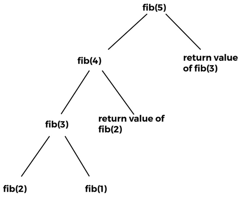
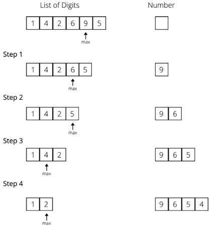
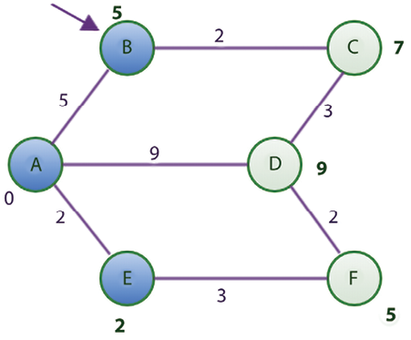
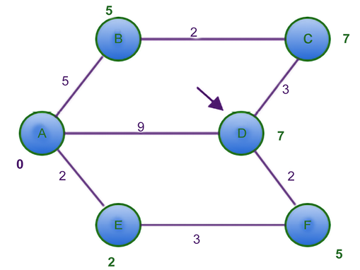

# 算法设计技术和策略

在计算领域，算法设计对于 IT 专业人员提高技能和促进行业发展非常重要。 算法设计过程从大量现实世界的计算问题开始，这些问题必须明确表述，以便使用可用的算法设计技术范围中的一种可能技术有效地构建解决方案。 算法世界包含过多的技术和设计原则，需要掌握这些技术和设计原则才能解决该领域中更困难的问题。 算法设计在计算机科学中很重要，一般而言，算法设计可以有效地为精确制定的问题设计解决方案，因为可以使用适当的算法设计技术轻松解决非常复杂和复杂的问题。

在本章中，我们将讨论对不同种类的算法进行分类的方法。 将描述和说明设计技术，我们将进一步讨论算法分析。 最后，我们将提供一些非常重要的算法的详细实现。

在本章中，我们将研究以下算法设计技术：

- 分而治之
- 动态规划
- 贪心算法

## 算法设计技巧
算法设计是一种强大的工具，可用于查看和清楚地理解适定的现实世界问题。 对于许多问题，有一种非常简单但有效的直接方法或蛮力方法。 蛮力方法正在尝试所有可能的解决方案组合以解决任何问题。 例如，假设一名销售人员要走访全国 ```10``` 个城市。 应该按什么顺序访问这些城市才能使总行进距离最小化？ 解决这个问题的蛮力方法是计算所有可能的路线组合的总距离，然后选择提供最小距离的路线。

你可能会猜到，蛮力算法效率不高。

它可以为有限的输入大小提供有用的解决方案，但是当输入大小变大时它变得非常低效。 因此，我们将这个过程分解为两个基本组成部分，以找到计算问题的最佳解决方案：

1. 清楚地表述问题
2. 根据问题的结构确定适当的算法设计技术以获得有效的解决方案

这就是为什么在开发可扩展和健壮的系统时，算法设计的研究变得非常重要。 设计和分析首先很重要，因为它们有助于开发有组织且易于理解的算法。 设计技术指南还有助于针对复杂问题轻松开发新算法。 此外，还可以使用设计技术对算法进行分类，这也有助于更好地理解它们。 算法范式有如下几种：

- 递归
- 分而治之
- 动态规划
- 贪心算法

由于我们在讨论不同的算法设计技术时会多次使用递归，所以让我们先了解递归的概念，然后再讨论不同的算法设计技术。

## 递归
递归算法反复调用自身以解决问题，直到满足特定条件。 每个递归调用本身都会衍生出其他递归调用。 递归函数可以处于无限循环中； 因此，要求每个递归函数都遵守某些属性。 递归函数的核心是两种情况：

1. 基本情况：这些告诉递归何时终止，这意味着一旦满足基本条件，递归就会停止
2. 递归情况：函数递归调用自身，我们朝着达到基本标准的方向前进

自然适用于递归解决方案的一个简单问题是计算阶乘。 递归阶乘算法定义了两种情况：当 ```n``` 为零时的基本情况（终止条件）和当 ```n``` 大于零时的递归情况（函数本身的调用）。 一个典型的实现如下：

```python
def factorial(n):
    # test for a base case
    if n == 0:
        return 1
    else:
        # make a calculation and a recursive call
        return n*factorial(n-1)


print(factorial(4))
```

这会产生以下输出：

```python
24
```

要计算 ```4``` 的阶乘，我们需要四次递归调用，加上初始父调用，如图 3.1 所示。 这些递归调用如何工作的细节如下。 最初，数字 ```4``` 被传递给阶乘函数，该函数将返回值 ```4``` 乘以 (```4-1=3```) 的阶乘。 为此，数字 ```3``` 再次传递给阶乘函数，该函数将返回值 ```3``` 乘以 (```3-1=2```) 的阶乘。 类似地，在下一次迭代中，值 ```2``` 乘以 (```2-1 =1```) 的阶乘。

这一直持续到我们到达 ```0``` 的阶乘，返回 ```1```。现在，每个函数返回值最终计算 ```1 * 1 * 2 * 3 * 4=24```，这是函数的最终输出。


图 3.1：阶乘 4 的执行流程

我们讨论了递归的概念，这对于理解不同算法范例的实现非常有用。 因此，现在让我们依次介绍不同的算法设计策略，从下一节的分而治之技术开始。

## 分而治之
解决复杂问题的重要而有效的技术之一是分而治之。 分而治之范式将问题分成更小的子问题，然后解决这些问题； 最后，它结合结果以获得全局最优解。 更具体地说，在分而治之的设计中，问题被分成两个较小的子问题，每个子问题都递归地解决。 合并部分解决方案以获得最终解决方案。 这是一种非常常见的问题解决技术，可以说是算法设计中最常用的方法。

分而治之设计技术的一些例子如下：

- 二分查找
- 合并排序
- 快速排序
- 快速乘法算法
- ```Strassen``` 的矩阵乘法
- 最近点对

让我们看一下二分查找和合并排序算法这两个示例，以了解分而治之设计技术的工作原理。

### 二分查找

二进制搜索算法基于分而治之的设计技术。 该算法用于从已排序的数据列表中查找给定数据。 它首先将搜索数据与列表的中间数据进行比较； 如果搜索数据小于中间数据，则丢弃大于中间数据的数据列表的一半； 该过程递归重复，直到找到搜索数据或我们到达列表的末尾。 值得注意的是，在每次迭代中，一半的搜索空间被丢弃，这提高了整体算法的性能，因为要搜索的数据更少。

以图3.2为例； 假设我们要在给定的已排序数据列表中搜索数据 ```4```。 列表在每次迭代中被分成两半； 使用分而治之策略，数据被搜索 $O(logn)$ 次。


图 3.2：使用二分查找算法查找数据的过程

用于在已排序的数据列表中搜索数据的 ```Python``` 代码如下所示：

```python
def binary_search(arr, start, end, key):
    while start <= end:
        mid = start + (end - start)/2
        if arr[mid] == key:
            return mid
        elif arr[mid] < key:
            start = mid + 1
        else:
            end = mid - 1
    return -1


arr = [4, 6, 9, 13, 14, 18, 21, 24, 38]
x = 13
result = binary_search(arr, 0, len(arr)-1, x)
print(result)
```

当我们在给定的数据列表中查找 ```13``` 时，上述代码的输出为 ```3```，即查找到的数据的位置。

在代码中，开始和结束索引给出了输入数组 ```[4, 6, 9, 13, 14, 18, 21, 24, 38]``` 的第一个和最后一个索引的位置。 存储在变量 ```key``` 中的待查找项首先与数组的中间数据匹配，然后我们丢弃一半列表并在另一半列表中查找该数据项。 迭代该过程，直到我们找到要搜索的数据项，或者我们到达列表的末尾，但我们没有找到该数据。

在最坏情况下分析二分搜索算法的工作原理时，我们可以看到，对于给定的 ```8``` 个数据的数组，在第一次不成功的尝试之后，列表减半，然后再次尝试不成功的搜索尝试，列表是长度为 ```2```，最后只剩下 ```1``` 个数据。 因此，二分搜索需要 ```4``` 次搜索。 如果列表的大小加倍，换句话说，到 ```16```，在第一次不成功的搜索之后，我们将有一个大小为 ```8``` 的列表，总共需要 ```4``` 次搜索。 因此，二分搜索算法将需要 ```5``` 次搜索才能找到包含 ```16``` 个数据项的列表。 因此，我们可以观察到，当我们将列表中的数据项数量加倍时，所需的搜索次数也会增加 ```1```。我们可以这样说，当我们有一个长度为 ```n``` 的列表时，所需的搜索总数将是 我们重复将列表减半的次数，直到剩下 ```1``` 个数据加 ```1```，这在数学上等同于 ($log_2 n + 1$)。 例如，如果 $n=8$，则输出将为 ```3```，这意味着所需的搜索次数将为 ```4```。每次迭代将列表分成两半； 采用分而治之的策略，二分查找算法的最坏情况时间复杂度为$O(log n)$。

合并排序是另一种基于分而治之设计策略的流行算法。 我们将在下一节中更详细地讨论归并排序。

### 合并排序

归并排序是一种按递增顺序对 $n$ 个自然数列表进行排序的算法。 首先，将给定的数据列表迭代地分成相等的部分，直到每个子列表包含一个数据，然后将这些子列表组合起来以按排序顺序创建一个新列表。 这种解决问题的编程方法基于分而治之的方法，强调需要将问题分解为与原始问题类型或形式相同的更小的子问题。 这些子问题分别求解，然后将结果组合起来得到原问题的解。

在这种情况下，给定一个未排序数据的列表，我们将该列表分成大约两半。 我们继续递归地将列表分成两半。

一段时间后，作为递归调用结果创建的子列表将只包含一个数据。 那时，我们开始在征服或合并步骤中合并解决方案。 这个过程如图3.3所示：


归并排序算法的实现主要使用两种方法实现，即 ```merge_sort``` 方法，递归地划分列表。 之后，我们将介绍 ```merge``` 方法来合并结果：

```python
def merge_sort(unsorted_list):
    if len(unsorted_list) == 1:
        return unsorted_list
    mid_point = int(len(unsorted_list)/2)
    first_half = unsorted_list[:mid_point]
    second_half = unsorted_list[mid_point:]
    half_a = merge_sort(first_half)
    half_b = merge_sort(second_half)
    return merge(half_a, half_b)
```

该实现首先将未排序的数据列表接受到 ```merge_sort``` 函数中。 ```if``` 语句用于建立基本情况，如果 ```unsorted_list``` 中只有一个数据，我们只需再次返回该列表。 如果列表中有多个数据，我们使用 ```mid_point = len(unsorted_list) // 2``` 找到近似中间。

使用这个 ```mid_point```，我们将列表分为两个子列表，即 ```first_half``` 和 ```second_half```：

```python
first_half = unsorted_list[:mid_point]
second_half = unsorted_list[mid_point:]
```

通过再次将两个子列表传递给 ```merge_sort``` 函数来进行递归调用：

```python
half_a = merge_sort(first_half)
half_b = merge_sort(second_half)
```

现在，对于合并步骤，```half_a``` 和 ```half_b``` 已排序。 当 ```half_a``` 和 ```half_b``` 都传完值后，我们调用 ```merge``` 函数，合并或组合存储在 ```half_a``` 和 ```half_b``` 中的两个解决方案，它们是列表：

```python
def merge(first_sublist, second_sublist):
    i = j = 0
    merged_list = []
    while i < len(first_sublist) and j < len(second_sublist):
        if first_sublist[i] < second_sublist[j]:
            merged_list.append(first_sublist[i])
            i += 1
        else:
            merged_list.append(second_sublist[j])
            j += 1
    while i < len(first_sublist):
        merged_list.append(first_sublist[i])
        i += 1
    while j < len(second_sublist):
        merged_list.append(second_sublist[j])
        j += 1
    return merged_list
```

```merge``` 函数接受我们要合并的两个列表，```first_sublist``` 和 ```second_sublist```。 ```i``` 和 ```j``` 变量被初始化为 ```0``` 并用作指针来告诉我们在合并过程中我们在两个列表中的位置。

最终的 ```merged_list``` 将包含合并后的列表。

```while``` 循环开始比较 ```first_sublist``` 和 ```second_sublist``` 中的数据：

```python
    while i < len(first_sublist) and j < len(second_sublist):
        if first_sublist[i] < second_sublist[j]:
            merged_list.append(first_sublist[i])
            i += 1
        else:
            merged_list.append(second_sublist[j])
            j += 1
```

```if``` 语句选择两者中较小的一个，```first_sublist[i]``` 或 ```second_sublist[j]```，并将其附加到 ```merged_list```。 ```i``` 或 ```j``` 索引递增以反映我们在合并步骤中的位置。 当任一子列表为空时，```while``` 循环停止。

```first_sublist``` 或 ```second_sublist``` 中可能遗留了数据。 最后两个 ```while``` 循环确保在返回之前将这些数据添加到 ```merged_list``` 中。 最后一次调用 ```merge(half_a, half_b)``` 将返回排序后的列表。 以下代码显示了如何传递一个数组以使用归并排序对数据进行排序：

```python
a= [11, 12, 7, 41, 61, 13, 16, 14] 
print(merge_sort(a))
```

输出将是：

```python
[7, 11, 12, 14, 16, 41, 61]
```

让我们通过合并两个子列表 ```[4, 6, 8]``` 和 ```[5, 7, 11, 40]``` 来试运行该算法，如表 3.1 所示。 在这个例子中，最初给出了两个排序的子列表，然后匹配第一个数据，并且由于第一个列表的第一个数据较小，它被移动到 ```merge_list```。 接下来，在步骤 2 中，再次匹配两个列表中的起始数据，并将第二个列表中较小的数据移至 ```merge_list```。 重复相同的过程，直到其中一个列表变空。

| Step | first_sublist | second_sublist | merged_list       |
| ---- | ------------- | -------------- | ----------------- |
| 0    | [4 6 8]       | [5 7 11 40]    | []                |
| 1    | [6 8]         | [5 7 11 40]    | [4]               |
| 2    | [6 8]         | [7 11 40]      | [4 5]             |
| 3    | [8]           | [7 11 40]      | [4 5 6]           |
| 4    | [8]           | [11 40]        | [4 5 6 7]         |
| 5    | []            | [11 40]        | [4 5 6 7 8]       |
| 6    | []            | []             | [4 5 6 7 8 11 40] |

这个过程也可以在图 3.4 中看到：


在其中一个列表变空之后，就像在本例中的第 ```4``` 步之后，在执行的这一点上，```merge``` 函数中的第三个 ```while``` 循环开始将 ```11``` 和 ```40``` 移动到 ```merged_list``` 中。 返回的 ```merged_list``` 将包含完全排序的列表。

合并排序的最坏情况运行时间复杂度将取决于以下步骤：

1. 首先，除法步骤将花费常数时间，因为它只计算中点，这可以在 $O(1)$ 时间内完成
2. 然后，在每次迭代中，我们递归地将列表分成两半，这将花费 $O(log n)$，这与我们在二进制搜索算法中看到的非常相似
3. 此外，组合/合并步骤将所有 ```n``` 个数据合并到原始数组中，这将花费 $(n)$ 时间。

因此，合并排序算法的运行时复杂度为 $O(log n) T(n) = O(n) * O(log n) = O(n log n)$。

我们已经借助几个例子讨论了分而治之算法设计技术。 在下一节中，我们将讨论另一种算法设计技术：动态规划。

## 动态规划

动态规划是解决优化问题的最强大的设计技术。 此类问题通常有许多可能的解决方案。 动态规划的基本思想是基于分而治之技术的直觉。 在这里，本质上，我们通过将问题分解为一系列子问题来探索所有可能解决方案的空间，然后组合结果来计算大问题的正确解决方案。 分而治之算法用于通过组合非重叠（不相交）子问题的解决方案来解决问题，而当子问题重叠时使用动态规划，这意味着子问题共享子问题 -子问题。 动态规划技术类似于分而治之，因为一个问题被分解成更小的问题。 然而，在分而治之中，每个子问题都必须先解决，然后才能将其结果用于解决更大的问题。 相比之下，基于动态规划的技术只解决每个子子问题一次，并且不会重新计算已经遇到的子问题的解决方案。 相反，它使用记忆技术来避免重新计算。

动态规划问题有两个重要特征：

- 最优子结构：给定任何问题，如果可以通过组合其子问题的解得到解，则称该问题具有最优子结构。 换句话说，最优子结构意味着问题的最优解可以从其子问题的最优解中得到。 例如，其系列中的第 ```i``` 个斐波那契数可以从第 ```(i-1)``` 个和第 ```(i-2)``` 个斐波那契数计算； 例如，可以从 ```fib(5)``` 和 ```fib(4)``` 计算出 ```fib(6)```。
- 重叠子问题：如果一个算法必须一次又一次地重复解决相同的子问题，那么这个问题就有重叠的子问题。 例如，```fib(5)``` 将对 ```fib(3)``` 和 ```fib(2)``` 进行多次计算。

如果问题具有这些特征，那么动态规划方法就很有用，因为可以通过重用之前计算的相同解决方案来改进实现。 在动态规划策略中，问题被分解成独立的子问题，中间结果被缓存，然后可以在后续操作中使用。

在动态方法中，我们将给定的问题分成更小的子问题。 同样在递归中，我们将问题划分为子问题。 然而，递归和动态规划之间的区别在于，类似的子问题可以解决任意多次，但在动态规划中，我们会跟踪以前解决的子问题，注意不要重新计算任何以前遇到的问题 子问题。 使问题成为用动态规划解决的理想候选问题的一个属性是它具有一组重叠的子问题。 一旦我们意识到子问题的形式在计算过程中已经重复了，我们就不需要重新计算它了。 相反，我们返回先前遇到的子问题的预计算结果。

动态规划考虑到每个子问题只应解决一次，并确保我们永远不会重新评估子问题，我们需要一种有效的方式来存储每个子问题的结果。 以下两种技术很容易获得：

- ```Top-down with memoization```：这种技术从初始问题集开始，并将其分成小的子问题。 在确定子程序的解决方案后，我们存储该特定子问题的结果。 以后遇到这个子问题，我们只返回它的预计算结果。 因此，如果可以使用子问题的解决方案递归地制定给定问题的解决方案，则可以轻松记住重叠子问题的解决方案。

记忆化意味着将子问题的解决方案存储在数组或哈希表中。 每当需要计算子问题的解时，如果已经计算过，则首先参考保存的值，如果未存储，则以通常的方式计算。 这个过程被称为 ```memoized```，这意味着它"记住"了之前计算过的操作的结果。

- 自下而上的方法：这种方法取决于子问题的"大小"。 我们先解决更小的子问题，然后在解决某个特定的子问题的同时，我们已经有了它所依赖的更小的子问题的解。 每个子问题只解决一次，每当我们尝试解决任何子问题时，所有先决条件较小的子问题的解决方案都是可用的，可以用来解决它。 在这种方法中，通过递归地将给定问题分解为子问题来解决给定问题，然后解决尽可能小的子问题。 此外，子问题的解决方案以自下而上的方式组合以得出更大子问题的解决方案，以便递归地达到最终解决方案。

让我们考虑一个例子来理解动态规划是如何工作的。 让我们使用动态规划解决斐波那契数列的问题。

### 计算斐波那契数列
斐波那契数列可以使用递归关系来证明。 递归关系是用于定义数学函数或序列的递归函数。 例如，下面的递推关系定义了斐波那契数列 ```[1, 1, 2, 3, 5, 8 ...]```：

```python
func(0) = 1 
func(1) = 1  
func(n) = func(n-1) + func(n-2) for n > 1
```

请注意，可以通过将 ```n``` 的值放入序列 ```[0, 1, 2, 3, 4, ...]``` 中来生成斐波那契数列。 我们举个例子来生成斐波那契数列到第五项：

```python
1 1 2 3 5
func(0) = 1 
func(1) = 1  
func(n) = func(n-1) + func(n-2) for n>1
```

生成序列的递归式程序如下：

```python
def fib(n):   
     if n <= 1:   
        return 1   
     else:  
        return fib(n-1) + fib(n-2)  
for i in range(5):
    print(fib(i))
```

这将产生如下输出：

```python
1
1
2
3
5
```

在此代码中，我们可以看到正在调用递归调用以解决问题。 当满足基本情况时，```fib()``` 函数返回 ```1```。如果 ```n``` 等于或小于 ```1```，则满足基本情况。 如果不满足基本情况，我们将再次调用 ```fib()``` 函数。 求解斐波那契数列第五项的递归树如图 3.5 所示：


图 3.5：```fib(5)``` 的递归树

我们可以从如图 3.6 所示的递归树的重叠子问题中观察到 ```fib(1)``` 的调用发生了两次，```fib(2)``` 的调用发生了三次， ```fib(3)``` 的调用发生了两次 . 同一个函数调用的返回值永远不会改变； 例如，无论何时调用 ```fib(2)```，它的返回值总是相同的。 同样，对于 ```fib(1)``` 和 ```fib(3)``` 也是一样的。 所以，它们是重叠的问题，因此，如果我们在遇到相同的函数时再次计算它，就会浪费计算时间。 这些对具有相同参数和输出的函数的重复调用表明存在重叠。 某些计算会在较小的子问题中重复出现。


图 3.6：```fib(5)``` 的递归树中显示的重叠子问题

在使用记忆技术的动态规划中，我们存储第一次遇到 ```fib(1)``` 的计算结果。 同样，我们存储 ```fib(2)``` 和 ```fib(3)``` 的返回值。 之后，每当我们遇到对 ```fib(1)```、```fib(2)``` 或 ```fib(3)``` 的调用时，我们只需返回它们各自的结果。 递归树图如图3.7所示：



图 3.7：```fib(5)``` 的递归树显示了已计算值的重用

因此，在动态规划中，我们已经消除了多次遇到 ```fib(3)```、```fib(2)``` 和 ```fib(1)``` 的需要。 这称为记忆技术，其中在将问题分解为子问题时不会重新计算重叠的函数调用。

因此，我们的 ```Fibonacci``` 示例中的重叠函数调用是 ```fib(1)```、```fib(2)``` 和 ```fib(3)```。 下面是斐波那契数列的基于动态编程的实现代码。

```python
def dyna_fib(n):
    if n == 0:
        return 0
    if n == 1:
        return 1  
    if lookup[n] is not None:
        return lookup[n]
  
    lookup[n] = dyna_fib(n-1) + dyna_fib(n-2)
    return lookup[n]


lookup = [None]*(1000)
 
for i in range(6): 
    print(dyna_fib(i))
```

这将产生如下输出：

```python
0
1
1
2
3
5
```

在斐波那契数列的动态实现中，我们将之前解决的子问题的结果存储在一个列表中（换句话说，就是本示例代码中的查找）。 我们首先检查是否已经计算了任何数字的斐波那契； 如果它已经被计算出来，那么我们从 ```lookup[n]``` 中返回存储的值。 否则，当我们计算它的值时，它是通过以下代码完成的：

```python
    if lookup[n] is not None:
        return lookup[n]
```

在计算出子问题的解后，它再次存储在查找列表中。 返回给定值的斐波那契数，如以下代码片段所示：

```python
lookup[n] = dyna_fib(n-1) + dyna_fib(n-2)
```


此外，为了存储 1,000 个数据的列表，我们使用 ```dyna_fib``` 函数创建一个列表查找：

```python
lookup = [None]*(1000)
```

因此，在基于动态规划的解决方案中，我们使用预先计算的解决方案来计算最终结果。

动态规划提高了算法的运行时间复杂度。 在递归方法中，对于每个值，调用两个函数； 例如，```fib(5)``` 调用 ```fib(4)``` 和 ```fib(3)```，然后 ```fib(4)``` 调用 ```fib(3)``` 和 ```fib(2)```，依此类推。 因此，递归方法的时间复杂度为 $O(2^n)$，而在动态规划方法中，我们不重新计算子问题，因此对于 ```fib(n)```，我们有 ```n``` 个总值要计算，在其他情况下 单词，```fib(0)```, ```fib(1)```, ```fib(2)``` ... ```fib(n)```。 因此，我们只求解一次这些值，因此总运行时间复杂度为 ```O(n)```。 因此，动态规划通常会提高性能。

在本节中，我们讨论了动态规划设计技术，在下一节中，我们讨论了贪心算法的设计技术。

## 贪心算法
贪心算法通常涉及优化和组合问题。 在贪心算法中，目标是在每一步中从许多可能的解决方案中获得最佳解决方案。 我们试图获得局部最优解，这可能最终导致我们获得全局最优解。 贪心策略并不总能产生最优解。 然而，局部最优解的序列通常近似于全局最优解。

例如，考虑给你一些随机数字，比如 ```1、4、2、6、9 和 5```。现在你必须使用所有数字来组成最大的数字，而不重复任何数字。 要使用贪婪策略从给定的数字中创建最大的数字，我们执行以下步骤。 首先，我们从给定的数字中选择最大的数字，然后将其附加到数字上并从列表中删除该数字，直到列表中没有数字为止。 一旦所有的数字都被使用过，我们就得到了使用这些数字可以组成的最大数字：```965421```。这个问题的逐步解决方案如图 3.8 所示：




图 3.8：贪心算法示例

让我们考虑另一个例子来更好地理解贪心方法。 假设你必须以最少的纸币数量给某人 ```29``` 印度卢比，一次给一张纸币，但绝不能超过欠款额。 假设我们有面额为 ```1、2、5、10、20 和 50``` 的纸币。为了使用贪心法解决这个问题，我们首先交出 ```20``` 卢比的纸币，然后对于剩下的 ```9``` 卢比，我们将 给一张 ```5``` 卢比的纸币； 剩下的 ```4``` 卢比，我们先给```2``` 卢比的纸币，然后再给 ```2``` 卢比的纸币。

在这种方法中，在每一步中，我们都选择了可能的最佳解决方案并给出了最大的可用注释。 假设，对于这个例子，我们必须使用 ```1、14 和 25``` 的钞票。然后，使用贪婪的方法，我们将选择 ```25``` 卢比的钞票，然后是四张 ```1``` 卢比的钞票，这样一共 ```5``` 个笔记。 但是，这不是可能的最小音符数。 更好的解决方案是给出 ```14、14 和 1``` 的注释。因此，很明显，贪婪方法并不总是给出最佳解决方案，而是一个可行且简单的解决方案。

典型的例子是将贪心算法应用于旅行商问题，其中贪心算法总是首先选择最近的目的地。 在这个问题中，贪婪的方法总是选择与当前城市最近的未访问过的城市； 这样，我们不确定我们会得到最好的解决方案，但我们肯定会得到一个最优解。 这种最短路径策略涉及寻找局部问题的最佳解决方案，希望这将导致全局解决方案。

这里列出了许多流行的标准问题，我们可以在这些问题中使用贪心算法来获得最优解：

- ```Kruskal``` 最小生成树
- ```Dijkstra``` 的最短路径问题
- 背包问题
- ```Prim``` 的最小生成树算法
- 旅行商问题

让我们在下一节中讨论一个流行的问题，换句话说，最短路径问题，可以使用贪婪方法解决。

### 最短路径问题

最短路径问题要求我们找出图上节点之间的最短路径。 ```Dijkstra``` 算法是一种非常流行的使用贪婪方法解决此问题的方法。 该算法用于查找图中从源节点到目标节点的最短距离。

```Dijkstra``` 算法适用于加权有向图和无向图。 该算法在加权图中生成从给定源节点 ```A``` 开始的最短路径列表的输出。 该算法的工作原理如下：

1. 最初，将所有节点标记为未访问，并将它们与给定源节点的距离设置为无穷大（源节点设置为零）。
2. 将源节点设置为当前节点。
3. 对于当前节点，查找所有未访问的相邻节点，并计算从源节点到当前节点到该节点的距离。 将新计算的距离与当前分配的距离进行比较，如果较小，则将其设置为新值。

一旦我们考虑了当前节点的所有未访问的相邻节点，我们将其标记为已访问。

如果目标节点已被标记为已访问，或者如果未访问节点列表为空，这意味着我们已经考虑了所有未访问节点，则算法结束。

接下来我们考虑与源节点距离最短的下一个未访问节点。 重复步骤 ```2``` 至 ```6```。

考虑图 3.9 中带有六个节点 ```[A、B、C、D、E 和 F]``` 的加权图的示例，以了解 ```Dijkstra``` 算法的工作原理。


图 3.9：具有六个节点的示例加权图

人工查看，节点 ```A``` 和 ```D``` 之间的最短路径，乍一看似乎是距离为 ```9``` 的直线。然而，最短路径意味着总距离最短，即使这包括几个部分。 相比之下，从节点 ```A``` 到 ```E```，然后从 ```E``` 到 ```F```，最后到 ```D``` 的总距离为 ```7```，这是一条更短的路线。

我们将使用单一来源实施最短路径算法。 它将确定从原点（在本例中为 ```A```）到图中任何其他节点的最短路径。 在第 9 章，图和其他算法中，我们将讨论如何用邻接表表示图。 我们使用邻接表以及每条边上的权重/成本/距离来表示图形，如以下 ```Python``` 代码所示。 图和表的邻接表如下：

```python
    graph = dict() 
    graph['A'] = {'B': 5, 'D': 9, 'E': 2} 
    graph['B'] = {'A': 5, 'C': 2} 
    graph['C'] = {'B': 2, 'D': 3} 
    graph['D'] = {'A': 9, 'F': 2, 'C': 3} 
    graph['E'] = {'A': 2, 'F': 3} 
    graph['F'] = {'E': 3, 'D': 2}
```

我们将在视觉演示后返回到其余代码，但不要忘记声明图形以确保代码正确运行。

嵌套字典包含距离和相邻节点。 表格用于跟踪从图中的源到任何其他节点的最短距离。 表 3.2 是起始表：

| 节点 | 距源最短距离 | 上一个节点 |
| :--: | :----------: | :--------: |
|  A   |      0       |    None    |
|  B   |  $\infty $   |    None    |
|  C   |  $\infty $   |    None    |
|  D   |  $\infty $   |    None    |
|  E   |  $\infty $   |    None    |
|  F   |  $\infty $   |    None    |

表 3.2：显示距源最短距离的初始表

当算法开始时，从给定源节点 (```A```) 到任何节点的最短距离是未知的。 因此，我们最初将到所有其他节点的距离设置为无穷大，但节点 ```A``` 除外，因为从节点 ```A``` 到节点 ```A``` 的距离为 ```0```。算法开始时没有访问过先前的节点。 因此，我们将节点 ```A``` 的前一个节点列标记为 ```None```。

在算法的第 1 步中，我们首先检查节点 ```A``` 的相邻节点。要找到从节点 ```A``` 到节点 ```B``` 的最短距离，我们需要找到从起始节点到节点 ```B``` 的前一个节点的距离，这发生了 为 ```A```，并将其添加到从节点 ```A``` 到节点 ```B``` 的距离。我们对 ```A``` 的其他相邻节点执行此操作，即 ```B、E 和 D```。如图 3.10 所示：


图 3.10：```Dijkstra``` 算法的示例图

首先取相邻节点 ```E```，因为它到节点 ```A``` 的距离最小； 从起始节点（```A```）到前一个节点（```None```）的距离为 ```0```，从前一个节点到当前节点（```E```）的距离为 ```2```。

将此总和与节点 ```E``` 的最短距离列中的数据进行比较（参见表 3.3）。 由于 ```2``` 小于无穷大 ($\infty $)，我们用两者中较小的一个代替，即 ```2```。类似地，将节点 ```A``` 到节点 ```B``` 和 ```D``` 的距离与节点 ```A``` 到这些节点的现有最短距离进行比较。 任何时候一个节点的最短距离被一个更小的值替换，我们需要为当前节点的所有相邻节点更新之前的节点列。

在此之后，我们将节点 ```A``` 标记为已访问（在图 3.11 中以蓝色表示）：


图 3.11：使用 ```Dijkstra``` 算法访问节点 ```A``` 后的最短距离图

在步骤 1 结束时，该表如表 3.3 所示，其中更新了节点 A 到节点 B、D 和 E 的最短距离。

| 节点 | 距源最短距离 | 上一个节点 |
| :--: | :----------: | :--------: |
| A\*  |      0       |    None    |
|  B   |      5       |     A      |
|  C   |  $\infty $   |    None    |
|  D   |      9       |     A      |
|  E   |      2       |     A      |
|  F   |  $\infty $   |    None    |

表 3.3：访问节点 ```A``` 后的最短距离表

此时，节点 ```A``` 被认为已访问。 因此，我们将节点 ```A``` 添加到已访问节点列表中。 在表中，我们通过向其附加星号来显示节点 ```A``` 已被访问过。

在第二步中，我们使用表 3.3 作为指南找到距离最短的节点。 节点 ```E``` 的值为 ```2```，距离最短。 要到达节点 ```E```，我们必须访问节点 ```A``` 并覆盖 ```2``` 的距离。

现在，节点 ```E``` 的相邻节点是节点 ```A``` 和 ```F```。由于节点 ```A``` 已经被访问过，我们将只考虑节点 ```F```。要找到到节点 ```F```的最短路线或距离，我们必须找到从起始节点到节点 ```E``` 并将其添加到节点 ```E``` 和 ```F``` 之间的距离。我们可以通过查看节点 ```E``` 的最短距离列来找到从起始节点到节点 ```E``` 的距离，该列的值为```2```。从节点 ```E``` 到节点的距离 ```F``` 可以从邻接表中得到，为```3```。这两个加起来是```5```，小于无穷大。 请记住，我们正在检查相邻节点 ```F```。由于节点 ```E``` 不再有相邻节点，因此我们将节点 ```E``` 标记为已访问。 我们更新后的表格和图形将具有以下值，如表 3.4 和图 3.12 所示：

| 节点 | 距源最短距离 | 上一个节点 |
| :--: | :----------: | :--------: |
| A\*  |      0       |    None    |
|  B   |      5       |     A      |
|  C   |  $\infty $   |    None    |
|  D   |      9       |     A      |
| E\*  |      2       |     A      |
|  F   |      5       |     E      |

表 3.4：访问节点 E 后的最短距离表


图 3.12：使用 ```Dijkstra``` 算法访问节点 ```E``` 后的最短距离图

访问节点 ```E``` 后，我们在表 3.4 的最短距离列中找到最小值，节点 ```B``` 和 ```F``` 为 ```5```。由于字母顺序原因，让我们选择 ```B``` 而不是 ```F```。 ```B``` 的相邻节点是节点 ```A``` 和 ```C```，因为节点 ```A``` 已经被访问过。 使用我们之前建立的规则，从 ```A``` 到 ```C``` 的最短距离是 ```7```，它被计算为从起始节点到节点 ```B``` 的距离，即 ```5```，而从节点 ```B``` 到 ```C``` 的距离是 ```2```。由于 ```7``` 小于 比无穷大，我们将最短距离更新为 ```7```，并用表 3.4 中的节点 ```B``` 更新之前的节点列。

现在，```B``` 也被标记为已访问（在图 3.13 中以蓝色表示）。

| 节点 | 距源最短距离 | 上一个节点 |
| :--: | :----------: | :--------: |
| A\*  |      0       |    None    |
| B\*  |      5       |     A      |
|  C   |      7       |     B      |
|  D   |      9       |     A      |
|  E   |      2       |     A      |
|  F   |      5       |     E      |

表 3.5：访问节点 B 后的最短距离表

表格的新状态如下，在表3.5中：



图 3.13：使用 ```Dijkstra``` 算法访问节点 ```B``` 后的最短距离图
距离最短但未访问过的节点是节点 ```F```。与 ```F``` 相邻的节点是节点 ```D``` 和 ```E```。由于节点 ```E``` 已经被访问过，我们将关注节点 ```D```。找到从起始节点到节点 ```D``` 的最短距离 ，我们通过将节点 ```A``` 到 ```F``` 的距离加上节点 ```F``` 到 ```D``` 的距离来计算这个距离。总计为 ```7```，小于 ```9```。因此，我们将 ```9``` 更新为 ```7```，并将节点 ```D``` 之前的 ```A``` 替换为 ```F``` 表 3.5 的节点列。

节点 ```F``` 现在被标记为已访问（在图 3.14 中以蓝色表示）。


图 3.14：使用 ```Dijkstra``` 算法访问节点 ```F``` 后的最短距离图

这是更新后的表格，如表 3.6 所示：

| 节点 | 距源最短距离 | 上一个节点 |
| :--: | :----------: | :--------: |
| A\*  |      0       |    None    |
| B\*  |      5       |     A      |
|  C   |      7       |     B      |
|  D   |      7       |     F      |
| E\*  |      2       |     A      |
| F\*  |      5       |     E      |

现在，只剩下两个未访问的节点，```C``` 和 ```D```，距离成本均为 ```7```。按字母顺序，我们选择考虑节点 ```C```，因为两个节点距起始节点 ```A``` 的最短距离相同。

然而，```C``` 的所有相邻节点都已被访问（在图 3.15 中以蓝色表示）。 因此，除了将节点 ```C``` 标记为已访问之外，我们别无他法。 该表此时保持不变。


图 3.15：使用 ```Dijkstra``` 算法访问节点 ```C``` 后的最短距离图

最后，我们取节点 ```D``` 并发现其所有相邻节点也已被访问。 我们只将其标记为已访问（在图 3.16 中以蓝色表示）。



图 3.16：使用 ```Dijkstra``` 算法访问节点 ```D``` 后的最短距离图

表不变，如表3.7所示：

| 节点 | 距源最短距离 | 上一个节点 |
| :--: | :----------: | :--------: |
| A\*  |      0       |    None    |
| B\*  |      5       |     A      |
| C\*  |      7       |     B      |
| D\*  |      7       |     F      |
| E\*  |      2       |     A      |
| F\*  |      5       |     E      |

表 3.7：访问节点 ```F``` 后的最短距离表

让我们用我们的初始图表验证表 3.7。 从图中我们知道 ```A``` 到 ```F``` 的最短距离是 ```5```。

根据该表，节点 ```F``` 到源列的最短距离为 ```5```。这是正确的。 它还告诉我们要到达节点 ```F```，我们需要访问节点 ```E```，然后从 ```E``` 到节点 ```A```，这是我们的起始节点。 这实际上是从节点 ```A``` 到节点 ```F``` 的最短路径。

现在，我们将讨论寻找最短路径的 ```Dijkstra``` 算法的 ```Python``` 实现。 我们通过表示使我们能够跟踪图形变化的表格来开始寻找最短距离的程序。 对于我们使用的初始图 3.8，这里是表格的字典表示，以伴随我们在本节前面显示的图形表示：

```python
table = { 
    'A': [0, None], 
    'B': [float("inf"), None], 
    'C': [float("inf"), None], 
    'D': [float("inf"), None], 
    'E': [float("inf"), None], 
    'F': [float("inf"), None], 
}
```

表格的初始状态使用 ```float("inf")``` 表示无穷大。 字典中的每个键都映射到一个列表。 在列表的第一个索引处，存储距源节点 ```A``` 的最短距离。 在第二个索引处，存储了前一个节点：

```python
DISTANCE = 0
PREVIOUS_NODE = 1
INFINITY = float('inf')
```

此处，最短路径的列索引由 ```DISTANCE``` 引用。 前一个节点列的索引由 ```PREVIOUS_NODE``` 引用。

首先，我们讨论在实现主要功能以查找最短路径时将使用的辅助方法，换句话说，```find_shortest_path```。 第一个辅助方法是 ```get_shortest_distance```，它返回一个节点到源节点的最短距离：

```python
def get_shortest_distance(table, vertex):
    shortest_distance = table[vertex][DISTANCE]
    return shortest_distance
```

```get_shortest_distance``` 函数返回存储在表的索引 ```0``` 中的值。 在该索引处，我们始终存储从起始节点到顶点的最短距离。 ```set_shortest_distance``` 函数只设置这个值如下：

```python
def get_shortest_distance(table, vertex):
    shortest_distance = table[vertex][DISTANCE]
    return shortest_distance
```

当我们更新节点的最短距离时，我们使用以下方法更新其前一个节点：

```python
def set_previous_node(table, vertex, previous_node):
    table[vertex][PREVIOUS_NODE] = previous_node
```

请记住，```PREVIOUS_NODE``` 常量等于 ```1```。在表中，我们将 ```previous_node``` 的值存储在表 ```[vertex][PREVIOUS_NODE]``` 中。 要找到任意两个节点之间的距离，我们使用 ```get_distance``` 函数：

```python
def get_distance(graph, first_vertex, second_vertex):
    return graph[first_vertex][second_vertex]
```

最后一个辅助方法是 ```get_next_node``` 函数：

```python
    def get_next_node(table, visited_nodes):
        unvisited_nodes = list(set(table.keys()).difference(set(visited_nodes)))
        assumed_min = table[unvisited_nodes[0]][DISTANCE]
        min_vertex = unvisited_nodes[0]
        for node in unvisited_nodes:
            if table[node][DISTANCE] < assumed_min:
                assumed_min = table[node][DISTANCE]
                min_vertex = node
        return min_vertex
```

```get_next_node``` 函数类似于查找列表中最小项的函数。 该函数首先使用 ```visited_nodes``` 找到我们表中未访问的节点，以获得两组列表之间的差异。 假设 ```unvisited_nodes``` 列表中的第一项是表的最短距离列中的最小项。

如果在 ```for``` 循环运行时发现一个更小的值，```min_vertex``` 将被更新。 然后该函数返回 ```min_vertex``` 作为与源的最短距离最小的未访问顶点或节点。

现在已经为算法的主要功能设置了所有内容，换句话说，```find_shortest_path```，如下所示：

```python
def find_shortest_path(graph, table, origin): 
    visited_nodes = [] 
    current_node = origin 
    starting_node = origin 
    while True: 
        adjacent_nodes = graph[current_node] 
        if set(adjacent_nodes).issubset(set(visited_nodes)): 
            # Nothing here to do. All adjacent nodes have been visited. 
            pass 
        else: 
            unvisited_nodes = set(adjacent_nodes).difference(set(visited_nodes)) 
            for vertex in unvisited_nodes: 
                distance_from_starting_node = get_shortest_distance(table, vertex) 
                if distance_from_starting_node == INFINITY and current_node == starting_node: 
                    total_distance = get_distance(graph, vertex, current_node) 
                else: 
                    total_distance = get_shortest_distance (table, current_node) + get_distance(graph, current_node, vertex) 
                if total_distance < distance_from_starting_node: 
                    set_shortest_distance(table, vertex, total_distance) 
                    set_previous_node(table, vertex, current_node) 
        visited_nodes.append(current_node)
        #print(visited_nodes)
        if len(visited_nodes) == len(table.keys()): 
            break 
        current_node = get_next_node(table,visited_nodes) 
    return (table)
```

在前面的代码中，该函数将由邻接表表示的图、表和起始节点作为输入参数。 我们将访问过的节点列表保存在 ```visited_nodes``` 列表中。 ```current_node``` 和 ```starting_node``` 变量都指向图中我们选择作为起始节点的节点。 原点值是所有其他节点寻找最短路径的参考点。

该函数的主要过程由 ```while``` 循环实现。 让我们分解一下 ```while``` 循环在做什么。 在 ```while``` 循环的主体中，我们考虑要调查的图中的当前节点，并首先使用 ```adjacent_nodes = graph[current_node]``` 获取当前节点的所有相邻节点。 ```if``` 语句用于判断 ```current_node``` 的所有相邻节点是否都被访问过。

```while``` 循环第一次执行时，```current_node``` 包含节点 ```A```，```adjacent_nodes``` 包含节点 ```B、D、E```。此外，```visited_nodes``` 为空。 如果所有节点都被访问过，我们只继续执行程序中的语句，否则，我们开始一个全新的步骤。

```set(adjacent_nodes).difference(set(visited_nodes))``` 语句返回未访问过的节点。 循环遍历此未访问节点列表：

```python
distance_from_starting_node = get_shortest_distance(table, vertex)
```

```get_shortest_distance(table, vertex)``` 辅助方法将返回存储在我们表的最短距离列中的值，使用顶点引用的未访问节点之一：

```python
if distance_from_starting_node == INFINITY and current_node == starting_node:
    total_distance = get_distance(graph, vertex, current_node)
```

当我们检查起始节点的相邻节点时，```distance_from_starting_node == INFINITY``` 和 ```current_node == starting_node``` 将评估为 ```True```，在这种情况下我们只需要通过引用图形来找到起始节点和顶点之间的距离：

```python
total_distance = get_distance(graph, vertex, current_node)
```

```get_distance``` 方法是我们用来获取顶点和 ```current_node``` 之间的边的值（距离）的另一个辅助方法。 如果条件失败，则我们将起始节点到 ```current_node``` 的距离与 ```current_node``` 到顶点的距离之和分配给 ```total_distance```。

一旦我们有了总距离，我们需要检查 ```total_distance``` 是否小于我们表中最短距离列中的现有数据。 如果它更少，那么我们使用两个辅助方法来更新该行：

```python
if total_distance < distance_from_starting_node: 
    set_shortest_distance(table, vertex, total_distance)
    set_previous_node(table, vertex, current_node)
```

此时，我们将 ```current_node``` 添加到已访问节点列表中：

```python
visited_nodes.append(current_node)
```

如果已经访问了所有节点，那么我们必须退出 ```while``` 循环。 为了检查是否是这种情况，我们将 ```visited_nodes``` 列表的长度与表中的键数进行比较。 如果它们变得相等，我们就简单地退出 ```while``` 循环。

```get_next_node``` 辅助方法用于获取要访问的下一个节点。 正是这种方法帮助我们使用我们的表找到距起始节点最短距离列中的最小值。 整个方法以返回更新后的表结束。 要打印表格，我们使用以下语句：

```python
shortest_distance_table = find_shortest_path(graph, table, 'A') 
for k in sorted(shortest_distance_table): 
     print("{} - {}".format(k,shortest_distance_table[k]))
```

这是前面代码片段的输出：

```python
A - [0, None]
B - [5, 'A']
C - [7, 'B']
D - [7, 'F']
E - [2, 'A']
F - [5, 'E']
```

```Dijkstra``` 算法的运行时间复杂度取决于顶点的存储和检索方式。 通常，最小优先级队列用于存储图的顶点，因此 ```Dijkstra``` 算法的时间复杂度取决于最小优先级队列的实现方式。

在第一种情况下，顶点存储编号从 ```1``` 到 ```|V|``` 在一个数组中。 这里，从整个数组中搜索一个顶点的每个操作都将花费 $O(V)$ 时间，使得总时间复杂度为 $O(V^2 V^2 + E) = O(V^2)$。 此外，如果使用斐波那契堆实现最小优先级队列，则每次循环迭代和提取最小节点所花费的时间将花费 $O(|V|)$ 时间。 此外，遍历所有顶点的相邻节点并更新最短距离需要 $O(|E|)$ 时间，并且每个优先级值更新需要 $O(log|V|)$ 时间，这使得 $O(|E| + log|V |)$. 因此，算法的总运行时间复杂度变为 $O(|E| + |V|log |V|)$，其中 $|V|$ 是顶点数，$|E|$ 是边的数量。

## 概括

算法设计技术对于制定、理解和开发复杂问题的最佳解决方案非常重要。 在本章中，我们讨论了在计算机科学领域非常重要的算法设计技术。 我们详细讨论了算法设计的重要类别，例如动态规划、贪心法和分治法，以及重要算法的实现。

动态规划和分而治之技术在某种意义上非常相似，它们都是通过组合子问题的解决方案来解决更大的问题。 在这里，分而治之技术将问题划分为不相交的子问题，递归地解决它们，然后组合子问题的解决方案以获得原始问题的解决方案，而在动态规划中，这种技术是 当子问题重叠时使用，并且避免了对同一子问题的重新计算。 此外，在基于贪心法的算法设计技术中，在算法的每一步中，都会选择看起来可能获得解决方案的最佳选择。

在下一章中，我们将讨论重要的数据结构，例如链表和指针结构。

## 练习

1. 当应用自上而下的动态规划方法来解决与空间和时间复杂性相关的给定问题时，以下哪个选项是正确的？
   1. 它将增加时间和空间的复杂性。
   2. 会增加时间复杂度，降低空间复杂度
   3. 会增加空间复杂度，降低时间复杂度
   4. 它将降低时间和空间的复杂性。

2. ```Dijkstra``` 的单一最短路径算法应用于边加权有向图，如图 3.17 所示。 最短路径距离路径的节点顺序是什么（假设 ```A``` 作为源）？


图 3.17：边加权有向图

考虑表 3.8 中列出的数据项的重量和值。 请注意，每个数据项只有一个单元。

| Item | Weight | Value |
| :--: | :----: | :---: |
|  A   |   2    |  10   |
|  B   |   10   |   8   |
|  C   |   4    |   5   |
|  D   |   7    |   6   |

表 3.8：不同数据项的重量和价值

我们需要最大化价值； 最大重量应为 11 公斤。 不得拆分任何数据项。 使用贪心方法建立数据项的值。