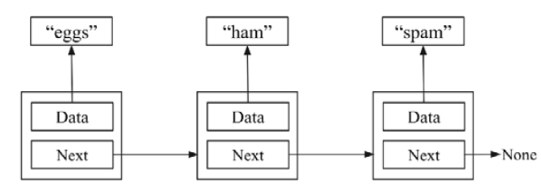
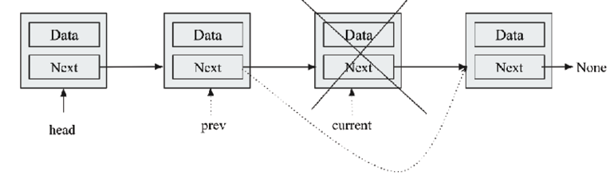
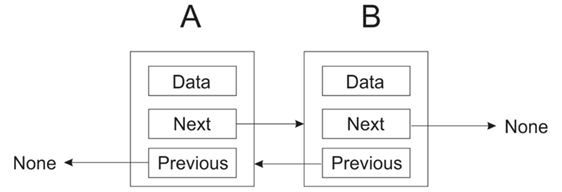
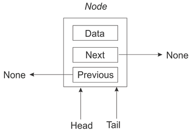
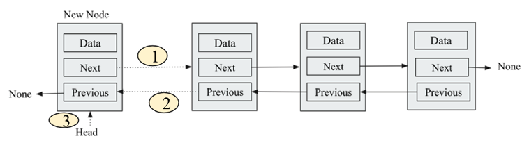

# 链表

```Python``` 的链表实现非常强大，可以涵盖多种不同的用例。 我们已经在[第 1 章](./1.md)"Python 数据类型和结构"中讨论了 ```Python``` 中链表的内置数据结构。 大多数时候，```Python``` 的链表数据结构的内置实现用于使用链表存储数据。 在本章中，我们将了解链表及其内部结构是如何工作的。

链表是一种数据结构，其中数据以线性顺序存储。 链表通过指针结构以线性顺序提供高效的数据存储。 指针用于存储数据项的内存地址。 它们存储数据和位置，位置存储下一个数据项在内存中的位置。

本章的重点如下：

- 数组
- 链表介绍
- 单向链表
- 双向链表
- 循环链表
- 链表的实际应用

在讨论链表之前，让我们先讨论一下数组，它是最基本的数据结构之一。

## 数组

数组是相同类型的数据项的集合，而链表是按顺序存储并通过指针连接的相同数据类型的集合。 在链表中，数据存储在不同的内存位置，而数组数据存储在连续的内存位置。

数组存储相同数据类型的数据，数组中的每个数据存储在连续的内存位置。 存储相同类型的多个数据值使得使用偏移量和基地址计算数组中任何数据的位置变得更加容易和快速。 术语**基地址**是指存储第一个数据的内存位置的地址，而**偏移**是指指示第一个数据与给定数据之间的位移的整数。

图 4.1 演示了一个包含七个整数序列的数组，这些整数值按顺序存储在连续的内存位置中。 第一个数据（数据值 ```3```）存储在索引 ```0``` 处，第二个数据存储在索引位置 ```1``` 处，依此类推。


图 4.1：一维数组的表示

与链表相比，数组数据的存储、遍历和访问非常快，因为可以使用它们的索引位置随机访问数据，而在链表的情况下，数据是按顺序访问的。 因此，如果要存储在数组中的数据很大并且系统内存不足，则数组数据结构将不是存储数据的好选择，因为很难分配大块内存位置。 数组数据结构有更多的限制，因为它有一个必须在创建时声明的静态大小。

此外，与链表相比，数组数据结构中的插入和删除操作速度较慢。 这是因为很难在给定位置插入数组中的数据，因为必须移动该所需位置之后的所有数据，然后在其间插入新数据。 因此，数组数据结构适用于需要对数据进行大量访问而插入和删除操作较少的情况，而链表适用于链表大小不固定、插入和删除操作较多的应用程序。

## 链表介绍

链表是一种重要且流行的数据结构，具有以下特性：

1. 数据存储在内存中的不同位置，这些位置通过指针连接。 指针是一个对象，可以存储变量的内存地址，每个数据指向下一个数据，依此类推，直到最后一个数据指向 ```None```。
2. 链表的长度可以在程序执行期间增加或减少。

与数组不同，链表将数据项顺序存储在内存中的不同位置，其中每个数据项单独存储并使用指针链接到其他数据项。 这些数据项中的每一个都称为**节点**。 更具体地说，节点存储实际数据和指针。 在图 4.2 中，节点 ```A``` 和 ```B``` 独立存储数据，节点 ```A``` 连接到节点 ```B```。


此外，节点可以根据我们想要存储数据的方式与其他节点建立不同的链接，并在此基础上学习各种数据结构，例如单向链表、双向链表、循环链表和树 .

### 节点和指针

节点是链表等多种数据结构的关键组成部分。 节点是数据的容器，连同到其他节点的一个或多个链接，其中链接是指针。

首先，让我们考虑一个创建包含数据（例如，字符串）的两个节点的链表的示例。 为此，我们首先声明存储数据的变量以及指向下一个变量的指针。 考虑下图 4.3 中的示例，其中有两个节点。 第一个节点有一个指向字符串（```eggs```）的指针，另一个节点指向字符串 ```ham```。

此外，指向 ```eggs``` 字符串的第一个节点具有指向另一个节点的链接。 指针用于存储变量的地址，由于字符串实际上并未存储在节点中，而是字符串的地址存储在节点中。


图 4.3：两个节点的示例链表

此外，我们还可以在这个现有链表中添加一个新的第三个节点，该链表将 ```spam``` 作为数据值存储，而第二个节点指向第三个节点，如图 4.4 所示。 因此，图 4.3 演示了具有数据字符串的三个节点的结构，即```egges```、```ham``` 和 ```spam```，它们按顺序存储在链表中。



图 4.4：三个节点的示例链表

因此，我们创建了三个节点——一个包含 ```egges```、```ham``` 和 ```spam```。 ```eggs``` 节点指向 ```ham``` 节点，而 ```ham``` 节点又指向 ```spam``` 节点。 但是 ```spam``` 节点指向什么？ 因为这是链表中的最后一个数据，我们需要确保它的下一个成员有一个值来明确这一点。 如果我们让最后一个数据指向 ```None```，那么我们就清楚了这个事实。 在 ```Python``` 中，我们将使用特殊值 ```None``` 来表示什么都没有。 考虑图 4.5。 节点 ```B``` 是链表中的最后一个数据，因此它指向 ```None```。


图 4.5：具有两个节点的链表

我们先来了解下节点的实现，如下代码片段所示：

```python
class Node:
    def __init__ (self, data=None):
        self.data = data
        self.next = None
```

在这里，```next``` 指针被初始化为 ```None```，这意味着除非我们更改 ```next``` 的值，否则该节点将成为一个端点，这意味着最初，附加到链表的任何节点都是独立的。

如果需要，你还可以将任何其他数据项添加到节点类。 如果你的节点将包含客户数据，则创建一个 ```Customer``` 类并将所有数据放在那里。

链表分为三种——单向链表、双向链表和循环链表。 首先，让我们讨论一下单向链表。

我们需要学习以下操作，以便在实时应用程序中使用任何链表。

- 遍历链表
- 在链表中插入数据项：
  - 在链表开头插入一个新的数据项（节点）
  - 在链表末尾插入一个新的数据项（节点）
  - 在链表中间 / 或任何给定位置插入新数据项（节点）
- 从链表中删除一个数据项：
  - 删除链表第一个节点
  - 删除链表最后一个节点
  - 删除链表中间 / 或任何给定位置的节点

我们将在后续小节中讨论这些对不同类型链表的重要操作，以及它们使用 ```Python``` 的实现。 让我们从单链表开始。

## 单向链表

链表（也称为单向链表）包含多个节点，其中每个节点包含数据和链接到下一个节点的指针。 链表中最后一个节点的链接为 ```None```，表示链表结束。 参考下面图4.6 中的链表，其中存储了一个整数序列。


图 4.6：单向链表的示例

接下来，我们讨论如何创建单向链表，以及如何遍历它。

### 创建和遍历

为了实现单向链表，我们可以使用我们在上一节中创建的节点类。 例如，我们创建三个节点 ```n1```、```n2``` 和 ```n3```，分别存储三个字符串：

```python
n1 = Node('eggs')
n2 = Node('ham')
n3 = Node('spam')
```

接下来，我们依次链接节点以形成链表。 例如，在下面的代码中，节点 ```n1``` 指向节点 ```n2```，节点 ```n2``` 指向节点 ```n3```，节点 ```n3``` 是最后一个节点，并且指向 ```None```：

```python
n1.next = n2
n2.next = n3
```

链表的遍历意味着访问链表的所有节点，从起始节点到最后一个节点。 遍历单向链表的过程从第一个节点开始，显示当前节点的数据，然后跟随指针移动，最终到达最后一个节点时停止。

为了实现链表的遍历，我们首先将当前变量设置为链表的第一项（起始节点），然后通过循环遍历整个链表，遍历每个节点，如下代码所示：

```python
current = n1
while current:
     print(current.data)
     current = current.next
```

在循环中，我们打印出当前数据，然后将 ```current``` 设置为指向链表中的下一个数据。 我们一直这样做，直到我们到达链表的末尾。 此示例的上述代码的输出是：

```python
eggs
ham
spam
```

然而，这个简单的链表实现有几个问题：

- 它需要程序员做太多的手工工作
- 链表的太多内部逻辑暴露给程序员

因此，让我们讨论一种更好、更有效的遍历链表的方法。

#### 改进链表创建和遍历

正如你在前面的链表遍历示例中注意到的，我们将节点类公开给客户端 / 用户。 但是，客户端节点不应与节点对象交互。 我们需要使用 ```node.data``` 获取节点的内容，使用 ```node.next``` 获取下一个节点。 我们可以通过创建一个返回生成器的方法来访问数据，这可以使用 ```Python``` 中的 ```yield``` 关键字来完成。 更新后的链表遍历代码片段如下：

```python
def iter(self):
    current = self.head
    while current:
        val = current.data
        current = current.next
        yield val
```

在这里，```yield``` 关键字用于从函数返回，同时保存其局部变量的状态，以使函数能够从中断处恢复。 每当再次调用该函数时，都会从最后一条 ```yield``` 语句开始执行。 任何包含 ```yield``` 关键字的函数都称为**生成器**。

现在，链表遍历要简单得多。 我们可以完全忽略链表之外称为节点的任何对象：

```python
for word in words.iter():
    print(word)
```

请注意，由于 ```iter()``` 方法生成节点的数据成员，因此我们的客户端代码根本不需要担心这一点。

可以使用一个简单的类来创建和保存单向链表。 我们从一个构造函数开始，该构造函数包含对链表中第一个节点（即以下代码中的 ```head```）的引用。 由于这个链表最初是空的，我们首先将这个引用设置为 ```None```：

```python
class SinglyLinkedList:
    def __init__ (self):
        self.head = None
```

在前面的代码中，我们从一个指向 ```None``` 的空链表开始。 现在，可以将新数据附加/添加到此链表。

### 插入数据项

我们需要执行的第一个操作是将数据项插入到链表中。 该操作也称为插入操作。 在这里我们有机会隐藏 ```Node``` 类。 链表类的用户永远不必与 ```Node``` 对象交互。

#### 将数据项插入到链表末尾
让我们看一下用于创建链表的 ```Python``` 代码，我们使用 ```append()``` 方法将新数据附加到链表中，如下所示：

```append()``` 方法的第一个操作可能如下所示：

```python
class SinglyLinkedList:
    def __init__(self):
        self.head = None
        self.size = 0

    def append(self, data):
        # 将数据封装在一个节点中
        node = Node(data)
        if self.head is None:
            self.head = node
        else:
            current = self.head
            while current.next:
                current = current.next
            current.next = node
```

在这里，在这段代码中，我们将数据封装在一个节点中，使其具有 ```next``` 指针属性。 从这里开始，我们检查链表中是否存在任意现有节点（即 ```self.head``` 是否指向一个节点）。 如果没有，这意味着链表是空的，新节点将是第一个节点。 因此，我们使新节点成为链表的第一个节点； 否则，我们通过遍历链表到最后一个节点并将最后一个节点的 ```next``` 指针更新为新节点来找到插入点。 这种工作如图 4.7 所示。


图 4.7：在单向链表的链表末尾插入节点

考虑以下附加三个节点的示例代码：

```python
words = SinglyLinkedList()
words.append('egg')
words.append('ham')
words.append('spam')
```

链表遍历将像我们之前讨论的那样工作。 你将从链表本身获取链表的第一个数据，然后通过 ```next``` 指针遍历链表：

```python
current = words.head
while current:
    print(current.data)
    current = current.next
```

不过，这个实现不是很有效，并且 ```append``` 方法有一个缺点。 在此，我们必须遍历整个链表来找到插入点。 当链表中只有几个数据项时，这可能不是问题，但当链表很长时，效率会很低，因为每次添加数据项都必须遍历整个链表。 让我们讨论 ```append``` 方法的更好实现。

为此，我们的想法是我们不仅有对链表中第一个节点的引用，还有对链表最后一个节点的引用。 这样，我们就可以在链表的末尾快速添加一个新节点。 使用此方法可以将插入操作的最坏情况运行时间从 $O(n)$ 减少到 $O(1)$。 我们必须确保之前的最后一个节点指向要插入到链表中的新节点。

这是我们更新的代码：

```python
class SinglyLinkedList:
    def __init__(self):
        self.tail = None
        self.head = None
        self.size = 0

    def append(self, data):
        node = Node(data)
        if self.tail:
            self.tail.next = node
        else:
            self.head = node
        self.tail = node
```

> 请注意所使用的约定。 我们添加新节点的点是通过 ```self.tail```。 ```self.head``` 变量指向链表中的第一个节点。

在此代码中，通过建立从最后一个节点到新节点的链接，可以通过尾指针将新节点插入到末尾。 图 4.8 显示了前面代码的工作原理。


图 4.8：说明在链表末尾插入节点

在图 4.8 中，第 ```1``` 步显示在末尾添加新节点，第 ```2``` 步显示链表为空时。 在这种情况下，```head``` 成为新节点，```tail``` 指向该节点。

此外，以下代码片段显示了代码的工作原理：

```python
words = SinglyLinkedList()
words.append('egg')
words.append('ham')
words.append('spam')
 
current = words.head
while current:
    print(current.data)
    current = current.next
```

上述代码的输出如下：

```python
eggs
ham
spam
```

#### 在中间位置插入数据项

要在给定位置插入或插入现有链表中的数据，首先，我们必须遍历链表以到达我们想要插入数据的所需位置。 可以使用两个指针（```prev``` 和 ```current```）在两个连续节点之间插入一个数据。

通过更新这些链接，可以轻松地将新节点插入两个现有节点之间，如图 4.9 所示。


图 4.9：在链表中的两个连续节点之间插入一个节点

当我们想在两个现有节点之间插入一个节点时，我们所要做的就是更新两个链接。 前一个节点指向新节点，新节点应该指向前一个节点的后继节点。

让我们看看下面的完整代码，在给定的索引位置添加一个新数据：

```python
class SinglyLinkedList:
    def __init__(self):
        self.tail = None
        self.head = None
        self.size = 0

    def append_at_a_location(self, data, index):
        current = self.head
        prev = self.head
        node = Node(data)
        count = 1
        while current:
            if count == 1:
                node.next = current
                self.head = node
                print(count)
                return
            elif index == index:
                node.next = current
                prev.next = node
                return
            count += 1
            prev = current
            current = current.next
        if count < index:
            print("The list has less number of elements")
```

在上面的代码中，我们从第一个节点开始，将当前指针移动到要添加新数据的索引位置，然后相应地更新节点指针。 在 ```if``` 条件下，首先，我们检查索引位置是否为 ```1```。在这种情况下，我们必须更新节点，因为我们将新节点添加到链表的开头。 因此，我们必须使新节点成为头节点。 接下来，在 ```elif``` 部分，我们通过比较 ```count``` 和 ```index``` 的值来检查我们是否到达了所需的索引位置。 如果两个值相等，我们在 ```prev``` 和 ```current``` 指示的节点之间添加一个新节点，并相应地更新指针。 最后，如果所需的索引位置大于链表的长度，我们将打印一条适当的消息。

以下代码片段使用 ```append``` 方法在现有链表的索引位置 ```2``` 处添加一个"新"数据：

```python
words = SinglyLinkedList()
words.append('egg')
words.append('ham')
words.append('spam')
current = words.head
while current:
    print(current.data)
    current = current.next
words.append_at_a_location('new', 2)
current = words.head
while current:
    print(current.data)
    current = current.next
```

上述代码的输出如下：

```python
egg
new
ham
spam
```

要注意的是，我们可能想要插入新数据的条件可能会根据要求而变化，所以假设我们想要在具有相同数据值的数据之前插入一个新数据。 在这种情况下，```append_at_a_position``` 的代码如下：

```python
def append_at_a_location(self, data):
    current = self.head
    prev = self.head
    node = Node(data)
    while current:
        if current.data == data:
            node.next = current
            prev.next = node
        prev = current
        current = current.next
```

我们现在可以使用前面的代码在中间位置插入一个新节点：

```python
words.append_at_a_location('ham')
current = words.head
while current:
    print(current.data)
    current = current.next
```

上述代码的输出如下：

```python
egg
ham
ham
spam
```

当我们有一个指向最后一个节点的额外指针时，插入操作的最坏情况时间复杂度为 $O(1)$。 否则，当我们没有到最后一个节点的链接时，时间复杂度将为 $O(n)$，因为我们必须遍链表才能到达所需位置，在最坏的情况下，我们可能必须遍历链表中的 ```n``` 个节点。

### 链表查询

创建链表后，我们可能需要一些有关链表的查询信息，例如链表的大小，并且偶尔需要确定给定数据项是否存在于链表中。

#### 搜索链表中的数据

我们可能还需要检查链表是否包含给定的数据项。 这可以使用 ```iter()``` 方法来实现，我们已经在上一节中遍历链表时看到了该方法。 使用它，我们编写搜索方法如下：

```python
def search(self, data):
    for node in self.iter():
        if data == node:
            return True
    return False
```

在上面的代码中，每一次循环都是将要查找的数据与链表中的每一项数据进行逐项比较。 如果找到匹配项，则返回 ```True```，否则返回 ```False```。

如果我们运行以下代码来搜索给定的数据项：

```python
print(words.search('sspam'))
print(words.search('spam'))
```

上述代码的输出如下：

```python
False
True
```

#### 获取链表的大小

通过计算节点数来获取链表的大小很重要。 一种方法是遍历整个链表并更新计数器：

```python
def size(self):
    count = 0
    current = self.head
    while current:
        count += 1
        current = current.next
    return count
```

上面的代码与我们在遍历链表时所做的非常相似。 同样，在这段代码中，我们将链表的节点逐一遍历，增加 ```count``` 变量。 然而，链表遍历可能是一个代价高昂的操作，我们应该尽可能避免。

因此，我们可以选择另一种方法，在该方法中我们可以向 ```SinglyLinkedList``` 类添加一个 ```size``` 成员，并在构造函数中将其初始化为 ```0```，如以下代码片段所示：

```python
class SinglyLinkedList:
    def __init__(self):
        self.head = data
        self.size = 0
```

因为我们现在只是读取节点对象的大小属性，而不是使用循环来计算链表中的节点数，所以我们将最坏情况下的运行时间从 $O(n)$ 减少到 $O(1)$。

### 删除数据项

链表的另一个常见操作是删除节点。 为了从单向链表中删除节点，我们可能会遇到三种可能性。

#### 删除单链表开头的节点

从头开始删除节点非常容易。 它涉及将头指针更新为链表中的第二个节点。 这可以分两步完成：

1. 创建一个指向第一个节点（头节点）的临时指针（当前指针），如图 4.10 所示。


图 4.10：从链表中删除第一个节点的图示

2. 接下来，将当前节点指针移动到下一个节点并分配给头节点。 现在，第二个节点成为头指针指向的头节点，如图4.11所示。


图 4.11：删除第一个节点后，```head``` 指针现在指向新的起始数据

这可以使用以下 ```Python``` 代码实现。 在这段代码中，最初，像我们之前所做的那样添加了三个数据，然后删除了链表的第一个节点：

```python
def delete_first_node(self):
    current = self.head
    if self.head is None:
        print("No data element to delete")
    elif current == self.head:
        self.head = current.next
```

在上面的代码中，我们首先检查链表中是否有要删除的数据项，然后打印相应的消息。 接下来，如果链表中有响应的数据项，我们按照步骤 ```1``` 将头指针分配给临时指针 ```current```，然后头指针现在指向下一个节点，假设我们已经有了一个三项的链表 数据项——```eggs```, ```ham```, 和```spam```：

```python
words.delete_first_node()
current = words.head
while current:
    print(current.data)
    current = current.next
```

上述代码的输出如下：

```python
ham
spam
```

#### 删除单链表末尾的节点

要从链表中删除最后一个节点，我们必须首先遍历链表以到达最后一个节点。 这时候我们还需要一个额外的指针，只指向最后一个节点之前的一个节点，这样在删除最后一个节点后，倒数第二个节点可以被标记为最后一个节点。 它可以通过以下三个步骤来实现：

1. 首先，我们有两个指针，换句话说，一个指向最后一个节点的 ```current``` 指针，以及一个指向最后一个节点（倒数第二个节点）之前的节点的 ```prev``` 指针。 最初，我们将有三个指针（```current```、```prev``` 和 ```head```）指向第一个节点，如图 4.12 所示。


图 4.12：从链表中删除结束节点的图示

2. 为了到达最后一个节点，我们移动 ```current``` 和 ```prev``` 指针，使 ```current``` 指针指向最后一个节点，```prev``` 指针指向倒数第二个节点。 因此，我们在当前指针到达最后一个节点时停止。 如图 4.13 所示。


图 4.13：遍历链表到达链表末尾

3. 最后，我们将 ```prev``` 指针标记为指向倒数第二个节点，通过将此节点指向 ```None``` 将其呈现为链表的最后一个节点，如图 4.14 所示。


图 4.14：从链表中删除最后一个节点

从链表末尾删除节点的 ```Python``` 实现如下：

```python
def delete_last_node(self):
    current = self.head
    prev = self.head
    while current:
        if current.next is None:
            prev.next = current.next
            self.size -= 1
        prev = current
        current = current.next
```

在前面的代码中，首先，```current``` 和 ```prev``` 指针按照步骤 ```1``` 分配了头指针。然后，在 ```while``` 循环中，我们使用 ```current.next is None``` 条件检查我们是否到达了链表的末尾。 一旦我们到达链表的末尾，我们就将 ```prev``` 指针指示的倒数第二个节点作为最后一个节点。 我们还减少了链表的大小。 如果我们没有到达链表的末尾，我们将在最后两行代码的 ```while``` 循环中递增 ```prev``` 和 ```current``` 指针。 接下来，让我们讨论如何删除单向链表中的任何中间节点。

#### 删除单向链表中的任何中间节点

我们首先必须决定如何选择要删除的节点。 标识要删除的中间节点可以通过索引号或节点包含的数据来确定。 让我们通过根据节点包含的数据删除节点来理解这个概念。

要删除任何中间节点，我们需要两个指针，类似于前面删除最后一个节点时的情况； 换句话说，当前指针和上一个指针。 一旦我们到达要删除的节点，就可以通过使前一个节点指向要删除的节点的下一个节点来删除所需的节点。 该过程的步骤如下：

1. 图 4.15 显示了何时从给定链表中删除中间节点。 在这里，我们可以看到初始指针指向第一个节点。


图 4.15：从链表中删除中间节点的图示

2. 一旦节点被识别，```prev``` 指针被更新以删除该节点，如图 4.16 所示。 图 4.16 中显示了要删除的节点以及指向要更新的节点的链接。



图4.16：遍历到链表中待删除的中间节点

3. 最后，删除节点后的链表如图4.17所示。


图 4.17：从链表中删除中间节点

假设我们要删除具有给定值的数据。 对于这个给定的条件，我们可以先搜索要删除的节点，然后按照讨论的步骤删除节点。

```delete()``` 方法的实现可能如下所示：

```python
def delete(self, data):
    current = self.head
    prev = self.head
    while current:
          if current.data == data:
              if current == self.head:
                  self.head = current.next
              else:
                  prev.next = current.next
              self.size -= 1
              return
          prev = current
          current = current.next
```

假设我们已经有了一个包含```eggs```、```ham```、```spam``` 三项的链表，下面的代码是执行删除操作，即从链表中删除一个值为 ```ham``` 的数据 给定链表：

```python
words.delete("ham")
current = words.head
while current:
    print(current.data)
    current = current.next
```

上述代码的输出如下：

```python
egg
spam
```

删除操作的最坏情况时间复杂度为 $O(n)$，因为我们必须遍历链表才能到达所需位置，在最坏情况下，我们可能必须遍历链表中的所有 ```n``` 个节点。

### 清除链表

我们可能需要快速清除一个链表，有一种非常简单的方法可以做到这一点。 我们可以通过将指针头和尾设置为 ```None``` 来清除链表：

```python
def clear(self):
    # 清除整个链表
    self.tail = None
    self.head = None
```

在上面的代码中，我们可以通过将 ```None``` 分配给尾指针和头指针来清除链表。

我们已经讨论了单链表的不同操作，现在我们将讨论双向链表的概念，并在下一节中了解如何在双向链表中实现不同的操作。

## 双向链表

双向链表与单向链表非常相似，因为我们使用相同的节点基本概念以及我们如何将数据和链接存储在一起。 单向链表和双向链表之间的唯一区别是，在单向链表中，每个连续节点之间只有一个链接，而在双向链表中，我们有两个指针——指向下一个节点的指针和指向前一个节点的指针。 见下图4.18的一个节点； 有一个指向下一个节点和前一个节点的指针，它们被设置为 ```None``` 因为没有节点附加到该节点。


图 4.18：表示具有单个节点的双向链表

单向链表中的节点只能确定与其关联的下一个节点。 但是，没有从该引用节点返回的链接。 流向只有一种方式。 在双向链表中，我们解决了这个问题，不仅可以引用下一个节点，还可以引用上一个节点。 考虑下图 4.19 以了解两个连续节点之间链接的性质。 这里，节点 ```A``` 引用节点 ```B```； 此外，还有一个返回节点 ```A``` 的链接。



图 4.19：具有两个节点的双向链表

双向链表可以向任何方向遍历。 双向链表中的节点可以在需要时很容易地被其前一个节点引用，而无需变量来跟踪该节点。

但是，在单向链表中，可能很难返回到链表的头或在链表的头进行一些修改，而在双向链表中很容易。

### 创建和遍历

创建双向链表节点的 ```Python``` 代码包括其初始化方法、```prev``` 指针、```next``` 指针和数据实例变量。 新创建节点时，所有这些变量默认为 ```None```：

```python
class Node:
    def __init__(self, data=None, next=None, prev=None):
        self.data = data
        self.next = next
        self.prev = prev
```

```prev``` 变量具有对前一个节点的引用，而 ```next``` 变量保留对下一个节点的引用，而 ```data``` 变量存储数据。

接下来，让我们创建一个双向链表类。

双向链表类有两个指针，```head``` 和 ```tail```，分别指向双向链表的开始和结束。 此外，对于链表的大小，我们将 ```count``` 实例变量设置为 ```0```。它可以用来跟踪链表中的数据项数。 考虑以下用于创建双向链表类的 ```Python``` 代码：

```python
class DoublyLinkedList:
    def __init__(self):
        self.head = None
        self.tail = None
        self.count = 0
```

这里 ```self.head``` 指向链表的起始节点，```self.tail``` 指向最后一个节点。 但是，对于头节点指针和尾节点指针的命名并没有固定的规则。

双向链表还需要返回链表大小、将数据项插入链表以及从链表中删除节点的功能。 接下来，我们讨论可应用于双向链表的不同操作。 让我们从插入操作开始。

### 插入数据项

```append``` 操作用于在链表的末尾添加一个数据。 在以下实例中，可以将数据附加或插入到双向链表中。

#### 在链表的开头插入一个节点

首先，重要的是检查链表的头节点是否为 ```None```。 如果是 ```None```，这意味着链表是空的，否则链表有节点，可以向链表插入一个新节点。 如果要向空链表中添加一个新节点，它的头指针应该指向新创建的节点，链表的尾部也应该指向这个新创建的节点。

下图 4.20 说明了向空链表添加新节点时双向链表的头指针和尾指针。



图 4.20：在空双向链表中插入节点的图示

或者，我们可以在现有双向链表的开头插入或插入一个新节点，如图 4.21 所示。


图 4.21：在双向链表中插入数据的图示

新节点应该作为链表的新起始节点，现在应该指向前一个头节点。

可以通过更新三个链接来完成，这三个链接也在图4.22中用虚线表示，说明如下：

1. 首先，新节点的 ```next``` 指针应该指向现有链表的头节点
2. 现有链表头节点的 ```prev``` 指针应该指向新节点
3. 最后，将新节点标记为链表中的头节点



图 4.22：在双向链表的开头插入一个节点

以下代码用于在链表最初为空且具有现有双向链表时在开头插入数据项：

```python
def append_at_start(self, data):
    # 在链表的开头插入一个数据项
    new_node = Node(data, None, None)
    if self.head is None:
        self.head = new_node
        self.tail = self.head
    else:
        new_node.next = self.head
        self.head.prev = new_node
        self.head = new_node
    self.count += 1
```


在上面的代码中，首先，无论链表是否为空，都会检查 ```self.head``` 条件。 如果为空，则头指针和尾指针指向新创建的节点。 在这种情况下，新节点成为头节点。 接下来，如果条件不为真，这意味着链表不为空，并且必须在链表的开头添加一个新节点。 为此，更新了三个链接，如图 4.22 所示，并在代码中以粗体显示。 更新完这三个链接后，最后，链表的大小增加了 ```1```。进一步，让我们了解如何在双向链表的末尾插入一个数据。

此外，以下代码片段显示了我们如何创建双链接链表并在链表的开头附加一个新节点：

```python
words = DoublyLinkedList()
words.append('egg')
words.append('ham')
words.append('spam')
print("Items in doubly linked list before append:")
current = words.head
while current:
    print(current.data)
    current = current.next
words.append_at_start('book')
print("Items in doubly linked list after append:")
current = words.head
while current:
    print(current.data)
    current = current.next
```

上述代码的输出是：

```python
Items in doubly linked list before append:
egg
ham
spam
Items in doubly linked list after append:
book
egg
ham
spam
```

在输出中，我们可以看到在链表的开头添加了新的数据项 ```book```。

#### 在链表末尾插入一个节点

要在双向链表的末尾追加/插入一个新数据，如果我们没有单独的指针指向链表的末尾，我们将需要遍历链表以到达链表的末尾。 在这里，我们有一个指向链表末尾的尾指针。

下图 4.23 显示了对现有链表的插入操作的可视化表示。


图 4.23：在双向链表的链表末尾插入节点

为了在最后添加一个新节点，我们更新两个链接如下：

1. 使新节点的 ```prev``` 指针指向上一个尾节点
2. 使之前的尾节点指向新节点
3. 最后，更新尾指针，使尾指针现在指向新节点

以下代码用于在双向链表的末尾插入一个数据项：

```python
def append(self, data):
    # Append an item at the end of the list.
    new_node = Node(data, None, None)
    if self.head is None:
        self.head = new_node
        self.tail = self.head
    else:
        new_node.prev = self.tail
        self.tail.next = new_node
        self.tail = new_node
    self.count += 1
```

上述代码中，前面程序的 ```if``` 部分是为空链表添加一个节点； 如果链表不为空，将执行前面程序的 ```else``` 部分。 如果要将新节点添加到链表中，则将新节点的 ```prev``` 变量设置为链表的尾部：

```python
new_node.prev = self.tail
```

尾部的下一个指针（或变量）必须设置为新节点：

```python
self.tail.next = new_node
```

最后，我们更新尾指针以指向新节点：

```python
self.tail = new_node
```

由于附加操作将节点数增加一，因此我们将计数器增加一：

```python
self.count += 1
```

以下代码片段可用于在链表末尾附加一个节点：

```python
print("Items in doubly linked list after append")
words = DoublyLinkedList()
words.append('egg')
words.append('ham')
words.append('spam')
words.append('book')
print("Items in doubly linked list after adding element at end.")
current = words.head
while current:
    print(current.data)
    current = current.next
```

以上代码的输出：

```python
Items in doubly linked list after adding element at end.
egg
ham
spam
book
```

向双向链表插入数据的最坏情况时间复杂度为 $O(1)$，因为我们已经有了指向链表末尾的尾指针，我们可以直接添加新数据。 接下来，我们将讨论如何在双向链表的中间位置插入节点。

#### 在链表的中间位置插入节点

在双向链表中的任何给定位置插入新节点类似于我们在单向链表中讨论的内容。 让我们举一个例子，我们在与给定数据具有相同数据值的数据之前插入一个新数据。

首先，我们遍历到那种情况下我们想要插入一个新数据的位置。 当前指针指向目标节点，而 ```prev``` 指针恰好指向目标节点的前一个节点，如图4.24所示。


图 4.24：用于在双向链表的中间位置插入节点的指针示意图

到达正确位置后，必须添加一些指针才能添加新节点。 这些需要更新的链接（也如图4.25所示）的详细信息如下：

1. 新节点的 ```next``` 指针指向当前节点
2. 新节点的 ```prev``` 指针应该指向前一个节点
3. 前一个节点的下一个指针应该指向新节点
4. 当前节点的 ```prev``` 指针应该指向新节点


图 4.25：为了在链表中的任何中间位置添加新节点而需要更新的链接演示

以下是 ```append_at_a_location()``` 方法的实现方式：

```python
def append_at_a_location(self, data):
    current = self.head
    prev = self.head
    new_node = Node(data, None, None)
    while current:
        if current.data == data:
            new_node.prev = prev
            new_node.next = current
            prev.next = new_node
            current.prev = new_node
            self.count += 1
        prev = current
        current = current.next
```

在上述代码中，首先将 ```current``` 和 ```prev``` 指针初始化为指向头节点。 然后，在 ```while``` 循环中，我们首先通过检查条件到达所需的位置。 在此示例中，我们根据用户提供的数据值检查当前节点的数据值。 到达所需位置后，我们将更新所讨论的四个链接，如图 4.25 所示。

以下代码片段可用于在双向链表中第一次出现单词 ```ham``` 后插入数据 ```ham```：

```python
words = DoublyLinkedList()
words.append('egg')
words.append('ham')
words.append('spam')
words.append_at_a_location('ham')
print("Doubly linked list after adding an element after word \"ham\" in the list.")
current = words.head
while current:
    print(current.data)
    current = current.next
```

以上代码的输出：

```python
Doubly linked list after adding an element after word "ham" in the list.
egg
ham
ham
spam
```

在双向链表的开始和结束位置插入的最坏情况运行时间复杂度为 $O(1)$，因为我们可以直接插入新节点，而在任何中间位置插入新节点的最坏情况时间复杂度 位置将是 $O(n)$ 因为我们可能必须遍历 ```n``` 项的链表。

接下来，让我们学习如何搜索给定项（如果它存在于双向链表中）。

### 链表查询

在双向链表中搜索数据项与我们在单向链表中的搜索方式类似。 我们使用 ```iter()``` 方法检查所有节点中的数据。 当我们循环遍历链表中的所有数据时，每个节点都与 ```contain``` 方法中传递的数据相匹配。 如果我们在链表中找到该数据项，则返回 ```True```，表示找到该数据项，否则返回 ```False```，表示未在链表中找到该数据项。 ```Python``` 代码如下：

```python
def iter(self):
    current = self.head
    while current:
        val = current.data
        current = current.next
        yield val

def contains(self, data):
    for node_data in self.iter():
        if data == node_data:
            print("Data item is present in the list.")
            return
    print("Data item is not present in the list.")
    return
```

以下代码可用于搜索现有双向链表中是否存在数据项：

```python
words = DoublyLinkedList()
 
words.append('egg')
words.append('ham')
words.append('spam')
words.contains("ham")
words.contains("ham2")
```

上述代码的输出如下：

```python
Data item is present in the list.
Data item is not present in the list.
```

双向链表中的搜索操作具有 $O(n)$ 的运行时间复杂度，因为我们必须遍历链表才能找到所需的数据，在最坏的情况下，我们可能必须遍历 ```n``` 项的整个链表 .

### 删除数据项
与单链表相比，双向链表中的删除操作更容易。 与单向链表需要遍历链表到达想要的位置，还需要多一个指针来跟踪目标节点的前一个节点不同，双向链表不需要这样做，因为我们可以双向遍历。

双向链表中的删除操作可以有四种情况，分别如下：

1. 要删除的数据项位于链表的开头
2. 要删除的数据项位于链表的尾端
3. 要删除的数据项位于链表中间位置的任意位置
4. 在链表中找不到要删除的数据项

要删除的节点通过将数据实例变量与传递给方法的数据进行匹配来标识。 如果数据与节点的数据变量匹配，则该匹配节点将被删除：

1. 对于第一种情况，当我们在第一个位置找到要删除的数据项时，我们必须简单地将头指针更新为下一个节点。 如图 4.26 所示。


图 4.26：删除双向链表中第一个节点的图示

2. 对于第二种情况，当我们在链表的最后一个位置找到要删除的数据项时，我们将不得不简单地将尾指针更新为倒数第二个节点。 如图 4.27 所示。


图 4.27：删除双向链表中最后一个节点的图示

对于第三种情况，我们在任意中间位置找到要删除的数据项。 为了更好地理解这一点，请考虑图 4.28 中所示的示例。 其中，有 ```A```、```B```、```C``` 三个节点。要删除链表中间的节点 ```B```，本质上就是让 ```A``` 指向节点 ```C``` 作为它的下一个节点，同时让 ```C``` 指向 ```A``` 作为它的前一个节点 .


图4.28：双向链表删除中间节点 ```B``` 示意图

```Python``` 中从双向链表中删除节点的完整实现如下。 我们将逐步讨论此代码的每个部分：

```python
def delete(self, data):
    # Delete a node from the list.
    current = self.head
    node_deleted = False
    if current is None:
        # List is empty
        print("List is empty")
    elif current.data == data:
        # Item to be deleted is found at starting of the list
        self.head.prev = None
        node_deleted = True
        self.head = current.next
    elif self.tail.data == data:
        # Item to be deleted is found at the end of list
        self.tail = self.tail.prev
        self.tail.next = None
        node_deleted = True
    else:
        while current:
            # search item to be deleted, and delete that node
            if current.data == data:
                current.prev.next = current.next
                current.next.prev = current.prev
                node_deleted = True
            current = current.next
        if node_deleted == False:
            # Item to be deleted is not found in the list
            print("Item not found")
    if node_deleted:
        self.count -= 1
```

最初，我们创建一个 ```node_deleted``` 变量来表示链表中已删除的节点，并将其初始化为 ```False```。 如果找到并随后删除了匹配节点，则 ```node_deleted``` 变量设置为 ```True```。

在 ```delete``` 方法中，```current``` 变量初始设置为链表的头节点（即指向链表的 ```self.head``` 节点）。 这显示在以下代码片段中：

```python
def delete(self, data):
    current = self.head
    node_deleted = False
```

接下来，我们使用一组 ```if...else``` 语句来搜索链表的各个部分，以确定要删除具有指定数据的节点。

首先，我们在头节点查找要删除的数据，如果在头节点匹配到数据，则删除该节点。 由于 ```current``` 指向的是 ```head```，如果 ```current``` 为 ```None```，这意味着链表为空，没有节点可以找到要删除的节点。 下面是它的代码片段：

```python
if current is None:
    node_deleted = False
```

但是，如果 ```current```（现在指向 ```head```）中包含要查找的数据，这意味着我们在 ```head``` 节点找到了要删除的数据，然后将 ```self.head``` 标记为指向 ```current.next``` 节点。 由于现在 ```head``` 后面没有节点，所以 ```self.head.prev``` 设置为 ```None```。 为此考虑以下代码片段：

```python
elif current.data == data:
    self.head.prev = None
    node_deleted = True
    self.head = current.next
```

类似地，如果要删除的节点位于链表的尾端，我们通过将其前一个节点指向 ```None``` 来删除最后一个节点。 ```self.tail``` 设置为指向 ```self.tail.prev```，```self.tail.next``` 设置为 ```None```，因为之后没有节点。 为此考虑以下代码片段：

```python
elif self.tail.data == data:
   self.tail = self.tail.prev
   self.tail.next = None
   node_deleted = True
```

最后，我们通过遍历整个节点链表来搜索要删除的节点。 如果要删除的数据与某个节点匹配，则删除该节点。

要删除一个节点，我们使用 ```current.prev.next = current.next``` 代码使当前节点的前一个节点指向下一个节点。 在那一步之后，我们使用 ```current.next.prev = current.prev``` 使当前的下一个节点指向当前节点的前一个节点。 此外，如果我们遍历整个链表，但没有找到所需的数据项，我们会打印相应的消息。 为此考虑以下代码片段：

```python
else:
    while current:
        if current.data == data:
            current.prev.next = current.next
            current.next.prev = current.prev
            node_deleted = True
        current = current.next
    if node_deleted == False:
        # Item to be deleted is not found in the list
        print("Item not found")
```

最后，检查 ```node_delete``` 变量以确定节点是否实际被删除。 如果删除了任何节点，那么我们将 ```count ```变量减 ```1```，这会跟踪链表中的节点总数。 请参阅以下代码片段：

```python
if node_deleted:
    self.count -= 1
```

如果删除任何节点，这会将计数变量减 ```1```。

让我们举个例子看看删除操作是如何工作的，同样的例子是添加三个字符串——```egg```、```ham``` 和 ```spam```，然后从链表中删除一个值为 ```ham``` 的节点。 代码如下：

```python
#Code to create for a doubly linked list
words = DoublyLinkedList()
words.append('egg')
words.append('ham')
words.append('spam')
words.delete('ham')
current = words.head
while current:
    print(current.data)
    current = current.next
```

上述代码的输出如下：

```python
egg
spam
```

删除操作的最坏情况运行时间复杂度是 $O(n)$，因为我们可能必须遍历 ```n``` 个数据项的链表来搜索要删除的数据项。

在下一节中，我们将学习对循环链表的不同操作。

## 循环链表

循环链表是链表的特例。 在循环链表中，端点是相连的，这意味着链表中的最后一个节点指向第一个节点。 换句话说，我们可以说在循环链表中，所有节点都指向下一个节点（在双向链表的情况下是前一个节点）并且没有结束节点，这意味着没有节点会指向 ```None```。

循环链表可以基于单链表和双向链表。 考虑图 4.29 基于单向链表的循环链表，其中最后一个节点 ```C``` 再次连接到第一个节点 ```A```，从而形成一个循环链表。


图 4.29：基于单向链表的循环链表示例

在双向循环链表的情况下，第一个节点指向最后一个节点，最后一个节点又指向第一个节点。 图 4.30 显示了基于双向链表的循环链表的概念，其中最后一个节点 C 通过 next 指针再次连接到第一个节点 A。 节点A也通过前一个指针连接到节点C，从而形成一个循环链表。


图 4.30：基于双向链表的循环链表示例

现在，我们将看看单向循环链表的实现。 一旦我们理解了单链表和双向链表的基本概念，实现双向循环链表就非常简单了。

除了我们在管理最后一个节点到第一个节点的链接时应该小心之外，几乎所有事情都是相似的。

我们可以重用我们在单链表小节中创建的节点类。 我们也可以重用 ```SinglyLinkedList``` 类的大部分内容。 因此，我们将重点关注循环链表实现与单向链表的不同。

### 创建和遍历

可以使用以下代码创建循环链表类：

```python
class CircularList:
    def __init__(self):
        self.tail = None
        self.head = None
        self.size = 0
```

在上面的代码中，最初在循环链表类中，我们有两个指针； ```self.tail``` 用于指向最后一个节点，```self.head``` 用于指向链表的第一个节点。

### 插入数据项

在这里，我们要在循环链表的末尾添加一个节点，如图 4.31 所示，我们有四个节点，其中头指向起始节点，尾指向最后一个节点。


图 4.31：在末尾添加节点的循环链表示例

图 4.32 显示了如何将节点添加到循环链表中。


图 4.32：在单循环链表的末尾插入一个节点

要在末尾添加一个节点，我们将更新三个链接：

1. 最后一个节点的 ```next``` 指针指向新节点
2. 新结点的 ```next``` 指针指向头结点
3. 更新尾指针指向新节点

循环链表在单向链表的基础上在循环表尾部插入一个数据的实现如下：

```python
def append(self, data):
    node = Node(data)
    if self.tail:
        self.tail.next = node
        self.tail = node
        node.next = self.head
    else:
        self.head = node
        self.tail = node
        self.tail.next = self.tail
    self.size += 1
```

在上面的代码中，首先，我们检查链表是否为空。 如果链表为空，我们转到上面代码的 ```else``` 部分。 在这种情况下，新节点将是链表的第一个节点，头指针和尾指针都将指向新节点，而新节点的下一个指针将再次指向新节点。

否则，如果链表不为空，我们转到前面代码的 ```if``` 部分。 在这种情况下，我们更新三个指针，如图 4.32 所示。 这类似于我们在单链表的情况下所做的。 本例中只增加了一个链接，在上述代码中以粗体显示。

更进一步，我们可以使用 ```iter()``` 方法遍历链表的所有数据，下面介绍的 ```iter()``` 方法应该定义在 ```CircularList``` 类中：

```python
def iter(self):
    current = self.head
    while current:
        val = current.data
        current = current.next
        yield val
```

下面的代码可以用来创建一个单向循环链表，然后打印链表的所有数据，然后当计数器变为链表长度 ```3``` 时停止。

```python
words = CircularList()
words.append('eggs')
words.append('ham')
words.append('spam')
counter = 0

for word in words.iter():
    print(word)
    counter += 1
    if counter > 2:
        break
```

上述代码的输出如下：

```python
eggs
ham
spam
```

在循环链表的中间位置附加任何数据完全是它在单链表中的实现。

### 链表查询
遍历循环链表非常方便，因为我们不需要寻找起点。 我们可以从任何地方开始，只需要在再次到达同一个节点时小心地停止遍历即可。 我们可以使用与本章开头讨论的相同的 ```iter()``` 方法。 循环链表也是如此； 唯一不同的是，我们在遍历循环链表的时候必须要提到退出条件，否则程序会陷入循环，无限运行下去。 我们可以根据我们的要求制定任何退出条件； 例如，我们可以使用计数器变量。 考虑以下示例代码：

```python
words = CircularList()
words.append('eggs')
words.append('ham')
words.append('spam')
counter = 0
for word in words.iter():
    print(word)
    counter += 1
    if counter > 100:
        break
```

在上面的代码中，我们将三个数据字符串添加到循环链表中，然后打印循环遍历链表 ```100``` 次的数据值。

在下一节中，让我们了解删除操作在循环链表中的工作原理。

### 删除循环链表中的数据

要删除循环链表中的节点，看起来我们可以像在附加操作的情况下那样做——只需确保尾指针的最后一个节点通过尾指针指向链表的起始节点 头指针。 我们有以下三种情况：

1. 当要删除的项是头节点时：

在这种情况下，我们必须确保我们使链表的第二个节点成为新的头节点（如图 4.33 中的步骤 1 所示），最后一个节点应该指向新的头节点（如图 4.33 中的步骤 2 所示）.

图 4.33：删除单循环链表中的起始节点

2. 当要删除的数据项是最后一个节点时：

在这种情况下，我们必须确保使倒数第二个节点成为新的尾节点（如图 4.34 中的步骤 1 所示），而新的尾节点应该指向新的头节点（如图 4.34 中的步骤 2 所示） .

图 4.34：删除单循环链表中的最后一个节点

3. 当待删除项为中间节点时：

这与我们在单向链表中所做的非常相似。 我们必须建立一个从目标节点的前一个节点到目标节点的下一个节点的链接，如图 4.35 所示。

图 4.35：删除单循环链表中的任何中间节点

删除操作的实现如下：

```python
def delete(self, data):
    current = self.head
    prev = self.head
    while prev == current or prev != self.tail:
        if current.data == data:
            if current == self.head:
                # item to be deleted is head node
                self.head = current.next
                self.tail.next = self.head
            elif current == self.tail:
                # item to be deleted is tail node
                self.tail = prev
                prev.next = self.head
            else:
                # item to be deleted is an intermediate node
                prev.next = current.next
            self.size -= 1
            return
        prev = current
        current = current.next
        if flag is False:
            print("Item not present in the list")
```

上述代码中，首先遍历所有数据，查找需要删除的数据。 在这里，特别要注意**停止条件**。 如果我们简单地检查当前指针等于 ```None```（我们在单向链表中这样做），程序将进入无限循环，因为在循环链表的情况下当前节点永远不会指向 ```None```。

为此，我们无法检查 ```current``` 是否已到达尾部，因为它永远不会检查最后一个节点。 因此，循环链表中的停止标准是 ```prev``` 和 ```current``` 指针指向同一节点的事实。 它会正常工作，除非第一次循环迭代（当时 ```current``` 和 ```prev``` 指向同一个节点，也就是**头节点**）。

一次，我们进入循环，我们用给定的数据值检查当前指针的数据值，得到要删除的节点。 我们检查要删除的节点是头节点、尾节点还是中间节点，然后更新图 ```4.33```、```4.34``` 和 ```4.35``` 所示的相应链接。

所以，我们讨论了在单向循环链表中删除任意节点时的不同场景，同样，基于双向链表的循环链表也可以实现。

以下代码可用于创建循环链表，并应用不同的删除操作：

```python
words = CircularList()
words.append("eggs")
words.append("ham")
words.append("spam")
words.append("foo")
words.append("bar")

print("Let us try to delete something that isn't in the list.")
words.delete("socks")
counter = 0
for item in words.iter():
    print(item)
    counter += 1
    if counter > 4:
        break

print("Let us delete something that is there.")
words.delete("foo")
counter = 0
for item in words.iter():
    print(item)
    counter += 1
    if counter > 3:
        break
```

上述代码的输出如下：

```python
Let us try to delete something that isn't in the list.
Item not present in the list
eggs
ham
spam
foo
bar
Let us delete something that is there.
eggs
ham
spam
bar
```

在循环链表中的给定位置插入数据的最坏情况时间复杂度是 $O(n)$，因为我们必须遍历链表到所需位置。 在循环链表的第一个和最后一个位置插入的复杂度为 $O(1)$。 同样，在给定位置删除数据的最坏情况时间复杂度为 $O(n)$。

到目前为止，我们已经讨论了在单循环链表中删除任何节点时的不同场景。 类似地，双向链表可以基于循环链表来实现。

在单链表中，节点的遍历可以在一个方向上完成，而在双向链表中，可以在两个方向（向前和向后）上遍历。 在这两种情况下，每当我们必须遍历链表以到达我们想要插入或删除任何数据的所需位置时，给定位置的插入和删除操作的复杂度为 O(n)。 类似地，对于给定的期望位置插入或删除节点的最坏情况时间复杂度是 O(n)。 每当我们需要节省内存空间时，我们应该使用单向链表，因为它只需要一个指针，而双向链表需要更多的内存空间来存储双指针。 当搜索操作很重要时，我们应该使用双向链表，因为可以在两个方向上进行搜索。 此外，当我们有一个应用程序需要遍历链表中的节点时，应该使用循环链表。 现在让我们看看链表的更多实际应用。

## 链表的实际应用

到目前为止，我们已经讨论了单链表、循环链表和双向链表。 根据不同的应用程序需要什么样的操作（插入、删除、更新等），相应地使用这些数据结构。 让我们看看一些使用这些数据结构的实时应用程序。

单向链表可用于表示任何稀疏矩阵。 另一个重要的应用是通过在链表的节点中累加常量来表示和操作多项式。

它还可以用于实现动态内存管理方案，允许用户在程序执行期间根据需要分配和释放内存。

另一方面，操作系统中的线程调度使用双向链表来维护当时正在运行的进程链表。 这些链表还用于操作系统中 **```MRU```**（最近使用）和 **```LRU```**（最近最少使用）缓存的实现。

各种应用程序也可以使用双向链表来实现撤消和重做功能。 浏览器可以使用这些链表来实现对所访问网页的向后和向前导航。

操作系统可以使用循环链表来实现循环调度机制。 循环链表的另一个应用是在 ```Photoshop``` 或 ```Word``` 软件中实现撤消功能，并将其用于实现允许你点击 **```返回```** 按钮的浏览器缓存。 除此之外，它还用于实现高级数据结构，例如斐波那契堆。 多人游戏也使用循环链表在循环中的玩家之间交换。

## 概括

在本章中，我们学习了构成链表基础的概念，例如节点和指向其他节点的指针。 我们已经讨论了单链表、双向链表和循环链表。 我们已经看到了可以应用于这些数据结构的各种操作及其使用 ```Python``` 的实现。

与数组相比，这些类型的数据结构具有某些优势。 在数组的情况下，插入和删除非常耗时，因为由于连续的内存分配，这些操作需要分别向下和向上移动数据。 另一方面，在链表的情况下，这些操作只需要改变指针。 链表相对于数组的另一个优势是允许动态内存管理方案，该方案在运行时根据需要分配内存，而数组基于静态内存分配方案。

单向链表只能正向遍历，而双向链表是双向的，这也是双向链表删除节点比单向链表容易的原因。 类似地，与单链表相比，循环链表在从最后一个节点访问第一个节点时节省了时间。 因此，每个链表都有其优点和缺点。 我们应该根据应用程序的要求使用它们。

在下一章中，我们将研究另外两种通常使用数组实现的数据结构——栈和队列。

## 练习
1. 在链表中指针指向的数据之后插入数据时，时间复杂度是多少？
2. 确定给定链表的长度时的时间复杂度是多少？
3. 在长度为 ```n``` 的单向链表中搜索给定数据的最坏情况时间复杂度是多少？
4. 对于给定的链表，假设它只有一个指向链表起始点的头指针，下面操作的时间复杂度是多少？
   1. 在链表的前面插入
   2. 在链表尾部插入
   3. 删除链表前节点
   4. 删除链表的最后一个节点
5. 从链表的末尾找到第 ```n``` 个节点。
6. 你如何确定给定链表中是否存在循环（或圆圈）？
7. 如何确定链表的中间数据？