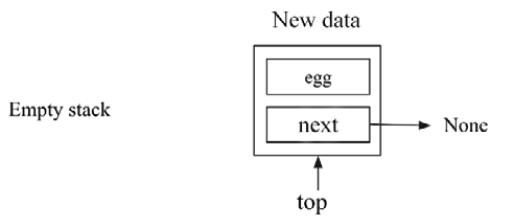

# 栈和队列

在本章中，我们将讨论两种非常重要的数据结构：栈和队列。 栈和队列有许多重要的应用，例如表单操作系统体系结构、算术表达式求值、负载平衡、管理打印作业和遍历数据。 在栈和队列数据结构中，数据是按顺序存储的，就像数组和链表一样，但与数组和链表不同的是，数据是按照特定的顺序处理的，并有一定的约束，我们将在本章中详细讨论。 此外，我们还将研究如何使用链表和数组来实现栈和队列。

在本章中，我们将讨论处理栈和队列中数据的约束和方法。 我们还将实现这些数据结构，并学习如何在 ```Python``` 中对这些数据结构应用不同的操作。

在本章中，我们将介绍以下内容：

- 如何使用各种方法实现栈和队列
- 栈和队列的一些实际示例应用程序

## 栈

栈是一种存储数据的数据结构，类似于厨房里的一叠盘子。 你可以把一个盘子放在栈顶，当你需要一个盘子时，你从栈顶拿走它。

添加到栈中的最后一个盘子将最先从栈中取出：


图 5.1：栈示例

上图描绘了一堆盘子。 只有将那个盘子留在堆的顶部才能将盘子添加到堆中。 从盘子堆中取出一个盘子意味着移除堆顶上的盘子。

栈是一种数据结构，它以类似于数组和链表的特定顺序存储数据，但有几个限制：

- 栈中的数据元素只能插入到最后（```push``` 操作）
- 一个栈中的数据元素只能从末尾删除（```pop``` 操作）
- 只能从栈中读取最后一个数据元素（```peek``` 操作）

栈数据结构允许我们从一端存储和读取数据，最后添加的元素首先被拾取。 因此，栈是后进先出 (**```LIFO```**) 结构，或后进后出 (**```LILO```**)。

在栈上执行两个主要操作——入栈和出栈。 当一个元素被添加到栈顶时，称为入栈操作，当一个元素要从栈顶取出（即移除）时，称为出栈操作。 另一个操作是 ```peek```，其中可以查看栈的顶部元素，而无需将其从栈中删除。 栈中的所有操作都是通过一个指针来进行的，这个指针一般命名为 ```top```。 所有这些操作如图 5.2 所示：


图 5.2：栈中压入和弹出操作的演示

下表演示了栈中两个重要的栈操作（```push``` 和 ```pop```）的使用：

|   栈操作   | Size |    Contents    |                      Operation results                       |
| :--------: | :--: | :------------: | :----------------------------------------------------------: |
|  stack()   |  0   |       []       |                   已创建栈对象，它是空的。                   |
| push "egg" |  1   |    ['egg']     |            一个了数据项 ```egg``` 被添加到栈中。             |
| push "ham" |  2   | ['egg', 'ham'] |               另一项 ```ham``` 被添加到栈中。                |
|   peek()   |  2   | ['egg', 'ham'] |                    返回顶部元素 ```ham```                    |
|   pop()    |  1   |    ['egg']     | ```ham``` 被弹出并返回。 （这个数据项是最后添加的，所以它首先被删除。） |
|   pop()    |  0   |       []       | ```egg``` 数据项被弹出并返回。 （这是添加的第一项，因此最后返回。） |

表 5.1：栈中不同操作的示例说明

栈用于许多事情。 栈的一种常见用法是在函数调用期间跟踪返回地址。 假设我们有以下程序：

```python
def b():
    print("b")

def a():
    b()

a()
print("done")
```

当程序执行到调用 ```a()``` 时，将遵循一系列事件以完成该程序的执行。 所有这些步骤的可视化如图 5.3 所示：


图 5.3：示例程序中函数调用期间一系列事件的步骤

事件的顺序如下：

1. 首先将当前指令的地址压入栈中，然后跳转到 ```a``` 的定义处执行
2. 在函数 ```a()``` 内部，函数 ```b()``` 被调用
3. 函数 ```b()``` 的返回地址被压入栈。 一旦 ```b()``` 中的指令和函数执行完成，返回地址就会从栈中弹出，这将我们带回函数 ```a()```
4. 当函数 ```a()``` 中的所有指令完成后，返回地址再次从栈中弹出，这将我们带回主程序和打印语句

上述程序的输出如下：

```python
b
done
```

我们现在已经讨论了栈数据结构的概念。 现在，让我们了解它在 ```Python``` 中使用数组和链表数据结构的实现。

### 使用数组的栈实现

栈像数组和链表一样按顺序存储数据，有一个特定的限制，即只能按照后进先出 (**```LIFO```**) 原则从栈的一端存储和读取数据。 一般来说，栈可以用数组和链表来实现。 基于数组的实现将具有固定长度的栈，而基于链表的实现可以具有可变长度的栈。

在栈的基于数组的实现（栈具有固定大小）的情况下，检查栈是否已满很重要，因为尝试将元素推入已满栈会产生错误， 称为溢出。 同样，尝试将弹出操作应用于空栈会导致称为下溢的错误。

让我们通过一个示例来理解使用数组的栈的实现，其中我们希望将三个数据元素```egg```、```ham``` 和```spam``` 压入栈。 首先，要使用入栈操作将新元素插入栈，我们检查溢出条件，即顶部指针指向数组的末尾索引。 栈顶指针是栈顶元素的索引位置。 如果顶部元素等于溢出条件，则不能添加新元素。 这是栈溢出情况。 如果数组中有空闲空间可以插入新元素，则将新数据压入栈。 图 5.4 显示了使用数组对栈进行压入操作的概览：


图 5.4：使用数组的栈实现中的推送操作序列

推送操作的 ```Python``` 代码如下：

```python
size = 3
data = [0] * (size)  # Initialize the stack
top = -1


def push(x):
    global top
    if top >= size - 1:
        print("Stack Overflow")
    else:
        top = top + 1
        data[top] = x
```

在上面的代码中，我们将栈初始化为固定大小（例如，在本例中为 ```3```），并将顶部指针指向 ```–1```，这表明栈为空。 此外，在 ```push``` 方法中，将顶部指针与栈的大小进行比较以检查溢出情况，如果栈已满，则打印栈溢出消息。 如果栈未满，栈顶指针加 ```1```，新的数据元素被添加到栈顶。 以下代码用于将数据元素插入栈：

```python
push('egg')
push('ham')
push('spam')
print(data[0 : top + 1] )
push('new')
push('new2')
```

在上面的代码中，当我们尝试插入前三个元素时，由于空间足够，所以添加了它们，但是当我们尝试添加数据元素 ```new``` 和 ```new2``` 时，栈已经满了，因此无法添加这两个元素 到栈。 这段代码的输出如下：

```python
['egg', 'ham', 'spam'] 
Stack Overflow 
Stack Overflow
```

接下来，```pop``` 操作返回栈顶元素的值，并将其从栈中移除。 首先，我们检查栈是否为空。 如果栈已经为空，则打印栈下溢消息。 否则，将顶部从栈中移除。 弹出操作的概览如图 5.5 所示：


图 5.5：使用数组的栈实现中的弹出操作顺序

```pop``` 操作的 ```Python``` 代码如下：

```python
def pop():
    global top
    if top == -1:
        print("Stack Underflow")
    else:
        top = top - 1
        data[top] = 0
        return data[top + 1]
```

在上面的代码中，我们首先通过检查栈是否为空来检查下溢情况。 如果顶部指针的值为 ```-1```，则表示栈为空。 否则，通过栈顶指针减 ```1``` 移除栈中的数据元素，并将栈顶数据元素返回给 ```main``` 函数。

假设我们已经向栈添加了三个数据元素，然后我们调用了四次 ```pop``` 函数。 由于栈中只有三个元素，所以移除了最开始的三个数据元素，当我们第四次尝试调用```pop``` 操作时，打印出栈下溢信息。 这显示在以下代码片段中：

```python
print(data[0 : top + 1])
pop()
pop()
pop()
pop()
print(data[0 : top + 1])
```

上述代码的输出如下：

```python
['egg', 'ham', 'spam']
Stack Underflow 
[]
```

接下来，让我们看一下 ```peek``` 操作的实现，其中我们返回栈顶元素的值。 ```Python``` 代码如下：

```python
def peek():
    global top
    if top == -1:
        print("Stack is empty")
    else:
        print(data[top])
```

在上面的代码中，首先我们检查栈顶指针的位置。 如果栈顶指针的值为 ```-1```，则表示栈为空，否则打印栈顶元素的值。

我们已经讨论了使用数组的栈的 ```Python``` 实现，接下来让我们讨论使用链表的栈实现。

### 使用链表的栈实现

为了使用链表实现栈，我们将编写 ```Stack``` 类，其中将声明所有方法； 但是，我们还将使用类似于我们在上一章中讨论的节点类：

```python
class Node:
    def __init__(self, data=None):
        self.data = data
        self.next = None
```

正如我们所知，链表中的节点保存数据和链表中下一项的引用。 使用链表实现栈数据结构可以被视为具有一些约束的标准链表，包括可以通过顶部指针从列表的末尾添加或删除元素（推送和弹出操作）。 如图 5.6 所示：


图 5.6：使用链表表示栈

现在让我们看看栈类。 它的实现与单向链表非常相似。 此外，我们需要两件事来实现栈：

- 我们首先需要知道栈顶是哪个节点，这样我们就可以通过这个节点进行 ```push``` 和 ```pop``` 操作
- 我们还想跟踪栈中的节点数，因此我们向 ```Stack``` 类添加一个 ```size``` 变量

考虑 ```Stack``` 类的以下代码片段：

```python
class Stack:
    def __init__(self):
        self.top = None
        self.size = 0
```

在上面的代码中，我们声明了 ```top``` 和 ```size``` 变量，它们被初始化为 ```None``` 和 ```0```。一旦我们初始化了 ```Stack``` 类，接下来，我们将在 ```Stack``` 类中实现不同的操作。 首先，让我们从推送操作的讨论开始。

### ```push``` 操作

```push``` 栈操作是对栈的重要操作； 它用于在栈顶部添加一个元素。 为了向栈中添加一个新节点，首先，我们检查栈中是否已经有一些数据项或者它是否为空。 我们在这里不需要检查溢出条件，因为我们不需要固定栈的长度，这与使用数组的栈实现不同。

如果栈已经有一些元素，那么我们必须做两件事：

- 新节点的 ```next``` 指针必须指向先前位于顶部的节点
- 我们通过将 ```self.top``` 指向新添加的节点，将这个新节点放在栈的顶部

参见下图5.7中的两条指令：


图 5.7：压栈操作的工作原理

如果现有的栈是空的，而要添加的新节点是第一个元素，我们需要让这个节点成为元素的顶部节点。 因此，```self.top``` 将指向这个新节点。 参见下图 5.8：



图 5.8：将数据元素 ```egg``` 插入空栈

下面是 ```push``` 操作的完整实现，应该定义在 ```Stack``` 类中：

```python
    def push(self, data):
        # create a new node
        node = Node(data)
        if self.top:
            node.next = self.top
        self.top = node
        self.size += 1
```

在上面的代码中，我们创建了一个新节点并将数据存储在其中。 然后我们检查顶部指针的位置。 如果它不为空，则意味着栈不为空，我们添加新节点，更新两个指针，如图 5.7 所示。 在 ```else``` 部分，我们让 ```top``` 指针指向新节点。 最后，我们通过增加 ```self.size``` 变量来增加栈的大小。

要创建三个数据元素的栈，我们使用以下代码：

```python
words = Stack()
words.push("egg")
words.push("ham")
words.push("spam")
# print the stack elements.
current = words.top
while current:
    print(current.data)
    current = current.next
```


上述代码的输出如下：

```python
spam
ham
egg
```

在上面的代码中，我们创建了一个包含三个元素的栈——```egg```、```ham``` 和 ```spam```。 接下来，我们将讨论栈数据结构中的弹出操作。

### ```pop``` 操作

应用于栈的另一个重要操作是弹出操作。 在这个操作中，栈顶的元素被读取，然后从栈中移除。 ```pop``` 方法返回栈顶的元素，如果栈为空则返回 ```None```。

要在栈上实现弹出操作，我们执行以下操作：

1. 首先，检查栈是否为空。 不允许在空栈上进行弹出操作。
2. 如果栈不为空，则检查顶部节点是否具有指向其他节点的下一个属性。 如果是，则表示栈中包含元素，并且最顶层节点指向栈中的下一个节点。 要应用弹出操作，我们必须更改顶部指针。 下一个节点应该在顶部。 我们通过将 ```self.top``` 指向 ```self.top.next``` 来做到这一点。 请参见下图 5.9 以了解这一点：


图 5.9：栈上弹出操作的工作原理

3. 当栈中只有一个节点时，弹出操作后栈为空。 我们必须将顶部指针更改为 ```None```。 参见下图 5.10：


图 5.10：对一个元素的栈的弹出操作

4. 删除此节点会导致 ```self.top``` 指向 ```None```，如图 5.10 所示。
5. 如果栈不为空，我们还将栈的大小减 1。

下面是 ```Python``` 中栈出栈操作的代码，应该定义在 ```Stack``` 类中：

```python
    def pop(self):
        if self.top:
            data = self.top.data
            self.size -= 1
            self.top = self.top.next or None
            return data
        else:
            print("Stack is empty")
```

在上面的代码中，首先，我们检查了顶部指针的位置。 如果不为 ```None```，说明栈不为空，我们可以应用 ```pop``` 操作，如果栈中有多个数据元素，我们将栈顶指针移动到下一个节点（见图5.9） )，如果这是最后一个节点，我们将顶部指针指向 ```None```（见图 5.10）。 我们还通过递减 ```self.size``` 变量来减小栈的大小。

假设我们在栈中有三个数据元素。 我们可以使用下面的代码将出栈操作应用到栈上：

```python
words = Stack()
words.pop()
current = words.top
while current:
    print(current.data)
    current = current.next
```

上述代码的输出如下：

```python
ham
egg
```

在上面的代码中，我们从三个元素（```egg```、```ham```、```spam```）的栈中弹出了顶部元素。

接下来，我们将讨论用于栈数据结构的 ```peek``` 操作。

### ```peek``` 操作

还有一个可以应用于栈的重要操作——```peek``` 方法。 该方法返回栈顶元素而不将其从栈中删除。 ```peek``` 和 ```pop``` 之间的唯一区别是 ```peek``` 方法只返回最顶层的元素； 但是，在 ```pop``` 方法的情况下，返回最顶层的元素，并且该元素也从栈中删除。

```peek``` 操作允许我们在不更改栈的情况下查看顶部元素。 这个操作非常简单。 如果有顶层元素，返回它的数据； 否则，返回 ```None```（因此，```peek``` 的行为与 ```pop``` 的行为相匹配）。 ```peek``` 方法的实现如下（这个应该定义在 ```Stack``` 类中）：

```python
    def peek(self):
        if self.top:
            return self.top.data
        else:
            print("Stack is empty")
```

在上面的代码中，我们首先使用 ```self.top``` 检查顶部指针的位置。 如果不为空，则表示栈不为空，返回最顶层节点的数据值，否则打印栈为空的信息。 我们可以通过下面的代码使用 ```peek``` 方法获取栈顶元素：

```python
words.peek()
```

上述代码的输出是：

```python
spam
```

根据我们将三个数据元素添加到栈的原始示例，如果我们使用 ```peek``` 方法，我们将获得顶部元素 ```spam``` 作为输出。

栈是一种重要的数据结构，具有多个实际应用程序。 为了更好地理解栈的概念，我们将讨论这些应用程序之一：利用栈进行括号匹配。

### 栈的应用

正如我们所知，数组和链表数据结构可以做栈或队列数据结构（我们将在稍后讨论）可以做的任何事情。

尽管如此，这些数据结构还是很重要，因为它们有很多应用。 例如，在任何应用程序中，可能需要以特定顺序添加或删除任何元素。 栈和队列可用于此以避免程序中的任何潜在错误，可能是从列表中间访问/删除元素（这可能发生在数组和链表的情况下）。

现在让我们看一个示例括号匹配应用程序，看看我们如何使用我们的栈来实现它。

让我们编写一个函数 ```check_brackets``` 来验证包含括号（```( )```、```[ ]``` 或 ```{ }```）的给定表达式是否平衡，即右括号的数量是否与左括号的数量匹配。 栈可用于以相反顺序遍历数据项列表，因为它们遵循 **```LILO```** 规则，这使它们成为解决此问题的不错选择。

以下代码用于在 ```Stack``` 类之外定义的单独的 ```check_brackets``` 方法。 此方法将使用我们在上一节中讨论的 ```Stack``` 类。 该方法将由字母字符和括号组成的表达式作为输入，并分别为给定表达式是否有效生成 ```True``` 或 ```False``` 作为输出。 ```check_brackets```方法的代码如下：

```python
def check_brackets(expression):
    brackets_stack = Stack()  # The stack class, we defined in previous section.
    last = " "
    for ch in expression:
        if ch in ("{", "[", "("):
            brackets_stack.push(ch)
        if ch in ("}", "]", ")"):
            last = brackets_stack.pop()
            if (
                last == "{"
                and ch == "}"
                or last == "["
                and ch == "]"
                or last == "("
                and ch == ")"
            ):
                continue
            else:
                return False
    return brackets_stack.size <= 0
```

上面的函数解析传递给它的表达式中的每个字符。 如果它得到一个开放的括号，它会将它推入栈。 如果它得到一个右括号，它将从栈中弹出顶部元素并比较两个括号以确保它们的类型匹配-```(```应该匹配```)```，```[```应该匹配```]```，和 ```{``` 应该匹配 ```}```。 如果他们不这样做，我们返回 ```False```； 否则，我们继续解析。

一旦到达表达式的末尾，我们需要进行最后一次检查。 如果栈是空的，那就没问题，我们可以返回 ```True```。 但是如果栈不为空，那么我们有一个没有匹配的右括号的左括号，我们将返回 ```False```。

我们可以使用以下代码测试括号匹配器：

```python
sl = (
    "{(foo)(bar)}[hello](((this)is)a)test",
    "{(foo)(bar)}[hello](((this)is)atest",
    "{(foo)(bar)}[hello](((this)is)a)test))",
)
for s in sl:
    m = check_brackets(s)
    print(f"{s}: {m}")
```

只有三个语句中的第一个应该匹配。 当我们运行代码时，我们得到以下输出：

```python
{(foo)(bar)}[hello](((this)is)a)test: True
{(foo)(bar)}[hello](((this)is)atest: False
{(foo)(bar)}[hello](((this)is)a)test)): False
```

在上面示例的三个表达式中，我们可以看到第一个表达式是有效的，而另外两个是无效的表达式。 因此，上述代码的输出为 ```True```、```False``` 和 ```False```。

综上所述，栈数据结构的 ```push```、```pop```、```peek``` 操作的时间复杂度为 $O(1)$，因为增删操作可以直接通过 ```top``` 指针在常数时间内进行。 栈数据结构简单； 但是，它用于在实际应用程序中实现许多功能。 例如，```Web``` 浏览器中的后退和前进按钮是使用栈实现的。 栈还用于在文字处理器中实现撤消和重做功能。

我们已经讨论了栈数据结构及其使用数组和链表的实现。 在下一节中，我们将讨论队列数据结构和可应用于队列的不同操作。

## 队列
另一个重要的数据结构是队列，它用于存储数据，类似于栈和链表，具有一些约束并以特定的顺序排列。 队列数据结构与你在现实生活中习惯的常规队列非常相似。 这就像一排人在商店里按顺序等待服务。 队列是一个需要掌握的基本重要概念，因为许多其他数据结构都建立在队列之上。

队列的工作方式如下。 通常第一个入队的人最先得到服务，每个人都会按照入队的先后顺序得到服务。 首字母缩略词 **```FIFO```** 最好地解释了队列的概念。 **```FIFO```**代表先进先出。 当人们站在队列中等待轮到他们服务时，服务只会在队列的前面提供。 因此，人们从队列的前面出队，然后从后面排队等待轮到他们。 人们离开队列的唯一时间是他们被服务时，这只发生在队列的最前面。 参考下图，人在排队，排在前面的人会先被服务：


图 5.11：队列图示

要加入队列，参与者必须站在队列中最后一个人的后面。 这是队列接受新进入者的唯一合法或允许的方式。 队列的长度无关紧要。

队列是按顺序存储的元素列表，具有以下约束：

1. 数据元素只能从一端插入，即队列的后端/尾部。
2. 数据元素只能从队列的另一端删除。
3. 只能读取队列前面的数据元素。

将元素添加到队列的操作称为入队。 从队列中删除元素使用出队操作。 每当一个元素入队时，队列的长度或大小递增 ```1```，并且使一个数据项出队会使队列中的元素数量减少 ```1```。

我们可以在图 5.12 所示的双向链表中看到这个概念，其中我们可以向尾/后端添加新元素，只能从队列的头/前端删除元素：


图 5.12：使用栈数据结构的队列实现

建议读者不要混淆表示法：入队操作只会在尾部/后端执行，出队操作将从头/前端执行。 应该固定一端用于入队操作，另一端用于出队操作； 但是，任何一端都可以用于这些操作。 在一般实践中，最好修复我们从后端执行入队操作和从前端执行出队操作。 为了演示这两个操作，下表显示了在队列中添加和删除元素的效果：

|         队列操作         | Size |           Contents            |                           运行结果                           |
| :----------------------: | :--: | :---------------------------: | :----------------------------------------------------------: |
|      ```queue()```       |  0   |           ```[]```            |                   创建的队列对象，它是空的                   |
|   enqueue ```packt```    |  1   |        ```['packt']```        |                  ```packt``` 被添加到队列中                  |
| enqueue ```publishing``` |  2   | ```['packt', 'publishing']``` |         另一个数据项 ```publishing``` 被添加到队列中         |
|       ```Size()```       |  2   | ```['packt', 'publishing']``` |              返回队列中的数据项数，在本例中为 2              |
|     ```dequeue()```      |  1   |     ```['publishing']```      | ```packt``` 出列并返回。 （此数据项是最先添加的，所以先删除。） |
|     ```dequeue()```      |  0   |           ```[]```            | ```publishing``` 数据项出列并返回。 （这是最后添加的，因此最后返回。） |

```Python``` 中的队列数据结构有一个内置的实现，```queue.Queue```，也可以使用 ```collections``` 模块中的 ```deque``` 类来实现。 队列数据结构可以使用 ```Python``` 中的多种方法来实现，即（1）```Python``` 的内置列表，（2）栈，以及（3）基于节点的链表。 我们将一一详细讨论。

### ```Python``` 的基于列表的队列

首先，为了实现基于 ```Python``` 的列表数据结构的队列，我们创建了一个 ```ListQueue``` 类，在这个类中我们声明并定义了队列的不同功能。 在这个方法中，我们将实际数据存储在 ```Python``` 的列表数据结构中。 ```ListQueue``` 类定义如下：

```python
class ListQueue:
    def __init__(self):
        self.items = []
        self.front = self.rear = 0
        self.size = 3  # 队列的最大容量
```

在 ```__init__``` 初始化方法中，```items``` 实例变量被设置为 ```[]```, 这意味着创建时队列为空。 队列的大小也设置为 ```3```（作为此代码中的示例），这是队列中可以存储的元素数量的最大容量。 而且，```rear``` 和 ```front``` 索引的初始位置也设置为 ```0```。```enqueue``` 和 ```dequeue``` 是队列中的重要方法，我们接下来会讨论。

#### ```enqueue``` 操作
```enqueue``` 操作在队列的末尾添加一个数据项。 考虑向队列添加元素的示例以理解图 5.13 中所示的概念。 我们从一个空列表开始。 最初，我们在索引 ```0``` 处添加数据项 ```3```。

接下来，我们在索引 ```1``` 处添加一个数据项 ```11```，并在每次添加元素时移动后指针：


图 5.13：队列上的 ```enqueue``` 操作示例

为了实现 ```enqueue``` 操作，我们使用 ```List``` 类的 ```append``` 方法将项（或数据）追加到队尾。 ```enqueue``` 方法的实现见如下代码。 这应该在 ```ListQueue``` 类中定义：

```python
    def enqueue(self, data):
        if self.size == self.rear:
            print("\n队列已满")
        else:
            self.items.append(data)
            self.rear += 1
```

在这里，我们首先通过比较队列的最大容量和后索引的位置来检查队列是否已满。 更进一步，如果队列中有空间，我们使用 ```List``` 类的 ```append``` 方法将数据添加到队尾，并将 ```rear``` 指针加 ```1```。

要使用 ```ListQueue``` 类创建队列，我们使用以下代码：

```python
q= ListQueue()
q.enqueue(20)
q.enqueue(30)
q.enqueue(40)
q.enqueue(50)
print(q.items)
```

上述代码的输出如下：

```python
Queue is full
[20, 30, 40]
```

在上面的代码中，我们最多可以添加三个数据元素，因为我们已经将队列的最大容量设置为 ```3```。添加三个元素后，当我们尝试添加另一个新元素时，我们会得到一条消息，即队列是 满的。

#### ```dequeue``` 操作

```dequeue``` 操作用于从队列中读取和删除数据项。 此方法从队列中返回前面的数据项并将其删除。 考虑从图 5.14 中所示的队列中取出元素的示例。 在这里，我们有一个包含元素 ```{3, 11, 7, 1, 4, 2}``` 的队列。 为了从这个队列中取出任何元素，首先插入的元素将首先被移除，因此第 ```3``` 项被移除。 当我们从队列中取出任何元素时，我们还将后指针减 ```1```：


图 5.14。 队列上的 ```dequeue``` 操作示例

下面是 ```dequeue``` 方法的实现，应该定义在 ```ListQueue``` 类中：

```python
    def dequeue(self):
        if self.front == self.rear:
            print("Queue is empty")
        else:
            data = self.items.pop(0)  # 从队列的前端删除数据项
            self.rear -= 1
            return data
```

在上面的代码中，我们首先通过比较前后指针来检查队列是否已经为空。 如果前后指针相同，则表示队列为空。 如果队列中有一些元素，我们使用 ```pop``` 方法将元素出队。 ```Python List``` 类有一个名为 ```pop()``` 的方法。 ```pop``` 方法执行以下操作：

1. 从列表中删除最后一项
2. 将列表中删除的数据项返回给调用它的用户或代码

```front``` 变量指向的第一个位置的数据项被弹出并保存在数据变量中。 我们还将 ```rear``` 变量减 ```1```，因为一个数据项已从队列中删除。 最后，在方法的最后一行，返回了数据。

要从现有队列中取出任何元素（例如数据项 ```{20, 30, 40}```），我们使用以下代码：

```python
data = q.dequeue()
print(data)
print(q.items)
```

上述代码的输出如下：

```python
20
[30, 40]
```

在上面的代码中，当我们从队列中取出一个元素时，我们得到第一个添加的元素 ```20```。

这种队列实现方法的局限性在于队列的长度是固定的，这对于队列的高效实现可能是不可取的。 现在，让我们讨论基于链表的队列实现。

### 基于链表的队列
队列数据结构也可以使用任何链表来实现，例如单链表或双向链表。 我们已经在前面的[第 4 章](./4.md)链表中讨论了单链表或双向链表的实现。 我们使用遵循队列数据结构的 **```FIFO```** 属性的链表来实现队列。

让我们讨论使用双向链表实现队列。 为此，我们从节点类的实现开始，该节点类与我们在前面[第 4 章](./4.md)链表中讨论双向链表时定义的节点相同。 此外，```Queue``` 类与双向链表类非常相似。 在这里，我们有 ```head``` 和 ```tail``` 指针，其中 ```tail``` 指向将用于添加新元素的队列的末尾（后端），而 ```head``` 指针指向将要添加的队列的开头（前端） 用于从队列中取出元素。 ```Queue``` 类的实现如下代码所示：

```python
class Node(object):
    def __init__(self, data=None, next=None, prev=None):
        self.data = data
        self.next = next
        self.prev = prev


class Queue:
    def __init__(self):
        self.head = None
        self.tail = None
        self.count = 0
```

最初，```self.head``` 和 ```self.tail``` 指针在创建 ```Queue``` 类的实例时设置为 ```None```。 为了保持对 ```Queue``` 中节点数量的统计，这里也维护了 ```count``` 实例变量，初始设置为 ```0```。

#### ```enqueue``` 操作

通过 ```enqueue``` 方法将元素添加到 ```Queue``` 对象。 数据元素通过节点添加。 ```enqueue``` 方法代码与我们在[第 4 章](./4.md)链表中讨论的双向链表的追加操作非常相似。

```enqueue``` 操作根据传递给它的数据创建一个节点并将其附加到队列的尾部。

首先，我们检查要入队的新节点是否是第一个节点，以及队列是否为空。 如果为空，则新节点成为队列的第一个节点，如图5.15所示：


图 5.15：在空队列中加入新节点的图示

如果队列不为空，则将新节点追加到队列的后端。 为了做到这一点并将一个元素加入现有队列，我们通过更新三个链接来追加节点：

1. 新节点的前一个指针应指向队列的尾部
2. 新节点的下一个指针 尾节点应指向新节点
3. 尾指针应更新为新节点。 
    所有这些链接如图 5.16 所示：


图 5.16：要为队列中的 ```enqueue``` 操作更新的链接图示

```enqueue``` 操作在 ```Queue``` 类中实现，如下代码所示：

```python
    def enqueue(self, data):
        new_node = Node(data, None, None)
        if self.head is None:
            self.head = new_node
            self.tail = self.head
        else:
            new_node.prev = self.tail
            self.tail.next = new_node
            self.tail = new_node
        self.count += 1
```

在上面的代码中，我们首先检查队列是否为空。 如果 ```head``` 指向 ```None```，这意味着队列是空的。 如果为空，则新节点成为队列的第一个节点，我们让 ```self.head``` 和 ```self.tail``` 都指向新创建的节点。 如果队列不为空，我们通过更新图 5.16 中所示的三个链接将新节点追加到队列的尾部。 最后，队列中元素的总数通过行 ```self.count += 1``` 增加。

对队列进行 ```enqueue``` 操作的最坏情况时间复杂度为 $O(1)$，因为任何项都可以在常数时间内直接通过尾指针追加。

#### ```dequeue``` 操作

使双向链表表现得像队列的另一个操作是 ```dequeue``` 方法。 该方法移除队列前面的节点，如图 5.17 所示。 在这里，我们首先检查出队元素是否是队列中的最后一个节点，如果是，则在出队操作后将队列清空。 如果不是这种情况，我们通过将 ```front/head``` 指针更新为下一个节点并将新头的 ```previous``` 指针更新为 ```None``` 来使第一个元素出队，如图 5.17 所示：


图 5.17：队列上的出队操作图示

对队列的出队操作的实现非常类似于从给定的双向链表中删除第一个元素，如下出队操作的代码所示：

```python
    def dequeue(self):
        if self.count == 1:
            self.count -= 1
            self.head = None
            self.tail = None
        elif self.count > 1:
            self.head = self.head.next
            self.head.prev = None
        elif self.count < 1:
            print("Queue is empty")
        self.count -= 1
```

为了从队列中取出任意元素，我们首先使用 ```self.count``` 变量检查队列中的数据项数。 如果 ```self.count``` 变量等于 ```1```，则表示出队元素是最后一个元素，我们将头指针和尾指针更新为 ```None```。

如果队列有很多节点，则通过更新图 5.17 所示的两个链接，将头指针移动到指向 ```self.head``` 之后的下一个节点。 我们还检查队列中是否还有数据项，如果没有，则打印一条消息说明队列为空。 最后，```self.count``` 变量减 ```1```。

队列中 ```dequeue``` 操作的最坏情况时间复杂度为 $O(1)$，因为任何项都可以在恒定时间内通过头指针直接移除。

### 基于栈的队列
队列是一种线性数据结构，其中 ```enqueue``` 操作从一端执行，删除（```dequeue```）操作从另一端执行，遵循 **```FIFO```** 原则。 使用栈实现队列有两种方法：

- 当 ```dequeue``` 操作代价高昂时
- 当 ```enqueue``` 操作代价高昂时

#### 方法 1：当 ```dequeue``` 操作代价高昂时

我们使用两个栈来实现队列。 在这种方法中, ```dequeue``` 操作很简单。 可以使用对用于队列实现的两个栈中的第一个栈（换句话说，```Stack-1```）的推送操作将新元素排入队列。

入队操作如图 5.18 所示，显示了将元素 ```{23, 13, 11}``` 入队的示例：


图 5.18：使用方法 1 在队列中进行 ```enqueue``` 操作的图示

此外，可以使用以下步骤使用两个栈（```Stack-1``` 和 ```Stack-2```）实现 ```dequeue``` 操作：

1. 首先，从 ```Stack-1``` 中移除（弹出）元素，然后将所有元素一个接一个地添加（推入）到 ```Stack-2``` 中。
2. 最顶层的数据元素将从 ```Stack-2``` 弹出，并将作为所需元素返回。
3. 最后，剩余的元素一个一个地从 ```Stack-2``` 弹出，然后再次推入 ```Stack-1```。

让我们看一个例子来帮助理解这个概念。 假设我们在队列 ```{23, 13, 11}``` 中存储了三个元素，现在我们想从这个队列中取出一个元素。 经过以上三步，完整的流程如图5.19所示。 你可能会注意到，此实现遵循队列的 **```FIFO```** 属性，因此返回 ```23```，因为它是最先添加的：


图 5.19：使用方法 1 在队列中执行 ```dequeue``` 操作的图示

 ```enqueue``` 操作的最坏情况时间复杂度是 $O(1)$，因为任何元素都可以直接添加到第一个栈中，而 ```dequeue``` 操作的时间复杂度是$O(n)$，因为所有元素都是从 ```Stack-1``` 中访问和转移到 ```Stack-2```。

#### 方法 2：当 ```enqueue``` 操作成本高昂时

在此方法中，```enqueue``` 操作与我们刚才讨论的先前方法的  ```dequeue```  操作非常相似， ```dequeue``` 操作同样类似于先前的 ```enqueue``` 操作。

为了实现 ```enqueue``` 操作，我们按照以下步骤进行：

1. 将所有元素从 ```Stack-1``` 移动到 ```Stack-2```。
2. 将我们要 ```enqueue``` 的元素推送到 ```Stack-2```。

将所有元素从 ```Stack-2``` 一个一个地移到 ```Stack-1``` 中。 从 ```Stack-2``` 弹出元素并将它们推入 ```Stack-1```。

让我们举个例子来理解这个概念。 假设我们要将三个元素 ```{23, 13, 11}``` 一个一个地 ```enqueue``` 。 我们按照上面的三个步骤来完成，如图5.20、图5.21和图5.22所示：


图 5.20：使用方法 2 将元素 ```23``` 入队到空队列


图 5.21：使用方法 2 将元素 ```13``` 入队到现有队列


图 5.22：使用方法 2 将元素 ```11``` 入队

出队操作可以直接通过对 ```Stack-1``` 应用弹出操作来实现。 让我们举个例子来理解这一点。 假设我们已经入队了三个元素，并且我们想要应用出队操作，我们可以简单地将栈顶元素弹出栈，如图 5.23 所示：


图 5.23：使用方法 2 对队列进行出队操作的图示

在第二种方法中，入队操作的时间复杂度为 $O(n)$，而出队操作的时间复杂度为 $O(1)$。

接下来，我们使用**方法 1** 讨论使用两个栈的队列的实现，其中出列操作的成本很高。 为了使用两个栈实现队列，我们首先设置两个栈实例变量以在初始化时创建一个空队列。 在这种情况下，栈只是 ```Python``` 列表，允许我们在其上调用 ```push``` 和 ```pop``` 方法，这使我们能够获得入队和出队操作的功能。 这是队列类：

```python
class Queue:
    def __init__(self):
        self.Stack1 = []
        self.Stack2 = []
```

```Stack1``` 仅用于存储添加到队列中的元素。 不能对该栈执行其他操作。

#### ```enqueue``` 操作

```enqueue``` 方法用于将数据项添加到队列中。 此方法仅接收要附加到队列的数据。 然后将此数据传递给 ```Queue``` 类中 ```Stack1``` 的 ```append``` 方法。 此外，```append``` 方法用于模拟 ```push``` 操作，将元素推送到栈的顶部。 下面的代码是 ```Python``` 中使用栈 ```enqueue``` 的实现，应该定义在 ```Queue``` 类中：

```python
    def enqueue(self, data):
        self.Stack1.append(data)
```

要将数据排入 ```Stack1```，可以使用以下代码：

```python
queue = Queue()
queue.enqueue(23)
queue.enqueue(13)
queue.enqueue(11)
print(queue.Stack1)
```

```Stack1``` 在队列上的输出如下：

```python
[23, 13, 11]
```

接下来，我们将检查出列操作的实现。

#### ```dequeue``` 操作

根据 **```FIFO```** 原则，出列操作用于按照添加项的相同顺序从队列中删除元素。 新元素被添加到 ```Stack1``` 中的队列中。 进一步，我们使用另一个栈，即 ```Stack2```，从队列中删除元素。 删除（```dequeue```）操作只会通过 ```Stack2``` 进行。 为了更好地理解如何使用 ```Stack2``` 从队列中删除数据项，让我们考虑以下示例。

最初，假设 ```Stack2``` 中填充了元素 ```5、6 和 7```，如图 5.24 所示：


图 5.24。 队列中 ```Stack1``` 的示例

接下来，我们检查 ```Stack2``` 是否为空。 由于一开始是空的，我们将所有从 ```Stack1``` 删除的元素移动到 ```Stack2```，对所有元素使用 ```Stack1``` 上的```pop``` 操作，然后将它们压入 ```Stack2```。 现在，```Stack1``` 变为空，```Stack2``` 拥有所有元素。 为了更清楚起见，我们在图 5.25 中展示了这一点：


图 5.25。 队列中 ```Stack1``` 和 ```Stack2``` 的演示

现在，如果 ```Stack``` 不为空，为了从这个队列中弹出一个元素，我们将 ```pop``` 操作应用于 ```Stack2```，我们得到元素 ```5```，这是正确的，因为它是第一个添加的，应该是第一个被添加的元素 从队列中弹出。

下面是队列的 ```dequeue```方法的实现，应该定义在 ```Queue``` 类中：

```python
    def dequeue(self):
        if not self.Stack2:
            while self.Stack1:
                self.Stack2.append(self.Stack1.pop())
        if not self.Stack2:
            print("No element to dequeue")
            return
        return self.Stack2.pop()
```

```if``` 语句首先检查 ```Stack2``` 是否为空。 如果不为空，我们继续使用 ```pop``` 方法移除队列前面的元素，如下所示：

```python
return self.Stack2.pop()
```

如果 ```Stack2``` 为空，则将 ```Stack1``` 的所有元素移动到 ```Stack2```：

```python
while self.Stack1:
    self.Stack2.append(self.Stack1.pop())
```

只要 ```Stack1```中还有元素，```while``` 循环就会继续执行。

```self.Stack1.pop()``` 语句将删除添加到 ```Stack1``` 的最后一个元素，并立即将弹出的数据传递给 ```self.Stack2.append()``` 方法。

让我们考虑一些示例代码来理解队列上的操作。 我们首先使用 ```Queue``` 实现将三个数据项添加到队列中，即 ```5、6 和 7```。接下来，我们使用以下代码应用出列操作从队列中删除数据项：

```python
queue = Queue()
queue.enqueue(23)
queue.enqueue(13)
queue.enqueue(11)
print(queue.Stack1)

queue.dequeue()
print(queue.Stack2)
```

上述代码的输出如下：

```python
[23, 13, 11]
[13, 11]
```

上面的代码片段首先将元素添加到队列中并打印出队列中的元素。 接下来，调用 ```dequeue``` 方法，之后再次打印队列时观察到元素数量的变化。

使用方法 1 的栈对队列数据结构进行 ```enqueue``` 和 ```dequeue``` 操作的时间复杂度分别为 $O(1)$ 和 $O(n)$。 这样做的原因是 ```enqueue``` 操作很简单，因为可以直接追加新元素，而在 ```dequeue``` 操作中，需要访问所有 ```n``` 个元素并将其移动到另一个栈。

总的来说，基于链表的实现是最有效的，因为 ```enqueue``` 和 ```dequeue``` 操作都可以在 $O(1)$ 时间内执行，并且对队列的大小没有限制。 在基于栈的队列实现中，其中一项操作成本很高，无论是 ```enqueue``` 还是 ```dequeue```。

### 队列的应用
队列可用于在许多实际的基于计算机的应用程序中实现各种功能。 例如，不是为网络上的每台计算机提供自己的打印机，而是可以通过排队每台计算机想要打印的内容，使计算机网络共享一台打印机。 当打印机准备好打印时，它会选择队列中的一项（通常称为作业）进行打印。 它将从首先发出命令的计算机打印命令，并按照不同计算机提交的顺序选择以下作业。

操作系统还会将要由 ```CPU``` 执行的进程排队。 让我们创建一个应用程序，它使用队列来创建一个基本的媒体播放器。

大多数音乐播放器软件允许用户将歌曲添加到播放列表。 点击播放按钮后，主播放列表中的所有歌曲都会一首接一首地播放。 歌曲的顺序播放可以通过队列来实现，因为要排队的第一首歌曲是要播放的第一首歌曲。 这与 **```FIFO```** 首字母缩略词一致。 我们将实现自己的播放列表队列以 **```FIFO```** 方式播放歌曲。

我们的媒体播放器队列只允许添加曲目和播放队列中所有曲目的方法。 在成熟的音乐播放器中，线程将用于改进队列的交互方式，而音乐播放器将继续用于选择下一首要播放、暂停甚至停止的歌曲。

```track``` 类将模拟音乐曲目：

```python
from random import randint


class Track:
    def __init__(self, title=None):
        self.title = title
        self.length = randint(5, 10)
```

每首曲目都包含对歌曲名称和歌曲长度的引用。 歌曲的长度是 ```5``` 到```10``` 之间的一个随机数。```Python``` 中的 ```random``` 模块提供了```randint``` 函数，可以让我们生成随机数。 该类代表任何包含音乐的 ```MP3``` 曲目或文件。 曲目的随机长度用于模拟播放曲目的秒数。

要创建一些 ```track``` 并打印出它们的长度，我们执行以下操作：

```python
track1 = Track("white whistle")
track2 = Track("butter butter")
print(track1.length)
print(track2.length)
```

上述代码的输出如下：

```python
6
7
```

根据为两条 ```track``` 生成的随机长度，你的输出可能会有所不同。

现在，让我们使用继承来创建我们的队列。 我们简单地从 ```Queue``` 类继承：

```python
import time


class MediaPlayerQueue(Queue):
```

为了将曲目添加到队列中，在 ```MediaPlayerQueue``` 类中创建了一个 ```add_track``` 方法：

```python
import time


class MediaPlayerQueue(Queue):
    def add_track(self, track):
        self.enqueue(track)
```

该方法将 ```track``` 对象传递给队列超类的入队方法。 实际上，这将使用 ```track``` 对象（作为节点的数据）创建一个节点，如果队列不为空则指向尾部，或者如果队列为空则指向头部和尾部，到这个新节点。

假设队列中的曲目按顺序播放，从添加的第一首曲目到最后一首 (**```FIFO```**)，那么播放函数必须循环遍历队列中的元素：

```python
    def play(self):
        while self.count > 0:
            current_track_node = self.dequeue()
            print(f"Now playing {current_track_node.data.title}")
            time.sleep(current_track_node.data.length)
```

```self.count``` 记录 ```track``` 何时添加到我们的队列以及 ```track``` 何时出队。 如果队列不为空，则调用 ```dequeue``` 方法将返回队列前面的节点（其中包含跟踪对象）。 打印语句然后通过节点的数据属性访问 ```track``` 的标题。 为了进一步模拟曲目的播放，```time.sleep()``` 方法会暂停程序执行，直到曲目的秒数过去：

```python
time.sleep(current_track_node.data.length)
```

媒体播放器队列由节点组成。 当 ```track``` 被添加到队列中时， ```track``` 被隐藏在一个新创建的节点中并与该节点的数据属性相关联。 这就解释了为什么我们通过调用 ```dequeue``` 返回的节点的数据属性来访问节点的跟踪对象。

你可以看到，在这种情况下，我们的节点对象不是只存储任何数据，而是存储 ```track``` 。

让我们试一试我们的音乐播放器：

```python
track1 = Track("white whistle")
track2 = Track("butter butter")
track3 = Track("Oh black star")
track4 = Track("Watch that chicken")
track5 = Track("Don't go")
```

我们创建五个以随机词作为标题的 ```track``` 对象，如下：

```python
print(track1.length)
print(track2.length)
```

输出如下：

```python
8
9
```

由于随机长度，输出可能与你在机器上获得的不同。

接下来，使用以下代码片段创建 ```MediaPlayerQueue``` 类的实例：

```python
media_player = MediaPlayerQueue()
```

 ```track``` 将被添加，播放函数的输出应该按照我们排队的相同顺序打印出正在播放的曲目：

```python
media_player.add_track(track1)
media_player.add_track(track2)
media_player.add_track(track3)
media_player.add_track(track4)
media_player.add_track(track5)
media_player.play()
```

上述代码的输出如下：

```python
Now playing white whistle
Now playing butter butter
Now playing Oh black star
Now playing Watch that chicken
Now playing Don't go
```

程序执行后，可以看到曲目按照排队的顺序播放。 播放每首曲目时，系统还会暂停等于曲目的长度的秒数。

## 概括
在本章中，我们讨论了两种重要的数据结构，即栈和队列。 我们已经看到了这些数据结构如何紧密地模仿现实世界中的栈和队列。 探索了具体的实现及其不同的类型。 我们后来应用栈和队列的概念来编写现实生活中的程序。

我们将在下一章考虑树。 将讨论对树的主要操作，以及该数据结构的不同应用领域。

## 练习

1. 以下哪个选项是使用链表的真正队列实现？
   1. 如果在 ```enqueue``` 操作中，在列表的开头添加了新的数据元素，那么 ```dequeue``` 操作必须从末尾开始执行。
   2. 如果在 ```enqueue``` 操作中，新的数据元素被添加到链表的末尾，那么 ```enqueue``` 操作必须从链表的开头开始执行。
   3. 以上两者。
   4. 以上都不是。
2. 假设队列是使用具有头指针和尾指针的单链表实现的。 入队操作在队头实现，出队操作在队尾实现。 入队和出队操作的时间复杂度是多少？
3. 实现一个队列最少需要多少个栈？
4. 使用数组可以有效地实现队列中的入队和出队操作。 这两个操作的时间复杂度是多少？
5. 我们如何以相反的顺序打印队列数据结构的数据元素？