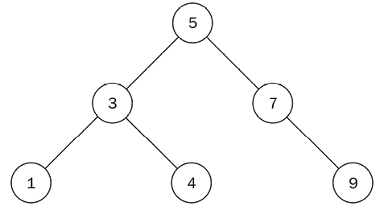
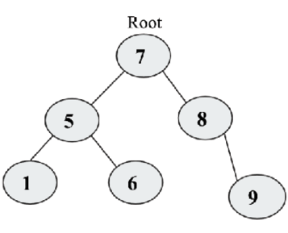

# 树

树是数据结构的分层形式。 不同于列表，队列和栈之类的数据结构是线性的(顺序存储)。 但是，树是非线性数据结构，因为这些数据项之间存在父子关系。 树的数据结构的顶部称为根节点。 这是树上所有其他节点的祖先。

由于它们在各种应用中使用，例如解析表达式，有效的搜索和优先级队列，因此树数据结构非常重要。 某些文档类型（例如 ```XML``` 和 ```HTML```）也可以在树中表示。

在本章中，我们将介绍以下主题：

- 树的术语和定义
- 二叉树和二叉树搜索
- 树遍历
- 二叉搜索树

## 术语

让我们考虑一些与树数据结构相关的术语。

要了解树，我们需要首先了解与它们相关的基本概念。 树是一种数据结构，其中数据以层次形式组织。

图6.1包含一棵典型的树，该树由字符节点组成。


图6.1：示例树数据结构

这是与树相关的术语列表：

- **节点**：前图中的每个字母代表一个节点。 节点是存储数据的任何数据结构。
- **根节点**：根节点是树中所有其他节点从中分支的第一个节点。 换句话说，根节点是一个没有父节点的节点。 在每个树中，总是有一个唯一的根节点。 根节点是上述示例树中的节点 ```A```。
- **子树**：子树是一棵树，其鼻祖从其他树中生成。 例如，节点 ```F```，```K``` 和 ```L``` 形成原始树的子树。
- **度**：给定节点的子节点总数称为节点的度。 一个由一个节点组成的树的度量为 ```0```。上图中的节点 ```A``` 的度为 ```2```，节点 ```B``` 的度为 ```3```，节点 ```C``` 的度为 ```3```，而节点 ```G``` 的度为 ```1```。
- **叶节点**：叶节点没有任何子节点，是给定树的末端节点。 叶节点的程度始终为 ```0```。在上图中，节点 ```J```，```E```，```K```，```L```，```H```，```M```，```I``` 都是叶节点。
- **边**：树上任何给定的两个节点之间的连接称为边。 给定树中的边总数最多比树中的总节点小。 一个示例边如图6.1所示。
- **父节点**：具有子树的节点是该子树的父节点。 例如，节点 ```B```是节点 ```D```，```E``` 和 ```F``` 的父节点，而节点 ```F``` 是节点 ```K``` 和 ```L``` 的父节点。
- **子节点**：这是一个来自父节点的后代节点。 例如，节点 ```B``` 和 ```C``` 是父节点 ```A``` 的子节点，而节点 ```H```，```G``` 和 ```I``` 是父节点 ```C``` 的子节点。
- **兄弟节点**：所有具有同一父节点的节点都是兄弟节点。 例如，节点 ```B``` 是节点 ```C``` 的兄弟节点，同样，节点 ```D```，```E``` 和 ```F``` 也是兄弟节点。
- **级**：树的根节点被认为是在 ```0``` 级 。 例如，在图6.1中，根节点 ```A``` 在 ```0``` 级，节点 ```B``` 和 ```C``` 为 ```1``` 级，而节点```D```，```E```，```F```，```H```，```G```和 ```I``` 处于 ```2``` 级。
- **树的高度**：树的最长路径中的节点总数是树的高度。 例如，在图6.1中，树的高度为 ```4```，是最长的路径，```A-B-D-J```，```A-C-G-M``` 和 ```A-B-F-K```，每个路径总数均为 ```4``` 个节点。
- **深度**：节点的深度是从树的根节点到该节点的边数。 在前面的树示例中，节点 ```H``` 的深度为 ```2```。

在线性数据结构中，数据项按顺序存储，而非线性数据结构将数据项存储在非线性结构中，其中数据项可以连接不止一项其他数据项。 线性数据结构中的所有数据项，例如数组，列表，栈和队列，都可以在一个通道中遍历，而对于非线性数据结构（例如树），这是不可能的； 它们与其他线性数据结构的存储方式不同。

在树数据结构中，节点在父子关系中排列。 树中的节点之间不应有任何周期。 树结构具有形成层次结构的节点，没有节点的树被称为空树。

首先，我们将讨论最重要的树之一: 二叉树。

## 二叉树
二叉树是节点的集合，其中树的节点可以为零，一个或两个子节点。 一棵简单的二叉树有两个子节点，即左子节点和右子节点。

例如，在图6.2所示的二叉树中，有一个根节点有两个子节点（一个左子节点，一个右子节点）：


图6.2：二叉树的示例

二叉树中的节点以左子树和右子树的形式组织。 例如，图6.3中显示了一个五个节点的树，该树具有根节点，```R``` 和两个子树，即左子树: ```T1``` 和右子树: ```T2```：


图6.3：五个节点的示例二叉树

普通的二叉树没有其他关于如何在树上排列的规则。 它只能满足每个节点最多有两个子节点的条件。

如果一棵二叉树的所有节点都有零或两个子节点，并且没有一个子节点，则一棵树被称为完全二叉树。 完全二叉树的一个示例如图6.4所示：


图6.4：完全二叉树的示例

一棵完全二叉树在二叉树上的所有节点都填充满了，并且没有任何新节点的空间。 如果我们添加新节点，则只能通过增加树的高度来添加它们。 完全二叉树如图6.5所示：


图6.5：完全二叉树的示例

完全二叉树填充满了所有可能的节点，除了在树的最低级别上有可能的例外。 所有节点也填充在左侧。 完全二叉树显示在图6.6中：


图6.6：完全二叉树的示例

二叉树可以平衡或不平衡。 在平衡二叉树中，树中每个节点的左右子树高度差不超过1。平衡树如图6.7所示：


图6.7：平衡树的示例

一棵不平衡的二叉树是一棵二叉树，右子树和左子树之间的高度超过1。 不平衡树的一个示例如图6.8所示：


图6.8：不平衡树的示例

接下来，我们将讨论简单二叉树实现的详细信息。

### 树节点的实现

正如我们已经在前几章中讨论的那样，一个节点由数据项和对其他节点的引用组成。

在二叉树节点中，每个节点将包含数据项和两个引用，分别指向其左右子节点。 让我们看一下在 ```Python``` 中构建二叉树节点类的以下代码：

```python
class Node:
    def __init__(self, data):
        self.data = data
        self.right_child = None
        self.left_child = None
```

为了更好地了解该课程的工作，让我们首先创建一个四个节点的二叉树（```N1```，```N2```，```N3``` 和 ```N4```），如图6.9所示：


图6.9：四个节点的二叉树

为此，我们首先创建了四个节点-```N1```，```N2```，```N3```和 ```N4```：

```python
n1 = Node("root node")
n2 = Node("left child node")
n3 = Node("right child node")
n4 = Node("left grandchild node")
```

接下来，我们根据先前讨论的二叉树的属性将节点相互连接。 ```N1``` 将是根节点，```N2``` 和 ```N3``` 是其子节点。 此外，```N4``` 将是 ```N2```的左子节点。 下一个代码片段根据所需的树显示了树不同节点之间的连接，如图6.9所示：

```python
n1.left_child = n2
n1.right_child = n3
n2.left_child = n4
```

在这里，我们创建了一个非常简单的树结构，该结构的四个节点。 创建树后，要应用于树的最重要的操作之一就是遍历。 接下来，我们将了解如何遍历树。

### 树遍历

访问树上所有节点的方法称为树遍历。 在线性数据结构的情况下，数据数据遍历很简单，因为所有数据项都是以顺序存储的，因此每个数据项仅访问一次。 但是，在非线性数据结构（例如树和图）的情况下，遍历算法很重要。 要理解遍历，让我们看看遍历在上一节中创建的二叉树的左子树。 为此，我们从根节点开始，打印出节点，然后向下移动到下一个左节点。 我们一直这样做，直到达到左子树的尽头，就像这样：

```python
current = n1
while current:
    print(current.data)
    current = current.left_child
```

代码的输出如下：

```python
left grandchild node
left child node
root node
right child node
```

根据访问根节点、左子树或右子树的顺序，有多种处理和遍历树的方法。主要有两种方法，首先是一种从节点开始，然后遍历每个可用的子节点，然后继续遍历下一个兄弟节点。 这种方法有三种可能的变体，即中序遍历，前序遍历和后序遍历。 遍历树的另一种方法是从根节点开始，然后访问每个级别上的所有节点，然后按级处理节点级别。 我们将在以下各节中讨论每种方法。

#### 中序遍历

按住树遍历的步骤如下：我们开始递归遍历左子树，一旦完成，就访问根节点，然后最后再遍历右子树。 它有以下三个步骤：

1. 我们开始遍历左子树，然后递归调用遍历功能
2. 接下来，我们访问根节点
3. 最后，我们遍历右子树，并递归地调用遍历功能

因此，简而言之，对于树的遍历，我们以左子树，根，然后是右子树的顺序访问树中的节点。

让我们考虑图6.10中显示的示例树以理解树的遍历：


图6.10：一个示例二叉树，用于阶数树遍历

在图6.10所示的二叉树中，内存遍历的工作如下：首先，我们递归访问根节点 ```A``` 的左子树 ```A```。节点 ```A``` 的左子树 ```A``` 具有节点 ```B``` 为根节点，因此我们再次转到根节点 ```B``` 的左子树，也就是说访问根节点 ```D```，然后访问合适的子节点 ```H```。

接下来，我们访问节点 ```B```，然后访问节点 ```E```。以这种方式，我们访问了根节点 ```A``` 的左子树 ```A```。 我们首先转到 ```null``` 的根节点 ```C``` 的左子树，因此接下来，我们访问节点 ```C```，然后访问节点 ```C``` 的正确子节点，即节点 ```F```。

因此，该示例的树的术中遍历是```G-D-H-B-E-A-C-F```。

递归函数的 ```Python``` 实现以返回树中节点的排序清单如下：

```python
def inorder(root_node):
    current = root_node
    if current is None:
        return
    inorder(current.left_child)
    print(current.data)
    inorder(current.right_child)


inorder(n1)
```

首先，我们检查当前节点是 ```null``` 的还是空的。 如果不是空的，我们将遍历树。 我们通过打印访问的节点数据访问节点。 在这种情况下，我们首先将其递归称为 ```current.left_child```，然后访问根节点，最后，我们用 ```current.right.right.child``` 递归地调用 ```inorder``` 函数。

最后，当我们在上述四个节点的示例树上应用上述遍及遍历算法时。 将 ```N1``` 作为根节点，我们将获得以下输出：

```python
left grandchild node
left child node
root node
right child node
```

接下来，我们将讨论前序遍历。

#### 前序遍历

前序遍历以根节点，左子树和右子树的顺序遍历树。 它的工作如下：

1. 我们开始使用根节点进行遍历
2. 接下来，我们遍历左子树，并递归左子树调用遍历功能
3. 接下来，我们访问右子树，并用右子树调用遍历功能

考虑图6.11中所示的示例树以理解前序遍历：


图6.11：一个示例树了解前序遍历

图6.11所示的示例二叉树的前序遍历如下：首先，我们访问根节点```A``` (```root```)，所以我们访问这个根节点，然后转到根节点 ```B```，节点 ```D``` 的左子树。我们访问节点```D```，然后访问根节点 ```D``` 的左子树，然后我们访问左子树 ```G```，根节点 ```D``` 的子树。由于没有节点 ```G``` 的子节点，我们访问了正确的子树。 我们回退到根节点 ```D```，节点 ```H``` 的子树的合适子节点。

通过这种方式，我们访问了根节点 ```A``` 的根节点 ```A``` 和根节点 ```A``` 的左子树。接下来，我们访问根节点 ```A``` 的右子树 ```A```。在这里，我们访问根节点 ```C```，然后转到根节点的左子树 ```C```，为 ```null```，所以我们访问了节点 ```C```，节点 ```F``` 的合适子节点。

该示例树的前序遍历将是```A-B-D-G-H-E-C-F```。

前序遍历的递归功能如下：

```python
def preorder(root_node):
    current = root_node
    if current is None:
        return
    print(current.data)
    preorder(current.left_child)
    preorder(current.right_child)


preorder(n1)
```

首先，我们检查当前节点是否为 ```null``` 或空。 如果为空，则说明这棵树是空树，如果当前节点不为空，则使用前序算法遍历这棵树。 前序遍历算法按照根、左子树、右子树的顺序递归遍历树，如上代码所示。 最后，当我们将上面的前序遍历算法应用于上面以 ```n1``` 个节点为根节点的四个节点的样本树时，我们得到如下输出：

```python
root node
left child node
left grandchild node
right child node
```

接下来，我们将讨论后序遍历。

#### 后序遍历

后序遍历的步骤如下：

1. 我们开始遍历左子树，然后递归调用遍历功能
2. 接下来，我们遍历右子树并递归调用遍历功能
3. 最后，我们访问根节点

因此，简而言之，对于后序遍历，我们按左子树，右子树和最后的根节点访问树中的节点。

考虑图6.12中所示的以下示例树了解后序遍历：


图6.12：一个示例树了解前序遍历

在上图（图6.12）中，我们首先递归递归根节点的左子树。 我们到达最后一个左子树，即根节点 ```D```，然后我们访问其左侧的节点，即节点 ```G```。我们访问了正确的子节点 ```H```，然后我们访问根节点 ```D``` 遵循相同的规则，我们接下来访问节点 ```B``` 的正确子节点。 访问节点 ```F```，然后我们访问节点 ```C```。最后，我们访问根节点 ```A```。

该示例树的后序遍历将是```G-H-D-E-B-F-C-A```。

树遍历的后阶方法的实现如下：

```python
def postorder(root_node):
    current = root_node
    if current is None:
        return
    postorder(current.left_child)
    postorder(current.right_child)
    print(current.data)


postorder(n1)
```

首先，我们检查当前节点是 ```null``` 的还是空的。 如果它不是空的，我们将使用所讨论的后序遍历算法，最后，当我们将上述后序遍历算法应用于上述四个节点的样本树上，```N1```作为根节点。 我们将获得以下输出：

```python
left grandchild node
left child node
right child node
root node
```

接下来，我们将讨论层序遍历。

#### 层序遍历

在这种遍历方法中，我们首先访问树的根，然后访问树下下一级上的每个节点。 然后，我们继续进入树上的下一个级，依此类推。 这种树的遍历是图中的宽度第一遍历的工作方式，因为它通过深入到树之前将所有节点遍历的所有节点拓宽。

让我们考虑以下示例树并遍历：


图6.13：一个示例树了解层序遍历

在图6.13中，我们首先访问级别 ```0``` 的根节点，该节点是值为 ```4``` 的节点。我们通过打印其值访问该节点。 接下来，我们移至 ```1``` 级，访问该级的所有节点，即具有值 ```2``` 和 ```8``` 的节点。 该级别的节点为 ```1```、```3```、```5``` 和 ```10```。因此，该树的层序遍历如下：```4```、```2```、```8```、```1```、```3```、```5``` 和 ```10```。

使用队列数据结构实现层序遍历。 我们首先访问根节点，然后将其推入队列。 访问队列前面的节点（```dequeued```），然后可以打印或存储以供以后使用。 添加根节点后，将左子节点添加到队列中，然后添加右节点。 因此，当在树的任何给定级进行遍历时，该级的所有数据项首先从左到右插入队列中。 之后，所有节点都是从队列访问的。 为树的所有级重复此过程。

使用此算法的前面树的遍历将加入根节点 ```4```，去除并访问节点。 接下来，节点 ```2``` 和 ```8 ```被访问，因为它们是下一个级的左右节点。 节点 ```2```被 ```dequeued```，以便可以访问。 接下来，它的左右节点是节点 ```1``` 和 ```3```。 在这一节点上，队列前面的节点是节点 ```8```。我们 ```dequeued``` 并访问节点 ```8```，然后我们加入其左右节点。 这个过程一直持续到队列为空为止。

广度优先遍历的 ```Python``` 实施如下。 我们列出根节点，并保留 ```list_of_nodes```列表中访问的节点的列表。 ```Dequeue``` 类用于保持队列：

```python
n1 = Node("root node")
n2 = Node("left child node")
n3 = Node("right child node")
n4 = Node("left grandchild node")
n1.left_child = n2
n1.right_child = n3
n2.left_child = n4


def level_order_traversal(root_node):
    list_of_nodes = []
    traversal_queue = deque([root_node])
    while len(traversal_queue) > 0:
        node = traversal_queue.popleft()
        list_of_nodes.append(node.data)
        if node.left_child:
            traversal_queue.append(node.left_child)
            if node.right_child:
                traversal_queue.append(node.right_child)
    return list_of_nodes


print(level_order_traversal(n1))
```

如果 ```traversal_queue``` 中的数据数大于零，则执行循环的主体。 队列前面的节点弹出并添加到 ```List_of_nodes``` 列表中。 如果存在带有左节点的节点，则第一个 ```if``` 语句将加入左子节点。 第二个 ```if``` 语句对正确的子节点进行了相同的操作。 此外，```List_of_nodes``` 列表在最后一个语句中返回。

上述代码的输出如下：

```python
['root node', 'left child node', 'right child node', 'left grandchild node']
```

我们讨论了不同的树遍历算法。 我们可以根据应用程序使用这些算法中的任何一种。 当我们需要从树上排序的内容时，中序遍历非常有用。 如果我们需要降序的数据项，这也适用，我们可以通过逆转顺序（例如右子树，根，然后再左子树）来做到这一点。 这被称为反向遍历。 而且，如果我们需要在任何叶子前检查根，我们将使用前序遍历。 同样，如果我们需要在根节点之前检查叶子节点。

以下是二元树的一些重要应用：

- 二叉树作为表达树，在编译器中使用
- 它也用于数据压缩中的霍夫曼编码
- 二叉树搜索用于有效搜索，插入和删除数据项列表
- 优先队列（```PQ```），用于在最坏情况下以对数时间集合中查找和删除最小或最大数据项

接下来，让我们讨论表达树。

### 表达树

表达式树是一种特殊的二叉树，可用于表示算术表达式。 算术表达式由运算符和操作数的组合表示，其中运算符可以是一元或二元。 在这里，运算符显示了我们要执行的操作，运算符告诉我们要将这些操作应用于哪些数据项。 如果运算符应用于一个操作数，则称为一元运算符，如果应用于两个操作数，则称为二元运算符。

算术表达式也可以用二叉树表示，也称为表达式树。 中缀表示法是一种常用的表示法，用于表达运算符位于操作数之间的算术表达式。 它是表示算术表达式的常用方法。 在表达式树中，所有叶节点都包含操作数，非叶节点包含运算符。 还值得注意的是，在一元运算符的情况下，表达式树的其中一个子树（右或左）为空。

算术表达式使用三种符号表示：中缀、后缀或前缀。 表达式树的中序遍历产生中缀表示法。 例如，```3 + 4``` 的表达式树如图 6.14 所示：


图6.14：表达式 ```3 + 4``` 的表达树

在此示例中，操作数在操作数之间插入（插入）为 ```3 + 4```。在必要时，可以使用括号来构建更复杂的表达式。 例如，对于```(4 + 5) * (5-3)```，我们将得到以下内容：


图6.15：表达式树```(4 + 5) * (5-3)```

前缀表示法通常称为波兰符号。 在此表示法中，操作符在操作数之前。 例如，添加两个数字 ```3``` 和 ```4``` 的算术表达式将显示为 ```+ 3 4```.让我们考虑另一个示例，```(3 + 4) * 5```.这也可以表示为 ```*( + 3 4) 5``` 前缀表示法。 表达树的预定遍历导致算术表达的前缀表示法。 例如，考虑图6.16所示的表达树：


图6.16：一个示例表达树，要理解前序遍历

图6.16所示的表达树的预定遍历将在前缀表示法中以 ```+-8 3 3``` 的形式给出表达式。

后缀或反向抛光符号（```RPN```）将操作符放在操作数之后，例如 ```3 4 +```。 图6.17所示的表达树的后序遍历给出了算术表达式的后缀符号。


图6.17：一个示例表达树，要理解后序遍历

前面表达树的后缀符号为 ```8 3 - 3 +```。 我们现在已经讨论了表达树。 使用后缀符法评估给定算术表达式的表达树很容易，因为它提供了更快的计算。

#### 解析反向波兰表达

为了从后缀符号创建表达树，使用栈。 在此，我们一次处理一个符号； 如果该符号是操作数，则将其引用将其推入栈，如果符号是操作符，则我们会从栈中弹出两个指针，并形成一个新的子树，其根是操作符。 从栈中弹出的第一个参考是子树的正确子节点，第二个引用成为子树的左子节点。 此外，将对这个新子树的引用推入栈。 以这种方式，对后缀符号的所有符号进行处理以创建表达树。

让我们以 ```4 5 + 5 3 - *``` 的例子为例。

首先，我们将符号 ```4``` 和 ```5``` 推到栈上，然后我们处理下一个符号 ```+```，如图6.18所示：


图6.18：操作数 ```4``` 和 ```5``` 被推到栈上

当读取新的符号 ```+``` 时，将其制成新子树的根节点，然后从栈中弹出两个引用，并添加最上方的引用作为根节点的右侧，而下一个弹出的引用为 如图6.19所示，添加为子树的左子节点：


图6.19：在创建表达树时处理了操作符 ```+```

下一个符号是 ```5``` 和 ```3```，将它们推入栈。 接下来，当一个新符号是操作符 ```-``` 时，它是作为新子树的根而创建的，并且分别弹出了两个顶部引用并分别添加到该根的左右子节点，如图6.20所示。 然后，将对此子树的引用推到栈：


图6.20：在创建表达树时处理操作符 ```-```

下一个符号是操作符 ```*```; 正如我们到目前为止所做的那样，这将作为根部创建，然后将从栈中弹出两个引用，如图6.21所示。 然后，最后的树如图6.21所示：


图6.21：在创建表达树时处理操作符 ```*```

要了解如何在 ```Python``` 中实现此算法，我们将考虑建造一棵树，以用后缀符号编写的表达法。 为此，我们需要一个树节点实现； 它可以定义如下：

```python
class TreeNode:
    def __init__(self, data=None):
        self.data = data
        self.right = None
        self.left = None
```

以下是我们将使用的栈类实现的代码：

```python
class Stack:
    def __init__(self):
        self.elements = []

    def push(self, item):
        self.elements.append(item)

    def pop(self):
        return self.elements.pop()
```

为了构建树，我们将在栈的帮助下写入数据。 让我们举一个算术表达式的例子并设置我们的栈：

```python
expr = "4 5 + 5 3 - *".split()
stack = Stack()
```

在第一个语句中，```split()``` 方法默认情况下在空格上拆分。 ```expr``` 是一个值```4```、```5```、```5```、```5```、```3```， ```-``` 和 ```*``` 的列表。

```expr```列表的每个数据将是操作符或操作数。 如果我们得到操作数，那么我们将其嵌入树节点并将其推到栈上。 如果我们得到操作符，我们将操作符嵌入到树节点中，然后将其两个操作数弹出到节点的左右子节点中。 在这里，我们必须注意确保第一个流行参考文献进入合适的子节点。

在继续前面的代码段时，以下代码是构建树的循环：

```python
for term in expr:
    if term in "+-*/":
        node = TreeNode(term)
        node.right = stack.pop()
        node.left = stack.pop()
    else:
        node = TreeNode(int(term))
    stack.push(node)
```

请注意，在操作数的情况下，我们执行从字符串到 ```int``` 的转换。 如果你希望支持浮点操作数，则可以使用 ```float()```。

在这个操作结束时，我们应该在栈中有一个数据，它包含了整棵树。

如果要计算表达式，我们可以使用以下功能：

```python
def calc(node):
    if node.data == "+":
        return calc(node.left) + calc(node.right)
    elif node.data == "-":
        return calc(node.left) - calc(node.right)
    elif node.data == "*":
        return calc(node.left) * calc(node.right)
    elif node.data == "/":
        return calc(node.left) / calc(node.right)
    else:
        return node.data
```

在前面的代码中，我们将节点传递给该函数。 如果该节点包含操作数，那么我们简单地返回该值。 如果我们有操作符，那么我们执行操作符在节点的两个子节点上代表的操作。 但是，由于一个或多个子节点也可以包含操作数或操作符，因此我们将 ```calc()``` 函数递归地称为两个子节点（请记住，每个节点的所有子节点也是节点）。

现在，我们只需要从栈中弹出根节点，然后将其传递到 ```calc()``` 函数。 然后，我们应该有计算的结果：

```python
root = stack.pop()
result = calc(root)
print(result)
```

运行此程序应产生结果```18```，这是 ```(4 + 5) * (5-3)``` 的结果。

表达式树在轻松表示和评估复杂表达式方面非常有用。 评估后缀、前缀和中缀表达式也很有用。 它可用于找出给定表达式中运算符的结合性。

在下一节中，我们将讨论二叉搜索树，它是一种特殊的二叉树。

## 二叉搜索树搜索

二叉搜索树（**```BST```**）是一种特殊的二叉树。 它是计算机科学应用程序中最重要，最常用的数据结构之一。 二叉搜索树是一棵在结构上是二叉树，并且非常有效地将数据存储在其节点中。 它提供非常快速的搜索，插入和删除操作。

如果树中的任何节点的值大于其左子树的所有节点中的值，则称为二叉树搜索，而小于（或等于）右子树的所有节点的值（或等于） 。 例如，如果 ```K1```，```K2``` 和 ```K3``` 是三个节点树的 ```key``` 值（如图6.22所示），则应满足以下条件：

1. ```key``` 值```k2 <= k1```
2. ```key``` 值```k3 > k1```

下图描述了二叉搜索树的上述条件：


图 6.22：二叉搜索树的示例

让我们考虑另一个例子，以便我们更好地理解二叉搜索树。 考虑图 6.23 中所示的二叉搜索树：



图 6.23：六个节点的二叉搜索树

在这棵树中，左子树中的所有节点都小于（或等于）父节点的值。 该节点右子树中的所有节点也都大于父节点。

要查看上面的示例树是否满足二叉搜索树的属性，我们可以看到根节点左子树中所有节点的值都小于 ```5```。同样，右子树中所有节点的值都大于 ```5```。此属性适用于树中的所有节点，无一例外。 例如，如果我们取另一个值为 ```3``` 的节点，我们可以看到所有左子树节点的值都小于值 ```3```，而所有右子树节点的值都大于 ```3```。

考虑二叉树的另一个例子。 让我们检查一下它是否是二叉搜索树。 尽管下图（图 6.24）看起来与上图相似，但它不符合二叉搜索树的条件，因为节点 ```7``` 大于根节点 ```5```； 即使它位于根节点的左子树中。 节点 ```4``` 在其父节点 ```7``` 的右子树中，这也违反了二叉搜索树的规则。 因此图 6.24，不是二叉搜索树：


图 6.24：不是二叉搜索树的二叉树示例

让我们开始在 ```Python``` 中实现二叉搜索树。 由于我们需要跟踪树的根节点，因此我们首先创建一个包含对根节点的引用的 ```Tree``` 类：

```python
class Tree:
    def __init__(self):
        self.root_node = None
```

这就是维护树状态所需的全部。 现在，让我们检查二叉搜索树中使用的主要操作。

### 二叉搜索树操作

可以对二叉搜索树执行的操作有插入、删除、查找最小值、查找最大值和搜索。 我们将在以下各节中一一详细讨论它们。

#### 插入

在二叉搜索树上实现的最重要的操作之一是在树中插入数据项。 为了向二叉搜索树中插入一个新数据，我们必须确保在添加新数据后不违反二叉搜索树的属性。

为了插入一个新数据，我们首先将新节点的值与根节点进行比较：如果该值小于根值，那么新数据将被插入到左子树；否则，它将被插入到右子树中。 以这种方式，我们走到树的末尾插入新数据。

让我们通过在树中插入数据项 ```5```、```3```、```7``` 和 ```1``` 来创建二叉搜索树。 考虑以下：

1. 插入 ```5```：我们从第一个数据项 ```5``` 开始。为此，我们将创建一个数据属性设置为 ```5``` 的节点，因为它是第一个节点。
2. 插入 ```3```：现在，我们要添加值为 ```3``` 的第二个节点，以便将数据值 ```3``` 与根节点的现有节点值 ```5``` 进行比较。 由于节点值 ```3``` 小于 ```5```，它将被放置在节点 ```5``` 的左子树中。二叉搜索树将如图 6.25 所示：


图 6.25：示例二叉搜索树中插入操作的第 ```2``` 步

这里，树满足二叉搜索树规则，其中左子树中的所有节点都小于父节点。

3. 插入 ```7```：为了向树中添加另一个值为 ```7``` 的节点，我们从值为 ```5``` 的根节点开始进行比较，如图 6.26 所示。 由于 ```7``` 大于 ```5```，因此值为 ```7``` 的节点位于该根的右侧：


图 6.26：示例二叉搜索树中插入操作的第 ```3``` 步

4. 插入 ```1```：接下来，我们再添加一个值为 ```1``` 的节点。从树的根开始，我们对 ```1``` 和 ```5``` 进行比较，如图6.27所示：


图 6.27：示例二叉搜索树中插入操作的第 ```4``` 步

这样比较可以看出 ```1``` 小于 ```5```，所以我们去 ```5``` 的左子树，它有一个值为 ```3``` 的节点，如图6.28所示：


图 6.28：示例二叉搜索树中节点 ```1``` 和节点 ```3``` 的比较

当我们将 ```1``` 与 ```3``` 进行比较时，```1``` 小于 ```3```，因此我们在节点 ```3``` 的下方向其左侧移动一个级别，如图 6.28 所示。 但是，那里没有节点。 因此，我们创建一个值为 ```1``` 的节点，并将其与节点 ```3``` 的左指针关联起来，得到最终的树。 到这里，我们就得到了最终的 ```4``` 个节点的二叉搜索树，如图 6.29所示：


图 6.29：示例二叉搜索树中插入操作的最后一步

我们可以看到这个例子只包含整数或数字。 因此，如果我们需要将字符串数据存储在二叉搜索树中，则将按字母顺序比较字符串。

如果我们想在二叉搜索树中存储任何自定义数据类型，我们必须确保二叉搜索树类支持排序。

在二叉搜索树中添加节点的 ```insert``` 方法的 ```Python``` 实现如下：

```python
class Node:
    def __init__(self, data):
        self.data = data
        self.right_child = None
        self.left_child = None


class Tree:
    def __init__(self):
        self.root_node = None

    def insert(self, data):
        node = Node(data)
        if self.root_node is None:
            self.root_node = node
            return self.root_node
        else:
            current = self.root_node
            parent = None
            while True:
                parent = current
                if node.data < parent.data:
                    current = current.left_child
                    if current is None:
                        parent.left_child = node
                        return self.root_node
                else:
                    current = current.right_child
                    if current is None:
                        parent.right_child = node
                        return self.root_node
```

在上面的代码中，我们首先用 ```Tree``` 类声明了 ```Node``` 类。 所有可以应用于树的操作都在 ```Tree``` 类中定义。 让我们了解一下插入方法的步骤。 我们从函数声明开始：

```python
def insert(self, data):
```

接下来，我们使用 ```Node``` 类将数据封装在一个节点中。 我们检查我们是否有根节点。 如果树中没有根节点，则新节点成为根节点，然后返回根节点：

```python
        if self.root_node is None:
            self.root_node = node
            return self.root_node
        else:
```

此外，为了插入新数据，我们必须遍历树并到达可以插入新数据的正确位置，同时不违反二叉搜索树的属性。 为此，我们在遍历树及其父节点时跟踪当前节点。 当前变量始终用于跟踪将插入新节点的位置：

```python
            current = self.root_node
            parent = None
            while True:
                parent = current
```

在这里，我们必须进行比较。 如果新节点持有的数据小于当前节点持有的数据，那么我们检查当前节点是否有左子节点。 如果没有，这就是我们插入新节点的地方。 否则，我们继续遍历：

```python
                if node.data < parent.data:
                    current = current.left_child
                    if current is None:
                        parent.left_child = node
                        return self.root_node
```

在此之后，我们需要处理大于（或等于）的情况。 如果当前节点没有右子节点，则插入新节点作为右子节点。 否则，我们向下移动并继续寻找插入点：

```python
                else:
                    current = current.right_child
                    if current is None:
                        parent.right_child = node
                        return self.root_node
```

现在，为了查看我们在二叉搜索树中插入了什么，我们可以使用任何现有的树遍历算法。 让我们实现中序遍历，它应该定义在 ```Tree``` 类中。 代码如下：

```python
    def inorder(self, root_node):
        current = root_node
        if current is None:
            return
        self.inorder(current.left_child)
        print(current.data)
        self.inorder(current.right_child)
```

现在，我们举个例子，在一棵二叉搜索树中插入几个数据（例如数据```5```、```2```、```7```、```9```、```1```），如图6.24所示，然后我们可以使用中序遍历算法来 看看我们在树中插入了什么：

```python
tree = Tree()
r = tree.insert(5)
r = tree.insert(2)
r = tree.insert(7)
r = tree.insert(9)
r = tree.insert(1)
 
tree.inorder(r)
```

上述代码的输出如下：

```python
1
2
5
7
9
```

在二叉搜索树中插入一个节点需要 $O(h)$，其中 ```h``` 是树的高度。

#### 搜索树

二叉搜索树是一种树状数据结构，其中一个节点的左子树中的所有节点都具有较小的值，而右子树具有较大的值。 因此，搜索具有给定值的数据非常容易。 让我们考虑一个具有节点 ```1```、```2```、```3```、```4```、```8```、```5``` 和 ```10``` 的示例二叉搜索树，如图 6.30 所示：


图 6.30：具有七个节点的示例二叉搜索树

在图 6.30 所示的前面的树中，如果我们希望搜索值为 ```5``` 的节点，例如，那么我们从根节点开始并将根节点与我们想要的值进行比较。 由于节点 ```5``` 的值大于根节点的值 ```4```，我们移动到右子树。 在右子树中，我们以节点 ```8``` 为根节点，因此我们将节点 ```5``` 与节点 ```8``` 进行比较。由于要查找的节点的值小于节点 ```8```，因此将其移至左子树。 当我们移动到左子树时，我们将左子树节点 ```5``` 与所需节点值 ```5``` 进行比较。这是一个匹配项，因此我们返回 "找到项"。

下面是在 ```Tree``` 类中定义的二叉搜索树中搜索方法的实现：

```python
    def search(self, data):
        current = self.root_node
        while True:
            if current is None:
                print("Item not found")
                return None
            elif current.data is data:
                print("Item found", data)
                return data
            elif current.data > data:
                current = current.left_child
            else:
                current = current.right_child
```

在前面的代码中，如果找到数据则返回数据，如果未找到数据则返回 ```None```。 我们从根节点开始搜索。 接下来，如果树中不存在要搜索的数据项，则返回 ```None```。 如果我们找到数据，它就会被返回。

如果我们正在搜索的数据小于当前节点的数据，我们就沿着树向左走。 此外，在代码的 ```else``` 部分，我们检查我们要查找的数据是否大于当前节点中保存的数据，这意味着我们向右搜索。

最后，下面的代码可用于创建一个示例二叉搜索树，其中包含一些介于 ```1``` 和 ```10``` 之间的值。然后，我们搜索值为 ```9``` 的数据项，以及该范围内的所有数字。 树中存在的那些被打印出来：

```python
tree = Tree()
tree.insert(5)
tree.insert(2)
tree.insert(7)
tree.insert(9)
tree.insert(1)
tree.search(9)
```

上述代码的输出如下：

```python
Item found 9
```

在上面的代码中，我们看到树中存在的数据项已被正确找到； 其余数据项在 ```1``` 到 ```10``` 范围内找不到。在下一节中，我们将讨论二叉搜索树中节点的删除。

#### 删除

二叉搜索树的另一个重要操作是删除或移除节点。 在此过程中，我们需要注意三种可能的情况。 我们要删除的节点可能具有以下内容：

- 无子节点：如果没有叶子节点，直接移除该节点
- 一个子节点：在这种情况下，我们将该节点的值与其子节点交换，然后删除该节点
- 两个子节点：在这种情况下，我们首先找到有序的后继者或前任者，交换它们的值，然后删除该节点

第一种情况最容易处理。 如果要删除的节点没有子节点，我们可以简单地将其从其父节点中删除。 在图 6.31 中，假设我们要删除没有子节点的节点 ```A```。 在这种情况下，我们可以简单地将其从其父节点（节点 ```Z```）中删除：


图 6.31：删除没有子节点的节点时的删除操作

在第二种情况下，当我们要删除的节点有一个子节点时，该节点的父节点将指向该特定节点的子节点。 我们来看下图，这里我们要删除节点 ```6```，它有一个子节点 ```5```，如图6.32所示：


图 6.32：删除有一个子节点的节点时的删除操作

为了删除以节点 ```5``` 作为唯一子节点的节点 ```6```，我们将节点 ```9``` 的左指针指向节点 ```5```。这里，我们需要确保子节点和父节点的关系遵循二叉搜索树的属性。

第三种情况，当我们要删除的节点有两个子节点时，为了删除它，我们先找到一个后继节点，然后将后继节点的内容移动到要删除的节点中。 后继节点是要删除的节点的右子树中具有最小值的节点； 当我们对要删除的节点的右子树应用中序遍历时，它将是第一个数据。

让我们通过图 6.33 所示的示例树来理解它，我们要删除节点 ```9```，它有两个子节点：


图 6.33：删除一个有两个子节点的节点时的删除操作

在图 6.33 所示的示例树中，我们找到节点右子树中最小的数据（即右子树中序遍历的第一个数据），即节点 ```12```。之后，我们将值替换为 节点 ```9``` 的值为 ```12``` 并删除节点 ```12```。节点 ```12``` 没有子节点，因此我们相应地应用删除没有子节点的规则。

要使用 ```Python``` 实现上述算法，我们需要编写一个辅助方法来获取我们要删除的节点及其父节点的引用。 我们必须编写一个单独的方法，因为我们没有任何对 ```Node``` 类中父级的引用。 这个辅助方法 ```get_node_with_parent``` 类似于搜索方法，它找到要删除的节点，并返回该节点及其父节点：

```python
    def get_node_with_parent(self, data):
        parent = None
        current = self.root_node
        if current is None:
            return (parent, None)
        while True:
            if current.data == data:
                return (parent, current)
            elif current.data > data:
                parent = current
                current = current.left_child
            else:
                parent = current
                current = current.right_child
        return (parent, current)
```

唯一的区别是，在我们更新循环内的当前变量之前，我们将其父级存储为 ```parent = current```。 执行实际删除节点的方法从以下搜索开始：

```python
    def remove(self, data):
        parent, node = self.get_node_with_parent(data)
        if parent is None and node is None:
            return False
        # Get children count
        children_count = 0
        if node.left_child and node.right_child:
            children_count = 2
        elif (node.left_child is None) and (node.right_child is None):
            children_count = 0
        else:
            children_count = 1
```

我们通过 ```parent, node = self.get_node_with_parent(data)``` 行分别将父节点和找到的节点传递给父节点和节点。 重要的是要知道节点具有我们要删除的子节点的数量，我们在 ```if``` 语句中这样做。

一旦我们知道一个节点具有我们要删除的子节点的数量，我们就需要处理可以删除一个节点的各种条件。 ```if``` 语句的第一部分处理节点没有子节点的情况：

```python
        if children_count == 0:
            if parent:
                if parent.right_child is node:
                    parent.right_child = None
                else:
                    parent.left_child = None
            else:
                self.root_node = None
```

在要删除的节点只有一个子节点的情况下，```if``` 语句的 ```elif``` 部分执行以下操作：

```python
        elif children_count == 1:
            next_node = None
            if node.left_child:
                next_node = node.left_child
            else:
                next_node = node.right_child
            if parent:
                if parent.left_child is node:
                    parent.left_child = next_node
                else:
                    parent.right_child = next_node
            else:
                self.root_node = next_node
```

```next_node``` 用于跟踪单个节点，它是要删除的节点的子节点。 然后我们将 ```parent.left_child``` 或 ```parent.right_child``` 连接到 ```next_node```。

最后，我们处理要删除的节点有两个子节点的情况：

```python
        else:
            parent_of_leftmost_node = node
            leftmost_node = node.right_child
            while leftmost_node.left_child:
                parent_of_leftmost_node = leftmost_node
                leftmost_node = leftmost_node.left_child
            node.data = leftmost_node.data
```

在寻找顺序后继者时，我们移动到最右节点，其中 ```leftmost_node = node.right_child```。 只要左节点存在，```leftmost_node.left_child``` 就会为 ```True```，```while``` 循环就会运行。 当我们到达最左边的节点时，它要么是叶节点（意味着它没有子节点），要么有右子节点。

我们用 ```node.data = leftmost_node.data``` 的有序后继节点的值更新即将删除的节点：

```python
            if parent_of_leftmost_node.left_child == leftmost_node:
                parent_of_leftmost_node.left_child = leftmost_node.right_child
            else:
                parent_of_leftmost_node.right_child = leftmost_node.right_child
```

前面的语句允许我们正确地将最左边节点的父节点附加到任何子节点。 观察等号右侧如何保持不变。 这是因为顺序继承者只能有一个右子节点作为它的唯一子节点。

以下代码演示了如何使用 ```Tree``` 类中的 ```remove``` 方法：

```python
tree = Tree()
tree.insert(5)
tree.insert(2)
tree.insert(7)
tree.insert(9)
tree.insert(1)
tree.search(9)
tree.remove(9)
tree.search(9)
```

上述代码的输出是：

```python
Item found 9
Item not found
```

在上面的代码中，当我们搜索数据项 ```9``` 时，它在树中可用，而在 ```remove``` 方法之后，数据项 ```9``` 不存在于树中。 在最坏的情况下，删除操作需要 $O(h)$，其中 ```h``` 是树的高度。

#### 查找最小和最大节点

二叉搜索树的结构使得搜索具有最大值或最小值的节点非常容易。 为了找到树中具有最小值的节点，我们从树的根开始遍历，每次访问左边的节点，直到到达树的末端。 同样，我们递归遍历右子树，直到到达末端，找到树中值最大的节点。

例如，考虑图 6.34，以搜索最小和最大数据。


图 6.34：查找二叉搜索树中的最小和最大节点

在这里，我们首先从根节点 ```6``` 到 ```3``` 向下移动树，然后从节点 ```3``` 到 ```1``` 以找到具有最小值的节点。 类似地，为了从树中找到最大值节点，我们沿着树的右侧从根向下，所以我们从节点 ```6``` 到节点 ```8```，然后从节点 ```8``` 到节点 ```10``` 找到具有最大值的节点 最大的价值。

返回任意节点最小值的方法的 ```Python``` 实现如下：

```python
    def find_min(self):
        current = self.root_node
        while current.left_child:
            current = current.left_child
        return current.data
```

```while``` 循环继续获取左节点并访问它，直到最后一个左节点指向 ```None```。 这是一个非常简单的方法。

同样，下面是返回最大节点的方法代码：

```python
    def find_max(self):
        current = self.root_node
        while current.right_child:
            current = current.right_child
        return current.data
```

以下代码演示了如何使用 ```Tree``` 类中的 ```find_min``` 和 ```find_max``` 方法：

```python
tree = Tree()
tree.insert(5)
tree.insert(2)
tree.insert(7)
tree.insert(9)
tree.insert(1)
print(tree.find_min())
print(tree.find_max())
```

上述代码的输出如下图所示：

```python
1
9
```

上面代码的输出，```1``` 和 ```9```，是最小值和最大值。 树中的最小值为 ```1```，最大值为 ```9```。在二叉搜索树中查找最小值或最大值的运行时间复杂度为 $O(h)$，其中 ```h``` 是树的高度。

#### 二叉搜索树的好处

通常，当我们最感兴趣的是在任何应用程序中频繁访问数据时，与数组和链表相比，二叉搜索树是更好的选择。 二叉搜索树对于大多数操作（例如搜索、插入和删除）都很快，而数组提供快速搜索，但在插入和删除操作方面相对较慢。 以类似的方式，链表在执行插入和删除操作时效率很高，但在执行搜索操作时速度较慢。 从二叉搜索树中搜索数据的最佳情况运行时间复杂度为 $O(log n)$，最坏情况时间复杂度为 $O(n)$，而搜索的最佳情况和最坏情况时间复杂度均为 列表是 $O(n)$。

下表提供了数组、链表和二叉搜索树数据结构的比较：

|    特性    |                            数组                            |                            链表                            |                          二叉搜索苏                          |
| :--------: | :--------------------------------------------------------: | :--------------------------------------------------------: | :----------------------------------------------------------: |
|  数据结构  |                            线性                            |                            线性                            |                            非线性                            |
|   易用性   | 易于创建和使用。 搜索、插入和删除的平均情况复杂度为 $O(n)$ |              插入和删除都很快，尤其是双向链表              |    数据的访问、插入和删除速度很快，平均复杂度为 $O(logn)$    |
| 访问复杂度 |              易于访问的数据。 复杂度为 $O(1)$              | 只能顺序访问，所以很慢。 平均和最坏情况下的复杂度为 $O(n)$ | 访问速度很快，但当树不平衡时访问速度很慢，最坏情况下的复杂度为 $O(n)$ |
| 搜索复杂度 |             平均和最坏情况下的复杂度为 $O(n)$              |  由于顺序搜索，它很慢。 平均和最坏情况下的复杂度为 $O(n)$  |                搜索的最坏情况复杂度为 $O(n)$                 |
| 插入复杂度 |        插入很慢。 平均和最坏情况下的复杂度为 $O(n)$        |              平均和最坏情况的复杂度为 $O(1)$               |                插入的最坏情况复杂度为 $O(n)$                 |
| 删除复杂度 |        删除很慢。 平均和最坏情况下的复杂度为 $O(n)$        |              平均和最坏情况的复杂度为 $O(1)$               |                删除的最坏情况复杂度为 $O(n)$                 |

让我们考虑一个例子来理解什么时候二叉搜索树是存储数据的好选择。 假设我们有以下数据节点——```5```、```3```、```7```、```1```、```4```、```6``` 和 ```9```，如图 6.35 所示。 如果我们使用列表来存储这些数据，最坏的情况将需要我们搜索整个包含七个数据的列表才能找到该数据项。 因此，需要进行 ```6``` 次比较才能在该数据节点中搜索第 ```9``` 项，如图 6.35 所示：


图 6.35：包含七个数据的示例列表如果存储在列表中则需要进行六次比较

但是，如果我们使用二叉搜索树来存储这些值，如下图所示，在最坏的情况下，我们将需要两次比较来搜索第 ```9``` 项，如图 6.36 所示：


图 6.36：包含七个数据的示例列表如果存储在二叉搜索树中则需要进行三次比较

但是，需要注意的是，搜索的效率还取决于我们如何构建二叉搜索树。 如果树没有正确构建，它可能会很慢。 例如，如果我们按照 ```1```、```3```、```4```、```5```、```6```、```7```、```9``` 的顺序将数据插入树中，如图 6.37 所示，那么树不会比列表更有效：


图 6.37：用顺序为 ```1```、```3```、```4```、```5```、```6```、```7```、```9``` 的数据构造的二叉搜索树

根据添加到树中的节点的顺序，我们可能有一个不平衡的二叉树。 因此，重要的是使用一种可以使树成为自平衡树的方法，这反过来将改进搜索操作。 因此，我们应该注意，如果二叉树是平衡的，则二叉搜索树是一个不错的选择。

## 概括
在本章中，我们讨论了一个重要的数据结构，即树数据结构。 与线性数据结构相比，树数据结构通常在搜索、插入和删除操作中提供更好的性能。 我们还讨论了如何将各种操作应用于树数据结构。 我们研究了二叉树，每个节点最多可以有两个子节点。 此外，我们了解了二叉搜索树并讨论了如何对它们应用不同的操作。 当我们想要开发一个现实世界的应用程序时，二叉搜索树非常有用，其中数据数据的检索或搜索是一个重要的操作。 为了二叉搜索树的良好性能，我们需要确保树是平衡的。 我们将在下一章讨论优先队列和堆。

## 练习

1. 关于二叉树，下列哪项是正确的：
   1. 每棵二叉树要么是完全的要么是满的
   2. 每个完全二叉树也是一个完全的二叉树
   3. 每个满二叉树也是一个完全二叉树
   4. 没有二叉树既完全又满
   5. 以上都不是
2. 哪种树遍历算法最后访问根节点？
   考虑这个二叉搜索树：
    
    图 6.38：示例二叉搜索树
3. 假设我们移除根节点 8，我们希望用左子树中的任何一个节点替换它，那么新根会是什么？
4. 以下树的中序、后序和前序遍历是什么？
    
    图 6.39：示例树
5. 如何判断两棵树是否相同？
6. 问题 4 中提到的树有多少片叶子？
7. 完美二叉树的高度与该树中节点数之间的关系是什么？
