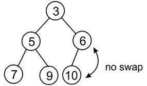

# 堆和优先队列

堆一种基于树的数据结构，其中树的每个节点与其他节点都有特定的关系，并且它们以特定的顺序存储。 根据树中节点的特定顺序，堆可以有不同的类型，例如最小堆和最大堆。

优先级队列是一种重要的数据结构，类似于队列和栈数据结构，存储数据以及与之相关的优先级。 在此，根据优先级提供数据。 优先级队列可以使用数组、链表和树来实现； 但是，它们通常使用堆来实现，因为它非常高效。

在本章中，我们将学习以下内容：

- 堆的概念及其操作
- 了解优先级队列的概念及其使用 ```Python``` 的实现

## 堆

堆是一种特殊的树，其中节点以特定方式排序。 堆是一种数据结构，其中每个数据项都满足一个堆属性，堆属性表示父节点和子节点之间必须存在一定的关系。 根据树中的这种特定关系，堆可以分为两种类型，即最大堆和最小堆。 在最大堆中，每个父节点值必须始终大于或等于其所有子节点。 在这种树中，根节点必须是树中的最大值。 例如，图 7.1 显示了最大堆，其中所有节点的值都比它们的子节点大：


图 7.1：最大堆的示例

在最小堆中，父子节点之间的关系是父节点的值必须始终小于或等于其子节点。 树中的所有节点都应遵循此规则。 在最小堆中，根节点持有最低值。 例如，图 7.2 显示了最小堆，其中所有节点的值都小于它们的子节点：


图 7.2：最小堆的示例

堆是一种重要的数据结构，因为它有多种应用，并用于实现堆排序算法和优先级队列。 我们将在本章后面详细讨论。 堆可以是任何一种树； 然而，最常见的堆类型是二叉堆，其中每个节点最多有两个子节点。

如果二叉堆是一棵有 ```n``` 个节点的完全二叉树，那么它的最小高度为 $log_2n$。

完全二叉树是指每一行都必须填满后才能开始填充下一行，如下图7.3所示：


图 7.3：完全二叉树的示例

为了实现堆，我们可以推导出索引值中父子节点的关系。 其关系是任何一个节点在 ```n``` 索引处的子节点都可以很容易地检索到，换句话说，左子节点将位于 ```2n```，右子节点将位于 ```2n + 1```。例如，节点 ```C``` 索引为 ```3```，因为节点 ```C``` 是节点 ```A```（索引为 ```1```）的右子节点，因此它变为 ```2n + 1 = 2 * 1 + 1 = 3```。此关系始终成立。 假设我们有一个元素列表 ```{A, B, C, D, E}```，如图 7.4 所示。 如果我们将任何元素存储在索引 ```i``` 处，则其父元素可以存储在索引 ```i/2``` 处，例如，如果节点 ```D``` 的索引为 ```4```，则其父元素将位于 ```4 / 2 = 2```，索引 ```2``` . 根的索引在数组中必须从 ```1``` 开始。 参见图 7.4 来理解这个概念：


图 7.4：所有节点的二叉树和索引位置

这种父子关系是一棵完全二叉树。 在索引值方面，为了高效地检索、搜索和存储堆中的数据项非常重要。 由于这个特性，很容易实现堆。 唯一的限制是我们应该从 ```1``` 开始索引，如果我们使用数组实现堆，那么我们必须在数组中的索引 ```0``` 处添加一个虚拟元素。 接下来，我们来了解一下堆的实现。 值得注意的是，我们将讨论与最小堆相关的所有概念，最大堆的实现与它非常相似，唯一的区别是堆属性。

让我们讨论使用 ```Python``` 实现最小堆。 我们从堆类开始，如下：

```python
class MinHeap:
    def __init__(self):
        self.heap = [0]
        self.size = 0
```

我们用零初始化堆列表以表示虚拟的第一个元素，我们添加一个虚拟元素只是为了从 ```1``` 开始索引数据项，因为如果我们从 ```1``` 开始索引，因父子关系，元素的访问变得非常容易。 我们还创建了一个变量来保存堆的大小。 我们将进一步讨论不同的操作，例如在堆中的特定位置插入、删除和删除。 让我们从堆中的插入操作开始。

### 插入

将数据项插入最小堆分两步进行。 首先，我们将新元素添加到列表的末尾（我们理解为树的底部），并将堆的大小增加 ```1```。 其次，在每次插入操作之后，我们需要在堆树中向上排列新元素，以满足堆属性的方式组织所有节点，在这种情况下，每个节点必须大于其父节点。 换句话说，父节点的值必须始终小于或等于其子节点，最小堆中的最低元素需要是根元素。 因此，我们首先将一个元素插入到树的最后一个堆中； 但是，将元素插入堆后，可能会违反堆属性。 在这种情况下，必须重新排列节点，使所有节点都满足堆属性。 这个过程称为堆化。 要对最小堆进行堆化，我们需要找到其子元素的最小值并将其与当前元素交换，并且必须重复此过程，直到满足所有节点的堆属性为止。

让我们考虑一个在最小堆中添加元素的示例，例如在图 7.5 中插入一个值为 ```2``` 的新节点：


图 7.5：在现有堆中插入新节点 ```2```

新元素将添加到第三行或第三层的最后位置。 它的索引值为 ```7```。我们将该值与其父项进行比较。 父项位于索引 ```7 / 2 = 3```（整数除法）。 父节点的值为 ```6```，高于新节点的值（即 ```2```），所以根据最小堆的性质，我们交换这些值，如图7.6所示：


图 7.6：交换节点 ```2``` 和 ```6``` 以保持堆属性

新数据项已被交换并向上移动到索引 ```3```。由于我们必须检查所有节点直到根，我们检查其父节点的索引为 ```3/2 = 1```（整数除法），所以我们 继续堆化过程。

因此，我们比较这两个元素，然后再次交换，如图 7.7 所示：


图 7.7：交换节点 ```2``` 和 ```3``` 以维护堆属性

最终交换后，我们到达了根。 在这里，我们可以注意到这个堆遵循最小堆的定义，如图 7.8 所示：


图 7.8：插入新节点 ```2``` 后的最终堆

现在，让我们再举一个例子，看看如何在堆中创建和插入元素。 我们从构建堆开始，一个接一个地插入 ```10``` 个元素。 元素是 ```{4, 8, 7, 2, 9, 10, 5, 1, 3, 6}```。 我们可以在图 7.9 中看到向堆中插入元素的分步过程：


图 7.9：创建堆的分步过程

在上图中，我们可以看到将元素插入堆的分步过程。 这里，我们继续添加元素，如图7.10所示：


图 7.10：创建堆的步骤 ```7``` 到 ```9```

最后，我们向堆中插入一个元素 ```6```，如图 7.11 所示：


图 7.11：最后一步和最终堆的构造

下面讨论堆中插入操作的实现。 首先，我们创建一个名为 ```arrange``` 的辅助方法，它负责在插入新节点后安排所有节点。 下面是 ```arrange()``` 方法的实现，它应该定义在 ```MinHeap``` 类中：

```python
    def arrange(self, k):
        while k // 2 > 0:
            if self.heap[k] < self.heap[k // 2]:
                self.heap[k], self.heap[k // 2] = self.heap[k // 2], self.heap[k]
            k //= 2
```


我们执行循环直到到达根节点； 在那之前，我们可以继续安排元素。 在这里，我们使用整数除法。 循环将在以下条件后中断：

```python
        while k // 2 > 0:
```

之后，我们比较父节点和子节点之间的值。 如果父项大于子项，则交换两个值：

```python
            if self.heap[k] < self.heap[k // 2]:
                self.heap[k], self.heap[k // 2] = self.heap[k // 2], self.heap[k]
```

最后，在每次迭代之后，我们在树中向上移动：

```python
            k //= 2
```

此方法确保元素被正确排序。

现在，为了在堆中添加新元素，我们需要使用下面的插入方法，它应该在 ```MinHeap``` 类中定义：

```python
    def insert(self, item):
        self.heap.append(item)
        self.size += 1
        self.arrange(self.size)
```

在上面的代码中，我们可以使用 ```append``` 方法插入一个元素； 然后我们增加堆的大小。 然后，在 ```insert``` 方法的最后一行，我们调用了```arrange()```方法对堆进行重组（```heapify it```），保证堆中的所有节点都满足堆属性。

现在，让我们创建堆并使用 ```MinHeap``` 类中定义的 ```insert()``` 方法插入数据 ```{4, 8, 7, 2, 9, 10, 5, 1, 3, 6}```，代码如下：

```python
    def insert(self, item):
        self.heap.append(item)
        self.size += 1
        self.arrange(self.size)
```

我们可以打印堆列表，只是为了检查元素是如何排序的。 如果将其重新绘制为树结构，您会注意到它符合堆的所需属性，类似于我们手动创建的：

```python
    h = MinHeap()
    for i in (4, 8, 7, 2, 9, 10, 5, 1, 3, 6):
        h.insert(i)
```

上述代码的输出如下：

```python
[0, 1, 2, 5, 3, 6, 10, 7, 8, 4, 9]
```

我们可以在输出中看到，数组中堆的所有数据项都在索引位置，如图 7.11 所示。 接下来，我们将讨论堆中的删除操作。

### 删除

删除操作从堆中删除一个元素。 要从堆中删除任何元素，让我们首先讨论如何删除根元素，因为它主要用于多种用例，例如查找堆中的最小或最大元素。 请记住，在最小堆中，根元素表示列表的最小值，而最大堆的根给出元素列表的最大值。

一旦我们从堆中删除根元素，我们就使堆的最后一个元素成为堆的新根。 在那种情况下，堆属性将不会被树满足。 因此，我们必须重新组织树的节点，使树的所有节点都满足堆属性。 最小堆中的删除操作如下: 

1. 一旦我们删除了根节点，我们就需要一个新的根节点。 为此，我们从列表中取出最后一项并将其作为新的根。
2. 由于选择的最后一个节点可能不是堆的最低元素，我们必须重新组织堆的节点。
3. 我们重组从根节点到最后一个节点的节点（成为一个新的根）； 这个过程称为堆化。 由于我们从堆的顶部移动到底部（这意味着从根节点向下移动到最后一个元素），这个过程称为向下渗透。

让我们考虑一个例子来帮助我们理解下面堆中的这个概念。 首先，我们删除值为 ```2``` 的根节点，如图 7.12 所示：


图 7.12：删除现有堆中根部值为 ```2``` 的节点

一旦我们删除了根，接下来我们需要选择一个可以作为新根的节点； 通常，我们选择取最后一个节点，换句话说，索引为 ```7``` 的节点 ```6```。因此，最后一个元素 6 位于根位置，如图 7.13 所示：


图 7.13：移动最后一个元素，换句话说，节点 ```6``` 到根位置

将最后一个元素移动到新根后，显然这棵树现在不满足最小堆属性。 所以，我们必须重新组织堆的节点，因此我们从根向下移动到堆中的节点，即堆化树。 因此，我们将新替换节点的值与其在树中的所有子节点进行比较。 在这个例子中，我们比较根的两个子节点，即 ```5``` 和 ```3```。由于右子节点较小，因此其索引为 ```3```，表示为（根 ```index * 2 + 1```）。 我们将继续这个节点并将新的根节点与该索引处的值进行比较，如图 7.14 所示：


图 7.14：根节点与节点 ```3``` 的交换

现在，应根据最小堆属性将值为 ```6``` 的节点向下移动到索引 ```3```。 接下来，我们需要将它与它的子节点进行比较，直至堆。 在这里，我们只有一个子节点，所以我们不需要担心将它与哪个子节点进行比较（对于最小堆，它总是较小的子节点），如图 7.15 所示：



图 7.15：节点 ```6``` 和节点 ```10``` 的交换

这里不需要交换，因为它遵循最小堆属性。 到达最后一个后，最终堆遵循最小堆属性。

为了使用 ```Python``` 实现从堆中删除根节点，首先我们实现了```percolate-down```过程，也就是 ```sink()``` 方法。 在我们实现 ```sink()``` 方法之前，我们实现了一个辅助方法来找出哪些子节点与父节点进行比较。 这个辅助方法是 ```minchild()```，它应该定义在 ```MinHeap``` 类中：

```python
    def minchild(self, k):
        if k * 2 + 1 > self.size:
            return k * 2
        elif self.heap[k * 2] < self.heap[k * 2 + 1]:
            return k * 2
        else:
            return k * 2 + 1
```

在这个方法中，首先，我们检查我们是否超出了列表的末尾——如果超出了，那么我们返回左子节点的索引：

```python
        if k * 2 + 1 > self.size:
            return k * 2
```

否则，我们只返回两个子节点中较小者的索引：

```python
        elif self.heap[k * 2] < self.heap[k * 2 + 1]:
            return k * 2
        else:
            return k * 2 + 1
```

现在我们可以创建 ```sink()``` 方法。 ```sink()``` 方法应该在 ```MinHeap``` 类中定义：

```python
    def sink(self, k):
        while k * 2 <= self.size:
            mc = self.minchild(k)
            if self.heap[k] > self.heap[mc]:
                self.heap[k], self.heap[mc] = self.heap[mc], self.heap[k]
            k = mc
```

在上面的代码中，我们首先运行循环直到树的末尾，以便我们可以根据需要将元素下沉（向下移动）； 这显示在以下代码片段中：

```python
    def sink(self, k):
        while k * 2 <= self.size:
```

接下来，我们需要知道要与左子节点或右子节点中的哪一个进行比较。 这是我们使用 ```minindex()``` 函数的地方，如以下代码片段所示：

```python
            mc = self.minchild(k)
```

接下来，我们比较父母和子节点，看看我们是否需要进行交换，就像我们在插入操作期间在 ```arrange()``` 方法中所做的那样：

```python
            if self.heap[k] > self.heap[mc]:
                self.heap[k], self.heap[mc] = self.heap[mc], self.heap[k]
```

最后，我们需要确保在每次迭代中都向下移动树，以免陷入循环，如下所示：

```python
            k = mc
```

现在，我们可以自己实现主要的 ```delete_at_root()``` 方法，它应该在 ```MinHeap``` 类中定义：

```python
    def delete_at_root(self):
        item = self.heap[1]
        self.heap[1] = self.heap[self.size]
        self.size -= 1
        self.heap.pop()
        self.sink(1)
        return item
```

在上面删除根节点的代码中，我们首先将根元素复制到一个变量 ```item``` 中，然后在下面的语句中将最后一个元素移动到根节点：

```python
        self.heap[1] = self.heap[self.size]
```

更进一步，我们缩小堆的大小，将元素从堆中移除，然后我们使用 ```sink()``` 方法重新组织堆元素，使堆中的所有元素都遵循堆的属性。

我们现在可以使用以下代码从堆中删除根节点。 让我们先在堆中插入一些数据项 ```{2, 3, 5, 7, 9, 10, 6}```，然后移除根节点：

```python
h = MinHeap()
for i in (2, 3, 5, 7, 9, 10, 6):
    h.insert(i)
print(h.heap)
n = h.delete_at_root()
print(n)
print(h.heap)
```

上述代码的输出如下：

```python
[0, 2, 3, 5, 7, 9, 10, 6]
2
[0, 3, 6, 5, 7, 9, 10]
```

我们可以在输出中看到新堆中返回了根元素 ```2```，并且重新排列了数据项，以便堆的所有节点都遵循堆属性（可以检查节点的索引，如图 7.16 所示） ). 接下来，我们将讨论是否要删除具有给定索引位置的任何节点。

### 删除特定位置的元素

通常，我们删除根部的元素，但是，可以从堆中的特定位置删除元素。 让我们通过一个例子来理解它。 给定以下堆，假设我们要删除索引 ```2``` 处值为 ```3``` 的节点。删除值为 ```3``` 的节点后，我们将最后一个节点移动到删除的节点，换句话说，值为 ```15``` 的节点，如 如图 7.16 所示：


图 7.16：从堆中删除节点 ```3```

在将最后一个元素移动到删除的节点后，我们将其与其根元素进行比较，因为它已经大于根元素，因此我们不交换。 接下来，我们将这个元素与它的所有子元素进行比较，由于左子元素较小，因此与左子元素进行交换，如图 7.17 所示：


图 7.17：节点 ```15``` 与 ```5``` 和 ```11``` 的比较，以及交换节点 ```15``` 和节点 ```5```

在将节点 ```15``` 与节点 ```5``` 交换后，我们在堆中向下移动。 接下来，我们将节点 ```15``` 与其子节点 ```8``` 进行比较。最后，交换节点 ```8``` 和节点 ```15```。 现在，最终的树遵循堆属性，如图 7.18 所示：


图 7.18：交换节点 ```8``` 和节点 ```15``` 后的最终堆

下面给出删除任意给定索引位置的数据项的删除操作的实现，应该在 ```MinHeap``` 类中定义：

```python
    def delete_at_location(self, location):
        item = self.heap[location]
        self.heap[location] = self.heap[self.size]
        self.size -= 1
        self.heap.pop()
        self.sink(location)
        return item
```

```Python``` 此实现与我们在上一节中看到的删除根元素的实现非常相似。 唯一不同的是，在这段代码中，我们指定了要删除的索引位置。 以下代码片段演示了从数据项 ```{4, 8, 7, 2, 9, 10, 5, 1, 3, 6}``` 创建的堆中删除特定位置 ```2``` 的节点：

```python
h = MinHeap()
for i in (4, 8, 7, 2, 9, 10, 5, 1, 3, 6):
    h.insert(i)
print(h.heap)

n = h.delete_at_location(2)
print(n)
print(h.heap)
```

上述代码的输出如下：

```python
[0, 1, 2, 5, 3, 6, 10, 7, 8, 4, 9]
2
[0, 1, 3, 5, 4, 6, 10, 7, 8, 9]
```

在上面的输出中，我们看到删除前和删除后，堆节点是根据它们的索引位置放置的。 我们已经使用最小堆示例讨论了概念和实现； 所有这些操作和概念都可以很容易地修改为最大堆实现，只需在我们确保父节点与最小堆中的子节点相比具有更小值的条件下反转逻辑即可。 现在在最大堆的情况下，我们必须在父堆中取较大的值。 堆用于各种应用程序，例如实现堆排序和优先级队列，我们将在后续部分中讨论。

### 堆排序
堆是一种用于对元素列表进行排序的重要数据结构，因为它非常适合于大量元素。 如果我们想对元素列表进行排序，比如升序，我们可以使用最小堆； 我们首先创建一个包含所有给定数据项的最小堆，根据堆属性，最小的数据值将存储在堆的根部。 借助堆属性，可以直接对元素进行排序。 过程如下：

1. 使用所有给定的数据项创建一个最小堆。
2. 读取并删除根节点，即最小值。 之后，将树的最后一个元素复制到新的根节点中，进一步重组树以保持堆属性。
3. 现在，我们重复步骤 ```2```，直到获得所有元素。
4. 最后，我们得到排序后的元素列表。

数据按照堆属性存储在堆中； 每当添加或删除新元素时，都会分别使用 ```arrange()``` 和 ```sink()``` 辅助方法维护堆属性，如前几节所述。

为了使用堆实现堆排序，首先我们使用以下代码创建一个包含数据项 ```{4, 8, 7, 2, 9, 10, 5, 1, 3, 6}``` 的堆（创建堆的详细信息在前面的部分已给出）：

```python
h = MinHeap()
unsorted_list = [4, 8, 7, 2, 9, 10, 5, 1, 3, 6]
for i in unsorted_list:
    h.insert(i)
print(f"Unsorted list: {unsorted_list}")
```

在上面的代码中，创建了最小堆 ```h```，并插入了 ```unsorted_list``` 中的元素。 每次调用 ```insert()``` 方法后，堆顺序属性将通过后续调用 ```sink()``` 方法恢复。

创建堆后，我们读取并删除根元素。 在每次迭代中，我们得到最小值，因此数据项按升序排列。 ```heap_sort()``` 方法的实现应该在 ```MinHeap``` 类中定义（它使用前面部分讨论的 ```delete_at_root()``` 方法）：

```python
    def heap_sort(self):
        sorted_list = []
        for _ in range(self.size):
            n = self.delete_at_root()
            sorted_list.append(n)
        return sorted_list
```

在上面的代码中，我们创建了一个空数组 ```sorted_list```，它按排序顺序存储所有数据项。 然后我们为列表中的数据项数运行循环。 在每次迭代中，我们调用  ```delete_at_root()``` 方法来获取最小值，并将其附加到 ```sorted_list```。

现在我们可以使用下面的代码来使用堆排序算法：

```python
print(f"Unsorted list: {unsorted_list}")
print(f"Sorted list: {h.heap_sort()}")
```

上述代码的输出如下：

```python
Unsorted list: [4, 8, 7, 2, 9, 10, 5, 1, 3, 6]
Sorted list: [1, 2, 3, 4, 5, 6, 7, 8, 9, 10]
```

使用 ```insert``` 方法建堆的时间复杂度需要 $O(n)$ 次。 此外，删除根元素后重组树需要$O(logn)$，因为我们在堆树中从上到下，堆的高度为$log_2(n)$，因此重组树的复杂度为 $O(logn)$。 因此，总的来说，堆排序的最坏情况时间复杂度是 $O(nlogn)$。 堆排序通常非常有效，给出了 $O(nlogn)$ 的最坏情况、平均情况和最佳情况复杂度。

## 优先队列

优先级队列是一种数据结构，类似于按照先进先出（**```FIFO```**）策略检索数据的队列，但在优先级队列中，优先级与数据相关联。 在优先级队列中，根据数据项的优先级来获取数据，优先级最高的数据项在优先级较低的数据项之前被获取，如果两个数据项具有相同的优先级，则根据先进先出政策。

我们可以根据应用程序分配数据的优先级。 它用于许多应用程序，例如 ```CPU``` 调度，许多算法也依赖于优先级队列，例如 ```Dijkstra``` 的最短路径、```A*``` 搜索和用于数据压缩的霍夫曼代码。

因此，在优先级队列中，优先级最高的数据项首先得到服务。 优先级队列按照与数据关联的优先级存储数据，因此元素的插入将在优先级队列中的特定位置。 优先级队列可以被视为修改后的队列，它以最高优先级的顺序返回数据项，而不是按 **```FIFO```** 顺序返回数据项。 优先级队列可以通过根据优先级插入项来修改入队位置来实现。 如图 7.19 所示，在给定队列的情况下，在特定索引处向队列中添加一个新项 ```5```（这里假设具有较高值的数据项具有较高的优先级）：


图 7.19：优先级队列的演示

让我们通过一个例子来理解优先级队列。 当我们按顺序接收到数据项时，元素会按照优先级顺序（假设数据值越大重要性越高）入队到优先级队列中。 首先，优先级队列是空的，所以先在队列中加入 ```3```； 下一个数据项是 ```8```，因为它大于 ```3```，所以将在开始时入队。接下来，数据项是 ```2```，然后是 ```6```，最后是 ```10```，它们按照优先级入队，并且当应用出列操作时，高优先级的数据项将首先出列。 所有步骤如图 7.20 所示：


图 7.20：创建优先级队列的分步过程

让我们讨论一下 ```Python``` 中优先级队列的实现。 我们首先定义节点类。 节点类将具有数据项以及与优先级队列中的数据关联的优先级：

```python
# class for Node with data and priority
class Node:
    def __init__(self, info, priority):
        self.info = info
        self.priority = priority
```

接下来，我们定义 ```PriorityQueue``` 类并初始化队列：

```python
# class for Priority queue
class PriorityQueue:
    def __init__(self):
        self.queue = []
```

接下来，让我们讨论向优先级队列添加新数据项的插入操作的实现。 在实现中，我们假设如果数据项具有较小的优先级值，则它具有高优先级（例如，与具有优先级值 ```4``` 的数据项相比，具有优先级值 ```1``` 的数据项具有更高的优先级）。 以下是在优先级队列中插入元素的情况：

1. 当队列最初为空时，将数据项插入到优先级队列中。
2. 如果队列不为空，则进行队列遍历，通过比较现有节点和新节点的优先级，根据关联的优先级到达队列中合适的索引位置。 我们在优先级大于新节点的节点之前添加新节点。
3. 如果新节点的优先级低于高优先级值，则该节点将被添加到队列的开头。

```insert()``` 方法的实现如下，应该定义在 ```PriorityQueue``` 类中：

```python
    def insert(self, node):
        if len(self.queue) == 0:
            # add the new node
            self.queue.append(node)
        else:
            # 遍历队列为新节点找到合适的位置
            for x in range(len(self.queue)):
                # 如果新节点的优先级更高
                if node.priority >= self.queue[x].priority:
                    # 如果我们遍历了整个队列
                    if x == (len(self.queue) - 1):
                        # 在末尾添加新节点
                        self.queue.insert(x + 1, node)
                    else:
                        continue
                else:
                    self.queue.insert(x, node)
                    return True
```

在上面的代码中，我们首先在队列为空时追加一个新的数据项，然后我们通过比较与数据项关联的优先级来迭代到达合适的位置。

接下来，当我们在优先级队列中应用删除操作时，最高优先级的数据项被返回并从队列中删除。 它应该在 ```PriorityQueue``` 类中定义如下：

```python
    def delete(self):
        # 从队列中删除第一个节点
        x = self.queue.pop(0)
        print("Deleted data with the given priority-", x.info, x.priority)
        return x
```

在前面的代码中，我们获得了具有最高优先级值的顶部元素。 此外，按优先级顺序打印优先级队列所有数据项的 ```show()``` 方法的实现应定义在 ```PriorityQueue``` 类中：

```python
    def show(self):
        for x in self.queue:
            print(f"{str(x.info)} - {str(x.priority)}")
```

现在，让我们考虑一个示例，看看如何使用优先级队列，其中我们首先添加数据项（```Cat```、```Bat```、```Rat```、```Ant``` 和 ```Lion```），相关优先级为 ```13```、```2```、```1```、```26``` 和 ```25``` 分别是：

```python
p = PriorityQueue()
p.insert(Node("Cat", 13))
p.insert(Node("Bat", 2))
p.insert(Node("Rat", 1))
p.insert(Node("Ant", 26))
p.insert(Node("Lion", 25))
p.show()
p.delete()
```

上述代码的输出如下：

```python
Rat – 1
Bat – 2
Cat – 13
Lion – 25
Ant – 26
Deleted data with the given priority- Rat 1
```

优先级队列可以使用多种数据结构来实现； 在上面的示例中，我们看到它的实现使用元组列表，其中元组包含优先级作为第一个元素，值数据项作为下一个元素。 然而，优先级队列大多是使用堆实现的，因为它在插入和删除操作的最坏情况下时间复杂度为 $O(logn)$ 时效率很高。

使用堆实现优先级队列与我们在最小堆实现中讨论的非常相似。 唯一的区别是现在我们存储与数据项关联的优先级，并且我们使用 ```Python``` 中的元组列表创建考虑优先级值的最小堆树。 为了完整起见，使用堆的优先级队列的代码如下：

```python
class PriorityQueueHeap:
    def __init__(self):
        self.heap = [()]
        self.size = 0

    def arrange(self, k):
        while k // 2 > 0:
            if self.heap[k][0] < self.heap[k // 2][0]:
                self.heap[k], self.heap[k // 2] = self.heap[k // 2], self.heap[k]
            k //= 2

    def insert(self, priority, item):
        self.heap.append((priority, item))
        self.size += 1
        self.arrange(self.size)

    def sink(self, k):
        while k * 2 <= self.size:
            mc = self.minchild(k)
            if self.heap[k][0] > self.heap[mc][0]:
                self.heap[k], self.heap[mc] = self.heap[mc], self.heap[k]
            k = mc

    def minchild(self, k):
        if k * 2 + 1 > self.size:
            return k * 2
        elif self.heap[k * 2][0] < self.heap[k * 2 + 1][0]:
            return k * 2
        else:
            return k * 2 + 1

    def delete_at_root(self):
        item = self.heap[1][1]
        self.heap[1] = self.heap[self.size]
        self.size -= 1
        self.heap.pop()
        self.sink(1)
        return item
```

我们使用下面的代码创建一个优先级队列，其中包含数据项```Bat```、```Cat```、```Rat```、```Ant```、```Lion``` 和 ```Bear```，其关联的优先级值为 ```2```、```13```、```18```、```26```、```3```、```4``` 分别为：

```python
h = PriorityQueueHeap()
h.insert(2, "Bat")
h.insert(13,"Cat")
h.insert(18, "Rat")
h.insert(26, "Ant")
h.insert(3, "Lion")
h.insert(4, "Bear")
h.heap
```

上述代码的输出如下：

```python
[(), (2, 'Bat'), (3, 'Lion'),  (4, 'Bear'),  (26, 'Ant'),  (13, 'Cat'),  (18, 'Rat')]
```

在上面的输出中，我们可以看到它显示了一个符合最小堆属性的最小堆树。 现在我们可以使用下面的代码来删除数据项：

```python
for _ in range(h.size):
    n = h.delete_at_root()
    print(n)
    print(h.heap)
```

上述代码的输出如下：

```python
Bat
[(), (3, 'Lion'), (13, 'Cat'), (4, 'Bear'), (26, 'Ant'), (18, 'Rat')]
Lion
[(), (4, 'Bear'), (13, 'Cat'), (18, 'Rat'), (26, 'Ant')]
Bear
[(), (13, 'Cat'), (26, 'Ant'), (18, 'Rat')]
Cat
[(), (18, 'Rat'), (26, 'Ant')]
Rat
[(), (26, 'Ant')]
Ant
[()]
```

在上面的输出中，我们可以看到数据项是根据与数据项关联的优先级生成的。

## 概括

在本章中，我们讨论了一个重要的数据结构，即堆。 我们还讨论了最小堆和最大堆的堆属性。 我们已经看到了几个可以应用于堆数据结构的操作的实现，例如堆化，以及从堆中插入和删除数据项。 我们还讨论了堆的两个重要应用——堆排序和优先级队列。 堆是一种重要的数据结构，因为它有很多应用，例如排序、选择列表中的最小值和最大值、图算法和优先级队列。 此外，当我们不得不重复删除具有最高或最低优先级值的数据对象时，堆也很有用。

在下一章中，我们将讨论散列表和符号表的概念。

## 练习

1. 从最小堆中删除任意元素的时间复杂度是多少？
2. 从最小堆中找到第 ```k``` 个最小元素的时间复杂度是多少？
3. 从二元最大堆和二元最小堆中确定最小元素的最坏情况时间复杂度是多少？
4. 组合两个大小为 ```n``` 的最大堆的最大堆的时间复杂度是多少？
5. 最大堆的层序遍历为```12```、```9```、```7```、```4```、```2```，插入新元素 ```1``` 和 ```8``` 后，最终的最大堆和最终最大堆的层序遍历是多少？
6. 以下哪个是二叉最大堆？


图 7.21：示例树