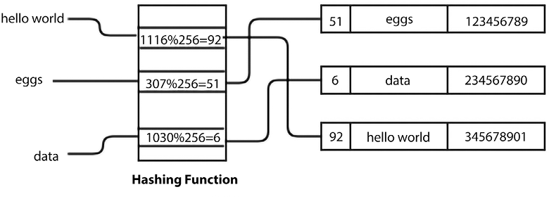

# 哈希表

哈希表是一种实现关联数组的数据结构，其中通过将键映射到值作为键值对来存储数据。 在很多应用中，我们大多需要在字典数据结构中进行插入、查找、删除等不同的操作。 例如，符号表是一种基于哈希表的数据结构，供编译器使用。 翻译编程语言的编译器维护一个符号表，其中键是映射到标识符的字符串。 在这种情况下，哈希表是一种有效的数据结构，因为我们可以通过对键应用哈希函数来直接计算所需记录的索引。 因此，不是直接将键用作数组索引，而是通过将哈希函数应用于键来计算数组索引。 它使得从哈希表的任何索引访问元素变得非常快。 哈希表使用哈希函数计算数据项在哈希表中存储位置的索引。

在哈希表中查找元素时，对键进行哈希处理会给出表中相应记录的索引。 理想情况下，散列函数为每个键分配一个唯一值； 然而，在实践中，我们可能会遇到哈希冲突，其中哈希函数为多个键生成相同的索引。 在本章中，我们将讨论处理此类冲突的不同技术。

在本章中，我们将讨论与这些相关的所有概念，包括：

- 哈希方法和哈希表技术
- 哈希表中不同的冲突解决技术

## 哈希表介绍

众所周知，数组和列表按顺序存储数据元素。 与在数组中一样，数据项通过索引访问。 使用索引访问数组元素很快。 但是，当我们忘记索引而需要访问任意元素时，使用它们就很不方便了。 例如，如果我们希望从索引为 ```56``` 的地址簿中提取某人的电话号码，则没有任何内容可以将特定联系人与号码 ```56``` 相关联。使用索引很难从列表中检索条目。

哈希表是一种更适合这类问题的数据结构。 哈希表是一种数据结构，其中元素通过键而不是索引访问，这与列表和数组不同。 在这种数据结构中，数据项存储在类似于字典的键值对中。 哈希表使用哈希函数来找到应该存储和检索元素的索引位置。 这使我们可以快速查找，因为我们使用的是与键的哈希值相对应的索引。

哈希表如何存储数据的概述如图 8.1 所示，其中使用任意哈希函数对键值进行哈希处理，以获得记录在哈希表中的索引位置。


图 8.1：哈希表的示例

字典是一种广泛使用的数据结构，通常使用哈希表构建。 字典使用键而不是索引，并将数据存储在（键，值）对中。 也就是说，我们不使用索引值访问联系人，而是使用字典数据结构中的键值。

以下代码演示了以（键，值）对形式存储数据的字典的工作原理：

```python
my_dict = {
    "Basant": "9829012345",
    "Ram": "9829012346",
    "Shyam": "9829012347",
    "Sita": "9829012348",
}
print("All keys and values")
for x, y in my_dict.items():
    print(x, ":", y)  # prints keys and values
my_dict["Ram"]
```

上述代码的输出如下：

```python
Basant : 9829012345
Ram : 9829012346
Shyam : 9829012347
Sita : 9829012348
'9829012346'
```

哈希表以非常有效的方式存储数据，因此检索速度非常快。 哈希表基于称为哈希的概念。

### 哈希函数

散列是一种技术，当我们向函数提供任意大小的数据时，我们会得到一个小的、简化的值。 该函数称为散列函数。 哈希使用哈希函数将键映射到另一个范围的数据，新范围的键可以用作哈希表中的索引； 换句话说，哈希用于将键值转换为整数值，可以用作哈希表中的索引。

在本章的讨论中，我们使用哈希将字符串转换为整数。 我们可以使用任何其他数据类型来代替可以转换为整数的字符串。 让我们举个例子。 比方说，我们要对表达式 ```hello world``` 进行哈希处理，也就是我们要得到这个字符串对应的一个数值，可以作为哈希表中的索引。

在 ```Python``` 中，```ord()``` 函数返回映射到 ```Unicode``` 编码系统中的字符的唯一整数值（称为序数值）。 如果字符与 ```Unicode``` 兼容，则序数值将 ```Unicode``` 字符映射到唯一的数字表示形式，例如，数字 ```0-127``` 映射到 ```ASCII``` 字符，这也对应于 ```Unicode``` 系统中的序数值。 但是，```Unicode``` 编码的范围可能更大。 因此，```Unicode``` 编码是 ```ASCII``` 的超集。 例如，在 ```Python``` 中，我们通过使用 ```ord('f')``` 为字符 ```f``` 获得唯一的序数值 ```102```。 此外，要获得整个字符串的哈希值，我们可以将字符串中每个字符的序号相加。 请参阅以下代码片段：

```python
sum(map(ord, 'hello world'))
```

上面的输出如下：

```python
1116
```

在上面的输出中，我们获得了 ```hello world``` 字符串的数值 ```1116```，它是给定字符串的哈希值。 考虑下图 8.2 以查看导致散列值 ```1116``` 的字符串中每个字符的序数值：


图 8.2：```hello world``` 字符串中每个字符的序数值

上述用于获取给定字符串的哈希值的方法存在多个字符串可能具有相同哈希值的问题； 例如，当我们改变字符串中字符的顺序并且我们有相同的散列值时。 请参阅以下代码片段，其中我们为 ```world hello``` 字符串获得了相同的哈希值：

```python
sum(map(ord, 'world hello'))
```

上面的输出如下：

```python
1116
```

同样，```gello xorld``` 字符串会有相同的散列值，因为该字符串的字符序数值之和将相同，因为 ```g``` 的序数值比 ```h``` 的序数值小 ```1```，并且 ```x``` 的序数值比 ```w``` 的序数值大 ```1```。 请参阅以下代码片段：

```python
sum(map(ord, 'gello xorld'))
```

上面的输出如下：

```python
1116
```

看下面的图 8.3，我们可以看到这个```gello xorld``` 字符串的哈希值又是 ```1116```：


图 8.3：```gello xorld``` 字符串的每个字符的序数值

在实践中，大多数散列函数都是不完善的并且面临冲突。 这意味着一个散列函数为多个字符串提供相同的散列值。 这种冲突对于实现哈希表是不希望的。

### 完美的哈希函数

一个完美的哈希函数是我们为给定字符串（它可以是任何数据类型；在这里，我们以字符串数据类型为例）获得唯一哈希值的函数。 我们的目标是创建一个散列函数，它可以最大限度地减少冲突次数、快速、易于计算，并在散列表中平均分配数据项。 但是，通常情况下，创建一个快速的高效哈希函数并为每个字符串提供唯一的哈希值是非常困难的。 如果我们试图开发一个避免冲突的散列函数，这会变得非常慢，而且一个慢的散列函数不能达到散列表的目的。 因此，我们使用快速哈希函数并尝试找到解决冲突的策略，而不是试图找到完美的哈希函数。

为避免上一节讨论的散列函数中的冲突，我们可以为每个字符的序数值添加一个乘数，该乘数会随着我们在字符串中的前进而不断增加。 此外，字符串的哈希值可以通过将每个字符的序数值相加得到。 为了更好地理解这个概念，请参考下面的图 8.4：


图 8.4：序数值乘以 hello world 字符串中每个字符的数值

在前面的图 8.4 中，每个字符的序数值逐渐乘以一个数字。 请注意，第二行具有每个字符的序数值； 第三行显示乘数值； 在第四行中，我们通过将第二行和第三行的值相乘得到值，使 ```104 x 1``` 等于 ```104```。最后，我们将所有这些相乘值相加得到 ```hello world``` 字符串的哈希值，即 ```6736``` .

下面的函数显示了这个概念的实现：

```python
def myhash(s):
    return sum(mult * ord(ch) for mult, ch in enumerate(s, start=1))
```

我们可以在之前使用的字符串上测试这个函数，如下所示：

```python
for item in ("hello world", "world hello", "gello xorld"):
    print(f"{item}: {myhash(item)}")
```

当我们执行前面的代码时，我们得到以下输出：

```python
hello world: 6736
world hello: 6616
gello xorld: 6742
```

我们可以看到，这一次，我们为这三个字符串得到了不同的哈希值。 不过，这不是一个完美的散列。 现在让我们试试字符串 ```ad``` 和 ```ga```：

```python
for item in ("ad", "ga"):
    print(f"{item}: {myhash(item)}")
```

上述代码片段的输出如下：

```python
ad: 297
ga: 297
```

因此，我们仍然没有完美的哈希函数，因为我们为这两个不同的字符串获得了相同的哈希值。 因此，我们需要制定解决此类冲突的策略。 我们将在下一节中讨论更多解决冲突的策略。

## 解决冲突
哈希表中的每个位置通常称为可以存储元素的槽或桶。 每个数据项以（键，值）对的形式存储在哈希表中，位置由键的哈希值决定。 我们举个例子，首先我们使用哈希函数，通过将所有字符的序数值相加来计算哈希值。 然后，我们通过计算模块 ```256``` 的总序数值来计算最终的哈希值（即索引位置）。这里，我们以 ```256``` 个槽/桶为例。 我们可以使用任意数量的槽，具体取决于我们在哈希表中需要多少记录。 我们在图 8.5 中展示了一个示例哈希，它具有与数据值对应的键字符串，例如，```eggs``` 键字符串具有对应的数据值 ```123456789```。

这个哈希表使用哈希函数将输入字符串 ```hello world``` 映射到哈希值 ```92```，它在哈希表中找到一个槽位：



图 8.5：示例哈希表

一旦我们知道了键的哈希值，它就会被用来寻找该元素在哈希表中应该存储的位置。 所以，我们需要找到一个空槽。 我们从与密钥的哈希值对应的槽开始。 如果那个槽是空的，我们就在那里插入数据项。 而且，如果插槽不为空，则意味着我们发生了碰撞。 这意味着我们有一个与表中先前存储的数据项相同的数据项的哈希值。 我们需要确定避免此类冲突或冲突的策略。

例如，在下图中，键字符串 ```hello world``` 已经存储在索引位置 ```92``` 的表中，并且使用新的键字符串，例如 ```world hello```，我们得到相同的哈希值 ```92```。这意味着有碰撞。 请参考下图 8.6 描述此概念：


图 8.6：两个字符串的哈希值相同

解决这种冲突的一种方法是从冲突的位置找到另一个空闲槽。 这个冲突解决过程称为开放寻址。

### 开放寻址

在开放寻址中，键值存储在哈希表中，并使用探测技术解决冲突。 开放寻址哈希表中使用的一种冲突解决技术。 通过搜索（也称为探测）替代位置解决冲突，直到我们在哈希表中找到一个未使用的槽来存储数据项。

基于开放寻址的冲突解决技术存在三种流行的方法：

- 线性探测
- 二次探测
- 双重散列

#### 线性探测
访问每个插槽的系统方法是解决冲突的线性方法，我们通过将 ```1``` 加到我们获得冲突的前一个哈希值来线性寻找下一个可用插槽。 这称为线性探测。 我们可以通过将密钥字符串中每个字符的序数值之和加 ```1``` 来解决冲突，该值进一步用于根据哈希表的大小取模计算最终的哈希值。

让我们考虑一个例子。 首先，计算密钥的哈希值。 如果该位置已被占用，我们将依次检查哈希表以寻找下一个空闲位置。 我们用它来解决一次碰撞，如下图8.7所示，其中，对于 ```key``` 字符串 ```egg```，其序数值之和为 ```307```，然后取模 ```256``` 计算哈希值，得到哈希 ```egg``` 键字符串的值为 ```51```。但是，数据已经存储在该位置，因此这意味着碰撞。 因此，我们将字符串的每个字符的序数值之和计算出的哈希值加 ```1```。这样我们就为这个 ```key``` 字符串得到了一个新的哈希值 ```52``` 来存储数据。 参考下图 8.7，它描述了上述过程：


图 8.7：冲突解决示例

为了在哈希表中找到下一个空闲槽，我们增加哈希值，这个增量在线性探测的情况下是固定的。 由于发生冲突时散列值的固定增量，新数据元素始终存储在散列函数给出的下一个可用索引位置。 这创建了一个连续的占用索引位置的集群，每当我们在集群中的任何地方获得另一个具有哈希值的数据元素时，该集群就会增长。

因此，这种方法的一个主要缺点是哈希表可能具有连续占用的位置，称为项簇。 在这种情况下，哈希表的一部分可能变得密集，而表的另一部分仍然是空的。 由于这些限制，我们可能更愿意使用不同的策略来解决冲突，例如象限探测或双重散列，我们将在接下来的部分中讨论。 让我们首先讨论哈希表作为一种冲突解决技术的线性探测的实现，在了解线性探测的概念之后，我们将讨论其他冲突解决技术。

## 实现哈希表

要实现哈希表，我们首先创建一个类来保存哈希表项。 这些需要有一个键和一个值，因为哈希表是一个 ```{key-value}``` 存储：

```python
class HashItem:
    def __init__(self, key, value):
        self.key = key
        self.value = value
```

接下来，我们开始处理哈希表类本身。 像往常一样，我们从一个构造函数开始：

```python
class HashTable:
    def __init__(self):
        self.size = 256
        self.slots = [None for _ in range(self.size)]
        self.count = 0
```

标准 ```Python``` 列表可用于将数据元素存储在哈希表中。 让我们首先将哈希表的大小设置为 ```256``` 个元素。 稍后，我们将研究在开始填充哈希表时如何增长哈希表的策略。 我们现在将在代码中初始化一个包含 ```256``` 个元素的列表。 这些是存储元素的位置——槽或桶。 因此，我们有 ```256``` 个槽来存储哈希表中的元素。 重要的是要注意表的大小和计数之间的差异。 表的大小是指表中槽的总数（已使用或未使用）。 表的计数是指填充的槽数，即已添加到表中的实际（键值）对的数量。

现在，我们必须为该表决定一个散列函数。 我们可以使用任何哈希函数。 让我们采用相同的哈希函数，该函数返回字符串中每个字符的序数值之和，并稍作修改。 由于这个哈希表有 ```256``` 个槽，这意味着我们需要一个哈希函数来返回 ```0``` 到 ```255```（表的大小）范围内的值。 一个好的方法是返回哈希值除以表的大小的余数，因为余数肯定是 ```0``` 到 ```255``` 之间的整数值。

由于散列函数仅供类内部使用，因此我们在名称的开头加上下划线 (```_```) 来表示这一点。 这是一个 ```Python``` 约定，用于指示某些内容供内部使用。 下面是散列函数的实现，应该定义在 ```HashTable ```类中：

```python
    def _hash(self, key):
        hv = sum(mult * ord(ch) for mult, ch in enumerate(key, start=1))
        return hv % self.size
```

目前，我们假设键是字符串。 稍后我们将讨论如何使用非字符串键。 现在，```_hash()``` 函数将为字符串生成哈希值。

### 将元素存储在哈希表中

为了将元素存储在哈希表中，我们使用 ```put()``` 函数将它们添加到表中，并使用 ```get()``` 函数检索它们。 首先，我们将查看 ```put()``` 函数的实现。 我们首先将键和值添加到 ```HashItem``` 类，然后计算键的哈希值。 ```put()``` 方法应该在 ```HashTable``` 类中定义：

```python
    def put(self, key, value):
        item = HashItem(key, value)
        h = self._hash(key)
        while self.slots[h] != None and self.slots[h].key != key:
            h = (h + 1) % self.size
        if self.slots[h] is None:
            self.count += 1
        self.slots[h] = item
        self.check_growth()
```

在获得键的哈希值后，如果槽不为空，则通过应用线性探测技术将前一个哈希值加 ```1``` 来检查下一个空闲槽。 考虑以下代码：

```python
        while self.slots[h] != None and self.slots[h].key != key:
            h = (h + 1) % self.size
```

如果槽为空，则我们将计数 ```+1```并将新元素（意味着槽之前没有包含）存储在列表中所需的位置。 参考以下代码：

```python
if self.slots[h] is None: 
     self.count += 1 
self.slots[h] = item 
self.check_growth()
```

在上面的代码中，我们创建了一个哈希表，并讨论了在碰撞发生时使用线性探测技术将数据元素存储在哈希表中的 ```put()``` 方法。

在上述代码的最后一行，我们调用了一个 ```check_growth()``` 方法，当哈希表中剩余的空槽数量非常有限时，该方法用于扩展哈希表的大小。 我们将在下一节中更详细地讨论这个问题。

### 扩容哈希表
在我们讨论的示例中，我们将哈希表的大小固定为 ```256```。很明显，当我们将元素添加到哈希表时，哈希表开始填满，并且在某个时候，所有的槽都会被填满。 为避免这种情况，我们可以在表开始变满时增加表的大小。

为了增加哈希表的大小，我们比较表中的大小和计数。 ```size``` 是槽的总数，```count``` 表示包含元素的槽的数量。 所以，如果计数等于大小，这意味着我们已经填满了表格。 哈希表的负载因子一般用于扩展表的大小； 这让我们知道有多少可用的表槽已被使用。 哈希表的负载因子是通过使用的槽数除以表中的槽总数来计算的。 它的定义如下：
$$
Load\ factor = n/k
$$
这里，```n``` 是已使用的槽数，```k``` 是槽总数。 当负载因子值接近 ```1``` 时，这意味着表将被填满，我们需要增加表的大小。 最好在表快满之前增加表的大小，因为当表填满时从表中检索元素会变慢。 加载因子的值 ```0.75``` 可能是增加表大小的一个很好的值。 另一个问题是我们应该将表的大小增加多少。 一种策略是简单地将其规模扩大一倍。

线性探测的问题是随着负载因子的增加，需要很长时间才能找到新元素的插入点。 此外，在开放寻址冲突解决技术的情况下，我们应该根据负载因子增加哈希表的大小以减少冲突次数。

当负载因子增加超过阈值时，哈希表增长的实现如下。 首先，我们重新定义了 ```HashTable``` 类，其中多了一个变量 ```MAXLOADFACTOR```，用于保证哈希表的负载因子始终低于预定义的最大负载因子。 ```HashTable``` 类定义如下：

```python
class HashTable:
    def __init__(self):
        self.size = 256
        self.slots = [None for _ in range(self.size)]
        self.count = 0
        self.MAXLOADFACTOR = 0.65
```

接下来，我们使用以下 ```check_growth()``` 方法在将任何记录添加到哈希表后检查哈希表的负载因子，该方法应在 ```HashTable``` 类中定义：

```python
    def check_growth(self):
        loadfactor = self.count / self.size
        if loadfactor > self.MAXLOADFACTOR:
            print("Load factor before growing the hash table", self.count / self.size)
            self.growth()
            print("Load factor after growing the hash table", self.count / self.size)
```

在上面的代码中，我们计算了哈希表的负载因子，然后检查它是否大于设定的阈值（也就是说，```MAXLOADFACTOR``` 是我们在创建哈希表时初始化的一个变量）。 在这种情况下，我们调用增加哈希表大小的 ```growth()``` 方法（在本例中，我们将哈希表大小加倍）。 ```hashTable``` 类中应该定义的 ```growth()``` 方法实现如下：

```python
    def growth(self):
        New_Hash_Table = HashTable()
        New_Hash_Table.size = 2 * self.size
        New_Hash_Table.slots = [None for _ in range(New_Hash_Table.size)]

        for i in range(self.size):
            if self.slots[i] != None:
                New_Hash_Table.put(self.slots[i].key, self.slots[i].value)

        self.size = New_Hash_Table.size
        self.slots = New_Hash_Table.slots
```

在前面的代码中，我们首先创建一个新的哈希表，其大小是原始哈希表的两倍，然后将其所有槽初始化为 ```None```。 接下来，我们检查我们拥有数据的原始哈希表中所有已填充的槽，因为我们必须将所有这些现有记录插入到新的哈希表中，因此，我们对现有的所有哈希表使用键值对调用 ```put()``` 方法。 一旦我们将所有记录复制到新的哈希表中，我们就用新的哈希表替换现有哈希表的大小和槽。

让我们通过在 ```HashTable``` 类的 ```__init__``` 方法中定义 ```self.size = 10``` 来创建一个最大容量为 ```10``` 条记录和阈值负载因子为 ```65%``` 的哈希表，这意味着每当将第七条记录添加到哈希表时，我们调用 ```check_growth()``` 方法：

```python
ht = HashTable()
ht.put("good", "eggs")
ht.put("better", "ham")
ht.put("best", "spam")
ht.put("ad", "do not")
ht.put("ga", "collide")
ht.put("awd", "do not")
ht.put("add", "do not")
ht.checkGrow()
```

在上面的代码中，我们使用 ```put()``` 方法添加了 ```7``` 条记录。 上述代码的输出如下：

```python
Load factor before growing the hash table 0.7
Load factor after growing the hash table 0.35
```

在上面的输出中，我们可以看到添加第 ```7``` 条记录前后的负载因子变成了哈希表增长前负载因子的一半。

在下一节中，我们将讨论用于检索存储在哈希表中的数据元素的 ```get()``` 方法。

### 从哈希表中检索元素

要从哈希表中检索元素，将返回与键对应的存储值。 在这里，我们讨论检索方法的实现——```get()``` 方法。 此方法返回存储在与给定键对应的表中的值。

首先，我们计算与要检索的值相对应的给定键的哈希值。 一旦我们有了键的哈希值，我们就在哈希值所在的位置查找哈希表。 如果键项与该位置存储的键值匹配，则检索相应的值。

如果不匹配，那么我们将字符串中所有字符的序数值之和加 ```1```，类似于我们存储数据时所做的，我们看新得到的哈希值。 我们继续搜索直到我们得到关键元素，或者我们检查哈希表中的所有槽。

在这里，我们使用线性探测技术来解决冲突，因此我们在从哈希表中检索数据元素时使用相同的技术。 因此，如果我们要使用不同的技术，比方说在存储数据元素时使用双重哈希或二次探查，我们应该使用相同的方法来检索数据元素。 考虑一个例子来理解图 8.8 中的概念，并分以下四个步骤：

1. 我们计算给定键字符串 ```egg``` 的哈希值，结果为 ```51```。然后，我们将此键与位置 ```51``` 处存储的键值进行比较，但不匹配。
2. 由于密钥不匹配，我们计算一个新的哈希值。
3. 我们在新建的哈希值所在的位置查找 ```key```，是 ```52```； 我们将键字符串与存储的键值进行比较，在这里，它是匹配的，如下图所示。
4. 哈希表中对应于该键值的存储值被返回。 参见下图 8.8：


图 8.8：演示了从哈希表中检索元素的四个步骤

要实现这个检索方法，即 ```get()``` 方法，我们首先要计算键的哈希值。 接下来，我们在表中查找计算出的哈希值。 如果匹配，我们返回相应的存储值。 否则，我们将继续查看按照描述计算的新散列值位置。 下面是 ```get()``` 方法的实现，它应该定义在 ```HashTable``` 类中：

```python
    def get(self, key):
        h = self._hash(key)  # computed hash for the given key
        while self.slots[h] != None:
            if self.slots[h].key == key:
                return self.slots[h].value
            h = (h + 1) % self.size
        return None
```

最后，如果在表中找不到键，我们返回 ```None```； 我们本可以打印在哈希表中找不到密钥的消息。

### 测试哈希表

为了测试哈希表，我们创建 ```HashTable``` 并在其中存储一些元素，然后尝试检索它们。 我们可以使用 ```get()``` 方法找出给定键的记录是否存在。 我们还使用了两个字符串 ```ad``` 和 ```ga```，它们发生了冲突并通过我们的散列函数返回了相同的散列值。 为了评估哈希表的工作，我们也抛出了这个冲突，只是为了看看冲突是否得到了妥善解决。 参考示例代码，如下：

```python
ht = HashTable()
ht.put("good", "eggs")
ht.put("better", "ham")
ht.put("best", "spam")
ht.put("ad", "do not")
ht.put("ga", "collide")
for key in ("good", "better", "best", "worst", "ad", "ga"):
    v = ht.get(key)
    print(v)
```

执行上面的代码后，我们得到以下输出：

```python
eggs
ham
spam
none
do not
collide
```

如你所见，查找最差的键返回 ```None```，因为该键不存在。 ```ad``` 和 ```ga``` 键也返回对应的值，说明它们之间的碰撞处理得当。

### 将哈希表实现为字典

使用 ```put()``` 和 ```get()``` 方法在哈希表中存储和检索元素可能看起来有点不方便。 不过，我们也可以把哈希表当作字典来使用，使用起来会更方便。 例如，我们想使用 ```ht["good"]``` 而不是 ```ht.get("good")``` 从表中检索元素。

这可以通过特殊方法 ```__setitem__()``` 和 ```__getitem__()``` 轻松完成，它们应该在 ```HashTable``` 类中定义。

为此，请参见以下代码：

```python
def __setitem__(self, key, value):
    self.put(key, value)

def __getitem__(self, key):
    return self.get(key)
```

现在，我们的测试代码如下所示：

```python
ht = HashTable()
ht["good"] = "eggs"
ht["better"] = "ham"
ht["best"] = "spam"
ht["ad"] = "do not"
ht["ga"] = "collide"
for key in ("good", "better", "best", "worst", "ad", "ga"):
    v = ht[key]
    print(v)
print(f"The number of elements is: {ht.count}")
```

上述代码的输出如下：

```python
eggs
ham
spam
none
do not
collide
The number of elements is: 5
```

请注意，我们还使用 ```count``` 变量打印了已存储在哈希表中的元素数。 上面的代码与我们在上一节中所做的相同，但使用起来更方便。

在下一节中，我们将讨论用于冲突解决的二次探测技术。

#### 二次探测
这也是一种解决哈希表冲突的开放寻址方案。 它通过计算密钥的哈希值并添加二次多项式的连续值来解决冲突； 迭代计算新哈希，直到找到空槽。 如果发生冲突，将在 $h+1^2$、$h+2^2$、$h+3^2$、$h+4^2$ 等位置检查下一个空闲时隙。 因此，新的哈希值计算如下：

```python
new-hash(key) = (old-hash-value + i ** 2)
Here, hash - value = key mod table_size
```

当我们有一个键作为字符串时，我们使用序数值乘以每个字符的数值的总和来计算哈希值，然后我们将它传递给哈希函数以最终获得键字符串的哈希。 但是，对于非字符串键元素的情况，我们可以直接使用哈希函数来计算键的哈希值。

让我们举一个简单的哈希表示例，其中有七个槽，并假设哈希函数为 ```h(key) = key mod 7```。为了理解二次探测的概念，让我们假设我们的关键元素值为 给定键字符串的散列。

因此，每当我们使用二次探测技术来确定下一个索引位置以在发生冲突时存储数据元素时，我们应该执行以下步骤来解决冲突：

1. 最初，由于我们有一个空表，当我们得到一个关键元素 ```15```（假设它是给定字符串的散列）时，我们使用给定的散列函数计算散列值，换句话说，```15 mod 7 = 1```。 因此，数据元素存储在索引位置 ```1```。
2. 然后，假设我们得到一个关键元素 ```22```（假设它是下一个给定字符串的哈希），我们使用哈希函数计算哈希值，即 ```22 mod 7 = 1```，它给出了索引位置 ```1```. 由于索引位置 ```1``` 已经被占用，存在碰撞，所以我们使用二次探测计算一个新的哈希值，即（```1 + 12 = 2```）。 新的索引位置为 ```2```。因此，数据元素存储在索引位置 ```2```。
3. 接下来，假设我们得到一个数据元素 ```29```（假设它是给定字符串的散列），我们计算散列值 ```29 mod 7 = 1```。由于我们在这里发生冲突，我们再次计算散列值，如步骤 ```2```，但是这里又发生了一次碰撞，所以我们又要重新计算一次 ```hash``` 值，也就是(```1 + 22 = 5```)，所以数据就存储在那个位置。

图 8.9 显示了上述使用二次探测技术求解过程的示例：


图 8.9：使用二次探测解决冲突的示例

用于避免碰撞的二次探测技术不会像线性探测那样受到数据项集群形成的影响； 但是，它确实受到二次集群的影响。 由于具有相同哈希值的数据元素也将具有相同的探测序列，因此二次聚类会创建一长串已填充的槽。

我们在上一节中讨论了哈希表的实现，包括数据元素的添加和检索，我们使用线性探测技术来解决冲突。 现在，如果我们想使用任何其他冲突解决技术，例如二次探测技术，我们可以更新哈希表的实现。 除以下两个方法外，```HashTable``` 类中的所有方法都相同，这两个方法应在 ```HashTable``` 类中定义：

```python
    def get_quadratic(self, key):
        h = self._hash(key)
        j = 1
        while self.slots[h] != None:
            if self.slots[h].key == key:
                return self.slots[h].value
            h = (h + j * j) % self.size
            j = j + 1
        return None

    def put_quadratic(self, key, value):
        item = HashItem(key, value)
        h = self._hash(key)
        j = 1
        while self.slots[h] != None and self.slots[h].key != key:
            h = (h + j * j) % self.size
            j = j + 1
        if self.slots[h] is None:
            self.count += 1
        self.slots[h] = item
        self.check_growth()
```

上述 ```get_quadratic()``` 和 ```put_quadratic()``` 方法的代码与我们前面讨论的 ```get()``` 和 ```put()``` 方法的实现类似，只是前面代码中的代码语句是粗体。 粗体语句表示在碰撞时，我们使用二次探测公式检查下一个空槽：

```python
ht = HashTable()
ht.put_quadratic("good", "eggs")
ht.put_quadratic("ad", "packt")
ht.put_quadratic("ga", "books")

v = ht.get_quadratic("ga")
print(v)
```

在上面的代码中，我们首先添加三个数据元素及其关联值，然后我们在哈希表中搜索具有键 ```ga``` 的数据项。 上述代码的输出如下：

```python
books
```

上面的输出对应于键字符串 ```ga```，根据哈希表中存储的输入数据，这是正确的。 接下来，我们将讨论另一种冲突解决技术——双重哈希。

#### 双重哈希
在双哈希冲突解决技术中，我们使用了两个哈希函数。 该技术的工作原理如下。 首先，主哈希函数用于计算哈希表中的索引位置，每当发生冲突时，我们使用另一个哈希函数通过递增哈希值来决定下一个空闲槽来存储数据。

为了在哈希表中找到下一个空闲槽，我们增加哈希值，这个增量在线性探测和二次探测的情况下是固定的。 由于发生冲突时哈希值的固定增量，记录总是移动到哈希函数给出的下一个可用索引位置。 它创建了一个连续的已占用索引位置集群。 每当我们在集群中的任何地方获得具有哈希值的另一条记录时，该集群就会增长。

然而，在双重哈希技术的情况下，探测间隔取决于关键数据本身，这意味着每当我们遇到冲突时，我们总是映射到哈希表中的不同索引位置，这反过来有助于避免 集群的形成。

这种冲突解决技术的探测顺序如下：

```python
(h ** 1 (key)+i * h ** 2 (key)) mod table_size
h ** 1(key) = key mod table_size
```

这里需要注意的是，第二个哈希函数应该快速、易于计算、计算结果不应为 ```0```，并且应该与第一个哈希函数不同。

第二个哈希函数的一个选择可以定义如下：

```python
h ** 2(key) = prime_number - (key mod prime_number)
```

在上面的散列函数中，素数应该小于表的大小。

例如，假设我们有一个哈希表，当我们将数据元素 ```{15, 22, 29}``` 依次添加到该表时，它最多可以有七个槽。 当我们遇到冲突时，执行以下步骤以使用双重哈希技术将这些数据元素存储在哈希表中：

首先，我们有数据元素 ```15```，我们使用主哈希函数计算哈希值，换句话说，(```15 mod 7 = 1```)。 由于表最初是空的，我们将数据存储在索引位置 ```1``` 处。
接下来，数据元素是 ```22```，我们使用主哈希函数计算哈希值，换句话说，(```22 mod 7 = 1```)。 由于索引位置 ```1``` 已被填充，这意味着存在碰撞。 接下来，我们使用上面定义的辅助哈希函数 ```h2(key) = prime_number - (key mod prime_number)``` 来确定哈希表中的下一个索引位置。 这里，我们假设小于表大小的素数是 ```5```。这意味着哈希表中的下一个索引位置将是 ```(1 + 1 * (5 - (22 mod 5))) mod 7```，这等价 到 ```4```。因此，我们将此数据元素存储在索引位置 ```4``` 处。
接下来，我们有数据元素 ```29```，因此我们使用主哈希函数计算哈希值，换句话说，(```29 mod 7 =1```)。 我们得到了一个碰撞，现在我们使用二级哈希函数来建立下一个用于存储数据元素的索引位置，换句话说，```(1 + 1 * (5 - (29 mod 5))) mod 7```，结果是 ```2```，因此我们将此数据元素存储在位置 ```2```。
上面使用双重散列解决冲突过程的例子如图8.10所示：


图 8.10：使用双重哈希解决冲突的示例

现在让我们看看如何使用双重哈希技术实现哈希表来解决冲突。 下面给出 ```put_double_hashing()``` 和 ```get_double_hashing()``` 方法，应该定义在 ```HashTable``` 类中。

以下 ```h2()``` 方法用于计算序数值的总和，因为在我们的示例中，我们将字符串作为关键元素：

```python
    def h2(self, key):
        return sum(mult * ord(ch) for mult, ch in enumerate(key, start=1))
```

此外，我们应该重新定义哈希表以包含一个质数作为将用于计算辅助哈希函数的变量：

```python
class HashTable:
    def __init__(self):
        self.size = 256
        self.slots = [None for _ in range(self.size)]
        self.count = 0
        self.MAXLOADFACTOR = 0.65
        self.prime_num = 5
```

下面的代码旨在向哈希表中插入一个数据元素和关联的值，并在发生冲突时使用双重哈希技术：

```python
    def put_double_hashing(self, key, value):
        item = HashItem(key, value)
        h = self._hash(key)
        j = 1
        while self.slots[h] != None and self.slots[h].key != key:
            h = (h + j * (self.prime_num - (self.h2(key) % self.prime_num))) % self.size
            j = j + 1
        if self.slots[h] is None:
            self.count += 1
        self.slots[h] = item
        self.check_growth()

    def get_double_hashing(self, key):
        h = self._hash(key)
        j = 1
        while self.slots[h] != None:
            if self.slots[h].key == key:
                return self.slots[h].value
            h = (h + j * (self.prime_num - (self.h2(key) % self.prime_num))) % self.size
            j = j + 1
        return None
```

上述```get_doubleHashing()``` 和 ```put_doubleHashing()``` 方法的代码与我们前面讨论的 ```get()``` 和 ```put()``` 方法的实现非常相似，除了前面代码中加粗的语句。 加粗的语句表示在发生碰撞时，我们使用双重哈希技术公式得到哈希表中的下一个空槽：

```python
ht = HashTable()
ht.put_doubleHashing("good", "eggs")
ht.put_doubleHashing("better", "spam")
ht.put_doubleHashing("best", "cool")
ht.put_doubleHashing("ad", "donot")
ht.put_doubleHashing("ga", "collide")
ht.put_doubleHashing("awd", "hello")
ht.put_doubleHashing("addition", "ok")

for key in ("good", "better", "best", "worst", "ad", "ga"):
    v = ht.get_doubleHashing(key)
    print(v)
print(f"The number of elements is: {ht.count}")
```

在上面的代码中，我们首先插入七个不同的数据元素及其关联值，然后我们在哈希表中搜索和检查一些随机数据项。 上述代码的输出如下：

```python
eggs
spam
cool
none
donot
collide
The number of elements is: 7
```

在上面的输出中，我们可以观察到键 ```worst``` 不存在于哈希表中，这意味着对应的输出为 ```None```。

线性探测导致初级聚类，而二次探测可能导致二级聚类，而双哈希技术是解决冲突的最有效方法之一，因为它不会产生任何集群。 这种技术的优点是它在哈希表中产生了均匀分布的记录。

在开放寻址冲突解决技术中，我们在哈希表中搜索另一个空槽，就像我们在线性探测、二次探测和双重哈希中所做的那样。 "封闭哈希"中的"封闭"是指我们不离开哈希表，每条记录都存储在哈希函数给定的索引位置，因此"封闭哈希"和"开放寻址"是同义词。

另一方面，当记录总是存储在哈希函数给出的索引位置时，这被称为"封闭寻址"或"开放哈希"技术。 在这里，"开放哈希"中的"开放"是指我们愿意通过单独的列表离开哈希表，其中可以存储数据元素； 例如，分离链是一种封闭寻址技术。

在下一节中，我们将讨论另一种冲突解决技术——链接技术。

### 分离链

分离链是另一种处理哈希表冲突问题的方法。 它通过允许哈希表中的每个槽在冲突位置存储对许多项的引用来解决这个问题。 因此，在发生冲突的索引处，我们可以在哈希表中存储多个数据项。

在链接中，哈希表中的槽是用空列表初始化的。 插入数据元素时，它会附加到与该元素的哈希值相对应的列表中。 例如，在下图 8.11 中，键字符串 ```hello world``` 和 ```world hello``` 发生了冲突。 在链接的情况下，两个数据元素都使用列表存储在哈希函数给出的索引位置，换句话说，在图 8.11 所示的示例中为 ```92```。 这是一个使用链接显示冲突解决的示例：


图 8.11：使用链接解决冲突的示例

另一个示例如图 8.12 所示，其中如果我们有许多哈希值为 ```51``` 的数据元素，所有这些元素将被添加到存在于哈希表的同一槽中的列表中：


图 8.12：一个列表中存储了多个具有相同散列值的元素

然后，链接通过允许多个元素具有相同的散列值来避免冲突。 因此，可以存储在哈希表中的元素数量没有限制，而在开放寻址冲突解决技术的情况下，我们必须固定表的大小，我们需要在以后增长 当桌子被填满时。 此外，哈希表可以容纳比可用槽数更多的值，因为每个槽都包含一个可以增长的列表。

但是，链接存在一个问题——当列表在特定哈希值位置增长时，它变得低效。 由于一个特定的槽有很多项，搜索它们会变得非常慢，因为我们必须在列表中进行线性搜索，直到找到具有所需键的元素。 这会减慢检索速度，这是不好的，因为哈希表本来就是高效的。 因此，在使用链表的单独链接算法中搜索的最坏情况时间复杂度为 $O(n)$，因为在最坏情况下，所有数据项将被添加到哈希表中的唯一索引位置，并且搜索数据项 将与链表类似。 下面的图 8.13 演示了对列表项的线性搜索，直到找到匹配项：


图 8.13：哈希值 ```51``` 的线性搜索演示

因此，当哈希表中的特定位置有很多条目时，就会出现数据项检索缓慢的问题。 这个问题可以使用另一种数据结构来解决，而不是使用可以执行快速搜索和检索的列表。 正如我们在上一章中讨论的那样，使用二叉搜索树 (```BST```) 是一个不错的选择，它提供快速检索。

我们可以简单地在每个槽中插入一个（最初为空的）```BST```，如下图 8.14 所示：


图 8.14：哈希值为 ```51``` 的桶的 ```BST```

在上图中，```51``` 槽包含一个 ```BST```，我们用它来存储和检索数据项。 然而，我们仍然会有一个潜在的问题——根据将数据项添加到 ```BST``` 的顺序，我们最终可能会得到一个与列表一样低效的搜索树。 也就是说，树中的每个节点只有一个孩子。 为了避免这种情况，我们需要确保我们的 ```BST``` 是自平衡的。

这是具有单独链接的哈希表的实现。 首先，我们创建一个 ```Node``` 类来存储键值对和一个指向链表中下一个节点的指针：

```python
class Node:
    def __init__(self, key=None, value=None):
        self.key = key
        self.value = value
        self.next = None
```

接下来，我们定义单向链表，其详细信息在[第 4 章](./4.md)链表中提供。 在这里，我们定义了用于将新数据记录添加到链表的 ```append()``` 方法：

```python
class SinglyLinkedList:
    def __init__(self):
        self.tail = None
        self.head = None

    def append(self, key, value):
        node = Node(key, value)
        if self.tail:
            self.tail.next = node
        else:
            self.head = node

        self.tail = node
```

接下来，我们定义 ```traverse()``` 方法，它打印所有带有键值对的数据记录。 应在 ```SinglyLinkedList``` 类中定义 ```traverse()``` 方法。 我们从头节点开始，在 ```while``` 循环中迭代移动下一个节点：

```python
    def traverse(self):
        current = self.head
        while current:
            print('"', current.key, "--", current.value, '"')
            current = current.next
```

接下来，我们定义一个 ```search()``` 方法来匹配我们要在链表中搜索的键。 如果键与任何节点匹配，则打印相应的键值对。 ```search()``` 方法应该在 ```SinglyLinkedList``` 类中定义：

```python
    def search(self, key):
        current = self.head
        while current:
            if current.key == key:
                print('"Record found:', current.key, "-", current.value, '"')
                return True
            current = current.next
        return False
```

一旦我们定义了链表和所有必需的方法，我们就定义了 ```HashTableChaining``` 类，在该类中我们用它的大小和空链表的所有槽初始化哈希表：

```python
class HashTableChaining:
    def __init__(self):
        self.size = 6
        self.slots = [None for _ in range(self.size)]
        for x in range(self.size):
            self.slots[x] = SinglyLinkedList()
```

接下来，我们定义哈希函数，换句话说，```_hash()```，类似于我们在前几节中讨论的内容：

```python
    def _hash(self, key):
        hv = sum(mult * ord(ch) for mult, ch in enumerate(key, start=1))
        return hv % self.size
```

然后，我们定义了 ```put()``` 方法来在哈希表中插入一条新的数据记录。 首先，我们创建一个具有密钥对对的节点，然后根据哈希函数计算索引位置。 然后，我们将节点附加到与给定索引位置关联的链表的末尾。 ```put()``` 方法应该在 ```HashTableChaining``` 类中定义：

```python
    def put(self, key, value):
        node = Node(key, value)
        h = self._hash(key)
        self.slots[h].append(key, value)
```

接下来，我们定义 ```get()``` 方法以从哈希表中检索给定键值的数据元素。 首先，我们使用在将记录添加到哈希表时使用的相同哈希函数计算索引位置，然后我们在与计算的给定索引位置关联的链表中搜索所需的数据记录。 ```get()``` 方法应该在 ```HashTableChaining``` 类中定义：

```python
    def get(self, key):
        h = self._hash(key)
        v = self.slots[h].search(key)
```

最后，我们可以定义 ```printHashTable()``` 方法，打印完整的哈希表，显示哈希表的所有记录：

```python
    def printHashTable(self):
        print("Hash table is :- \n")
        print("Index \t\tValues\n")
        for x in range(self.size):
            print(x, end="\t\n")
            self.slots[x].traverse()
```

我们可以使用下面的代码在哈希表中插入一些示例数据记录，我们使用链接技术来存储数据。 然后，我们搜索一条数据记录，并打印出完整的哈希表：

```python
ht = HashTableChaining()
ht.put("good", "eggs")
ht.put("better", "ham")
ht.put("best", "spam")
ht.put("ad", "do not")
ht.put("ga", "collide")
ht.put("awd", "do not")

ht.printHashTable()
```

上述代码的输出如下：

```python
Hash table is :- 
Index              Values
0
1
2
" good - eggs "
3
" better - ham "
" ad - do not "
" ga - collide "
4
5
" best - spam "
" awd - do not "
```

上面的输出显示了所有数据记录是如何存储在哈希表中每个索引位置的。 我们可以观察到，多条数据记录存储在哈希函数给出的同一个索引位置。

哈希表是以键值对形式存储数据的重要数据结构，我们可以使用任何冲突解决技术，换句话说，开放寻址或分离链。 当键在哈希表中均匀分布时，开放式寻址技术非常快，但簇形成可能会很复杂。

分离链技术没有聚簇的问题，但是当所有的数据记录都散列到哈希表中非常少的索引位置时，它可能会变慢。

## 符号表
编译器和解释器使用符号表来跟踪已在程序中声明的符号和不同实体，例如对象、类、变量和函数名称。 符号表通常使用哈希表构建，因为从表中有效地检索符号很重要。

让我们看一个例子。 假设我们在 ```symb.py``` 文件中有以下 ```Python``` 代码：

```python
name = "Joe"
age = 27
```

在这里，我们有两个符号，名字和年龄。 每个符号都有一个值； 例如，姓名符号的值为 ```Joe```，年龄符号的值为 ```27```。符号表允许编译器或解释器查找这些值。 因此，姓名和年龄符号成为哈希表中的键。 与它们关联的所有其他信息都成为符号表条目的值。

在编译器中，符号表也可以有其他符号，例如函数和类名。 例如，```greet()``` 函数和两个变量，即 ```name``` 和 ```age```，存储在符号表中，如图 8.15 所示：


图 8.15：符号表示例

编译器为每个在执行时加载到内存中的模块创建一个符号表。 符号表是哈希表的重要应用之一，主要用于编译器和解释器中，以高效地存储和检索符号和相关值。

## 概括

在本章中，我们讨论了哈希技术和哈希表的数据结构。 我们了解了对哈希表执行的不同操作的实现和概念。 我们还讨论了几种冲突解决技术，包括开放寻址技术，即线性探测、二次探测和双重哈希。 此外，我们还讨论了另一种冲突解决方法——分离链。 最后，我们查看了通常使用哈希表构建的符号表。 符号表允许编译器或解释器查找已定义的符号（例如变量、函数或类）并检索有关它的所有信息。 在下一章中，我们将详细讨论图算法。

## 练习

1. 有一个有 ```40``` 个槽的哈希表，表中存储了 ```200``` 个元素。 哈希表的负载因子是多少？
2. 使用单独的链接算法进行散列的最坏情况搜索时间是多少？
3. 假设哈希表中的键均匀分布。 搜索/插入/删除操作的时间复杂度是多少？
4. 从字符数组中删除重复字符的最坏情况复杂度是多少？