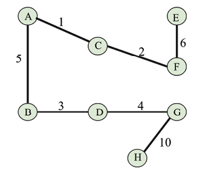

# 图和算法

图是一种非线性数据结构，其中问题通过将一组节点与边（例如电话网络或社交网络）连接为网络表示。 例如，在图中，节点可以表示不同的城市，而它们之间的连接表示边。 图是最重要的数据结构之一。 它们用于解决许多计算问题，尤其是当问题以对象的形式及其连接形式表示时，例如 找出从一个城市到另一个城市的最短道路。 图是用于解决现实世界中问题的有用数据结构，其中该问题可以表示为类似网络的结构。 在本章中，我们将讨论与图相关的最重要和最受欢迎的概念。

在本章中，我们将了解以下概念：

- 图数据结构的概念
- 如何表示图和图遍历
- 不同的操作及其实现

首先，我们将研究不同类型的图。

## 图

图是一组有限数量的顶点（也称为节点）和边，其中边是顶点之间的连接，图中的每个边都与两个不同的节点相连。 此外，图是网络的形式数学表示形式，即图 ```G``` 是一组边 ```E``` 和顶点 ```V``` 的集合，在形式数学符号中以```G =(V，E)```表示。

图的示例如图9.1所示：


图9.1：图的示例

图9.1中的图 ```G =(V，E)```可以描述如下：

- ```V = {A, B, C, D, E}```
- ```E = {{A, B}, {A, C}, {B, C}, {B, D}, {C, D}, {D, D}, {B, E}, {D, E}}```
- ```G = (V, E)```

让我们讨论图的一些重要定义：

- **节点**或**顶点**：图中的点或节点称为顶点。 在上图中，顶点或节点为```A```, ```B```, ```C```, ```D``` 和 ```E```，并用 ```dot``` 表示。
- **边**：这是两个顶点之间的连接。 连接 ```A``` 和 ```B``` 的线是边的一个示例。
- **环**：当返回节点的边本身时，边形成一个环，例如 ```D``` 节点。
- 顶点/节点的**度**：在给定顶点上偶然的边总数称为该顶点的程度。 例如，上图中 ```B``` 点的度为 ```4```。
- **邻接**：这是指任意两个节点之间的连接； 因此，如果任何两个顶点或节点之间都有联系，则称它们彼此邻接。 例如，```C``` 节点与 ```A``` 节点邻接，因为它们之间存在边。
- **路径**：任意两个节点之间的一系列顶点和边代表路径。 例如，```CABE``` 表示从 ```C``` 节点到 ```E``` 节点的路径。
- **叶顶点**（也称为吊坠顶点）：如果它具有一个度，则称为叶顶点或吊坠顶点。

现在，我们将看一下不同类型的图。

### 有向图和无向图

图由节点之间的边表示。 连接边可以被视为有向或无方向性。 如果图中的连接边是无向的，则该图称为无向图，如果图中的边是指向的，则称为有向图。 一个无的图仅表示边作为节点之间的界线。 除了它们连接的事实外，没有关于节点之间关系的其他信息。 例如，在图9.2中，我们演示了一个使用边连接的四个节点```A```, ```B```, ```C``` 和 ```D``` 的无向图：


图9.2：无向图的示例

在有向图中，边提供了有关图中任意两个节点之间连接方向的信息。 如果据说从节点到 ```B``` 的边是指向的，则边```(A, B)```不等于边```(B, A)```。 绘制带有箭头的线作为有向边，有向边连接两个节点的任何方向。

例如，在图9.3中，我们展示了一个有向图，其中的节点是使用有向边来连接的：


图9.3：有向图的示例

边的箭头决定了方向。 如前图所示，只能从 ```A``` 移动到```B```，而不是 ```B``` 到 ```A```。在有向图中，每个节点（或顶点）具有入度和出度。 让我们看看这些定义：

- **入度**：图中顶点的边总数称为该顶点的度。 例如，在上图中，由于边 ```CE``` 进入 ```E``` 节点，```E``` 节点具有 ```1``` 个入度。
- **出度**：从图中的顶点出来的边总数称为该顶点的出度。 例如，上图中的 ```E``` 节点的出度为 ```2```，因为它具有两个边 ```EF``` 和 ```ED```，从该节点出去。
- **孤立点**：一个节点或顶点在一个零度时称为孤立点，如图9.3中所示，如 ```G``` 节点所示。
- **源点**：如果顶点为零，则称为源点。 例如，在上图中，```A``` 节点是源点。
- **收点**：如果顶点为零，则是一个收点。 例如，在上图中，```F``` 节点是收点。

现在，我们了解了有向图的工作方式，我们可以研究有向无环图。

### 有向无环图

有向无环图（```DAG```）是无环的有向图。 在 ```DAG``` 中，所有边都从一个节点到另一个节点将其定向，以使边永远不会形成闭环。 当第一个边的起始节点等于序列中最后一个边的结尾节点时，形成图中的一个环。

```DAG``` 显示在图9.4中，其中图9.4指向图中的所有边，并且该图没有任何环：


图9.4：有向无环图的示例

因此，在有向无环图中，如果我们从给定节点的任何路径开始，我们永远找不到在同一节点上结束的路径。 ```DAG``` 有许多实际应用，例如在作业调度，引用图和数据压缩。

接下来，我们将讨论加权图。

### 加权图

加权图是一个具有与图中边相关的数字权重的图。 加权图可以是有向图或无向图。 数字权重可用于指示距离或成本，具体取决于图的目的：


图9.5：加权图的示例

让我们考虑一个示例：图9.5指示从节点 ```A``` 到达 ```D``` 节点的不同方法。 有两个可能的路径，例如从节点 ```A``` 到 ```D``` 节点，也可以是通过 ```B``` 节点和 ```C``` 节点到节点 ```D``` 的```A-B-C-D```。 现在，根据与边相关的权重，任何一条路径都可以被认为比旅程中的其他路径更好 - 例如 假设该图中的权重代表两个节点之间的距离，我们想找出```A-D``` 节点之间的最短路径。 然后，一个可能的路径 ```A-D``` 的相关成本为 ```40```，另一个可能的路径 ```A-B-C-D``` 的相关成本为 ```25```。在这种情况下，更好的路径是 ```A-B-C-D```，其具有更短的距离。

接下来，我们将讨论两分图。

### 两分图

两分图（也称为 ```bigraph```）是一个特殊的图，该图的所有节点都可以分为两个集合，以使边从一个集合的节点连接到另一个集合的节点。 有关两分图，请参见图9.6； 图的所有节点都分为两个独立的集合，即集合 ```U``` 和集合 ```V```，因此图中的每个边在集合 ```U``` 中具有一个端，而在集合 ```V``` 中有另一端（例如，```edge (A, B)```， 一端或一个顶点来自集合 ```U```，另一端或另一端或另一个点来自集合 ```V```）。

在两分图中，没有边连接到同一集合的节点：


图9.6：两分图的示例

当我们需要对两个不同类别的对象之间的关系建模时，两分图很有用，例如，申请人和作业的图，我们可能需要在其中建模这两个不同的组之间的关系； 另一个例子可能是足球运动员和俱乐部的两分图，如果球员为特定的俱乐部效力，我们可能需要建模。

接下来，我们将讨论不同的图示技术。

## 图表示

图表示技术意思是我们如何将图存储在内存中，即我们如何存储顶点，边和权重（如果图是加权图）。 图可以用两种方法表示，即**邻接表**，以及**邻接矩阵**。

邻接表表示基于链表。 在此中，我们通过维护图的每个顶点（或节点）来维护邻接表（也称为相邻节点）来表示图。 在图的邻接矩阵表示中，我们维护一个矩阵，该矩阵表示哪个节点与图中的其他节点相邻； 即，邻接矩阵具有图中每个边的信息，该信息由矩阵的单元格表示。

这两种表示都可以使用。 但是，我们的选择取决于我们将在其中使用图示的应用程序。 当我们期望该图会稀疏并且我们的边数量较小时，邻接表是可取的。 例如 如果 ```200``` 个节点的图显示了 ```100``` 个边，则最好将此图存储在邻接表中，因为如果我们使用邻接矩阵，则矩阵的大小为 ```200x200```，值为零值很多。 当我们期望该图具有很多边时，相邻矩阵是可取的，并且矩阵将是密集的。 在邻接矩阵中，与邻接表表示相比，查找和检查是否存在边非常容易。

我们将在随后的部分中详细讨论邻接矩阵。 首先，我们将查看邻接表。

### 邻接表

在此表示中，所有直接连接到节点 ```X``` 的节点都列出在其相邻的节点列表中。 图示图来表示图的所有节点的邻接表。

图9.7中所示的图中的两个节点 ```A``` 和 ```B```，如果它们之间存在直接连接，则据说是相邻的：


图9.7：五个节点的示例图

链表可用于实现邻接表。 为了表示图，我们需要等于图中节点总数的连接表的数量。 在每个索引上，该顶点的相邻节点存储。 例如，请考虑图9.8所示的邻接表，与图9.7所示的示例图相对应：


图9.8：图9.7所示图的邻接表

在这里，第一个节点代表图的 ```A``` 顶点，其相邻的节点为 ```B``` 和 ```C```。第二个节点代表图的 ```B``` 顶点，其相邻的 ```E```，```C``` 和 ```A``` 的相邻节点。 该图的，```C```，```E``` 和 ```F``` 的相邻节点表示，如上图9.8所示。

使用列表进行表示非常限制，因为我们缺乏直接使用顶点标签的能力。 因此，要使用 ```Python``` 有效实现图，使用字典数据结构，因为它更适合表示图。 要使用字典数据结构实现同一图，我们可以使用以下代码段：

```python
graph = {
    "A": ["B", "C"],
    "B": ["E", "C", "A"],
    "C": ["A", "B", "E", "F"],
    "E": ["B", "C"],
    "F": ["C"],
}
```

现在，我们可以轻松地确定 ```A``` 顶点具有 ```B``` 和 ```C``` 的相邻顶点。```F``` 顶点具有 ```C``` 顶点是其唯一的邻居。 同样，```B``` 顶点具有 ```E```，```C``` 和 ```A``` 的相邻顶点。

当图稀疏时，邻接表是一种优选的图示技术，我们可能需要经常添加或删除图中的节点。 但是，很难检查图中是否存在此技术中的给定边。

接下来，我们将讨论另一种图示方法，即邻接矩阵。

### 邻接矩阵

表示图的另一种方法是使用邻接矩阵。 在此中，图示通过通过边显示节点及其互连来表示。 使用此方法，使用矩阵的尺寸```(V X V)```表示图，其中每个单元格表示图中的边。 矩阵是二维阵列。 因此，这里的想法是用 ```1``` 或 ```0``` 表示矩阵的单元格，具体取决于两个节点是否通过边连接。 我们显示了一个示例图，以及其相应的邻接矩阵，如图9.9：


图9.9：给定图的邻接矩阵

可以使用给定的邻接表实现邻接矩阵。 要实现邻接矩阵，让我们以图的先前基于字典的实现。 首先，我们必须获得邻接矩阵的关键元素。 重要的是要注意，这些矩阵元素是图的顶点。 我们可以通过对图的键进行排序获取密钥元素。 代码段如下：

```python
matrix_elements = sorted(graph.keys())
cols = rows = len(matrix_elements)
```

接下来，图的键的长度将是邻接矩阵的尺寸，该矩阵存储在 ```cols``` 和 ```lows``` 中。 ```cols``` 和 ```low```s 的值相等。

因此，现在，我们通过 ```rows``` 创建一个尺寸 ```col``` 的空邻接矩阵，最初用零填充所有值。 初始化一个空邻接矩阵的代码段如下：

```python
adjacency_matrix = [[0 for x in range(rows)] for y in range(cols)]
edges_list = []
```

```edges_list``` 变量将存储形成图中边的元组。 例如，```A``` 和 ```B``` 节点之间的边将存储为```(a，b)```。 多维阵列使用 ```for``` 循环填充：

```python
for key in matrix_elements:
    for neighbor in graph[key]:
        edges_list.append((key, neighbor))
print(edges_list)
```

顶点的邻居是通过 ```graph[key]``` 获得的。 然后，将 ```key``` 与``` neighbor```结合使用，然后将元组创建存储在 ```edges_list``` 中的元组。

用于存储图边的前一个 ```Python``` 代码的输出如下：

```python
[('A', 'B'), ('A', 'C'), ('B', 'E'), ('B', 'C'), ('B', 'A'), ('C', 'A'), ('C', 'B'), ('C', 'E'), ('C', 'F'), ('E', 'B'), ('E', 'C'), ('F', 'C')]
```

实现邻接矩阵的下一步是使用 ```1``` 表示图中的边的存在。 这可以使用```Adjacency_matrix [index_of_first_vertex] [index_of_second_vertex] = 1``` 语句来完成。 标记图边存在的完整代码段如下：

```python
for edge in edges_list:
    index_of_first_vertex = matrix_elements.index(edge[0])
    index_of_second_vertex = matrix_elements.index(edge[1])
    adjacency_matrix[index_of_first_vertex][index_of_second_vertex] = 1

print(adjacency_matrix)
```

```MATRIX_ELEMENT``` 阵列具有其行和 ```COLS```，从 ```A``` 到所有其他顶点，索引为 ```0``` 到 ```5```。```for``` 循环通过元组列表进行迭代，并使用索引方法获取要存储边的相应索引。

前面代码的输出是图9.9所示的示例图的邻接矩阵。 产生的邻接矩阵看起来如下：

```python
[0, 1, 1, 0, 0]
[1, 0, 0, 1, 0]
[1, 1, 0, 1, 1]
[0, 1, 1, 0, 0]
[0, 0, 1, 0, 0]
```

在第 ```1``` 行和第 ```1``` 列中，```0``` 表示 ```A``` 和 ```A``` 之间的边不存在，同样，在第 ```3``` 行和第 ```2``` 列中，有 ```1``` 表示图中的 ```C``` 和 ```B``` 顶点之间的边。

当我们必须经常查找并检查图中两个节点之间的边的存在或不存在时，邻接矩阵的使用是适合图表示。 在网络中创建路由表，在公共传输应用程序和导航系统中搜索路由等。当经常在图中添加或删除节点时，邻接矩阵不合适，在这些情况下，邻接表是一种更好的技术。

接下来，让我们讨论不同的图遍历方法，其中我们访问给定图的所有节点。

## 图遍历

图遍历意味着访问图的所有顶点，同时跟踪已经访问了哪些节点或顶点且没有访问哪些节点或顶点。 如果图算法在最小可能的时间内遍历图的所有节点，则该算法是有效的。 ```Graph Traversal```，也称为图搜索算法，与 ```preorder```，```onorder```，```inorder```，```postorder``` 和 ```level order``` 算法等树遍历算法非常相似。 在图搜索算法中，我们从节点开始，然后通过边到图中的所有其他节点。

图遍历的一种常见策略是沿着一条路径，直到达到死端，然后遍历遍历，直到我们遇到替代路径。 我们还可以迭代地从一个节点移动到另一个节点，以遍历整个图或部分图。 图遍历算法对于回答许多基本问题非常重要 - 它们在图中如何从一个顶点到另一个顶点以及从图中的节点到 ```B``` 节点的路径比其他路径更好。 例如，图遍历算法对于在城市网络中从一个城市到另一个城市的最短路线很有用。

在下一节中，我们将讨论两种重要的图遍历算法：广度优先搜索（**```BFS```**）和深度优先搜索（**```DFS```**）。

### 广度优先遍历

广度优先搜索（**```BFS```**）的工作原理与级序遍历算法在树数据结构中的工作方式非常相似。 ```BFS``` 算法也按级逐步工作； 它首先访问级 ```0``` 的根节点，然后在第一个级连接到根节点的所有节点在 ```1``` 级 ```1``` 访问。级 ```1```节点与根节点的距离为 ```1```。 访问 ```1```级的所有节点后，接下来将访问 ```2``` 级节点。 同样，图中的所有节点都按级遍历级，直到访问所有节点为止。 因此，广度第一的遍历算法在图中宽广。

队列数据结构用于存储图中要访问的顶点信息。 我们从启动节点开始。 首先，我们访问该节点，然后查找其所有相邻或相邻的顶点。 我们首先访问这些相邻的顶点，同时将他们的邻居添加到要访问的顶点列表中。 我们遵循此过程，直到我们访问了图的所有顶点，以确保没有两次访问顶点。

让我们考虑一个示例，以更好地了解图9.10所示的示例：图9.10：


图9.10：示例图

在图9.10中，我们的左侧有五个节点的图，右侧是一个队列数据结构，用于存储要访问的顶点。 我们开始访问第一个节点，即节点 ```A```，然后将其所有相邻的顶点```B```，```C``` 和 ```E``` 添加到队列中。 在这里，重要的是要注意，有多种方法可以将相邻节点添加到队列中，因为有三个节点```B```，```C``` 和 ```E```，可以将它们添加到队列中，例如```BCE```, ```CEB```, ```CBE```, ```BEC``` 或 ```ECB```。 每种都会给我们带来不同的遍历结果。

所有这些可能的解决方案对图遍历都是正确的，但是在此示例中，我们按字母顺序添加节点，只是为了使队列中的事物保持简单，即```BCE```。 如图9.11所示，访问了 ```A``` 节点：


图9.11：节点 ```A``` 在广度优先的遍历中访问

接下来，一旦我们访问了 ```A```顶点，我们就会访问其第一个相邻顶点 ```B```，并添加那些尚未在队列中尚未添加或未访问的顶点 ```B``` 的相邻顶点。 在这种情况下，我们必须添加 ```D``` 顶点（因为它具有两个顶点，```A``` 和 ```D``` 节点已经访问了```A```），如图9.12：所示。


图9.12：节点 ```B``` 在广度优先的遍历中访问

现在，访问 ```B``` 顶点后，我们访问了队列的下一个顶点 - ```C``` 顶点。 同样，添加尚未添加到队列的相邻顶点。 在这种情况下，没有剩下未记录的顶点，如图9.13：


图9.13：节点 ```C``` 在广度优先的遍历中访问

访问 ```C``` 顶点后，我们访问了队列```E``` 的下一个顶点，如图9.14：


图9.14：节点 ```E``` 访问了广度优先的遍历

同样，在访问 ```E``` 顶点后，我们在最后一步访问了 ```D``` 顶点，如图9.15所示：


图9.15：```D``` 节点在广度优先的遍历中访问

因此，用于遍历前图的 ```BFS``` 算法以 ```A-B-C-E-D``` 的顺序访问顶点。 这是前面图的 ```BFS``` 遍历的可能解决方案之一，但是根据我们如何将相邻节点添加到队列中，我们可以获得许多可能的解决方案。

为了了解 ```Python``` 中此算法的实现，我们将使用另一个无向图的示例，如图9.16：


图9.16：无向样品图

图9.16所示的图的邻接表如下：

```python
graph = {
    'A': ['B', 'G', 'D'],
    'B': ['A', 'F', 'E'],
    'C': ['F', 'H'],
    'D': ['F', 'A'],
    'E': ['B', 'G'],
    'F': ['B', 'D', 'C'],
    'G': ['A', 'E'],
    'H': ['C'],
}
```

使用邻接表存储图后，```BFS``` 算法的实现如下，我们将详细讨论一个示例：

```python
from collections import deque


def breadth_first_search(graph, root):
    graph_queue = deque([root])
    visited_vertices = [root]
    node = root
    while len(graph_queue) > 0:
        node = graph_queue.popleft()
        adj_nodes = graph[node]
        if remaining_elements := set(adj_nodes).difference(
            set(visited_vertices)
        ):
            for elem in sorted(remaining_elements):
                visited_vertices.append(elem)
                graph_queue.append(elem)
    return visited_vertices
```


要使用宽领先算法遍历此图，我们首先初始化队列和源节点。 我们从节点开始遍历遍历。 首先，将节点排队并添加到访问的节点列表中。 之后，我们使用一段循环来进行图遍历。 在 ```while``` 循环的第一次迭代中，节点 ```A``` 被出队。

接下来，按字母顺序排序的一个节点的所有未访问的相邻节点，均为```B```，```D``` 和 ```G```。 队列现在包含节点```B```，```D``` 和 ```G```。这如图9.17：


图9.17：使用 ```BFS``` 算法访问节点 ```A```

为了实现，我们将所有这些节点```(B，D，G)```添加到访问的节点列表中，然后添加这些节点的相邻/相邻节点。 在这一点上，我们开始了另一个循环的迭代。 访问节点后，```B``` 节点被出队。 从其相邻的节点```(A, E, F)```中，一个节点已经访问。 因此，我们仅按字母顺序排列 ```E``` 和 ```F``` 节点，如图9.18所示。

当我们想找出访问的节点列表中是否有一组节点时，我们使用```remaining_elements = set(adj_nodes).difference(set(visited_vertices))```语句。 这使用集合对象的差异方法来查找 ```adj_nodes``` 中的节点，而不是在 ```visited_vertices``` 中找到：


图9.18：使用 ```BFS``` 算法访问节点 ```B```

现在，队列现在存有以下节点-```D```，```G```，```E``` 和 ```F```。```D```节点已出队，但是访问了其所有相邻节点，因此我们只是脱离了它。 队列前面的下一个节点是 ```G```。我们排出了```G``` 节点，但是我们还发现其所有相邻节点都被访问了，因为它们在访问的节点列表中。 因此，```G``` 节也被出队。 我们也排出了节点，因为也访问了其所有相邻节点。 现在队列中唯一的节点是 ```F``` 节点。 如图9.19所示：


图9.19：使用 ```BFS``` 算法访问节点 ```E```

```F``` 节点出队，我们看到从其相邻的节点，```B```，```D``` 和 ```C``` 中，只有 ```C``` 尚未访问。 然后，我们加入 ```C``` 节点并将其添加到访问的节点列表中，如图9.20：


图9.20：使用 ```BFS``` 算法访问节点E

然后，```C``` 节点出队。 ```C``` 具有 ```F``` 和 ```H``` 的相邻节点，但是 ```F``` 已经访问了 ```F```，而 ```H``` 节点则留下了 ```H```节点。 ```H``` 节点入队，并添加到访问的节点列表中。 最后，```while``` 循环的最后一次迭代将导致 ```H``` 节点出队。

它唯一的相邻节点 ```C```，已经访问过。 一旦队列为空，循环就会断开。 如图9.21所示：


图9.21：最终节点 ```H``` 使用 ```BFS``` 算法访问

使用 ```BFS``` 算法的给定图的遍历的输出为```A```，```B```，```D```，```G```，```E```，```F```，```C``` 和 ```H```。

当我们在图9.16所示的图上运行上述 ```BFS``` 代码时，使用以下代码：

```python
print(breadth_first_search(graph, 'A'))
```

当我们遍历图9.16中所示的图时，我们将获得以下节点序列：

```python
['A', 'B', 'D', 'G', 'E', 'F', 'C', 'H']
```

在最坏的情况下，每个节点和边都需要遍历，因此每个节点将至少入列一次。 每个入口和脱水操作所花费的时间为$O(1)$，因此总时间为$O(V)$。 此外，花费在每个顶点扫描邻接表的时间为$O(e)$。 因此，```BFS``` 算法的总时间复杂性为 $O(|V| + |E|)$，其中 $|V|$ 是顶点或节点的数量，而$|E|$ 是图中的边数。

```BFS``` 算法对于构造最小迭代的图中最短路径遍历非常有用。 至于 ```BFS``` 的一些现实世界应用程序，它可用于创建一个有效的 ```Web``` 轨搜寻器，其中可以为搜索引擎维护多个级别的索引，并且可以从源网页维护封闭的网页列表 。 ```BFS``` 对于导航系统也很有用，在导航系统中，可以从不同位置的图中轻松检索相邻位置。

接下来，我们将讨论另一种图遍历算法，即深度优先搜索算法。

### 深度优先遍历

顾名思义，深度优先搜索（**```DFS```**）或遍历算法遍历该图，类似于预遍历算法在树中的工作方式。 在 ```DFS``` 算法中，我们在图中任何特定路径的深度中遍历。 因此，在兄弟节点之前先访问了子节点。

在此，我们从根节点开始。 首先，我们访问它，然后看到当前节点的所有相邻顶点。 我们开始访问其中一个相邻节点。 如果边连接的是访问过的节点，我们将回溯到当前节点。 而且，如果边连接一个未访问的节点，那么我们转到该节点并继续从该节点进行处理。 我们继续进行相同的过程，直到没有未访问的节点时到达死胡同。 在这种情况下，我们回到了以前的节点，然后在回溯时到达根节点时停止。

让我们以一个示例来使用图9.22中所示的图来了解 ```DFS``` 算法的工作。


图9.22：用于理解 ```DFS``` 算法的示例图

我们首先访问 ```A``` 节点，然后看一下 ```A``` 顶点的邻居，然后看一个邻居的邻居，等等。 访问了 ```A``` 顶点后，我们访问了它的一个邻居 ```B```（在我们的示例中，我们按字母顺序排序；但是，可以添加任何邻居），如图9.23：所示。


图9.23：节点 ```A``` 和 ```B``` 以深度优先遍历访问

访问 ```B``` 顶点后，我们查看了 ```A``` 的另一个邻居，即 ```S```，因为没有连接到 ```B``` 可以访问的顶点。 接下来，我们寻找 ```S``` 顶点的邻居，即 ```C``` 和 ```G``` 顶点。 我们访问 ```C```，如图9.24所示：


图9.24：节点 ```C``` 以深度优先遍历访问

访问 ```C``` 节点后，我们访问了其相邻的顶点 ```D``` 和 ```E```，如图9.25所示：


图9.25：```D``` 和 ```E``` 节点以深度优先遍历访问

同样，在访问 ```E``` 顶点后，我们访问了 ```H``` 和 ```G``` 顶点，如图9.26所示：


图9.26：```H``` 和 ```F```节点以深度优先遍历访问

最后，我们访问了 ```F``` 节点，如图9.27所示：


图9.27：```F``` 节点是在深度优先的遍历中访问的

```DFS``` 遍历的输出为```A-B-S-C-D-E-H-G-F```。

要实现 ```DFS```，我们从给定图的邻接表开始。 这是前面图的邻接表：

```python
graph = {
    'A': ['B', 'S'],
    'B': ['A'],
    'S': ['A', 'G', 'C'],
    'D': ['C'],
    'G': ['S', 'F', 'H'],
    'H': ['G', 'E'],
    'E': ['C', 'H'],
    'F': ['C', 'G'],
    'C': ['D', 'S', 'E', 'F'],
}
```

```DFS``` 算法的实现始于创建列表以存储访问的节点。 ```graph_stack``` 栈变量用于帮助遍历过程。 我们将 ```Python``` 列表用作栈。

启动节点（称为```root```）使用图的邻接矩阵（图）传递。 首先，将根部推到栈上。 语句```node = root``` 用于在栈中保存第一个节点：

```python
def depth_first_search(graph, root):
    visited_vertices = []
    graph_stack = [root]
    node = root
    while graph_stack:
        if node not in visited_vertices:
            visited_vertices.append(node)
        adj_nodes = graph[node]
        if set(adj_nodes).issubset(set(visited_vertices)):
            graph_stack.pop()
            if graph_stack:
                node = graph_stack[-1]
            continue
        else:
            remaining_elements = set(adj_nodes).difference(set(visited_vertices))
        first_adj_node = sorted(remaining_elements)[0]
        graph_stack.append(first_adj_node)
        node = first_adj_node
    return visited_vertices
```


只要栈不是空的，将执行时循环的主体。 如果正在考虑的节点不在访问的节点列表中，我们将其添加。 节点的所有相邻节点均通过 ```adj_nodes = graph[node]``` 收集。 如果访问了所有相邻节点，我们将弹出最高节点，并将节点设置为 ```graph_stack[-1]```。 在这里，```graph_stack[-1]``` 是栈上的最高节点。 继续语句跳回 ```while``` 循环测试条件的开始。

另一方面，如果不是访问了所有相邻的节点，则通过在 ```adj_nodes``` 和 ```visited_vertices``` 之间的差异中获得尚待访问的节点，```remaining_elements = set(adj_nodes).difference(set(visited_vertices))```。

```sorted(remaining_elements)``` 中的第一项分配给 ```first_adj_node```，然后推到栈上。 然后，我们将栈的顶部指向此节点。

当 ```while``` 循环退出时，我们将返回 ```visited_vertices```。

现在，我们将通过将源代码与上一个示例相关联来解释源代码的工作。 选择 ```A``` 节点作为我们的启动节点。 将 ```A``` 推到栈上并添加到 ```visited_vertices``` 列表中。 这样，我们将其标记为已访问。 使用简单的 ```Python``` 列表实现了```graph_stack``` 栈。 我们的栈现在是其唯一元素。 我们检查了 ```A``` 节点的相邻节点 ```B``` 和 ```S```。为了测试是否访问了 ```A``` 的所有相邻节点，我们使用 ```if``` 语句：

```python
        if set(adj_nodes).issubset(set(visited_vertices)):
            graph_stack.pop()
            if graph_stack:
                node = graph_stack[-1]
            continue
```

如果访问了所有节点，我们将弹出栈的顶部。 如果 ```graph_stack``` 栈不是空的，我们将栈顶部的节点分配给节点，然后启动 ```while``` 循环正文的另一个执行的开始。 如果 ```adj_nodes``` 中的所有节点都是 ```visited_vertices``` 的子集，则 ```set(adj_nodes).issubset(set(visited_vertices))``` 为 ```True```。 如果 ```if``` 语句失败，则意味着有些节点仍有待访问。 我们用 ```remaining_elements = set(adj_nodes).difference(set(visited_vertices))``` 获得剩余的节点。

参考图，```B``` 和 ```S``` 节点将存储在剩余的 ```elements``` 中。 我们将按字母顺序访问列表，如下：

```python
        first_adj_node = sorted(remaining_elements)[0]
        graph_stack.append(first_adj_node)
        node = first_adj_node
```

我们对 ```remaining_elements``` 进行排序，然后将第一个节点返回到 ```first_adj_node```。 这将返回 ```B```。我们通过将 ```B``` 节点附加到 ```graph_stack``` 将其将其推向栈。 我们通过将其分配给节点来准备 ```B``` 节点以访问。

在 ```while``` 循环的下一次循环中，我们将 ```B``` 节点添加到访问的节点列表中。 我们发现已经访问了 ```B``` 的唯一相邻节点。 由于 ```B``` 的所有相邻节点都已访问，因此我们将其从栈中弹出，将 ```A``` 作为栈上的唯一元素。 我们返回 ```A``` 并检查是否访问过其所有相邻节点。 ```A``` 节点现在是唯一未访问的节点。 我们将 ```S```推到栈，然后重新开始整个过程。

遍历的输出是 ```A-B-S-C-D-E-H-G-F-F```。

当我们使用邻接表时，```DFS``` 的时间复杂性为$O(V+E)$，当我们使用邻接矩阵进行图示时，```DFS``` 的时间复杂性是$O(V^2)$。 ```DFS``` 与邻接表的时间复杂性较低，因为获得相邻节点更容易，而邻接矩阵则效率不高。

```DFS``` 可以应用于解决迷宫问题，查找连接的组件，图中的循环检测以及查找图的桥梁以及其他用例。

我们讨论了非常重要的图遍历算法。 现在，让我们讨论一些与图相关的算法，以从给定的图中查找生成树。 遍历树对于几个现实世界中的问题很有用，例如旅行推销员问题。

## 其他有用的图方法

我们经常需要使用图来查找两个节点之间的路径。 有时，有必要找到节点之间的所有路径，在某些情况下，我们可能需要找到节点之间的最短路径。 例如，在路由应用程序中，我们通常使用各种算法来确定从源节点到目标节点的最短路径。 对于未加权的图，我们将简单地确定边之间最低数量的路径。 如果给出了加权图，我们必须计算通过一组边的总权重。

因此，在不同的情况下，我们可能必须使用不同的算法（例如最小生成树）找到最长或最短的路径，我们在下一节中查看。

### 最小生成树

最小生成树（**```MST```**）是连接图的边的子集，带有边加权图，该图连接了图的所有节点，最低可能的总边权重，没有循环。 更正式的是，给定一个连接的图 ```G```，其中 ```G = (V, E)``` 具有实值的边权重，```MST``` 是一个子集的子图，具有一个子集，因此边权重的总和是最小的，并且没有循环。 有许多可能的遍历树可以在没有任何环的情况下连接图的所有节点，但是最小生成树是一棵树，在所有其他可能的遍历树中，具有最低的总边权重（也称为成本）。 一个示例图显示在图9.28及其相应的 ```MST```（右侧）中，我们可以观察到所有节点已连接，并具有从原始图（左侧）取的边的子集。

```MST``` 在所有边的总权重中最低，即 ```(1+4+2+4+5 = 16)``` 在所有其他可能的生成树中：


图9.28：带有相应最小生成树的示例图

```MST``` 具有不同的现实应用程序。 它们主要用于道路拥堵，液压电缆，电缆网络甚至集群分析的网络设计中。

首先，让我们讨论 ```Kruskal``` 的最小生成树算法。

### ```Kruskal``` 的最小生成树算法

```Kruskal``` 的算法是一种广泛使用的算法，用于从给定的加权，连接和无向图中查找生成树。 它基于贪婪的方法，因为我们首先找到了最低权重的边，然后将其添加到树上，然后在每次迭代中，我们将权重最低的边添加到生成树，以便我们不形成环。 最初，在此算法中，我们将图的所有顶点视为单独的树，然后在每种迭代中，我们以最低的权重选择边，以使其不形成环。 这些独立的树是组合的，并成长为形成一个生成树。 我们重复此过程，直到处理所有节点。 该算法如下：

1. 初始化具有零边的空的```MST(M)```
2. 根据其权重对所有边进行分类
3. 对于排序列表中的每个边，我们将它们一一添加到```MST(M)```，以使其不形成环

让我们考虑一个例子。

我们首先选择最低权重（权重1）的边，如图9.29所示的虚线所示：


图9.29：选择跨越树中权重最低的第一个边

选择权重 ```1``` 的边后，我们选择权重 ```2``` 的边，然后用权重 ```3``` 选择边，因为这些是下一个最低的权重，如图9.30所示：


图9.30：在生成树中选择边 ```2``` 和 ```3```

同样，我们分别选择具有权重 ```4``` 和 ``5``` 的下一个边，如图9.31所示：


图9.31：在生成树中选择具有权重 ```4``` 和 ```5``` 的边

接下来，我们选择了权重 ```6``` 的下一个边，并使其成为虚线。 在那之后，我们看到最低的权重是 ```7```，但是如果我们选择它，它会产生一个环，因此我们忽略了它。 接下来，我们使用权重 ```8```，然后检查 ```9``` 的边，这也被忽略了，因为它们也会形成一个环。 因此，选择了最低权重 ```10``` 的下一个边。 如图9.32所示：


图9.32：在生成树中选择权重 ```6``` 和 ```10``` 的边

最后，我们使用 ```Kruskal``` 的算法看到以下跨越树，如图9.33所示：


图9.33：使用 ```Kruskal``` 的算法创建的最后一个生成树

```Kruskal``` 的算法有许多现实世界中的应用程序，例如解决旅行推销员问题(```TSP```)，在该问题中，我们必须从一个城市开始，我们必须在最低总成本的网络中访问所有不同的城市，并且不访问同一城市，而没有两次访问同一城市 。 还有许多其他应用程序，例如电视网络，旅游操作，```LAN```网络和电网。

```Kruskal``` 算法的时间复杂性是 $O(Elog(E))$ 或 $O(Elog(V))$，其中 $E$ 是边的数量，$V$ 是顶点的数量。

现在，让我们在下一节中讨论一种更受欢迎的 ```MST``` 算法。

### ```PRIM``` 的最小生成树算法

```PRIM``` 的算法也基于一种贪婪的方法来找到最低成本跨越树的成本。``` PRIM``` 的算法与 ```Dijkstra``` 算法非常相似，该算法在图中找到了最短路径。 在此算法中，我们以任意节点作为起点开始，然后从所选节点和穿越最低成本（或权重）的边检查传出边。 在该算法中，术语成本和权重可互换使用。 因此，从选定的节点开始之后，我们通过选择最低且不会形成环的边来生长树。 该算法如下：

1. 创建一个包含所有边及其权重的词典
2. 从字典中获得最低成本的边，并以未形成环的方式生长树
3. 重复步骤 ```2``` 直到访问所有顶点

让我们考虑一个示例，以了解 ```Prim``` 算法的原理。 假设我们任意选择一个节点，然后我们从 ```A``` 中检查所有外向的边。在这里，我们有两个选项 ```AB``` 和 ```AC```； 我们选择边 ```AC```，因为它的成本/权重较小（权重 ```1```），如图9.34所示：


图9.34：在使用 ```Prim``` 的算法构造生成树时选择边 ```AC```

接下来，我们检查边 ```AC``` 的最低外部边。 我们有选项 ```AB```，```CD```，```CE```，```CF```，其中我们选择了边 ```CF```，其权重最低。同样，我们种植树，接下来我们选择最低的加权边，即 ```AB```，如图所示 图9.35：


图9.35：在使用 ```Prim``` 的算法构造生成树时选择边 ```AB```

之后，我们选择边 ```BD``` 的权重为 ```3```，同样，我们选择了边 ```DG```，它的权重最低为 ```4```。这如图9.36所示：


图9.36：在使用 ```Prim``` 的算法构造生成树时选择边 ```BD``` 和 ```DG```

接下来，我们选择边 ```FE``` 和 ```GH```，分别具有 ```6``` 和 ```10``` 的权重，如图9.37所示：


图9.37：在使用```Prim```的算法构造生成树时选择边 ```FE``` 和 ```GH```

接下来，每当我们尝试包括更多边时，就会形成一个环，因此我们忽略了这些边。 最后，我们获得了生成树，如下图9.38：



图9.38：使用 ```Prim``` 的算法的最后一棵树

```Prim``` 的算法还具有许多真实的应用程序。 对于所有可以使用 ```Kruskal``` 算法的应用程序，我们也可以使用```Prim``` 的算法。 其他应用程序包括道路网络，游戏开发等。

由于 ```Kruskal``` 和 ```Prim``` 的 ```MST``` 算法都用于相同的目的，因此应该使用哪种算法？ 通常，它取决于图的结构。 对于具有 ```C``` 顶点和 ```E``` 边的图，```Kruskal``` 的算法的最差时间复杂性是$O(ElogV)$，而 ```Prim``` 的算法具有 $O(E+VlogV)$ 的时间复杂性。 因此，我们可以观察到，当我们拥有密集的图时， ```Prim``` 的算法效果更好，而 ```Kruskal``` 的算法在我们的算法上却更好。

## 概括

图是一种非线性数据结构，由于它具有大量的现实世界应用，因此非常重要。 在本章中，我们使用列表和词典讨论了在 ```Python``` 中表示图的不同方法。 此外，我们学到了两个非常重要的图遍历算法，即深度优先搜索（```DFS```）和广度优先搜索（```BFS```）。 此外，我们还讨论了找到 ```MST``` 的两种非常重要的算法，即```Kruskal``` 算法和 ```Prim``` 算法。

在下一章中，我们将讨论搜索算法以及可以有效地搜索列表中项目的各种方法。

## 练习

1. 在带有五个节点的无向图中，最大边数量（无自旋）是多少？
2. 我们如何称呼所有节点具有相等度的图？
3. 说明什么是割点，并在给定图中识别割点：


图9.39：示例图

4. 假设 ```n``` 边的图 ```G```，图 ```G``` 中可能的最大割点数量是多少？